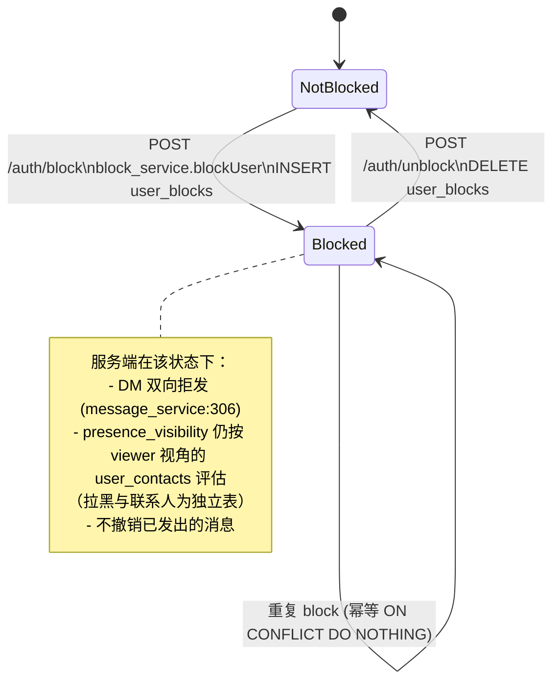
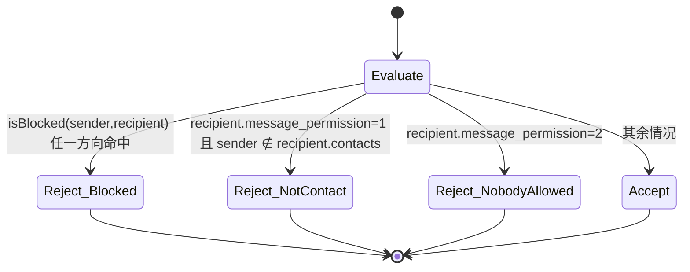

# 账号隐私架构设计

> 适用范围：mushroom-app 与「账号 / 用户身份」相关的隐私能力，包括拉黑、隐私偏好（可发现性 / 消息权限 / 在线可见性）、会话级隐藏、账号生命周期相关字段。
>
> 不包含：多账号本地数据隔离（见 `docs/architecture/multi-account-isolation.md`）、登录鉴权流程、媒体文件权限（见 `docs/architecture/media-upload.md`）。

---

## 1. 模块概述

### 1.1 目标

- 提供对齐主流 IM（WhatsApp / Telegram / WeChat）的账号隐私能力：拉黑、可发现性、消息权限、在线可见性、会话隐藏。
- 隐私规则在**服务端**作为唯一可信源强制执行，避免客户端绕过。
- 三端（web / electron / mobile）UI 与本地缓存保持一致语义。
- 隐私状态变更通过 WebSocket 实时下发至关心方，避免轮询。

### 1.2 非目标

- 端到端加密（E2EE）：当前传输层为 TLS + 服务端可见消息，隐私能力建立在「服务端可信」假设之上。
- 数据合规导出 / GDPR 删除工作流：尚未提供端点。
- 群聊内的细粒度成员屏蔽：当前拉黑仅对 DM 生效。

### 1.3 业务范围速览

| 能力                                      | 状态                                                                      |
| ----------------------------------------- | ------------------------------------------------------------------------- |
| 拉黑 / 解除拉黑（user_blocks）            | ✅ 端到端                                                                 |
| 隐私偏好：discoverable_by_username        | ⚠️ 写入但搜索未消费                                                       |
| 隐私偏好：discoverable_by_phone           | ⚠️ 写入但搜索未消费                                                       |
| 隐私偏好：message_permission（DM 门控）   | ✅ 端到端                                                                 |
| 隐私偏好：presence_visibility（在线状态） | ✅ 端到端（含 5min 桶化）                                                 |
| 已读回执 / typing 隐私开关                | ✅ 端到端（`read_receipts_visibility` 0/2 二态，双向失效；typing 群扇出） |
| 个人资料字段的可见范围（头像/手机号/...） | ❌ 未实现                                                                 |
| 会话隐藏（hidden_before_seq）             | ✅ 端到端                                                                 |
| 账号注销 / 数据导出                       | ❌ 仅有 `users.is_deleted` 字段                                           |
| 风控字段（users.status）传导到隐私链路    | ❌ 未串联                                                                 |

---

## 2. 架构总览

### 2.1 组件依赖

```mermaid
flowchart LR
  subgraph Client[客户端三端]
    UIw[Web PrivacySettingsPanel]
    UIm[Mobile AccountSecurityPrivacy/Blocked]
    UIe[Electron 复用 Web bundle]
    Core[app-core controller<br/>mobile + electron]
    WebSync[apps/web syncContext<br/>+ ws handlers]
  end

  subgraph Shared[packages/shared]
    Types[types/models.ts<br/>PrivacyRule / UserBlock]
    API[api/index.ts transport]
    WSTypes[types/ws.ts<br/>BlockChangedMessage / presence / typing]
  end

  subgraph Server
    UC[user_controller]
    CC[conversation_controller]
    MC[message_controller]
    PS[privacy_service]
    BS[block_service]
    PV[presence_visibility]
    MS[message_service]
    WS[ws_server dispatchToUser]
  end

  subgraph PG[(PostgreSQL)]
    UPS[user_privacy_settings]
    UB[user_blocks]
    UCT[user_contacts]
    CUS[conversation_user_state]
    U[users]
  end

  UIw --> API
  UIm --> Core --> API
  UIe --> API
  API -->|HTTP /auth/*| UC --> PS --> UPS
  API -->|HTTP /auth/block,/auth/unblock| UC --> BS --> UB
  MS --> BS
  MS --> PS
  PV --> UPS
  PV --> UCT
  MS --> MC
  CC --> CUS
  BS -->|block_changed| WS
  PV -->|presence transition| WS
  WS -.WebSocket.-> WebSync
  WS -.WebSocket.-> Core
```

### 2.2 状态机：拉黑关系



### 2.3 状态机：隐私偏好下「DM 是否可达」



---

## 3. 关键概念

| 概念          | 定义                                                                                       | 出处                                                                          |
| ------------- | ------------------------------------------------------------------------------------------ | ----------------------------------------------------------------------------- |
| `PrivacyRule` | 0=ANYONE / 1=CONTACTS_ONLY / 2=NOBODY，所有可见性偏好统一三档                              | `packages/shared/src/types/models.ts:37-50`                                   |
| 联系人语义    | **单向**：viewer→target 在 `user_contacts` 存在记录即视为 contact                          | `server/src/service/presence_visibility.ts` 头部注释                          |
| 拉黑语义      | 双向阻断 DM 发送；**不**自动从对方联系人删除；`user_blocks` 独立于 `user_contacts`         | `server/src/repository/block_repository.ts`                                   |
| 可发现性      | discoverable_by_username / by_phone：理论上控制搜索查得到与否，**服务端当前未消费**（gap） | `server/src/db/migrate.ts:252-259`                                            |
| 消息权限      | message_permission：仅对 `conversation.type=1`（DM）生效；群聊不过滤                       | `server/src/service/message_service.ts:306-325`                               |
| 在线可见性    | presence_visibility：HTTP 与 snapshot 走 5min 桶化，transition 广播直发                    | `presence_visibility.ts bucketizeLastActiveAt`                                |
| 会话隐藏      | per-user 把 `hidden_before_seq` 抬到 `next_seq-1`，list/around/delta SQL 强制过滤          | `conversation_repository.ts:974-990`、`message_repository.ts:150,213,334,412` |
| 桶化          | bucketize 5min 把精确 last_active_at 量化为段，降低被反推的精度                            | `presence_visibility.ts`                                                      |

---

## 4. 业务工作流程

### 4.1 拉黑 / 解除拉黑

```mermaid
sequenceDiagram
  participant U as 用户(blocker)
  participant W as 客户端
  participant S as user_controller
  participant B as block_service
  participant DB as PostgreSQL
  participant WS as ws_server
  participant T as 被拉黑方(blocked)

  U->>W: 点击「拉黑」
  W->>S: POST /auth/block { target_user_id }
  S->>B: blockUser(blocker, blocked)
  B->>DB: BEGIN; INSERT user_blocks ON CONFLICT DO NOTHING
  DB-->>B: ok
  B->>DB: COMMIT
  B->>WS: dispatchToUser(blocker, block_changed action=blocked)
  B->>WS: dispatchToUser(blocked, block_changed action=blocked)
  WS-->>W: block_changed
  WS-->>T: block_changed
  W->>W: contacts_cache.is_blocked = true
  T->>T: contacts_cache.is_blocked = true（对端也感知）
```

解除流程对称：`/auth/unblock` → `DELETE FROM user_blocks` → 推 `block_changed action=unblocked`。出处：`server/src/service/block_service.ts`。

### 4.2 DM 发送时的隐私门控

`server/src/service/message_service.ts:306-325` 仅对 `conversation.type === 1`（DM）执行：

1. 调 `block_service.isBlocked(sender, recipient)` + `isBlocked(recipient, sender)`，任一方向命中 → 拒发。
2. 读 `user_privacy_settings.message_permission`（recipient 视角）：
   - `0 ANYONE` → 放行
   - `1 CONTACTS_ONLY` → 检查 sender 是否在 recipient.`user_contacts` 中
   - `2 NOBODY` → 拒发
3. 通过后才走 outbox / WS 投递（详见 `docs/architecture/messaging.md` §4.1）。

群聊（`type=2`）当前**不**做拉黑/权限过滤，与 WhatsApp 群语义一致；客户端可选择折叠来自 `is_blocked=true` 用户的消息（当前未实现，见 §11）。

### 4.3 在线状态可见性评估

`server/src/service/presence_visibility.ts`：

1. 订阅 / 快照 / 推送三条路径统一进入 `evaluateForViewer(viewerId, targetId)`。
2. 读 target.`presence_visibility`：
   - `0 ANYONE` → 返回精确 last_active_at（仍走 5min 桶化以降低反推精度）
   - `1 CONTACTS_ONLY` → viewer 是否在 target 的「能看见我」集合中（语义：viewer→target 在 `user_contacts` 即视为 contact）
   - `2 NOBODY` → 返回 `offline` 兜底
3. HTTP / snapshot 路径走 `bucketizeLastActiveAt(ts, 5min)`；transition（在线⇄离线翻转）广播 `skipBucketize=true` 以保证体验。

### 4.4 隐私偏好读取 / 更新

```
GET  /auth/privacy   →  privacy_service.getOrEnsure(userId)
PUT  /auth/privacy   →  privacy_service.patch(userId, partial)
                       └ validateRule 0/1/2 白名单字段
```

服务端入口 `server/src/controller/user_controller.ts` `getPrivacySettings` / `updatePrivacySettings`；持久化 `server/src/repository/privacy_repository.ts` `ensureForUser` 在用户首次读取时插入默认值。

### 4.5 会话隐藏（自己删除会话）

```
POST /conversation/delete  → conversation_service.hideConversationForUser
                            └ UPDATE conversation_user_state
                                SET hidden_before_seq = next_seq - 1
```

后续 list / around / delta SQL 强制 `m.seq > COALESCE(cus.hidden_before_seq, 0)`，对端无感知。出处：`server/src/repository/conversation_repository.ts:974-990`、`server/src/repository/message_repository.ts:150,213,334,412`。

---

## 5. 策略

### 5.1 PrivacyRule 三档统一

所有隐私偏好统一使用 `PrivacyRule` 0/1/2 而不是布尔，避免后续从「开/关」扩展到「联系人可见」时的字段迁移。PG 用 `CHECK IN (0,1,2)` 约束（`server/src/db/migrate.ts:254-257`）。

### 5.2 联系人单向语义

「联系人」由 viewer→target 的 `user_contacts` 单向决定，**不**要求 target 也加了 viewer。这与 Signal / Telegram 一致，便于「我把对方加为联系人即可看到其在线」的对称体验。出处：`server/src/service/presence_visibility.ts` 头部注释。

### 5.3 拉黑与联系人解耦

`user_blocks` 与 `user_contacts` 是两张独立表；拉黑**不**自动从 contacts 删除，也不阻止 contact 关系建立。这避免了「拉黑后再解除时无法恢复联系人」的体验劣化，参考 Telegram。

### 5.4 双向广播 block_changed

block_service 在事务后向 **blocker 与 blocked 双方都推**送 `block_changed`，使得：

- blocker 端 UI 即时刷新（多端登录场景下其他端也同步）。
- blocked 端的本地缓存 `contacts_cache.is_blocked` 也标记，便于客户端做"对方拒收"的提示语（当前未实现 UX，但数据已具备）。

风险点：被拉黑方理论上不应感知，参考 Telegram 设计。当前实现选择「双向通知」以便多端同步，**需要复核 payload 是否泄露 blocker 资料字段**（见 §11 gap）。

### 5.5 5 分钟桶化

`bucketizeLastActiveAt` 将精确时间戳量化为 5min 段，降低通过频繁 poll 反推用户具体行为时间的精度。仅 transition 推送绕过桶化，因 transition 本身是事件离散点，无法被反推具体时刻。

### 5.6 默认值的选择

| 字段                     | 默认            | 理由                                                    |
| ------------------------ | --------------- | ------------------------------------------------------- |
| discoverable_by_username | 0 ANYONE        | 用户名是用户主动设置的公开标识，默认开放搜索            |
| discoverable_by_phone    | 1 CONTACTS_ONLY | 手机号是敏感 PII，默认仅通讯录匹配可发现                |
| message_permission       | 0 ANYONE        | 新用户体验优先；陌生人骚扰由举报 + 用户主动收紧偏好治理 |
| presence_visibility      | 1 CONTACTS_ONLY | 默认不向陌生人暴露在线状态                              |

### 5.7 服务端强制 vs 客户端兜底

- **服务端必须强制**：消息门控（message_permission）、拉黑、在线可见性、会话隐藏 SQL 过滤。
- **客户端可附加 UX 层过滤**：例如折叠来自 `is_blocked=true` 用户在群里的消息，但服务端 SQL 不再过滤群内消息。
- **可发现性** 当前**仅**在客户端不暴露设置项的偏好默认值，服务端搜索路径尚未消费（gap）。

---

## 6. 平台落地布局

| 平台     | 隐私设置 UI                                                                                          | 拉黑列表 UI                                                                     | 本地缓存                                                                                                                                                | WS 处理                                                                              |
| -------- | ---------------------------------------------------------------------------------------------------- | ------------------------------------------------------------------------------- | ------------------------------------------------------------------------------------------------------------------------------------------------------- | ------------------------------------------------------------------------------------ |
| Web      | `apps/web/src/components/settings/PrivacySettingsPanel.tsx` 嵌入 `SystemSettingsModal` tab="privacy" | `apps/web/src/pages/Home.tsx:344-415` 联系人菜单 + `useContacts.ts:34` 列表过滤 | IndexedDB shim 的 `contacts_cache.is_blocked`                                                                                                           | `apps/web/src/ws/handlers/contactChangeHandler.ts:70-91` `handleBlockChangedMessage` |
| Electron | 复用 Web bundle（renderer 目录仅 .gitkeep）                                                          | 同 Web                                                                          | SQLite `contacts_cache.is_blocked` + `blocked_at`（`apps/electron/src/main/migration.ts:55-90`），IPC `db:get-blocked-users`（`database.ts:3365-3424`） | 同 Web（renderer 走 ws router）+ 主进程持久化                                        |
| Mobile   | `apps/mobile/src/features/account/screens/AccountSecurityPrivacyScreen.tsx`                          | `apps/mobile/src/features/account/screens/AccountSecurityBlockedScreen.tsx`     | `packages/app-core/src/controller.ts` 维护 in-memory + RN SQLite                                                                                        | `packages/app-core/src/controller.ts:1992-2001, 2318-2335` `handleBlockChanged`      |

**重复实现风险**：Web 自己写了 `contactChangeHandler`，Mobile/Electron 共用 `app-core/controller`。两套对 `block_changed` 的字段映射不完全一致（`mapContactToLocal` 把 `is_blocked` 硬编码 false，`mapBlockToLocal` 硬编码 true），后续应统一到 `app-core`，见 §11 P1。

---

## 7. 核心代码文件

> 仅列路径与职责，不展开实现。

### 7.1 服务端

| 文件                                                                  | 职责                                                                                        |
| --------------------------------------------------------------------- | ------------------------------------------------------------------------------------------- |
| `server/src/controller/user_controller.ts`                            | `getPrivacySettings` / `updatePrivacySettings` / `listBlocks` / `blockUser` / `unblockUser` |
| `server/src/service/privacy_service.ts`                               | `validateRule`、`ensureForUser`、`patch`                                                    |
| `server/src/repository/privacy_repository.ts`                         | `ensureForUser` / `findByUserId` / `findManyByUserIds`                                      |
| `server/src/service/block_service.ts`                                 | `blockUser` / `unblockUser` / `isBlocked`；事务后 dispatchToUser 双向推 `block_changed`     |
| `server/src/repository/block_repository.ts`                           | `addBlock` / `removeBlock` / `isBlocked` 双向                                               |
| `server/src/service/presence_visibility.ts`                           | `evaluateForViewer` + `bucketizeLastActiveAt`（5min）                                       |
| `server/src/service/message_service.ts:306-325`                       | DM 发送门控：拉黑双向 + message_permission                                                  |
| `server/src/service/conversation_service.ts:460-487`                  | `hideConversationForUser`（写 `hidden_before_seq`）                                         |
| `server/src/repository/conversation_repository.ts:974-990`            | `hidden_before_seq` UPDATE                                                                  |
| `server/src/repository/message_repository.ts:150,213,334,412,601-618` | list/around/delta SQL 的可见性过滤 + `visible_from_sequence` 计算                           |
| `server/src/routers/user_router.ts`                                   | `/auth/blocks`、`/auth/block`、`/auth/unblock`、`/auth/privacy` 路由                        |

### 7.2 共享层（packages/shared）

| 文件                                         | 职责                                                                                                  |
| -------------------------------------------- | ----------------------------------------------------------------------------------------------------- |
| `packages/shared/src/types/models.ts:37-70`  | `PrivacyRule` 枚举、`UserPrivacySettings`、`UserBlock`、`ContactListItem.is_blocked/blocked_at`       |
| `packages/shared/src/types/ws.ts:47,347-349` | `block_changed` classify 与 `BlockChangedMessage` payload                                             |
| `packages/shared/src/api/index.ts:231-342`   | transport：`getBlocks` / `getPrivacySettings` / `updatePrivacySettings` / `blockUser` / `unblockUser` |

### 7.3 Web 端（apps/web/src）

| 文件                                                        | 职责                                                           |
| ----------------------------------------------------------- | -------------------------------------------------------------- |
| `apps/web/src/components/settings/PrivacySettingsPanel.tsx` | 隐私四项偏好 UI                                                |
| `apps/web/src/components/settings/SystemSettingsModal.tsx`  | 容器（tab="privacy"）                                          |
| `apps/web/src/pages/Home.tsx:344-415`                       | 联系人右键菜单的「拉黑 / 解除拉黑」                            |
| `apps/web/src/hooks/useContacts.ts:34`                      | `blockedUsers` 派生                                            |
| `apps/web/src/sync/syncContext.ts:354`                      | 启动同步：调 `getBlocks()` 合并入 `contacts_cache`             |
| `apps/web/src/ws/router.ts:47`                              | 派发 `block_changed`                                           |
| `apps/web/src/ws/handlers/contactChangeHandler.ts:70-91`    | `handleBlockChangedMessage` 本地落盘 + `im:contacts-sync` 事件 |

### 7.4 Electron 主进程

| 文件                                           | 职责                                                                                                       |
| ---------------------------------------------- | ---------------------------------------------------------------------------------------------------------- |
| `apps/electron/src/main/migration.ts:55-90`    | `contacts_cache.is_blocked` / `blocked_at`、`conversations.local_hidden_before_seq` / `is_locally_deleted` |
| `apps/electron/src/main/database.ts:3365-3424` | IPC `db:get-blocked-users` 等持久化操作                                                                    |
| `apps/electron/src/preload/index.ts:232`       | `getBlockedUsers` preload 暴露                                                                             |

### 7.5 Mobile 端

| 文件                                                                        | 职责                                             |
| --------------------------------------------------------------------------- | ------------------------------------------------ |
| `apps/mobile/src/features/account/screens/AccountSecurityPrivacyScreen.tsx` | 隐私偏好 UI（4 行单选）                          |
| `apps/mobile/src/features/account/screens/AccountSecurityBlockedScreen.tsx` | 拉黑列表（滑动解除）                             |
| `apps/mobile/src/actions/account/contact-actions.ts:30-66`                  | `handleBlockUser` / `handleUnblockUser`          |
| `apps/mobile/src/actions/account/account-session-actions.ts`                | `getPrivacySettings` / `setPrivacySettings`      |
| `apps/mobile/src/app/controller/state/useAccountState.ts:23`                | `privacySettings` state                          |
| `apps/mobile/src/app/controller/state/useMobileAppState.ts:25-29`           | 联系人列表 `!is_blocked` / `is_blocked` 派生     |
| `packages/app-core/src/controller.ts:468-477,1571-1581,1967-2001,2296-2335` | 隐私状态机 + WS 事件路由（Mobile/Electron 共用） |

---

## 8. 关联数据库表（PostgreSQL）

### 8.1 `users`（节选隐私相关字段；`server/src/db/migrate.ts:14-33`）

```sql
users(
  id            UUID PRIMARY KEY,
  username      TEXT UNIQUE,
  phone         TEXT UNIQUE,
  email         TEXT UNIQUE,
  nickname      TEXT,
  avatar_url    TEXT,
  gender        SMALLINT,
  signature     TEXT,
  status        SMALLINT,        -- 风控状态；当前未串联到隐私链路（gap）
  is_deleted    BOOLEAN DEFAULT false,  -- 软删除；登录拦截已实现，无自助入口
  created_at, updated_at)
```

可见性字段（per-field visibility）当前缺失，所有字段对登录用户全公开。

### 8.2 `user_privacy_settings`（`server/src/db/migrate.ts:252-259`，注释 `:547-550`）

```sql
user_privacy_settings(
  user_id PRIMARY KEY REFERENCES users(id) ON DELETE CASCADE,
  discoverable_by_username SMALLINT DEFAULT 0 CHECK (discoverable_by_username IN (0,1,2)),
  discoverable_by_phone    SMALLINT DEFAULT 1 CHECK (discoverable_by_phone    IN (0,1,2)),
  message_permission       SMALLINT DEFAULT 0 CHECK (message_permission       IN (0,1,2)),
  presence_visibility      SMALLINT DEFAULT 1 CHECK (presence_visibility      IN (0,1,2)),
  updated_at)
```

`privacy_service` 在用户首次读取时 `ensureForUser` 插入默认行；patch 走部分更新。

### 8.3 `user_blocks`（`server/src/db/migrate.ts:276-281`）

```sql
user_blocks(
  blocker_id  UUID REFERENCES users(id) ON DELETE CASCADE,
  blocked_id  UUID REFERENCES users(id) ON DELETE CASCADE,
  created_at  TIMESTAMP DEFAULT NOW(),
  PRIMARY KEY (blocker_id, blocked_id))
```

索引（`server/src/db/migrate.ts:409-412`）：

- `idx_user_blocks_blocked (blocked_id, blocker_id)` — 被拉黑视角查询
- `idx_user_blocks_blocker_created_at (blocker_id, created_at DESC)` — 拉黑列表分页

### 8.4 `user_contacts`（`server/src/db/migrate.ts:291`）

单向，不带 `state`（add-request 流程未实现）。隐私链路只读，不写。

### 8.5 `conversation_user_state`（节选；`server/src/db/migrate.ts:65-79`）

```sql
conversation_user_state(
  conversation_id, user_id,
  last_read_seq, unread_count,
  is_pinned, is_muted,
  hidden_before_seq,    -- per-user 会话隐藏水位
  ...)
```

### 8.6 客户端 SQLite（Electron 视角，`apps/electron/src/main/migration.ts:55-90`）

- `contacts_cache.is_blocked` / `blocked_at` — 与服务端 `user_blocks` 同步
- `conversations.local_hidden_before_seq` — 本端隐藏水位（叠加到服务端值）
- `conversations.is_locally_deleted` — Electron 本地硬删除标记

---

## 9. IPC / API 契约

### 9.1 HTTP API

挂载：`server/src/app.ts:202-205`。

| 方法 | 路径                   | 说明                                             |
| ---- | ---------------------- | ------------------------------------------------ |
| GET  | `/auth/blocks`         | 拉黑列表（分页按 `created_at DESC`）             |
| POST | `/auth/block`          | `{ target_user_id }` → 写入 `user_blocks`，幂等  |
| POST | `/auth/unblock`        | `{ target_user_id }` → 删除 `user_blocks`，幂等  |
| GET  | `/auth/privacy`        | 返回 4 项 PrivacyRule（必要时 ensure 默认值）    |
| PUT  | `/auth/privacy`        | 部分更新；service 层 `validateRule` 0/1/2 白名单 |
| POST | `/conversation/delete` | `deleteForSelf` → 抬升 `hidden_before_seq`       |

客户端 transport 统一封装：`packages/shared/src/api/index.ts:231-342`。

### 9.2 WebSocket 事件

定义：`packages/shared/src/types/ws.ts`。

| classify                                      | 方向                                       | payload                                                                                                                            | 生产者                                     | 消费者                                                                                                                        |
| --------------------------------------------- | ------------------------------------------ | ---------------------------------------------------------------------------------------------------------------------------------- | ------------------------------------------ | ----------------------------------------------------------------------------------------------------------------------------- |
| `block_changed`                               | server → client（双向：blocker + blocked） | `{ action: "blocked" \| "unblocked", block: { blocker_id, blocked_id, created_at, ...user_fields } }` (`:347-349`)                 | `server/src/service/block_service.ts`      | Web `apps/web/src/ws/handlers/contactChangeHandler.ts:70-91`；Mobile/Electron `packages/app-core/src/controller.ts:2318-2335` |
| `contact_changed`                             | server → client                            | 新增/删除联系人                                                                                                                    | `contact_service`                          | 同上                                                                                                                          |
| `presence` / `presence.snapshot`              | server → client                            | last_active_at（桶化后）/ status                                                                                                   | `presence_service` + `presence_visibility` | Web hook；Mobile `useMobileRealtimeEffects.ts:69`                                                                             |
| `presence.subscribe` / `presence.unsubscribe` | client → server                            | 订阅/取消订阅特定 user 的 presence                                                                                                 | 客户端按可见会话动态订阅                   | server `presence_service`                                                                                                     |
| `typing`                                      | server → client                            | DM/group 输入指示（group 按 `conversation_id` 扇出；关闭方不接收）                                                                 | `message_service`                          | 客户端 hook                                                                                                                   |
| `conversation_read`                           | server → client                            | 已读水位                                                                                                                           | `conversation_service`                     | 客户端 hook                                                                                                                   |
| `group_read`                                  | server → client                            | 群已读回执：reader 关闭 `read_receipts_visibility` 或候选 author 关闭均不推送（双向 enforcement，见 `./group-read-and-typing.md`） | `conversation_query_service`               | 客户端 hook + `read-state` API 补齐                                                                                           |
| `privacy_sync`                                | server → client                            | 隐私设置变更跨设备同步（`version` 单调合并）                                                                                       | `privacy_service.ts:64`                    | 三端 `applyPrivacyVersion`                                                                                                    |

### 9.3 Electron IPC

| Channel                   | 用途                 | 出处                                           |
| ------------------------- | -------------------- | ---------------------------------------------- |
| `db:get-blocked-users`    | 渲染层读本地拉黑列表 | `apps/electron/src/main/database.ts:3365-3424` |
| 其他 `db:*` 隐私相关写入  | 同步 contacts_cache  | `database.ts` 同段                             |
| preload `getBlockedUsers` | 暴露给 renderer      | `apps/electron/src/preload/index.ts:232`       |

---

## 10. 约束与安全

### 10.1 强制约束

- 服务端是隐私规则的唯一可信源，客户端不得绕过。所有 list/around/delta SQL 必须 join `conversation_user_state` 并过滤 `hidden_before_seq`（已在 `message_repository.ts` 集中实现）。
- DM 发送门控**必须在 outbox 写入前**完成（`message_service.ts:306-325`），避免被拒发的消息在 outbox 残留。
- `validateRule` 必须在 service 层强制 0/1/2 白名单，前端表单不可信。

### 10.2 幂等

- block / unblock：`INSERT ... ON CONFLICT DO NOTHING`、`DELETE ... WHERE` 天然幂等。
- privacy update：基于 `user_id` 的 `INSERT ... ON CONFLICT DO UPDATE`，部分字段更新。

### 10.3 推送脱敏

- `block_changed` 推给 blocked 方时**应仅含 `blocker_id`**，不携带 blocker 的 `nickname/avatar_url` 等资料字段（参考 Telegram）。当前实现需要核实 payload 字段集，见 §11 P0-12。
- presence 桶化到 5min 段，避免被反推具体行为时刻。

### 10.4 性能

- `user_blocks` 双索引覆盖「我拉黑了谁」与「谁拉黑了我」两个查询路径，DM 发送时 `isBlocked` 双向调用走索引。
- `bucketizeLastActiveAt` 在 HTTP / snapshot 走桶化，避免热点会话的 presence 高频回源。

### 10.5 失败模式

| 场景                                                   | 表现                                                        | 兜底                                                    |
| ------------------------------------------------------ | ----------------------------------------------------------- | ------------------------------------------------------- |
| `user_privacy_settings` 行未创建                       | `getPrivacySettings` 首次访问                               | `ensureForUser` 自动插入默认行                          |
| 客户端 `contacts_cache.is_blocked` 与服务端漂移        | 列表错位                                                    | 重新调 `getBlocks()`（启动 / WS 重连）                  |
| `block_changed` 推送丢失                               | UI 不同步                                                   | 重连后调 `getBlocks()` 全量校准（`syncContext.ts:354`） |
| 群聊内被拉黑者消息仍可见                               | 体验问题                                                    | 客户端层折叠（待实现，§11）                             |
| 用户改 `presence_visibility=2 NOBODY` 后他人订阅仍存在 | server 端 `evaluateForViewer` 返回 offline                  | 无残留泄露                                              |
| `users.is_deleted=true`                                | 登录被拒（`auth_service.ts:248`），但 presence/搜索链路未读 | gap，见 §11                                             |

---

## 11. 现状缺口与 Roadmap

### 11.1 现状与代码的漂移

| 现象                                                          | 现状                                                         | 期望                                                                                                                           | 优先级 |
| ------------------------------------------------------------- | ------------------------------------------------------------ | ------------------------------------------------------------------------------------------------------------------------------ | ------ |
| `discoverable_by_username` / `discoverable_by_phone` 写而不读 | UI 可改、API 可存，但 `user_service` 的搜索路径未消费        | 在按用户名/手机号查找用户的 SQL 中加入 `EXISTS (user_privacy_settings WHERE rule != 2) AND (rule=0 OR viewer ∈ contacts)` 过滤 | P0     |
| `users.status` 未串联到隐私链路                               | 被封禁账户仍可能出现在搜索/在线列表                          | presence / search / message_service 都应过滤 `status != 正常`                                                                  | P0     |
| `users.is_deleted` 仅登录拦截                                 | 已注销用户的资料仍可被他人查询                               | 资料 / 搜索 / presence 同时拦截 `is_deleted`                                                                                   | P0     |
| `block_changed` 推给 blocked 方的 payload 含 blocker 资料     | 可能违反 Telegram 风格的"被拉黑无感"约定                     | 复核 payload，被拉黑方仅收 `blocker_id`，不带 avatar/nickname；或直接不推                                                      | P0     |
| 群聊不过滤拉黑用户消息                                        | 群内被拉黑者发的消息对 blocker 仍可见                        | 客户端层在渲染前折叠 `is_blocked=true` 的发送者消息（共享 app-core 已具备字段）                                                | P1     |
| Web 与 Mobile/Electron 的 WS handler 重复                     | `contactChangeHandler` 与 `app-core/controller` 两套字段映射 | Web 也接入 `app-core`，统一字段映射                                                                                            | P1     |

### 11.2 Roadmap

| 项      | 描述                                                                                                                                                                                                                                                                  | 优先级 |
| ------- | --------------------------------------------------------------------------------------------------------------------------------------------------------------------------------------------------------------------------------------------------------------------- | ------ |
| 隐私-1  | 搜索路径消费 `discoverable_by_*` + `users.status` + `is_deleted` 过滤                                                                                                                                                                                                 | P0     |
| 隐私-2  | ✅ 已完成：落地为 `user_privacy_settings.read_receipts_visibility` **单列三值**（`0` 任何人 / `1` 仅联系人[预留] / `2` 不允许），串到群已读 fanout、`GET /api/conversation/:id/read-state` 与 WS `privacy_sync`（双向 enforcement 详见 `./group-read-and-typing.md`） | —      |
| 隐私-2b | `read_receipts_visibility=1`（仅联系人可见）语义实现 + `last_seen` 时间戳字段（原三列方案残余）                                                                                                                                                                       | P2     |
| 隐私-3  | 把 Web 的 `contact_changed` / `block_changed` 处理迁到 `app-core`，删除 `apps/web/src/ws/handlers/contactChangeHandler.ts`                                                                                                                                            | P1     |
| 隐私-4  | 新增 `POST /conversation/clear`（per-user 清空，不抬整段 hidden）与 `POST /account/delete`（自助注销）                                                                                                                                                                | P1     |
| 隐私-5  | 资料字段可见范围：`avatar_visibility` / `phone_visibility` / `signature_visibility` 列 + 资料查询接口分级返回                                                                                                                                                         | P1     |
| 隐私-6  | 联系人请求授权：`user_contacts.state in (requested, accepted)` + 推送 + UI                                                                                                                                                                                            | P2     |
| 隐私-7  | 数据导出（GDPR），异步任务 + 邮件下载链接                                                                                                                                                                                                                             | P2     |
| 隐私-8  | 群聊内屏蔽用户的客户端折叠 UX                                                                                                                                                                                                                                         | P2     |

### 11.3 不做事项

- 端到端加密（E2EE）：本期不引入。
- 服务端为群聊做拉黑过滤：保持与 WhatsApp 一致，群消息不按 DM 拉黑过滤；折叠由客户端 UX 实现。
- 第三方账号删除回调：暂无外部 SSO 依赖。

---

## 12. 变更记录

| 日期       | 变更                                                                                                                                                                                                                              | 提交 / PR  |
| ---------- | --------------------------------------------------------------------------------------------------------------------------------------------------------------------------------------------------------------------------------- | ---------- |
| 2026-05-22 | 首版：覆盖拉黑、PrivacyRule 四项偏好、会话隐藏、users.is_deleted/status 字段；标注 8 项 gap 与 8 条 roadmap                                                                                                                       | （待提交） |
| 2026-08-05 | 同步群聊已读回执隐私开关：`read_receipts_visibility`（0/2 二态）端到端落地，双向 enforcement + WS `privacy_sync` / `group_read`；隐私-2 标记完成并拆出 `=1` 语义与 `last_seen` 为隐私-2b。完整协议见 `./group-read-and-typing.md` | （待提交） |

后续任何涉及 `user_privacy_settings` 字段、`user_blocks` 关系、`block_changed` payload、`presence_visibility` 评估口径、`hidden_before_seq` 语义、群聊屏蔽策略的修改均需更新本表。
