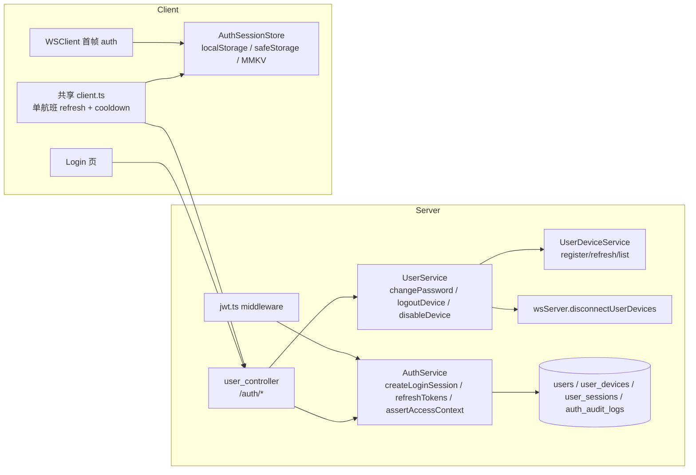
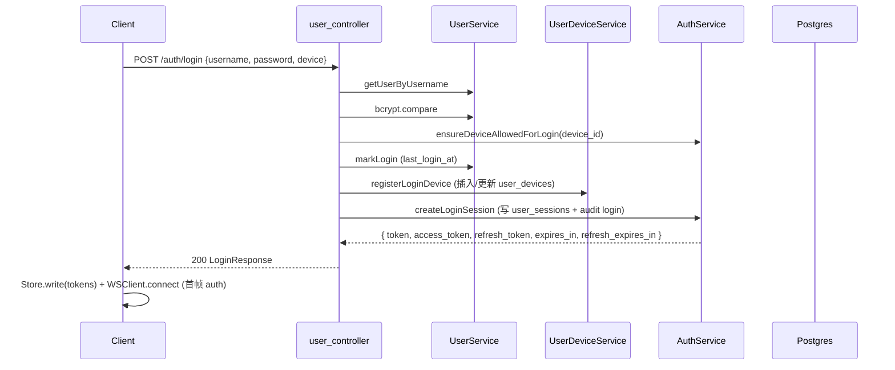
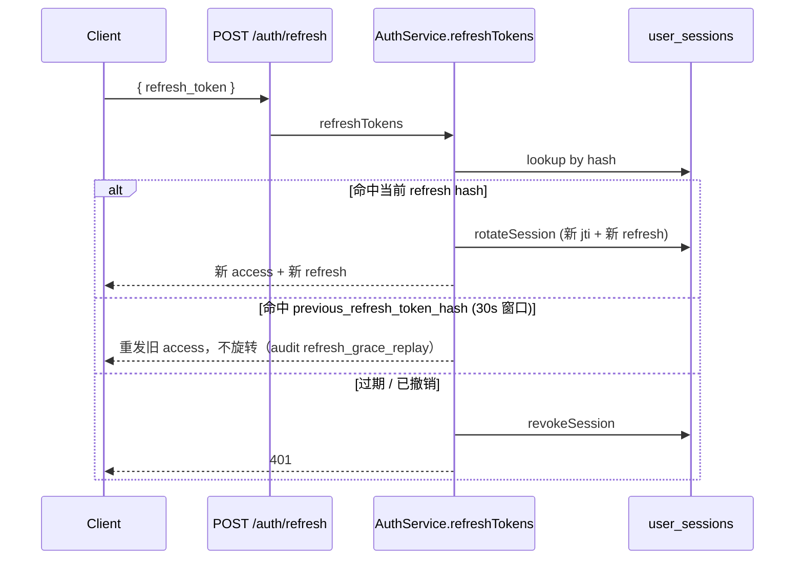
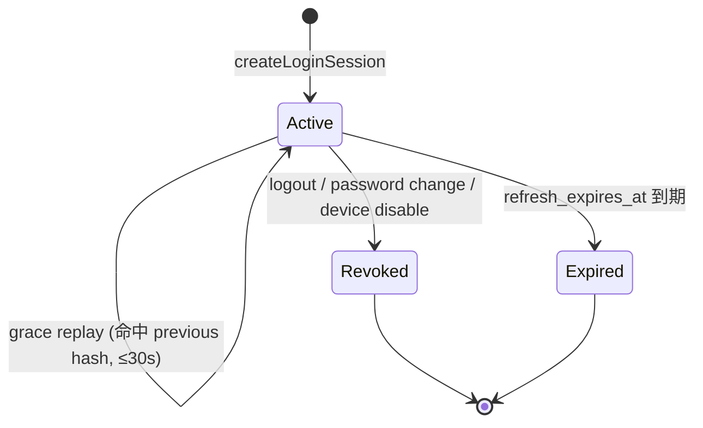

# 认证与会话管理架构设计

> 适用范围：mushroom-app 的「用户登录 / 注册 / 令牌颁发 / 多设备会话 / 安全审计」全链路。
>
> 关联文档：
>
> - 多账号隔离与本地数据分区：`docs/architecture/multi-account-isolation.md`
> - WebSocket 鉴权与强制下线：`docs/architecture/websocket.md`
> - 推送 token 与设备注册：`docs/architecture/push-notification.md`

---

## 1. 模块概述

### 1.1 目标

- 颁发并维护用户访问凭据（access + refresh JWT/opaque），统一覆盖 Web / Electron / Mobile。
- 以「设备」为最小粒度跟踪登录会话，支持多设备登录、单设备登出、撤销其他设备、踢全部下线。
- 提供权威的实时撤销路径：密码变更 / 设备登出 / 顶号场景下立刻关闭 WebSocket。
- 写完整安全审计：`auth_audit_logs` 表覆盖 login / refresh / logout / device / password 全事件。

### 1.2 非目标

- **不实现** 2FA / TOTP / 短信邮件二次验证。
- **不实现** 登录失败账号级锁定（仅 IP 级 `authLimiter` rate limit）。
- **不实现** 设备指纹 / 异地登录风控。
- **不实现** 服务端密码找回（依赖运营介入）。
- **不实现** OAuth / SSO 外联。

### 1.3 平台覆盖

| 维度           | Server                    | Web                   | Electron                                | Mobile (RN)                                  |
| -------------- | ------------------------- | --------------------- | --------------------------------------- | -------------------------------------------- |
| Token 颁发     | `AuthService` + JWT HS256 | n/a                   | n/a                                     | n/a                                          |
| Token 本地存储 | n/a                       | `localStorage`        | electron `safeStorage`（fallback 明文） | MMKV per-uid（`mushroom-mobile.user.<uid>`） |
| 自动 refresh   | n/a                       | 提前 5 min + 401 拦截 | 同 web                                  | 共享单航班 client + 401 拦截                 |
| 强制下线响应   | WS close 4001             | 路由跳登录            | 同 web                                  | 同 web                                       |

---

## 2. 架构总览

### 2.1 端到端组件依赖

### 2.2 登录时序

### 2.3 Refresh 时序（含 grace replay）

---

## 3. 业务流程

| 流程            | 入口                        | 关键服务方法                                                                     | 副作用                                      |
| --------------- | --------------------------- | -------------------------------------------------------------------------------- | ------------------------------------------- |
| 注册            | `POST /auth/register`       | `UserService.createUser` (`server/src/service/user_service.ts:108-121`)          | 写 `users`；**不自动登录**                  |
| 登录            | `POST /auth/login`          | `AuthService.createLoginSession` (`server/src/service/auth_service.ts:62-108`)   | 写 `user_sessions` + audit `login`          |
| 刷新            | `POST /auth/refresh`        | `AuthService.refreshTokens` (`server/src/service/auth_service.ts:110-304`)       | `rotateSession` 或 grace replay             |
| 当前设备登出    | `POST /auth/logout`         | `UserService.logoutCurrentDevice` (`server/src/service/user_service.ts:423-447`) | session revoked + device status=2 + WS 4001 |
| 指定设备登出    | `POST /auth/logout-device`  | `UserService.logoutDevice` (`server/src/service/user_service.ts:471-510`)        | 同上 + audit `logout.device`                |
| 登出全部 / 其他 | `POST /auth/logout-all`     | `UserService.logoutAllDevices` (`server/src/service/user_service.ts:512-549`)    | 支持 `keep_current`                         |
| 禁用设备        | `POST /auth/device/disable` | `UserService.disableDevice` (`server/src/service/user_service.ts:551-595`)       | device status=0，禁止再登录                 |
| 恢复设备        | `POST /auth/device/restore` | `UserService.restoreDevice` (`server/src/service/user_service.ts:597-623`)       | device status=1（不重新颁发凭据）           |
| 修改密码        | `POST /auth/password`       | `UserService.changePassword` (`server/src/service/user_service.ts:212-280`)      | 撤销除当前外所有 session + WS 4001          |
| 设备列表        | `GET /auth/devices`         | `UserService.getManagedDevices` (`server/src/service/user_service.ts:361-403`)   | 含在线 / 当前设备标记                       |
| 安全事件        | `GET /auth/security-events` | `UserService.getSecurityEvents` (`server/src/service/user_service.ts:405-421`)   | 最近 N（≤100）条 audit                      |

完整 API → DTO 表见 §7。

---

## 4. 策略与设计原则

- **Access JWT + Opaque Refresh**：access 走 JWT（HS256），无状态可被中间件校验；refresh 是 48 字节 base64url 随机串，**只在 DB 存 SHA-256 哈希**，离线泄漏数据库也无法直接复用。
- **Session 集中校验**：`assertAccessContext` 在 HTTP / WS 鉴权时都会回查 `user_sessions`，即便 access JWT 未过期也能即时撤销（密码改 / 顶号）。
- **30s grace replay**：refresh 与 access 分别有 30s 窗口（`config.ts:100-101`），容忍移动端并发刷新与轮转抖动；audit 记录 `refresh_grace_replay`。
- **Device-bound login**：`device_id` 是登录必填项，写入 JWT 与 session，`assertAccessContext` 比对一致性后才允许使用。
- **统一设备身份**：`device_id` 各端统一为 UUID v4（生成规则收敛到 `packages/app-core/src/device-identity.ts`），`device_name` / `app_version` 上报真实设备型号与构建版本（参考 Telegram 展示风格）。详见 `docs/architecture/push-notification.md` §7.5。
- **强一致下线**：登出 / 改密 / 禁用 → 撤销 session + 断 WS（`disconnectUserDevices` close 4001），不依赖客户端轮询。
- **审计静默吞错**：`recordAudit` / `touchAccessContext` 失败不抛错（`auth_service.ts:386-407`），避免拖垮主流程；属已知风险（§11）。
- **不实现锁定 / 2FA**：当前安全模型依赖 IP `authLimiter` + 强密码策略 + 用户教育，企业部署应配合反向代理 WAF；详见 §11 风险。
- **客户端单航班 refresh**：所有平台共用 `packages/shared/src/api/client.ts` 的 `refreshInFlight` 去重 + cooldown，避免 401 风暴。

---

## 5. 平台分层结构

### 5.1 服务端

| 模块              | 路径                                               | 责任                                                           |
| ----------------- | -------------------------------------------------- | -------------------------------------------------------------- |
| AuthService       | `server/src/service/auth_service.ts:1-440`         | token 颁发 / 校验 / 旋转 / 审计                                |
| UserService       | `server/src/service/user_service.ts`               | 注册 / 改密 / 设备生命周期                                     |
| UserDeviceService | `server/src/service/user_device_service.ts`        | 设备注册 / 刷新 / 列表                                         |
| Controller        | `server/src/controller/user_controller.ts:119-541` | `/auth/*` 路由实现                                             |
| Router            | `server/src/routers/user_router.ts:6-15`           | 路径声明                                                       |
| JWT middleware    | `server/src/handler/jwt.ts:42-46`                  | `verifyAccessToken`                                            |
| Rate limit        | `server/src/app.ts:191-202`                        | `authLimiter` 60s / 50 次（仅 login/register/refresh）         |
| Schema            | `server/src/db/migrate.ts:14-280`                  | `users` / `user_devices` / `user_sessions` / `auth_audit_logs` |

### 5.2 共享层

| 路径                                          | 责任                                                                                                                                             |
| --------------------------------------------- | ------------------------------------------------------------------------------------------------------------------------------------------------ |
| `packages/shared/src/types/api.ts:24-170`     | DTO：`LoginRequest` / `DeviceRegistrationPayload` / `LoginResponse` / `RefreshTokenRequest` / `ChangePasswordRequest` / `UserDevicesResponse` 等 |
| `packages/shared/src/api/client.ts`           | HTTP 客户端 + 单航班 refresh + cooldown                                                                                                          |
| `packages/app-core/src/auth.ts`               | `buildLoginUserFromAccessToken`（纯 base64 JWT 解码）                                                                                            |
| `packages/app-core/src/storage.ts:26-263`     | `AuthSessionStore` 抽象 + `createJsonBackedAuthSessionStore`                                                                                     |
| `packages/app-core/src/controller.ts:506-631` | `logoutManagedDevice / logoutOtherDevices / logoutAllManagedDevices / logout` 编排                                                               |

### 5.3 Web

| 模块           | 路径                           | 责任                                                                                     |
| -------------- | ------------------------------ | ---------------------------------------------------------------------------------------- |
| 登录页         | `apps/web/src/pages/Login.tsx` | 构造 `DeviceRegistrationPayload` 提交                                                    |
| Token 存储     | `apps/web/src/utils/token.ts`  | `localStorage` + `AUTH_TOKENS_CHANGED_EVENT` 跨 tab 广播                                 |
| HTTP / refresh | `apps/web/src/http/index.ts`   | `ACCESS_TOKEN_REFRESH_LEAD_MS = 5 min` 主动提前 refresh，`scheduleProactiveTokenRefresh` |

### 5.4 Electron

| 模块         | 路径                                         | 责任                                                                                            |
| ------------ | -------------------------------------------- | ----------------------------------------------------------------------------------------------- |
| 主进程 token | `apps/electron/src/main/index.ts:302-332`    | `safeStorage` 加密；不可用时 fallback 明文（警告）                                              |
| 切换账号     | `apps/electron/src/main/index.ts:233-267`    | 未勾选清理的 logout，保留账号数据                                                               |
| 登出 IPC     | `apps/electron/src/main/index.ts:499-527`    | 先 `unregister` 再 `logout`，记 runtimeLog                                                      |
| Preload      | `apps/electron/src/preload/index.ts:169-179` | 暴露 `saveToken / getToken / deleteToken / saveRefreshToken / getRefreshToken / setAccessToken` |

### 5.5 Mobile (RN)

| 模块           | 路径                                                                                               | 责任                                                                  |
| -------------- | -------------------------------------------------------------------------------------------------- | --------------------------------------------------------------------- |
| MMKV 存储      | `apps/mobile/src/data/storage.ts`                                                                  | `deviceStorage` + `userStorage(uid)`（`mushroom-mobile.user.${uid}`） |
| 会话工厂       | `apps/mobile/src/services/app-runtime.ts:118+`                                                     | `createSessionForUser` + per-uid JSON store                           |
| HTTP / refresh | `apps/mobile/src/services/api.ts`                                                                  | MobileServerApi + 共享 client 单航班 refresh                          |
| 单元测试       | `apps/mobile/__tests__/mobile-api-refresh.test.ts` / `apps/mobile/__tests__/app-core-auth.test.ts` |                                                                       |

---

## 6. 核心代码索引

| 职责                    | 路径                                                                   |
| ----------------------- | ---------------------------------------------------------------------- |
| 颁发 token / JWT 构造   | `server/src/service/auth_service.ts:409-439 buildTokenResponse`        |
| Refresh 旋转            | `server/src/service/auth_service.ts:269-282`                           |
| Refresh grace replay    | `server/src/service/auth_service.ts:136-185`                           |
| assertAccessContext     | `server/src/service/auth_service.ts:306-370`                           |
| 审计写入                | `server/src/service/auth_service.ts:386-407`                           |
| 设备允许登录            | `server/src/service/auth_service.ts:48-60 ensureDeviceAllowedForLogin` |
| 改密 → 撤销其他 session | `server/src/service/user_service.ts:212-280`                           |
| 强制 WS 下线            | `server/src/service/user_service.ts:261/434/491/525-531/574`           |
| HTTP 限流               | `server/src/app.ts:191-202 authLimiter`                                |
| 公开路径白名单          | `server/src/app.ts:43-49`                                              |

---

## 7. API 路径 → DTO

| Method / Path                | 鉴权           | Req DTO                      | Resp DTO                      | 实现                     |
| ---------------------------- | -------------- | ---------------------------- | ----------------------------- | ------------------------ |
| POST /auth/login             | open + limiter | LoginRequest（含 device）    | LoginResponse                 | `user_controller.ts:119` |
| POST /auth/register          | open + limiter | RegisterRequest              | UserProfile                   | `user_controller.ts:236` |
| POST /auth/refresh           | open + limiter | RefreshTokenRequest          | LoginResponse                 | `user_controller.ts:193` |
| POST /auth/device/register   | JWT            | RegisterCurrentDeviceRequest | RegisterCurrentDeviceResponse | `user_controller.ts:205` |
| POST /auth/device/unregister | JWT            | —                            | `{updated}`                   | `user_controller.ts:432` |
| POST /auth/logout            | JWT            | —                            | null                          | `user_controller.ts:412` |
| POST /auth/logout-device     | JWT            | `{device_id}`                | LogoutDevicesResponse         | `user_controller.ts:448` |
| POST /auth/logout-all        | JWT            | `{keep_current?}`            | LogoutDevicesResponse         | `user_controller.ts:468` |
| POST /auth/device/disable    | JWT            | `{device_id}`                | UpdateDeviceStatusResponse    | `user_controller.ts:485` |
| POST /auth/device/restore    | JWT            | `{device_id}`                | UpdateDeviceStatusResponse    | `user_controller.ts:508` |
| GET /auth/devices            | JWT            | —                            | UserDevicesResponse           | `user_controller.ts:403` |
| GET /auth/security-events    | JWT            | `?limit`                     | UserSecurityEventsResponse    | `user_controller.ts:531` |
| GET /auth/session            | JWT            | —                            | UserSessionSummary            | `user_controller.ts:370` |
| POST /auth/password          | JWT            | ChangePasswordRequest        | ChangePasswordResponse        | `user_controller.ts:344` |

> `LoginResponse` 同时返回 `token` 与 `access_token`（旧客户端兼容，建议下线 `token`）。

---

## 8. 数据库 schema

| 表                | 关键字段                                                                                                                                                                                                                                                | 路径                             |
| ----------------- | ------------------------------------------------------------------------------------------------------------------------------------------------------------------------------------------------------------------------------------------------------- | -------------------------------- |
| `users`           | `username / email / phone`（各自 UNIQUE）/ `password`(bcrypt) / `status`(0/1/2) / `is_deleted` / `last_login_at`                                                                                                                                        | `server/src/db/migrate.ts:14-32` |
| `user_devices`    | `(user_id, device_id)` UNIQUE / `device_type` / `push_provider` / `push_token` / `app_version` / `last_seen_at` / `last_ip` / `status`(0 disabled / 1 active / 2 logged out)                                                                            | `server/src/db/migrate.ts:198-`  |
| `user_sessions`   | `session_id`(PK) / `refresh_token_hash` / `access_jti` / `previous_refresh_token_hash` / `previous_refresh_rotated_at` / `previous_access_jti` / `previous_access_rotated_at` / `issued_at` / `expires_at` / `status`(0 active / 1 revoked / 2 expired) | `server/src/db/migrate.ts:217-`  |
| `auth_audit_logs` | `action / action_status / user_id / device_id / session_id / ip / user_agent / details(jsonb)`                                                                                                                                                          | `server/src/db/migrate.ts:240-`  |

---

## 9. Token / Session 状态机

设备状态：`0 disabled`（拒绝登录）/ `1 active`（可用）/ `2 logged out`（已注销，可恢复或重新登录）。

---

## 10. 客户端 Token 存储与切账号

| 平台     | 存储                                         | 加密                                       | 跨标签 / 跨进程同步                            |
| -------- | -------------------------------------------- | ------------------------------------------ | ---------------------------------------------- |
| Web      | `localStorage`                               | 无                                         | `storage` 事件 + `AUTH_TOKENS_CHANGED_EVENT`   |
| Electron | `electron-store` + `safeStorage`             | 系统 Keychain；不可用 fallback 明文 + warn | IPC `setAccessToken` 同步给渲染进程 web bundle |
| Mobile   | MMKV per-uid（`mushroom-mobile.user.<uid>`） | 无（**风险** §11）                         | 单实例进程，无需同步                           |

切账号 / 多账号：见 `docs/architecture/multi-account-isolation.md`。核心逻辑：`logout({wipeLocalData:false})` 保留 per-uid 数据 → 登录新账号即可切回。

---

## 11. 现状缺口与 Roadmap

| 缺口 / 风险                                                             | 影响                            | 建议                                                                   | 优先级 |
| ----------------------------------------------------------------------- | ------------------------------- | ---------------------------------------------------------------------- | ------ |
| `authLimiter` 注释「20 次」实际 `max:50`（`server/src/app.ts:191-197`） | 文档与代码不一致                | 对齐为 20 或更新注释                                                   | P1     |
| 登录失败无账号级锁定                                                    | 同 IP 限流内可撞库              | 引入 `failed_attempts` + 时间窗锁定                                    | P0     |
| 无 2FA / MFA                                                            | 凭据泄漏即失陷                  | TOTP / 邮件验证码作为高敏操作复核                                      | P1     |
| 无设备指纹 / 新设备登录告警                                             | 异地登录无感                    | 新设备首次登录发邮件 / 站内信                                          | P1     |
| Mobile refresh token 明文落 MMKV                                        | root 设备易窃                   | iOS Keychain / Android EncryptedSharedPreferences                      | P0     |
| Electron `safeStorage` 不可用时 fallback 明文                           | Linux 无 KWallet/Gnome 时风险   | 明确拒绝 + 引导用户处理                                                | P1     |
| Web access+refresh 都存 `localStorage`                                  | XSS 拿走凭据                    | refresh 改 httpOnly Cookie + SameSite=Lax                              | P0     |
| `LoginResponse` 同时含 `token` / `access_token` 冗余                    | 维护成本                        | 公告期后下线 `token`                                                   | P3     |
| `register` 不返回 session                                               | 多一次往返                      | 注册成功直接颁发凭据                                                   | P3     |
| JWT 默认 TTL 24h 偏长                                                   | 泄漏窗口大                      | 缩短到 1h，依赖 refresh                                                | P2     |
| `unregisterPushForCurrentDevice` 不写 audit                             | 异常退出留下「孤儿」            | 始终 audit `device.unregister_push`                                    | P2     |
| `recordAudit` / `touchAccessContext` 静默吞错                           | 安全审计可能丢失                | 失败计数上报到 metrics                                                 | P2     |
| `device_id` 由客户端自生成                                              | 可伪造 → 影响「踢其他设备」语义 | 已统一 UUID v4 格式（三端一致）；服务端签发并下发 `device_id` 仍待评估 | P2     |
| `/auth/refresh` 未绑 device 校验                                        | 异机刷新可行                    | refresh 校验绑定 device_id                                             | P1     |
| grace replay 30s 偏短                                                   | 弱网仍可能 401                  | 抽样指标后调优                                                         | P3     |

---

## 12. 关键常量

| 常量                        | 默认值                                                              | 出处                                                      |
| --------------------------- | ------------------------------------------------------------------- | --------------------------------------------------------- |
| `JWT_ACCESS_TTL_SECONDS`    | 86 400（24h）                                                       | `server/src/utils/config.ts:95`                           |
| `JWT_REFRESH_TTL_SECONDS`   | 2 592 000（30d）                                                    | `server/src/utils/config.ts:96-99`                        |
| `JWT_REFRESH_GRACE_SECONDS` | 30                                                                  | `server/src/utils/config.ts:100`                          |
| `JWT_ACCESS_GRACE_SECONDS`  | 30                                                                  | `server/src/utils/config.ts:101`                          |
| `authLimiter` window / max  | 60 s / 50                                                           | `server/src/app.ts:191-197`                               |
| bcrypt saltRounds           | 10                                                                  | `server/src/service/user_service.ts:113, 252`             |
| 最小密码长度                | 6                                                                   | `server/src/service/user_service.ts:219`                  |
| Refresh token 长度          | 48 bytes (base64url)                                                | `server/src/service/auth_service.ts:71, 263`              |
| Session ID 长度             | 24 bytes                                                            | `server/src/service/auth_service.ts:69`                   |
| Access JTI 长度             | 18 bytes                                                            | `server/src/service/auth_service.ts:70, 262`              |
| Web 主动 refresh 提前       | 5 min                                                               | `apps/web/src/http/index.ts ACCESS_TOKEN_REFRESH_LEAD_MS` |
| Security events 最大 limit  | 100                                                                 | `server/src/controller/user_controller.ts:539`            |
| Mobile per-uid 命名空间     | `mushroom-mobile.user.${uid}`                                       | `apps/mobile/src/data/storage.ts`                         |
| Mobile auth store key       | `mushroom.mobile.auth`                                              | `packages/app-core/src/storage.ts:263`                    |
| 公开路径白名单              | `/auth/login` `/auth/register` `/auth/refresh` `/healthz` `/readyz` | `server/src/app.ts:43-49`                                 |

---

## 13. Changelog

| 日期       | 变更                                                                                         |
| ---------- | -------------------------------------------------------------------------------------------- |
| 2026-05-22 | 初版：覆盖 AuthService / UserService / UserDeviceService 与三端 token 存储；标注 14 项 gap。 |
