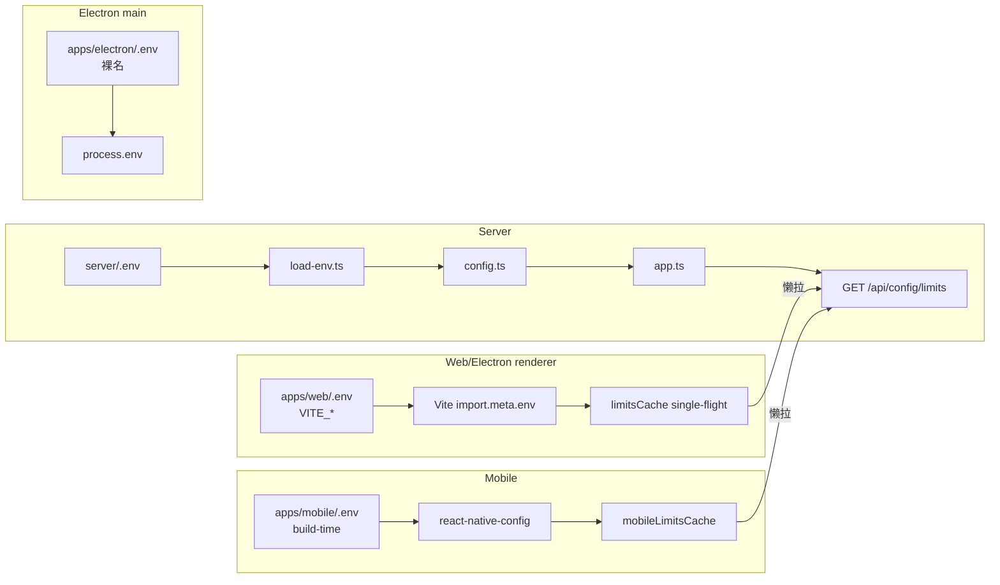

# 配置管理架构设计

> 适用范围：mushroom-app 的环境变量与运行时配置体系——server / web / electron / mobile 四端的 `.env` 分治、`/api/config/limits` 客户端下发、灰度开关。
>
> 关联文档：
>
> - 日志相关变量：`docs/logging.md`
> - 上传分片参数：`docs/architecture/media-upload.md`

---

## 1. 模块概述

### 1.1 目标

- 严格隔离 server 密钥与 client bundle，避免泄漏。
- 服务端集中读取一次（`config.ts`），按业务域分组提供常量。
- 客户端按需懒拉 `/api/config/limits`，避免硬编码上传/文本上限。
- 提供少量灰度开关（如 `PRESENCE_FANOUT_MODE`），通过重启切换。

### 1.2 非目标

- **不实现** 远程配置中心（etcd / Apollo / Nacos / Firebase Remote Config）。
- **不实现** 客户端动态 feature flag / A/B 灰度。
- **不实现** 配置热更（修改 .env 必须重启进程）。
- **不实现** 多副本配置一致性保证。

### 1.3 平台覆盖

| 维度       | server/.env                  | apps/web/.env     | apps/electron/.env                | apps/mobile/.env         |
| ---------- | ---------------------------- | ----------------- | --------------------------------- | ------------------------ |
| 加载器     | `dotenv`                     | Vite `VITE_*`     | Vite `VITE_*` + 主进程裸名        | `react-native-config`    |
| 入口       | `server/src/utils/config.ts` | `import.meta.env` | `import.meta.env` / `process.env` | `Config`                 |
| 编译时绑定 | 否（运行时）                 | 是（bundle 内联） | 渲染层是 / 主进程否               | 是（写入 native 二进制） |

---

## 2. 架构总览

---

## 3. 业务流程

### 3.1 服务端启动

1. `load-env.ts` 进程启动时 `dotenv.config()` 一次。
2. `config.ts` 模块 import 时按域调 `readString/Number/Boolean/StringList/Enum`。
3. 致命门禁：`JWT_SECRET` 缺失即 throw（`config.ts:54-61`），生产/开发均 fail-fast。
4. 后续模块全部从 `config.*` 读，禁止再访问 `process.env`。

### 3.2 客户端懒拉 limits

1. 首次需要附件上传 / 文本长度校验时（`apps/web/src/hooks/useChatOutgoing.ts:204`、`apps/web/src/http/api.ts:268`、`apps/mobile/src/actions/chat/message-actions.ts:196-204`）触发 `ensureLimits()`。
2. 单例 cache + single-flight Promise，避免并发重复请求。
3. 失败回退 `DEFAULT_LIMITS_CONFIG`（`apps/web/src/http/api.ts:202`）。
4. 永久缓存到进程退出，**无 TTL / 无版本号 / 无热刷新**。

### 3.3 调用入口

- HTTP：`GET /api/config/limits`（`server/src/app.ts:206-219`）。
- 上游：附件上传 / 头像更新 / 文本超长拦截。
- 下游：无（叶子端点）。

---

## 4. 策略与设计原则

- **分治 .env**：四个独立 `.env` 文件，根目录不再提供统一 `.env`（AGENTS.md L57-63）；client 包**从不**读根 .env，避免密钥泄漏。
- **架构隔离**：
  - Vite 不带 `VITE_` 前缀的变量不会进 `import.meta.env`。
  - react-native-config 编译期写入 native 二进制，源码层无运行时访问服务端环境的能力。
- **fail-fast**：`JWT_SECRET` 启动期校验；其他关键变量（DB / Redis）由库自身在首次连接时失败。
- **暴露面收敛**：`/api/config/limits` 只白名单返回非敏感字段（上传分片、附件大小、文本长度）；不含密钥 / URL / 心跳常量 / fanout 模式。
- **灰度开关稀有**：当前仅 `PRESENCE_FANOUT_MODE`（contacts/subscribers/both）一处；重启生效。
- **环境变量命名**：服务端按域大写（`SERVER_/DB_/REDIS_/MINIO_/JWT_/PUSH_/CALL_/WS_/PRESENCE_/OUTBOX_/MAX_/UPLOAD_/LOG_`）；渲染层 `VITE_*`；Electron 主进程裸名。
- **PUSH_DRY_RUN 默认非生产 true**：减少开发环境误推真实设备。

---

## 5. 平台分层结构

### 5.1 服务端 config 分类（按行号）

| 分类      | 行号             | 关键 env（节选）                                                                                      |
| --------- | ---------------- | ----------------------------------------------------------------------------------------------------- |
| server    | L66-77           | `SERVER_HOST/PORT/NODE_ID`、`SERVER_GRACEFUL_SHUTDOWN_TIMEOUT_MS`                                     |
| minio     | L78-85           | `MINIO_*`                                                                                             |
| pg        | L86-92           | `DB_*`                                                                                                |
| auth      | L93-102          | `JWT_SECRET`（必需）、`JWT_ACCESS_TTL_SECONDS=86400`、`JWT_REFRESH_TTL_SECONDS=2592000`、双 30s grace |
| redis     | L103-108         | `REDIS_*`                                                                                             |
| outbox    | L109-117         | `OUTBOX_*`                                                                                            |
| push      | L118-146         | FCM / 华为 / 小米；私钥 `\\n→\n` 还原                                                                 |
| call      | L147-162         | `CALL_INVITE_TIMEOUT_SECONDS=45`、TURN shared-secret / static、LiveKit                                |
| websocket | L163-176         | `WS_HEARTBEAT_CHECK_INTERVAL_MS=35000`、`WS_DEVICE_PRESENCE_TTL_SECONDS=70`                           |
| presence  | L177-202         | `PRESENCE_FANOUT_MODE=both`（灰度）、`PRESENCE_*`                                                     |
| limits    | L203-228         | `MAX_TEXT_LENGTH=2000`、`MAX_{IMAGE/VIDEO/AUDIO/VOICE/FILE}_SIZE_MB`、`UPLOAD_CHUNK_*`                |
| logging   | docs/logging.md  | `LOG_*`（不在 config.ts，logger 直接读）                                                              |
| 限流      | `app.ts:191-201` | 硬编码 `/auth/login` / register / refresh，未 env 化                                                  |

### 5.2 客户端 .env 范围

| App                          | 行数 | 命名                       | 关键变量                                                                                                                                          |
| ---------------------------- | ---- | -------------------------- | ------------------------------------------------------------------------------------------------------------------------------------------------- |
| `server/.env.example`        | 124  | 大写按域                   | 全部服务端 env                                                                                                                                    |
| `apps/web/.env.example`      | 13   | `VITE_*`                   | `VITE_API_BASE_URL=/api`、`VITE_WS_URL`、`VITE_DEV_PROXY_TARGET`、`VITE_CALL_ICE_SERVERS`(JSON)、`VITE_CALL_FORCE_RELAY`、`VITE_CALL_DEBUG_MEDIA` |
| `apps/electron/.env.example` | 31   | 主进程裸名 + 渲染 `VITE_*` | `LOG_*`、`API_BASE_URL=http://127.0.0.1:9100`、渲染层同 web                                                                                       |
| `apps/mobile/.env.example`   | 18   | react-native-config        | 仅 `LOG_*` 4 项；头部警告"NEVER place server-side secrets"                                                                                        |

### 5.3 共享层

| 路径                                         | 责任                                          |
| -------------------------------------------- | --------------------------------------------- |
| `packages/shared/src/config/limits.ts:64-69` | `LimitsConfig` DTO                            |
| `apps/web/src/http/api.ts:186-211`           | web/electron `ensureLimits` + `getLimitsSync` |
| `apps/mobile/src/services/api.ts:189-213`    | mobile `ensureLimits`                         |

---

## 6. 核心代码索引

| 职责                      | 路径                                         |
| ------------------------- | -------------------------------------------- |
| dotenv 一次性加载         | `server/src/utils/load-env.ts`               |
| 工具函数 read\*           | `server/src/utils/config.ts:7-50`            |
| JWT_SECRET 门禁           | `server/src/utils/config.ts:54-61`           |
| WS 心跳不变量注释         | `server/src/utils/config.ts:172-174`         |
| PRESENCE_FANOUT_MODE 灰度 | `server/src/utils/config.ts:184`             |
| /api/config/limits 实现   | `server/src/app.ts:206-219`                  |
| LimitsConfig 类型         | `packages/shared/src/config/limits.ts:64-69` |
| web 懒拉单例              | `apps/web/src/http/api.ts:186-211`           |
| mobile 懒拉单例           | `apps/mobile/src/services/api.ts:189-213`    |

---

## 7. API 路径

| Method | Path                 | DTO                         |
| ------ | -------------------- | --------------------------- |
| GET    | `/api/config/limits` | → `LimitsConfig`（无 auth） |

---

## 8. WS 协议

不涉及。

---

## 9. 数据库

不涉及（纯 env 驱动）。

---

## 10. 约束与边界

- **不能把 server 密钥放进客户端 .env**：依赖 Vite/RN-config 编译期不会注入未带前缀的变量 + AGENTS.md 约定 + review；**无自动化检查**。
- **客户端 limits 永久缓存**：登出不清；切账号不刷新（影响小但需注意）。
- **多副本配置不一致**：滚动升级期间不同实例可能用不同 limits；client 命中不同实例会感知到。
- **灰度只有重启**：`PRESENCE_FANOUT_MODE` 切换需要重启服务进程。
- **限流参数硬编码**：`server/src/app.ts:191-197` 的 authLimiter 改值需改代码。
- **日志 env 散落**：不在 `config.ts`，由 logger 模块直接读 `process.env`。

---

## 11. 现状缺口与 Roadmap

| ID  | 现状                          | 风险                                                  | 建议                                                                           |
| --- | ----------------------------- | ----------------------------------------------------- | ------------------------------------------------------------------------------ |
| R1  | 无远程配置中心                | 改 env 必须重启 + 滚动                                | 引入 Nacos / etcd / Apollo；至少把 limits + presence fanout 接入               |
| R2  | `/api/config/limits` 暴露面窄 | 心跳常量、reaction 白名单、media 自动下载阈值都硬编码 | 扩展 `/api/config/runtime`，覆盖更多客户端可调常量                             |
| R3  | 客户端 limits 无 TTL / 版本号 | server .env 改后客户端要重启感知                      | 响应加 `version` 头；客户端定时 1h 重拉，版本变化推 in-app banner              |
| R4  | 客户端 limits 缓存永不清      | 切账号不刷新                                          | 登出/切账号时 reset；增加 `If-None-Match`                                      |
| R5  | 灰度开关稀缺（仅 1 个）       | 重要变更只能通过版本发布                              | 引入 server-side feature flag 表（`feature_flags(key, value, scope)`）         |
| R6  | 无 CI 检查密钥泄漏            | 人为失误风险                                          | pre-commit + CI lint：扫描 `apps/*/.env*` 不允许 `JWT_/PUSH_/TURN_/DB_/REDIS_` |
| R7  | logging env 不在 config.ts    | 分散难维护                                            | 收口到 `config.logging.*`                                                      |
| R8  | 限流参数硬编码                | 攻防场景调整慢                                        | env 化：`AUTH_LIMITER_WINDOW_MS` / `AUTH_LIMITER_MAX`                          |
| R9  | 多实例配置不一致              | 滚动升级窗口期 limits 抖动                            | 加 `/api/config/version` + 客户端容错（取较小值）                              |
| R10 | mobile .env 编译期固化        | OTA 后 .env 无法跟随                                  | 关键开关走 server 下发，不走 .env                                              |

优先级：R6（安全）→ R1（运维）→ R3 / R4（一致性）→ 其余。

---

## 12. Changelog

| 日期       | 版本 | 变更                                                          | 作者     |
| ---------- | ---- | ------------------------------------------------------------- | -------- |
| 2026-05-23 | v1.0 | 首版：四端 .env 分治、/api/config/limits、灰度现状、10 项缺口 | OpenCode |
