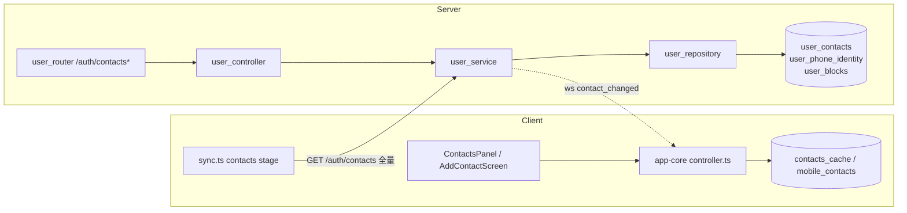

# 联系人架构设计

> 适用范围：mushroom-app 的「通讯录 / 联系人」模块——单向 owner 视角、软删、手机号匹配。
>
> 关联文档：
>
> - 拉黑与隐私门控：`docs/architecture/account-privacy.md`
> - 增量同步框架：`docs/architecture/messaging.md`
> - WS classify 注册：`docs/architecture/websocket.md`

---

## 1. 模块概述

### 1.1 目标

- 提供基础「单向加好友」体验：添加 / 备注 / 删除 / 黑名单。
- 通讯录手机号匹配：上传哈希号码批量找出已注册用户。
- 与拉黑、隐私可见性、消息接收策略联动。

### 1.2 非目标

- **不实现** 好友请求 / 审批流（`status` 只有 `normal/deleted`）。
- **不实现** 好友分组 / 标签 / 星标 / 置顶联系人。
- **不实现** mutual contacts / 推荐人。
- **不实现** 双向自动加好友（owner 视角单向）。

### 1.3 平台覆盖

| 维度       | Server                      | Web                | Electron                  | Mobile                                            |
| ---------- | --------------------------- | ------------------ | ------------------------- | ------------------------------------------------- |
| 数据源     | `user_contacts` (PG)        | 内存 + electronAPI | `contacts_cache` (SQLite) | `mobile_contacts` (SQLite + JSON payload)         |
| 添加入口   | `POST /auth/contacts`       | `AddContactDialog` | 同 web                    | `AddContactScreen` + `AddressBookMatchListScreen` |
| 通讯录匹配 | `POST /auth/contacts/match` | n/a                | n/a                       | `performAddressBookMatch`                         |

---

## 2. 架构总览

---

## 3. 业务流程

| 流程       | 端点 / 入口                                    | 说明                                                                             |
| ---------- | ---------------------------------------------- | -------------------------------------------------------------------------------- |
| 添加联系人 | `POST /auth/contacts`                          | upsert `status='normal'`，已是好友抛 `BusinessError`；推 `contact_changed:added` |
| 更新备注   | `PUT /auth/contacts/:contactUserId`            | 仅 owner 可见的 `remark_name` / `remark_note`                                    |
| 删除联系人 | `DELETE /auth/contacts/:contactUserId`         | 软删（status→deleted），保留行用于未来增量游标；推 `contact_changed:removed`     |
| 拉黑       | `POST /auth/block`                             | 写 `user_blocks`，独立于 contacts；推 `block_changed`                            |
| 全量同步   | `GET /auth/contacts` + `GET /auth/blocks`      | 当前**全量返回 normal**；客户端本地 diff 幂等                                    |
| 通讯录匹配 | `POST /auth/contacts/match` body `{phones:[]}` | 上限 500 条 E.164；命中 `user_phone_identity`                                    |
| 单号查询   | `POST /auth/contacts/lookup-phone`             | 返回 `is_already_contact` 标记                                                   |
| 搜索用户   | `GET /auth/search`                             | `mode=phone` 整号精确；`mode=username` 用户名子串（`default_country_code=+86`）  |

### 3.1 调用入口

- HTTP：`server/src/routers/user_router.ts:25-30`（联系人挂在 `/auth` 前缀下，非独立 `/contact`）。
- WS 推送：`contact_changed` / `block_changed`（`packages/shared/src/types/ws.ts:46, 341-351`）。

### 3.2 上下游依赖

- 上游：UI（ContactsPanel / AddContactDialog / AddContactScreen）、共享 `controller`。
- 下游：`UserService.areContacts` 给消息层做「仅联系人可发送」门控（`message_service.ts:323`）、presence_visibility 的 contacts_only 判定、push 路由的「联系人才推送」开关。

---

## 4. 策略与设计原则

- **单向 owner 视角**：A 加 B 不影响 B 是否加 A。简单可控但失去「互为好友」语义。
- **软删保留行**：`status='deleted'` 行不物理删除（`user_repository.ts:313-323`），为未来 since/cursor 增量游标预留。
- **备注私有**：`remark_name` / `remark_note` 仅 owner 视角，对方完全不可见。
- **黑名单独立表**：`user_blocks` 单独维护；查 contacts 时 `LEFT JOIN` 过滤掉「我拉黑的」，但**不**过滤「拉黑我的」（隐私层另做）。
- **客户端合并视图**：`ContactListItem extends Contact { is_blocked, blocked_at }` 让 contacts + blocks 渲染统一。
- **diff 字段白名单**：`CONTACT_COMPARE_FIELDS`（`packages/shared/src/utils/contactDiff.ts:11-22`）**故意排除 `updated_at`**，避免 server touch 触发无意义本地写入。
- **手机号匹配走独立表**：`user_phone_identity(phone_e164 UNIQUE)`，注册/改号时 upsert；批量查走 `IN ($1...$N)`。

---

## 5. 平台分层结构

### 5.1 服务端

| 模块       | 路径                                                                                                    |
| ---------- | ------------------------------------------------------------------------------------------------------- |
| Router     | `server/src/routers/user_router.ts:25-30`                                                               |
| Controller | `server/src/controller/user_controller.ts:557-660`                                                      |
| Service    | `server/src/service/user_service.ts:625-761`（另含 `lookupUserByPhone:838-882`、`areContacts:773-775`） |
| Repository | `server/src/repository/user_repository.ts:134-345`                                                      |
| Schema     | `server/src/db/migrate.ts:291-303, 415-418`                                                             |

### 5.2 共享层

| 路径                                                  | 责任                                                            |
| ----------------------------------------------------- | --------------------------------------------------------------- |
| `packages/shared/src/types/models.ts:17-35`           | `Contact` / `ContactListItem` DTO                               |
| `packages/shared/src/types/ws.ts:46, 341-351`         | `contact_changed` 帧                                            |
| `packages/shared/src/utils/contactDiff.ts:11-22`      | `CONTACT_COMPARE_FIELDS` + `hasContactChanged` / `diffContacts` |
| `packages/app-core/src/controller.ts:1988, 2296-2330` | WS 派发 + handleBlockChanged 触发全量重拉                       |
| `packages/app-core/src/sync.ts:735-777`               | contacts stage（4 阶段同步首阶段）                              |

### 5.3 Web / Electron

| 模块               | 路径                                                                                                     |
| ------------------ | -------------------------------------------------------------------------------------------------------- |
| 主面板             | `apps/web/src/components/contacts/ContactsPanel.tsx`                                                     |
| 添加               | `apps/web/src/components/contacts/AddContactDialog.tsx`                                                  |
| 详情               | `apps/web/src/components/contacts/PeerDetailPanel.tsx`（含乐观更新）                                     |
| Hook               | `apps/web/src/components/contacts/useResolvedContact.ts`                                                 |
| WS handler（待删） | `apps/web/src/ws/handlers/contactChangeHandler.ts`                                                       |
| Electron 缓存      | `contacts_cache` 见 `apps/electron/src/main/migration.ts:75-90`                                          |
| IPC                | `apps/electron/src/main/database.ts:3363, 3372, 3377, 3409, 3437`（get/get-blocks/create/update/delete） |

### 5.4 Mobile

| 模块           | 路径                                                                                 |
| -------------- | ------------------------------------------------------------------------------------ |
| 本地表         | `mobile_contacts` 见 `apps/mobile/src/data/migration.ts:41-46`                       |
| Repository     | `apps/mobile/src/data/sqlite-data-repository.ts:446, 461, 483, 998`                  |
| 添加流程       | `apps/mobile/src/features/add-contact/screens/AddContactScreen.tsx`                  |
| 通讯录匹配     | `apps/mobile/src/features/add-contact/screens/AddressBookMatchListScreen.tsx`        |
| Actions        | `apps/mobile/src/actions/account/contact-actions.ts:71, 87, 122, 159, 226, 256, 263` |
| 通讯录匹配缓存 | `apps/mobile/src/data/address-book-match-cache.ts`                                   |

---

## 6. 核心代码索引

| 职责                        | 路径                                                                  |
| --------------------------- | --------------------------------------------------------------------- |
| 添加联系人                  | `server/src/service/user_service.ts:625+` saveContact                 |
| 软删                        | `server/src/repository/user_repository.ts:313-323` markContactDeleted |
| 列表 + 排除自己拉黑         | `server/src/repository/user_repository.ts:172-177`                    |
| 反向 owner 查询（presence） | `server/src/repository/user_repository.ts:188-197`                    |
| 批量手机号匹配              | `server/src/repository/user_repository.ts:325-346`                    |
| 客户端 contacts stage       | `packages/app-core/src/sync.ts:735-777`                               |
| handleContactChanged        | `packages/app-core/src/controller.ts:2296-2316`                       |
| handleBlockChanged 触发全量 | `packages/app-core/src/controller.ts:2330`                            |

---

## 7. API 路径表

基底前缀：`/auth`（联系人挂在 user 模块下）。

| Method | Path                            | DTO                                                      |
| ------ | ------------------------------- | -------------------------------------------------------- |
| GET    | `/auth/contacts`                | → `ContactListItem[]`                                    |
| POST   | `/auth/contacts`                | `{contact_user_id, remark_name?, remark_note?, source?}` |
| PUT    | `/auth/contacts/:contactUserId` | `{remark_name?, remark_note?}`                           |
| DELETE | `/auth/contacts/:contactUserId` | → `null`                                                 |
| POST   | `/auth/contacts/match`          | `{phones: string[]}` ≤500                                |
| POST   | `/auth/contacts/lookup-phone`   | `{phone_e164, default_country_code?}`                    |
| GET    | `/auth/blocks`                  | → 黑名单列表                                             |
| POST   | `/auth/block` / `/auth/unblock` | `{target_user_id}`                                       |

---

## 8. WS 协议

| classify          | 方向 | payload                                                                        |
| ----------------- | ---- | ------------------------------------------------------------------------------ |
| `contact_changed` | S→C  | `{ action: 'added'\|'updated'\|'removed', contact: Contact }`                  |
| `block_changed`   | S→C  | `{ action, target_user_id }` 不带 profile → 客户端触发 `syncNow({force:true})` |

**关键缺陷**：变更只走 `wsServer.dispatchToUser(userId,...)`（`user_service.ts:704, 735, 756`），**未写 outbox**——离线或异机节点用户会丢推送，需下次同步补齐（见 §11 R3）。

---

## 9. 数据库

| 表                    | 行                   | 关键约束                                                                                  |
| --------------------- | -------------------- | ----------------------------------------------------------------------------------------- |
| `user_contacts`       | `migrate.ts:291-303` | UNIQUE `(owner_user_id, contact_user_id)`；CHECK `owner≠contact`；status∈{normal,deleted} |
| `user_phone_identity` | `migrate.ts:282-290` | UNIQUE `phone_e164`                                                                       |
| `user_blocks`         | `migrate.ts:276-281` | PK `(blocker_id, blocked_id)`                                                             |

关键索引：`(owner_user_id, status, updated_at DESC)`、反向 `(contact_user_id, owner_user_id)`（`migrate.ts:415-418`）。

`source` 列枚举意图（无 server 端白名单）：`search` / `qr` / `contact_book` / `group` / `recommend` / `manual` / `phone_book`。

---

## 10. 约束与边界

- **不双向**：A 加 B 不会自动给 B 创建 A 的联系人记录；查询「B 是否已加我」需 `listReverseContactOwners`。
- **/contacts 全量返回**：当前没有 since/cursor 增量；客户端 diff 兜底。
- **匹配上限 500**：单次 `/contacts/match` 上限 500 条；超过需要客户端分页。
- **手机号必须 E.164**：服务端不做本地号码归一；客户端需先用 default_country_code 转换。
- **备注私有**：对端永远看不到 owner 设置的 remark。
- **黑名单不影响 contacts 表**：拉黑某人不会自动删 contact；UI 层合并展示。
- **WS contact_changed 双轨投递**：服务端在事务内写 `message_outbox(event_type=contact.changed)`，事务外同步调用 `wsServer.dispatchToUser`；在线设备由 WS 直发兜底实时性，离线/多端由 outbox worker 兜底可达性。见 §8 与 §11 R3。

---

## 11. 现状缺口与 Roadmap

| ID  | 现状                                           | 风险                       | 建议                                                                                                                    |
| --- | ---------------------------------------------- | -------------------------- | ----------------------------------------------------------------------------------------------------------------------- |
| R1  | 无好友请求/审批                                | 隐私不足，骚扰风险         | 引入 `status∈{requested, accepted, deleted}` + 推 `contact_request` 帧                                                  |
| R2  | `/contacts` 永远全量                           | 大通讯录用户首屏慢、流量高 | 加 `?since=updated_at` 参数；利用已保留的 `deleted` 行做 tombstone                                                      |
| R3  | ~~`contact_changed` 不经 outbox~~ ✅ 已修复    | 离线 / 跨节点丢推送        | 已改造：service 内事务写入 `OutboxRepository.insertEvents(event_type='contact.changed')` + 事务外保留 WS 直发，双轨投递 |
| R4  | 无好友分组 / 标签 / 星标 / 置顶                | 大通讯录难管理             | 新增 `user_contact_tags` 多对多表                                                                                       |
| R5  | mobile_contacts 用 JSON payload                | 复杂查询难做               | 关键字段拆列（已有 sort_name，可拆 `is_starred` 等）                                                                    |
| R6  | source 枚举无 server 校验                      | 数据脏值无约束             | 加 zod whitelist                                                                                                        |
| R7  | web `contactChangeHandler.ts` 与 app-core 重复 | 维护双份易漂移             | 删除 web 实现，统一走 app-core（账号隐私文档 P1）                                                                       |
| R8  | 手机号匹配无频控                               | 通讯录爆破风险             | 加 per-user rate limit + 异常监控                                                                                       |
| R9  | 无 mutual contacts                             | 缺少社交感                 | 加 `GET /contacts/mutual?user_id=`                                                                                      |
| R10 | 删除联系人无「同时拉黑」开关                   | 误操作仍可被骚扰           | UI 提供组合操作                                                                                                         |
| R11 | 添加成功后不会自动建直聊                       | 用户需手动开聊             | 可选：`POST /contacts` 返回 `direct_conversation_id`                                                                    |
| R12 | 备注名无搜索索引                               | 输入备注名搜不到           | server 端 contacts 搜索加 `remark_name ILIKE`                                                                           |

优先级：R1（隐私）→ R2（性能）→ R8（安全）→ 其余。

---

## 12. Changelog

| 日期       | 版本 | 变更                               | 作者     |
| ---------- | ---- | ---------------------------------- | -------- |
| 2026-05-23 | v1.0 | 首版：覆盖 8 端点、3 表、12 项缺口 | OpenCode |
