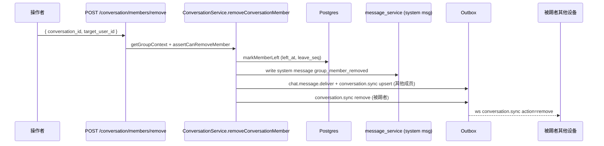

# 会话与群组架构设计

> 适用范围：mushroom-app 的「会话（Conversation）」抽象——1v1 直聊与群组（Group）的全栈实现。涵盖：会话创建、增量同步、成员管理、角色权限、群公告、群设置、置顶/静音/归档、群主转让、解散与退出。
>
> 关联文档：
>
> - 消息流水线（含 system message / read / 同步）：`docs/architecture/messaging.md`
> - 实时长连接（`conversation_sync` / `conversation_read` 帧）：`docs/architecture/websocket.md`
> - 推送（mention only / 群内静音判定）：`docs/architecture/push-notification.md`
> - 账号隐私（block / mute_all 的隐私层）：`docs/architecture/account-privacy.md`
> - 多账号隔离（per-uid 缓存）：`docs/architecture/multi-account-isolation.md`

---

## 1. 模块概述

### 1.1 目标

- 提供统一会话抽象：`type=1`（direct）+ `type=2`（group），客户端使用同一套渲染/同步链路。
- 群组三级角色（owner=2 / admin=1 / member=0），覆盖加人、踢人、转让、解散、禁言、公告、群设置。
- 会话状态二维：**会话级**（profile / settings / message_seq）与**用户级**（pinned / muted / archived / draft / unread / last_read_seq）拆分到不同表，避免写放大。
- 与 messaging 同步层一致：变更通过 outbox 写 `chat.message.deliver` + `conversation.sync` 双消息，客户端通过 `GET /conversation/sync` 增量拉取。

### 1.2 非目标

- **不实现** 入群审批 / 入群验证（`settings` 字段已预留扩展位但无对应流程）。
- **不实现** 群邀请链接 / 二维码邀请。
- **不实现** 全员禁言之外的「定向禁言批量操作」（仅按成员逐一）。
- **不实现** 跨群「广播 / 公告频道」类形态。
- **不实现** 子频道 / Thread。
- **不实现** 群人数硬上限（DB 不强约束；§11 列为风险）。

### 1.3 平台覆盖

| 维度          | Server                                                | Web                           | Electron            | Mobile (RN)                                           |
| ------------- | ----------------------------------------------------- | ----------------------------- | ------------------- | ----------------------------------------------------- |
| 群创建 / 直聊 | `ConversationService` / `direct_conversation_service` | `useConversation` Hook        | 复用 web            | `conversation-actions` / `start-conversation` screens |
| 群管理 UI     | n/a                                                   | `GroupManageModal`            | 同 web              | `GroupInfo*Screen` 系列                               |
| 持久化        | Postgres                                              | 内存 + IndexedDB              | SQLite（main 进程） | MMKV + SQLite                                         |
| 增量同步      | `GET /conversation/sync` + WS `conversation.sync`     | 共享 `controller.ts` 同步循环 | 同 web + IPC diff   | 同 web + per-uid                                      |

---

## 2. 架构总览

### 2.1 端到端组件

```mermaid
flowchart LR
  subgraph Server
    CC[conversation_controller]
    CS[ConversationService]
    DCS[direct_conversation_service]
    MS[message_service<br/>system message]
    OBW[OutboxWorker]
    DB[(conversations<br/>conversation_members<br/>conversation_user_state<br/>direct_conversation_pairs)]
  end
  subgraph Client
    Ctrl[packages/app-core controller.ts]
    Cache[(local SQLite/IndexedDB/MMKV<br/>per-uid)]
    Sync[conversation-sync.ts reducer]
    UI_W[Web GroupManageModal / ChatWindow]
    UI_M[Mobile GroupInfo*Screen]
  end
  CC --> CS
  CC --> DCS
  CS --> DB
  CS --> MS
  MS --> OBW
  OBW -. ws conversation.sync .-> Ctrl
  Ctrl --> Cache
  Ctrl --> Sync
  UI_W --> Ctrl
  UI_M --> Ctrl
```

### 2.2 群管理操作时序（以「踢人」为例）



---

## 3. 业务流程

| 流程       | 入口                                                   | 关键服务                                                                               | 系统消息                                                             |
| ---------- | ------------------------------------------------------ | -------------------------------------------------------------------------------------- | -------------------------------------------------------------------- |
| 创建直聊   | `POST /conversation/direct`                            | `direct_conversation_service.createDirectConversation`                                 | —                                                                    |
| 创建群     | `POST /conversation/create`（type=2，调用方=owner）    | `ConversationService.createConversation`                                               | `conversation_created`                                               |
| 加成员     | `POST /conversation/members/add`                       | `addConversationMembers`（权限：`canInviteGroupMembers`）                              | `group_member_joined`×N                                              |
| 踢成员     | `POST /conversation/members/remove`                    | `removeConversationMember`（admin 不能踢 admin，不能踢 owner）                         | `group_member_removed` + `conversation.sync action=remove`（target） |
| 退群       | `POST /conversation/leave`                             | `leaveConversation`（owner 必须先转让）                                                | `group_member_left` + `conversation.sync action=remove`（离群者）    |
| 设角色     | `POST /conversation/members/role`                      | `updateConversationMemberRole`（仅 owner）                                             | `group_role_updated`                                                 |
| 成员禁言   | `POST /conversation/members/mute`                      | `updateConversationMemberMute`（admin 不能禁言 admin）                                 | `group_member_muted` / `group_member_unmuted`                        |
| 转让群主   | `POST /conversation/owner/transfer`                    | `transferConversationOwner`                                                            | `group_owner_transferred`                                            |
| 解散群     | `POST /conversation/disband`                           | `disbandConversation`（仅 owner）                                                      | — + `conversation.sync action=remove`                                |
| 改群资料   | `POST /conversation/profile`                           | `updateConversationProfile`（受 `profile_edit_permission`）                            | —                                                                    |
| 改群公告   | `POST /conversation/announcement`                      | `updateConversationAnnouncement`                                                       | `group_announcement_updated`                                         |
| 改群设置   | `POST /conversation/settings`                          | `updateConversationSettings`（mute_all 由 admin+，invite/profile permission 仅 owner） | `group_mute_all_updated` / `group_settings_updated`                  |
| 用户级状态 | `POST /conversation/state`                             | `updateConversationState`（pin/mute/archive/draft）                                    | —                                                                    |
| 本地隐藏   | `POST /conversation/delete`                            | `deleteConversationForSelf`（写 `hidden_before_seq`）                                  | —                                                                    |
| 标记已读   | `POST /conversation/read`（或 WS `conversation_read`） | `markConversationRead`（夹取 `[0, message_seq]`）                                      | —                                                                    |
| 增量同步   | `GET /conversation/sync`                               | `getConversations(userId, pageSize, syncCursor)`                                       | —                                                                    |

### 3.1 调用入口

- HTTP：`server/src/routers/conversation_router.ts:6-22`（17 个端点，前缀 `/conversation`，**未加 `/api`**）。
- WS：`conversation_read` / `conversation_sync`（`packages/shared/src/types/ws.ts:161-195`）。
- 幂等键中间件覆盖：`create / members/add / members/remove / announcement / owner/transfer`（`server/src/app.ts:180-184`）。

### 3.1.1 客户端本地删除语义：hard vs soft

| 场景                                                                      | 路径                                                                | 本地操作                                                                                       | 说明                                                                                                          |
| ------------------------------------------------------------------------- | ------------------------------------------------------------------- | ---------------------------------------------------------------------------------------------- | ------------------------------------------------------------------------------------------------------------- |
| 用户主动「本地隐藏会话」 / 群主「解散群聊」                               | controller → `repository.softDeleteConversation`                    | **soft delete**：写 `hidden_before_seq` / `local_hidden_before_seq` 等 cutoff 字段，保留会话行 | 服务端可能仍存在该会话；本地仅是「我看不到」。下一轮 sync 复算 cutoff                                         |
| 服务端 WS `conversation_sync action=remove`（被踢 / 主动退群 / 群被解散） | `controller.handleRealtimeEvent` → `repository.removeConversations` | **hard delete**：会话行连同 `messagesByConversation[id]` 一并清除                              | 服务端权威通知「此会话对你不再存在」；与 `apps/web/src/ws/handlers/conversationSyncHandler.ts:18-20` 实现对齐 |

### 3.2 上下游依赖

- 上游：UI（GroupManageModal / GroupInfo\*Screen）、共享 controller。
- 下游：messaging（system message + outbox）、websocket（`conversation.sync` 扇出）、push（mention_only / mute_all 决策）。

---

## 4. 策略与设计原则

- **会话级 vs 用户级分表**：`conversations` 存共享元数据（名、头像、公告、settings、`message_seq`）；`conversation_user_state` 存每用户私有视图（pin / mute / archive / draft / unread / `last_read_seq` / `hidden_before_seq`）。读单条会话需 join，但避免互相阻塞。
- **可见性裁剪**：`conversation_members.join_seq / leave_seq` 决定历史消息可见区间；`conversation_user_state.hidden_before_seq` 让「我删除会话」只影响自己。
- **直聊唯一性**：`direct_conversation_pairs(user_low_id, user_high_id)` 复合唯一约束 + CHECK `low<high`，并发时撞唯一约束 reload 已有会话（`direct_conversation_service.ts:113-121, 160-167`）。
- **权限分层**：写操作均经 `getGroupContext` 预检 + 角色校验；公开权限工具 `canManageGroupProfile / canInviteGroupMembers` 由 `settings.profile_edit_permission / invite_permission` 决定。
- **角色保护**：admin 不能踢 / 改 / 禁言其他 admin（仅 owner 可），保证「群主之外的横向对等」。
- **finishGroupMutation 公共收尾**（`conversation_service.ts:1266-1345`）：所有成员变更后统一更新 `message_seq` 指针、补 unread/last_read、写 outbox `chat.message.deliver` + `conversation.sync` 双消息，保证客户端单一同步入口。
- **系统消息统一文案**：`packages/shared/src/types/models.ts:133-145` 12 种 `SystemMessageKind` + `createSystemMessageContent` 生成本地化内容，客户端无需自己拼。
- **markRead 幂等**：`markConversationRead` 把 `read_seq` 夹取到 `[0, message_seq]`；controller 层做幂等短路（`conversation_controller.ts:427-523`），避免无变化时写 outbox 风暴。
- **群已读 fanout**：群聊 markRead 后按新增区间聚合作者仅向原作者 dispatch `group_read`，离线由 `GET /api/conversation/:id/read-state`（`conversation_router.ts:23`）补齐；隐私双向 enforcement 见 `./group-read-and-typing.md`。
- **隐私联动**：建直聊前 `UserService.hasBlocked` 互查（`direct_conversation_service.ts:71-76`）。

---

## 5. 平台分层结构

### 5.1 服务端

| 模块                          | 路径                                                                   | 责任                                                |
| ----------------------------- | ---------------------------------------------------------------------- | --------------------------------------------------- |
| `ConversationService`         | `server/src/service/conversation_service.ts:93-1348`                   | 群操作全部业务方法                                  |
| `direct_conversation_service` | `server/src/service/conversation/direct_conversation_service.ts:1-169` | 1v1 创建 + 并发去重                                 |
| Controller                    | `server/src/controller/conversation_controller.ts:1-777`               | HTTP 入口 + WS 派发辅助                             |
| Router                        | `server/src/routers/conversation_router.ts:6-22`                       | 17 个端点声明                                       |
| 幂等键                        | `server/src/app.ts:180-184`                                            | 关键写操作幂等                                      |
| Schema                        | `server/src/db/migrate.ts:34-80, 304-311`                              | conversations / members / user_state / direct_pairs |

### 5.2 共享层

| 路径                                             | 责任                                                                                                                  |
| ------------------------------------------------ | --------------------------------------------------------------------------------------------------------------------- |
| `packages/shared/src/types/models.ts:124-287`    | `GroupConversationSettings` / `SystemMessageKind` / `Conversation` / `ConversationMember` / `ConversationSyncPayload` |
| `packages/shared/src/types/api.ts:321-494`       | 所有 conversation REST DTO                                                                                            |
| `packages/shared/src/types/ws.ts:161-195`        | `conversation_read` / `conversation_sync` 帧                                                                          |
| `packages/shared/src/api/index.ts:250-333`       | HTTP client 方法                                                                                                      |
| `packages/app-core/src/controller.ts:651-1720+`  | 缓存 + 远端调用编排                                                                                                   |
| `packages/app-core/src/conversation-sync.ts`     | `recomputeConversationSyncProgress` reducer                                                                           |
| `packages/app-core/src/conversation-blanking.ts` | 清空消息字段 patch                                                                                                    |
| `packages/app-core/src/storage.ts`               | 平台无关 repository 接口                                                                                              |

### 5.3 Web / Electron

| 模块               | 路径                                                                                                                                                                      |
| ------------------ | ------------------------------------------------------------------------------------------------------------------------------------------------------------------------- |
| HTTP 封装          | `apps/web/src/http/api.ts`                                                                                                                                                |
| Hook               | `apps/web/src/hooks/useConversation.ts`、`apps/web/src/hooks/chat/useChatConversationActions.ts`、`apps/web/src/hooks/chat/useChatGroupActions.ts`                        |
| 列表               | `apps/web/src/components/conversations/ConversationList.tsx`                                                                                                              |
| 创建               | `apps/web/src/components/conversations/AddConversation.tsx`（群名 maxLength=16，来源 `@mushroom/shared` 的 `GROUP_NAME_MAX_LENGTH`）、`StartDirectConversationDialog.tsx` |
| 群管理             | `apps/web/src/components/groups/GroupManageModal.tsx`（1066 行，唯一群管理 UI）                                                                                           |
| 提及               | `apps/web/src/components/chat/MentionPickerModal.tsx`、`composer/useMentionComposer.ts`                                                                                   |
| 持久化（Electron） | `apps/electron/src/main/database.ts`、`apps/electron/src/main/migration.ts`                                                                                               |

### 5.4 Mobile (RN)

| 模块           | 路径                                                                                                                                                                     |
| -------------- | ------------------------------------------------------------------------------------------------------------------------------------------------------------------------ |
| 会话 actions   | `apps/mobile/src/actions/chat/conversation-actions.ts`（482 行）                                                                                                         |
| 群 actions     | `apps/mobile/src/actions/account/group-actions.ts`（391 行）                                                                                                             |
| 状态           | `apps/mobile/src/app/controller/state/useGroupState.ts`                                                                                                                  |
| 视图 props     | `apps/mobile/src/app/view-props/{group-manage-props,start-conversation-props,peer-profile-props,home-screen-props,chat-screen-props}.ts`                                 |
| 群信息系列屏幕 | `apps/mobile/src/features/group-info/screens/GroupInfo{Screen,ProfileScreen,AnnouncementScreen,MembersScreen,InviteScreen,PermissionsScreen,PermissionChoiceScreen}.tsx` |
| 起会话屏幕     | `apps/mobile/src/features/start-conversation/screens/{StartDirectScreen,StartGroupSelectScreen,StartGroupConfigureScreen}.tsx`                                           |
| 行 / 滑动      | `apps/mobile/src/components/conversation/ConversationRow.tsx`、`apps/mobile/src/features/chat/ConversationSwipeRow.tsx`                                                  |

---

## 6. 核心代码索引

| 职责                | 路径                                                                              |
| ------------------- | --------------------------------------------------------------------------------- |
| 角色常量            | `server/src/service/conversation_service.ts:46-48`                                |
| 默认 settings       | `server/src/service/conversation_service.ts:49-53`                                |
| 权限工具            | `server/src/service/conversation_service.ts:73-91`                                |
| 增量同步            | `server/src/service/conversation_service.ts:101-107`                              |
| markRead            | `server/src/service/conversation_service.ts:116-151`                              |
| 群资料              | `server/src/service/conversation_service.ts:153-199`                              |
| 群公告              | `server/src/service/conversation_service.ts:201-264`                              |
| 群设置              | `server/src/service/conversation_service.ts:266-406`                              |
| 用户级状态          | `server/src/service/conversation_service.ts:408-457`                              |
| 本地隐藏            | `server/src/service/conversation_service.ts:459-487`                              |
| createConversation  | `server/src/service/conversation_service.ts:489-621`                              |
| 加成员              | `server/src/service/conversation_service.ts:630-756`                              |
| 退群                | `server/src/service/conversation_service.ts:758-822`                              |
| 踢人                | `server/src/service/conversation_service.ts:824-898`                              |
| 改角色              | `server/src/service/conversation_service.ts:900-986`                              |
| 禁言                | `server/src/service/conversation_service.ts:988-1081`                             |
| 转让群主            | `server/src/service/conversation_service.ts:1083-1171`                            |
| 解散群              | `server/src/service/conversation_service.ts:1173-1207`                            |
| finishGroupMutation | `server/src/service/conversation_service.ts:1266-1345`                            |
| direct 并发去重     | `server/src/service/conversation/direct_conversation_service.ts:113-121, 160-167` |
| markRead 幂等短路   | `server/src/controller/conversation_controller.ts:427-523`                        |

---

## 7. API 路径 → DTO（17 端点）

基底前缀：`/conversation`（无 `/api`）。

| Method | Path                           | Controller           | Req DTO → Resp DTO                                                         |
| ------ | ------------------------------ | -------------------- | -------------------------------------------------------------------------- |
| GET    | `/conversation/sync`           | `sync`               | `ConversationSyncParams → ConversationSyncResponse`                        |
| GET    | `/conversation/members`        | `getMember`          | `?conversation_id → ConversationMember[]`                                  |
| POST   | `/conversation/create`         | `create`             | `CreateConversationRequest → CreateConversationResponse`                   |
| POST   | `/conversation/direct`         | `direct`             | `CreateDirectConversationRequest → CreateConversationResponse`             |
| POST   | `/conversation/members/add`    | `addMembers`         | `AddConversationMembersRequest → ConversationMemberMutationResponse`       |
| POST   | `/conversation/leave`          | `leave`              | `LeaveConversationRequest → ConversationMemberMutationResponse`            |
| POST   | `/conversation/delete`         | `deleteForSelf`      | `DeleteConversationRequest → null`                                         |
| POST   | `/conversation/disband`        | `disband`            | `DisbandConversationRequest → null`                                        |
| POST   | `/conversation/members/remove` | `removeMember`       | `RemoveConversationMemberRequest → ConversationMemberMutationResponse`     |
| POST   | `/conversation/members/role`   | `updateMemberRole`   | `UpdateConversationMemberRoleRequest → ConversationMemberMutationResponse` |
| POST   | `/conversation/owner/transfer` | `transferOwner`      | `TransferConversationOwnerRequest → ConversationMemberMutationResponse`    |
| POST   | `/conversation/profile`        | `updateProfile`      | `UpdateConversationProfileRequest → CreateConversationResponse`            |
| POST   | `/conversation/announcement`   | `updateAnnouncement` | `UpdateConversationAnnouncementRequest → CreateConversationResponse`       |
| POST   | `/conversation/settings`       | `updateSettings`     | `UpdateConversationSettingsRequest → CreateConversationResponse`           |
| POST   | `/conversation/members/mute`   | `updateMemberMute`   | `UpdateConversationMemberMuteRequest → ConversationMemberMutationResponse` |
| POST   | `/conversation/state`          | `updateState`        | `UpdateConversationStateRequest → 200 OK`                                  |
| POST   | `/conversation/read`           | `markRead`           | `MarkConversationReadRequest → MarkConversationReadResponse`               |

---

## 8. WS 协议

| classify            | 方向 | payload                                      | 备注                                                    |
| ------------------- | ---- | -------------------------------------------- | ------------------------------------------------------- |
| `conversation_read` | C→S  | `{ conversation_id, read_seq }`              | 等价 `POST /conversation/read`；幂等                    |
| `conversation_sync` | S→C  | `{ items: ConversationSyncEntry[], cursor }` | 由 outbox 推送；entry 含 `action: 'upsert' \| 'remove'` |

变更触发：成员变动 / settings / profile / announcement / read 等任何写操作都会经 `finishGroupMutation` 写出 `conversation.sync`，客户端 reducer `recomputeConversationSyncProgress`（`packages/app-core/src/conversation-sync.ts`）合并到本地缓存。

---

## 9. 数据库 / Schema

参考 `server/src/db/migrate.ts`。

### 9.1 `conversations`（`:34-49`）

| 列                          | 类型                        | 备注                        |
| --------------------------- | --------------------------- | --------------------------- |
| `id`                        | bigserial PK                |                             |
| `type`                      | smallint NOT NULL           | 1=direct, 2=group           |
| `name`                      | text                        |                             |
| `avatar`                    | text                        |                             |
| `owner_id`                  | bigint                      | group 必填                  |
| `announcement`              | text                        |                             |
| `settings`                  | jsonb NOT NULL DEFAULT `{}` | `GroupConversationSettings` |
| `message_seq`               | bigint NOT NULL DEFAULT 0   | 单调递增                    |
| `created_at` / `updated_at` | timestamptz                 |                             |

### 9.2 `conversation_members`（`:51-64`）

| 列                            | 备注                                              |
| ----------------------------- | ------------------------------------------------- |
| `conversation_id` / `user_id` | 复合 PK                                           |
| `role`                        | 0/1/2                                             |
| `mute_until`                  | timestamptz NULL，按成员禁言                      |
| `join_seq` / `leave_seq`      | 历史可见性裁剪                                    |
| `left_at`                     | NULL=在群；非 NULL=已离开（仍保留行用于历史回溯） |

唯一索引：`(conversation_id, user_id) WHERE left_at IS NULL` 保证「在群唯一」。

### 9.3 `conversation_user_state`（`:66-80`）

| 列                              | 备注               |
| ------------------------------- | ------------------ |
| `conversation_id` / `user_id`   | 复合 PK            |
| `pinned` / `muted` / `archived` | bool               |
| `draft`                         | text               |
| `last_read_seq`                 | bigint             |
| `hidden_before_seq`             | bigint，软删除分界 |
| `updated_at`                    | timestamptz        |

### 9.4 `direct_conversation_pairs`（`:304-311`）

| 列                                   | 备注             |
| ------------------------------------ | ---------------- |
| `user_low_id` / `user_high_id`       | CHECK `low<high` |
| `conversation_id`                    | FK               |
| UNIQUE `(user_low_id, user_high_id)` |                  |

---

## 10. 约束与边界

- **群人数**：DB 无硬上限；UI 也未做拦截（§11 风险 R1）。
- **角色矩阵**：owner（1 人，转让后旧 owner 自动降 admin） / admin（多人） / member。owner 退群必须先转让；解散仅 owner。
- **admin 同级保护**：admin 不能 kick / 改角色 / 禁言其他 admin；仅 owner 可。
- **mute_until**：按成员禁言到期自动失效；不写定时任务，发送侧实时判断。客户端在 Composer 处实时派生 `composerMode='muted-self'`，禁用 Send 按钮并展示提示横幅；保留输入草稿，解禁后可立即发送。
- **mute_all**：群级；admin+ 可改；客户端 Composer 在 `settings.mute_all && role===0` 时进入 `composerMode='muted-all'`，禁用 Send / 附件 / 录音按钮并在输入框上方显示"群主已开启全员禁言"。服务端为兜底；若边界时刻消息已离开客户端，被 `BusinessError("The group is muted for regular members")` 拒绝，则归入 `isRetryableOutgoingError===false`，仅在气泡下方红字提示，不进入自动重试队列、不触发底部 toast。
- **invite_permission**：`all` / `admins_only`（默认）；改值仅 owner。
- **profile_edit_permission**：`all` / `admins`（默认）；改值仅 owner；影响 name / avatar / announcement 写入。
- **直聊创建**：双向 block 任一方都阻断；未关注者也可创建（无好友前置）。
- **本地隐藏**（`hidden_before_seq`）：只影响自己；下一次对方发消息会重新置顶（reducer 比较新 seq）。
- **幂等键**：`create/members add|remove/announcement/owner transfer` 必传 `Idempotency-Key`（24h 窗口）。

---

## 11. 现状缺口与 Roadmap

| ID  | 现状                                                                                      | 风险 / 影响                                                | 建议                                                                                                 |
| --- | ----------------------------------------------------------------------------------------- | ---------------------------------------------------------- | ---------------------------------------------------------------------------------------------------- |
| R1  | 群人数无硬上限（DB + UI 均未限制）                                                        | 大群性能、广播放大、扇出洪峰                               | 加 `MAX_GROUP_MEMBERS`（如 500/2000 分级），server 端 createConversation / addMembers 拦截           |
| R2  | 无入群审批 / 验证                                                                         | 添加即入群，开放群易被垃圾账号灌入                         | 扩展 `settings.join_approval`：'open' \| 'approve' \| 'invite_only'；新增 join_request 表 + 审批端点 |
| R3  | 无群邀请链接 / 二维码                                                                     | 邀请效率低，强依赖通讯录可见                               | 新增 `invite_tokens` 表（hash 存 + 过期 + 使用次数）+ `/conversation/invite/{token}`                 |
| R4  | 路由前缀缺 `/api`                                                                         | 与文档 / 其他模块不一致（messaging / auth 都在 `/api` 下） | 网关层加重写或新增 `/api/conversation/*` 并保留旧路径过渡                                            |
| R5  | `GroupManageModal` 单文件 1066 行                                                         | 维护成本高、tab 间状态耦合                                 | 拆 Members / Profile / Settings / Owner Transfer 子组件                                              |
| R6  | Mobile 群管理零散在 7 个 Screen                                                           | 与 web 体验不对齐，缺成员搜索                              | 抽 `useGroupManage` hook 收敛业务态；补成员搜索                                                      |
| R7  | 直聊创建未做 mute / hide 重置选项                                                         | 二次开聊时旧的 hidden_before_seq 仍生效，新用户疑惑        | createDirect 提供「重置可见性」可选位                                                                |
| R8  | `conversation_members.left_at` 行永久保留                                                 | 表无限增长                                                 | 加 TTL 清理 job（如 left>180d 且无法回溯）                                                           |
| R9  | system message kind 12 种但未覆盖「群人数变更后限额提醒」「群头像被外部模糊化」等业务事件 | 历史回溯信息缺失                                           | 扩 `SystemMessageKind` enum                                                                          |
| R10 | 群转让无被转让方确认                                                                      | 误操作风险                                                 | 改为「发起 → 待确认」两步，新增 `pending_owner_id` 列                                                |
| R11 | settings JSONB 无 schema 校验                                                             | 老客户端写入未知字段会污染数据                             | server 端用 zod 白名单 + 写前裁剪                                                                    |
| R12 | 成员禁言批量操作缺失（仅单人）                                                            | 大群封控成本高                                             | `POST /conversation/members/mute/batch`                                                              |
| R13 | 缺「只读群 / 公告频道」形态                                                               | 单一治理模式难覆盖运营群                                   | 加 `settings.post_permission: 'all' \| 'admins'`                                                     |
| R14 | 群成员变更广播给「全员所有设备」                                                          | 大群下 outbox 写入放大                                     | 同 messaging：合批 + per-uid 限流                                                                    |

Roadmap 建议优先级：R1 / R4 / R11 / R2 / R3 / R10 / 其余按需。

---

## 12. Changelog

| 日期       | 版本 | 变更                                                                                                                                                                                                                                                                                                                                                                                                                                                                                                                                                                                                                                                                                                    | 作者     |
| ---------- | ---- | ------------------------------------------------------------------------------------------------------------------------------------------------------------------------------------------------------------------------------------------------------------------------------------------------------------------------------------------------------------------------------------------------------------------------------------------------------------------------------------------------------------------------------------------------------------------------------------------------------------------------------------------------------------------------------------------------------- | -------- |
| 2026-05-23 | v1.0 | 首版：覆盖 17 个端点、3 种角色、群设置、群公告、成员管理、群主转让、解散；列出 14 项缺口                                                                                                                                                                                                                                                                                                                                                                                                                                                                                                                                                                                                                | OpenCode |
| 2026-05-23 | v1.1 | settings/announcement 写入改为 jsonb 字段级 merge（`COALESCE(settings,'{}'::jsonb) \|\| $2::jsonb`），service 层只传 patch + 加 diff 短路；前端 `useChatGroupActions` 中 profile/announcement/settings 三个 handler 移除显式 `syncConversationState()`，依赖 outbox 推送的 `conversation.sync` 增量；修复并发保存（settings vs announcement）相互覆盖、空 patch 仍触发系统消息与全量刷新的问题                                                                                                                                                                                                                                                                                                          | OpenCode |
| 2026-05-24 | v1.2 | 移动端接入 `POST /conversation/disband`：群主在群信息底部点击「解散群聊」走 `disbandConversation`（确认 → 软删除本地会话 → 刷新快照），不再误触发 `/conversation/leave` 抛 `Group owner must transfer ownership before leaving`；成员管理新增左滑「移出」入口（沿用既有 `onRemoveGroupMember`）；移除「通过链接邀请」占位按钮；置顶 / 静音 / 归档改为 silent toast，不再显示「正在置顶…」中间态                                                                                                                                                                                                                                                                                                         | OpenCode |
| 2026-05-25 | v1.3 | `leave` 与 `removeMember` 对齐：除了向剩余成员派发 `conversation.sync action=upsert` 外，新增向离群者本人派发 `action=remove`，确保桌面端/移动端在主动退群后能自动从会话列表移除该会话，不再显示陈旧成员。修复移动端「2 人群对端离开后聊天头部成员数与成员页未刷新」问题——`@mushroom/app-core` 的 `syncNow` 改造为外层 deferred + do-while 模式：入口立即创建 outer promise 占住 `syncNowInflight`，整个 replay 期间该字段始终非空，关闭跨轮 microtask 窗口；piggyback 调用者等到最后一轮 resolve，避免读到过期首轮 snapshot。mobile 端 `conversation_sync action=remove` 增加 hard delete 快速路径（与 web 端 `conversationSyncHandler` 对齐），与用户主动删除走 soft delete 的语义有意区分，见 §3.1.1 | OpenCode |
| 2026-08-05 | v1.4 | 群聊已读回执 / typing 群扇出同步：§4 补 markRead 群 fanout 与 `read-state` 补齐路径；完整协议见 `./group-read-and-typing.md`                                                                                                                                                                                                                                                                                                                                                                                                                                                                                                                                                                            |
