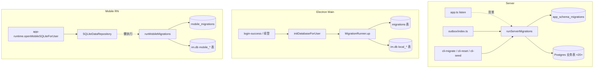

# 数据库迁移架构设计

> 适用范围：mushroom-app 三端的数据库 schema 管理：Server Postgres、Electron SQLite（better-sqlite3）、Mobile SQLite（nitro-sqlite）。
>
> 关联文档：
>
> - 消息持久化：`docs/architecture/messaging.md`
> - 会话/群组表：`docs/architecture/conversation-group.md`
> - 多账号隔离与 per-uid 数据库路径：`docs/architecture/multi-account-isolation.md`

---

## 1. 模块概述

### 1.1 目标

- 三端各自维护自己的 schema 演进，但用相同的「单调递增 id + 版本表 + 顺序应用」模式，降低记忆成本。
- 所有 schema 变更可重复执行（`IF NOT EXISTS` / `ALTER ... CATCH`），允许 cold-start 自动跑迁移而无需运维介入。
- 服务端与客户端持久层职责清晰拆分：Server 是「真理源」，客户端为「面向 UI 的本地缓存 + 离线发送队列」。
- Per-uid 物理隔离客户端数据库文件，杜绝跨账号串数据。

### 1.2 非目标

- **不实现** down migration / 回滚通道。
- **不实现** schema checksum / drift 自动检测。
- **不实现** server schema → client schema 的 codegen。
- **不实现** 多节点服务端的 advisory lock 协调（依赖 `IF NOT EXISTS` + 事务幂等）。

### 1.3 平台覆盖

| 维度         | Server                                | Electron                          | Mobile                    |
| ------------ | ------------------------------------- | --------------------------------- | ------------------------- |
| 引擎         | Postgres（pg-promise 单例）           | SQLite（better-sqlite3，WAL）     | SQLite（nitro-sqlite）    |
| 版本表       | `app_schema_migrations`               | `migrations`                      | `mobile_migrations`       |
| 触发         | HTTP 启动背景 + Outbox 进程启动 + CLI | main 进程切账号时                 | repository 首次调用懒执行 |
| Per-uid 隔离 | 无（共享 DB）                         | `<userData>/users/<uid>/db/im.db` | `users/<uid>/db/im.db`    |

---

## 2. 架构总览

---

## 3. 业务流程

### 3.1 Server 启动流程

1. `server/src/app.ts:318` HTTP listen 成功后立即 spawn 迁移 Promise。
2. `runServerMigrations()`（`server/src/db/migrate.ts:580-619`）保证 `app_schema_migrations` 表存在 → 顺序遍历内置 `migrations[]` → 未应用项在单事务里跑 `statements[]` → 写入版本号。
3. 成功：`lifecycle.migrationsReady=true`，启动 outbox worker / 缩略图恢复 / 幂等键清理。
4. 失败：归类入 `lifecycle.startupIssue`，`/health` 反映异常；HTTP 端口仍可监听以暴露探针。
5. Outbox 独立进程启动时也会跑一次（`server/src/outbox/index.ts:32`），靠 `IF NOT EXISTS` + 事务原子性兜底并发。

### 3.2 Electron 切账号流程

1. 用户登录成功 / 续登 / 擦除后 → `initDatabaseForUser(uid)`（`apps/electron/src/main/database.ts:169-207`）。
2. 关闭旧 handle → 写入 `last-login-user` → 打开 `<userData>/users/<uid>/db/im.db` → 设 `journal_mode=WAL` / `busy_timeout=5000` / `synchronous=NORMAL`。
3. `MigrationRunner` 自开短期 handle 跑迁移（与主 handle 短暂并存，靠 WAL 兼容）。
4. 所有 pending 迁移在 **同一事务** 里 commit，任一失败整批回滚。

### 3.3 Mobile 切账号流程

1. `app-runtime.openMobileSQLiteForUser(uid)`（`apps/mobile/src/services/app-runtime.ts:136`）→ `sqlite-connection.ts:106-159` 关旧连接 + `forceNativeClose()` + 打开 `users/<uid>/db/im.db`。
2. 首次业务调用触发 `SQLiteDataRepository.ensureInitialized()`（`apps/mobile/src/data/sqlite-data-repository.ts:432-438`） → `runMobileMigrations(db)`。
3. **每条迁移单独事务**（与 Electron 不同），失败不影响已应用项。
4. Baseline alignment：若版本表为空但 `mobile_conversations` 已存在，仅插记录不跑 SQL（兼容旧 `ensureSchema()` 安装）。

---

## 4. 策略与设计原则

- **统一三段式版本机制**：自建版本表（id+name+applied_at）+ 内置迁移数组 + 顺序应用；接口仅 `up: statements[]`，无 down。
- **幂等优先**：服务端使用 `CREATE TABLE IF NOT EXISTS` / `CREATE INDEX IF NOT EXISTS`；客户端在 init 阶段使用 `DROP IF EXISTS + CREATE`（把首迁移当 RESET，对老安装会清空 cache）；Mobile 末尾用 `ALTER TABLE ADD COLUMN ... CATCH` 兼容 baseline。
- **客户端 ≠ server 镜像**：本地表是「UI 投影 + 离线发送队列」，字段集与 server 显著不同（详见 §10）。
- **Per-uid 物理隔离**：客户端 DB 路径绑定 uid（详见 `multi-account-isolation.md`），切账号即换文件而非清表。
- **手工类型对齐**：`packages/shared/src/types/models.ts` 用 snake_case 与磁盘列名一致；无 codegen，靠 review 维系一致性。
- **Electron 整批事务 vs Mobile 单条事务**：Electron 倾向「原子升级」，Mobile 倾向「容错增量」——差异源于设备网络可靠性预期。

---

## 5. 平台分层结构

### 5.1 服务端

| 模块        | 路径                                                                  | 责任                                   |
| ----------- | --------------------------------------------------------------------- | -------------------------------------- |
| pg 单例     | `server/src/db/pg.ts:1-16`                                            | pg-promise 实例、连接池（max=20）      |
| Runner      | `server/src/db/migrate.ts:580-619`                                    | 版本表 + 顺序应用 + 事务               |
| 迁移数组    | `server/src/db/migrate.ts:10-12, 14-578`                              | 当前仅 `id=1 consolidated_init_schema` |
| 启动入口    | `server/src/app.ts:318-339`                                           | 背景 Promise + lifecycle 上报          |
| Outbox 入口 | `server/src/outbox/index.ts:32`                                       | 独立进程同样跑                         |
| CLI         | `server/src/db/cli-migrate.ts:8`、`cli-reset.ts:17`、`cli-seed.ts:63` | 手工运维                               |

### 5.2 Electron

| 模块     | 路径                                            | 责任                                        |
| -------- | ----------------------------------------------- | ------------------------------------------- |
| Runner   | `apps/electron/src/main/migration.ts:284-336`   | 单事务批量升级                              |
| 迁移数组 | `apps/electron/src/main/migration.ts:10-282`    | id=1 init_schema / id=2 media_cache_user_id |
| DB 入口  | `apps/electron/src/main/database.ts:90-219`     | 续登 / 切账号 / 擦除                        |
| 路径     | `apps/electron/src/main/runtime-paths.ts:33-84` | per-uid + per-instance                      |

### 5.3 Mobile

| 模块       | 路径                                                     | 责任                          |
| ---------- | -------------------------------------------------------- | ----------------------------- |
| Runner     | `apps/mobile/src/data/migration.ts:234-285`              | 单条事务 + baseline alignment |
| 迁移数组   | `apps/mobile/src/data/migration.ts:36-232`               | id=1 init_schema（只此一条）  |
| 懒触发     | `apps/mobile/src/data/sqlite-data-repository.ts:432-438` | 首调用 ensureInitialized      |
| 连接管理   | `apps/mobile/src/data/sqlite-connection.ts:24-159`       | per-uid + forceNativeClose    |
| 运行时入口 | `apps/mobile/src/services/app-runtime.ts:136-137`        | 登录后切账号                  |

### 5.4 共享层

| 路径                                        | 责任                             |
| ------------------------------------------- | -------------------------------- |
| `packages/shared/src/types/models.ts:1-320` | 手写 DTO；snake_case；无 codegen |

---

## 6. 核心代码索引

| 职责                     | 路径                                                    |
| ------------------------ | ------------------------------------------------------- |
| Server 版本表创建        | `server/src/db/migrate.ts:582-587`                      |
| Server 顺序应用          | `server/src/db/migrate.ts:609-618`                      |
| Electron MigrationRunner | `apps/electron/src/main/migration.ts:284-336`           |
| Electron 批量事务        | `apps/electron/src/main/migration.ts:318-331`           |
| Mobile baseline 对齐     | `apps/mobile/src/data/migration.ts:208-220, 243-248`    |
| Mobile 单条事务          | `apps/mobile/src/data/migration.ts:266-274`             |
| Electron per-uid 路径    | `apps/electron/src/main/runtime-paths.ts:82-84`         |
| Mobile per-uid 连接      | `apps/mobile/src/data/sqlite-connection.ts:24, 102-104` |

---

## 7. API / 命令接口

无 HTTP API。运维 CLI：

| 命令                                     | 入口                             | 用途                               |
| ---------------------------------------- | -------------------------------- | ---------------------------------- |
| `pnpm --filter @mushroom/server migrate` | `server/src/db/cli-migrate.ts:8` | 显式跑迁移                         |
| `pnpm --filter @mushroom/server reset`   | `server/src/db/cli-reset.ts:17`  | `DROP SCHEMA public` + 重建 + 迁移 |
| `pnpm --filter @mushroom/server seed`    | `server/src/db/cli-seed.ts:63`   | 写入测试种子数据                   |

---

## 8. WS 协议

不涉及。

---

## 9. 数据库 Schema 全表清单

### 9.1 Server Postgres 表（按模块）

**Auth / 用户 / 设备**

| 表                           | 行                 | PK / UNIQUE / 关键索引                                                                                 |
| ---------------------------- | ------------------ | ------------------------------------------------------------------------------------------------------ |
| `users`                      | `migrate.ts:14-33` | PK `id`；UNIQUE `username` / `email` / `phone`；软删 `is_deleted`；status∈{0,1,2}                      |
| `user_devices`               | `:198-216`         | UNIQUE `(user_id, device_id)`；多端 push provider 索引                                                 |
| `user_sessions`              | `:217-239`         | UNIQUE `session_id`；含 `refresh_token_hash` / `previous_refresh_token_hash` 部分唯一索引（30s grace） |
| `auth_audit_logs`            | `:240-251`         | 三套 `created_at DESC` 时序索引                                                                        |
| `user_privacy_settings`      | `:252-259`         | PK `user_id`（FK CASCADE）                                                                             |
| `user_notification_settings` | `:260-275`         | 含 `quiet_hours_*`                                                                                     |
| `user_blocks`                | `:276-281`         | PK `(blocker_id, blocked_id)`，双向索引                                                                |
| `user_phone_identity`        | `:282-290`         | UNIQUE `phone_e164`                                                                                    |

**联系人**

| 表              | 行         | 备注                                                           |
| --------------- | ---------- | -------------------------------------------------------------- |
| `user_contacts` | `:291-303` | UNIQUE `(owner_user_id, contact_user_id)`；CHECK owner≠contact |

**会话**

| 表                          | 行         | 备注                                                            |
| --------------------------- | ---------- | --------------------------------------------------------------- |
| `conversations`             | `:34-50`   | 含 `message_seq` / `last_reaction_sequence` 游标                |
| `conversation_members`      | `:51-64`   | 部分唯一索引 `(conversation_id, user_id) WHERE left_at IS NULL` |
| `conversation_user_state`   | `:65-80`   | 用户级状态分表                                                  |
| `direct_conversation_pairs` | `:304-311` | CHECK `low<high`；保证两人仅一条直聊                            |

**消息 / 反应**

| 表                   | 行         | 备注                                                                                    |
| -------------------- | ---------- | --------------------------------------------------------------------------------------- |
| `messages`           | `:81-94`   | UNIQUE `(conversation_id, seq)`；UNIQUE `(sender_id, client_message_id) WHERE NOT NULL` |
| `message_user_state` | `:133-140` | 用户级（已读/隐藏）                                                                     |
| `message_reactions`  | `:141-151` | 带 `sequence` 游标 + `is_deleted` 墓碑                                                  |

**投递**

| 表               | 行        | 备注                                                                          |
| ---------------- | --------- | ----------------------------------------------------------------------------- |
| `message_outbox` | `:95-110` | status∈{0,1,2,3,9}，9=lease；`(status, next_retry_at, lease_expires_at)` 索引 |

**通话**

| 表                  | 行         | 备注                          |
| ------------------- | ---------- | ----------------------------- |
| `call_sessions`     | `:152-169` | UNIQUE `call_id`              |
| `call_participants` | `:170-186` | UNIQUE `(call_id, device_id)` |
| `call_events`       | `:187-197` | `request_id` 幂等             |

**附件 / 幂等**

| 表                     | 行         | 备注                                                              |
| ---------------------- | ---------- | ----------------------------------------------------------------- |
| `attachment_uploads`   | `:111-132` | UNIQUE `object_name`；upload_mode∈{single,multipart}              |
| `api_idempotency_keys` | `:312-323` | PK `(user_id, method, path, client_request_id)`；TTL `expires_at` |

> 推送：无独立表，token 落 `user_devices.push_provider/push_token/push_app_id`。

### 9.2 Electron 本地表

`local_conversations` / `local_conversation_members` / `contacts_cache` / `local_messages` / `sync_cursors` / `outgoing_messages` / `sync_backfill_jobs` / `media_cache`（v2 起按 `user_id` 分用户）/ `local_message_reactions` / `local_reaction_cursors`。

迁移：

- **id=1 init_schema**（`migration.ts:10-234`）：先 `DROP IF EXISTS` 一组业务表再重建（首装等于 RESET 老缓存）；建立 `idx_local_messages_conversation_sequence` 等部分唯一索引。
- **id=2 media_cache_user_id**（`:236-277`）：`DROP TABLE media_cache` 后重建，把 `username` 字符串替换为 `user_id` 数值；UNIQUE 改 `(user_id, remote_url, category)`。

### 9.3 Mobile 本地表

`mobile_contacts` / `mobile_conversations` / `mobile_messages` / `mobile_message_states` / `mobile_message_reactions` / `mobile_reaction_cursors`。

特征：列设计偏「JSON-blob + 查询投影」——主体存 `payload TEXT NOT NULL`，仅抽取 `sort_name` / `sequence` / `last_message_time` / `is_pinned` / `is_archived` 等查询列。

仅 **id=1 init_schema**（`migration.ts:36-170`）；末尾用 `ADD COLUMN ... CATCH` 兼容前迁移协议安装。

---

## 10. 约束与边界

- **服务端无 advisory lock**：HTTP / outbox 进程同时启动时，靠 `IF NOT EXISTS` + 单事务防冲突；并非严格的「leader-only migration」。
- **Electron 整批事务**：所有 pending 迁移一并 commit，任一失败回滚到上次成功版本——便于「全或无」语义，但单条慢迁移会阻塞整体。
- **Mobile 单条事务**：每条独立 commit，失败可下次重试；但意味着客户端可能停留在「中间版本」。
- **Electron init=RESET**：v1 包含 `DROP TABLE IF EXISTS`，对老安装等同清空本地缓存（需要回服务端拉数据）。
- **Mobile baseline alignment**：用 `mobile_conversations` 是否已存在判断是否是「ensureSchema 老安装」；新表若与之同名将触发误判。
- **客户端写并发**：Mobile 多个 repo 实例同时 `ensureInitialized` 会重复跑迁移，靠 nitro 单连接事务隔离勉强兜底。
- **类型对齐靠人工**：DTO 与 SQL 列名一致需 review 把关，没有自动检测；漏改会运行时报错。
- **Server schema 单一**：当前仅 1 条「consolidated_init_schema」，意味着所有历史变更已合并；未来变更需要新增 `id=2` 而不能修改 `id=1`。

---

## 11. 现状缺口与 Roadmap

| ID  | 现状                                       | 风险                                           | 建议                                                      |
| --- | ------------------------------------------ | ---------------------------------------------- | --------------------------------------------------------- |
| R1  | 三端均无 down migration                    | 误改无法快速回滚                               | 接口扩 `down: string[]`；CLI 提供 `migrate:down --to=N`   |
| R2  | 无 schema checksum / drift 检测            | 人工改 DB 后版本表显示已应用但实际 schema 偏离 | 版本表加 `checksum` 列，启动时 diff information_schema    |
| R3  | 无 dry-run / plan                          | 迁移直接 commit，缺验证窗口                    | CLI 加 `migrate:plan` 输出待执行 SQL                      |
| R4  | 服务端多进程并发跑（HTTP + outbox）        | 罕见竞态可能产生重复版本号写入冲突             | 在事务前 `SELECT pg_advisory_lock(<key>)` 串行化          |
| R5  | Electron 整批事务，单条失败全回滚          | 大版本跨越时高风险                             | 拆为「分批 commit + checkpoint」模式                      |
| R6  | Electron init_schema 含 DROP               | 老安装升级清空本地缓存                         | 改为 `CREATE IF NOT EXISTS`；DROP 只在 reset 场景显式调用 |
| R7  | Mobile 仅 1 条迁移 + ADD COLUMN CATCH 兜底 | schema 演进路径不清晰                          | 严格遵守「只 append 新迁移，不改老迁移」                  |
| R8  | DTO 手写无 codegen                         | 字段漏改运行时报错                             | 引入 zod schema 单源 + 派生 TS / SQL DDL                  |
| R9  | 服务端无迁移耗时 / 错误日志                | 出问题难定位                                   | 版本表加 `duration_ms` / `error_text` 列                  |
| R10 | 无迁移自动测试                             | 重构易破坏老安装升级路径                       | 加 e2e：从 v0/v1 升级到最新并校验 schema                  |
| R11 | 客户端多账号同时操作时无显式互斥           | 切账号并发时可能开错 DB                        | 加 connection mutex（`async-mutex`）                      |
| R12 | 推送 token 与 `user_devices` 强耦合        | 多 provider / 多 token 难扩展                  | 拆 `user_push_tokens` 表                                  |
| R13 | `api_idempotency_keys` 仅靠定时清理        | 表膨胀风险                                     | 启用 pg partition by `expires_at` 或 cron VACUUM          |
| R14 | client 端缺「服务端 schema 版本」探针      | 客户端无法判断后端是否升级                     | `/api/config/limits` 返回 server schema version           |

优先级建议：R6（影响用户体验）→ R2 / R9（运维盲点）→ R4 / R11（并发风险）→ R1 / R3（运维能力）→ R8 / R10（长期质量）。

---

## 12. Changelog

| 日期       | 版本 | 变更                                          | 作者     |
| ---------- | ---- | --------------------------------------------- | -------- |
| 2026-05-23 | v1.0 | 首版：覆盖三端迁移机制、20+ 表清单、14 项缺口 | OpenCode |
