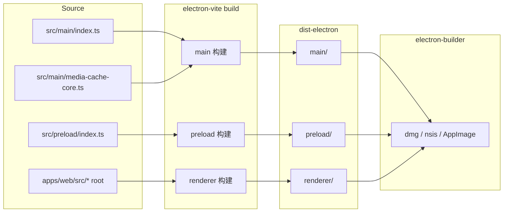

# Electron 构建打包架构设计

> 适用范围：mushroom-app 桌面端的构建栈、打包目标、多实例、签名/更新现状。
>
> 关联文档：
>
> - 多账号隔离 / userData 路径：`docs/architecture/multi-account-isolation.md`
> - 数据库迁移：`docs/architecture/db-migrations.md`
> - 配置：`docs/architecture/config.md`

---

## 1. 模块概述

### 1.1 目标

- 单一 monorepo 复用 web bundle 作为 renderer，避免双套 UI 代码。
- main/preload/renderer 三层各自走 electron-vite 独立构建管线。
- 支持开发期多实例（`--instance=` 切 userData），便于本机测多账号 / 多版本。
- per-uid + per-instance 数据隔离，配合主 / 渲染分层安全策略。

### 1.2 非目标

- **不实现** 签名 / 公证（mac notarize / win cert 均未配置）。
- **不实现** 自动更新（无 electron-updater 依赖、无 publish 通道）。
- **不实现** 多架构 / universal 包（mac 走 host arch；win 仅 x64；linux 仅 AppImage）。
- **不实现** 显式 native rebuild 步骤（依赖 prebuilt-binary）。

### 1.3 平台覆盖

| 平台    | 产物       | 架构         | 备注                          |
| ------- | ---------- | ------------ | ----------------------------- |
| macOS   | `dmg`      | host（默认） | 未签名、未公证                |
| Windows | `nsis`     | x64          | 非 oneClick、可选路径；未签名 |
| Linux   | `AppImage` | host         | 无 deb/rpm/snap               |

---

## 2. 架构总览



---

## 3. 业务流程

### 3.1 开发期

1. `pnpm dev:electron` → electron-vite dev server（renderer 走 web 同源）。
2. main 进程：`runtime-paths.ts:33-49` 读取 `--instance=xxx` / `MUSHROOM_APP_INSTANCE` → 切 userData 到 `<defaultUserData>/instances/<id>`。
3. `app.whenReady` 前完成 path 切换；非 packaged 允许多实例（无 single-instance lock）。

### 3.2 构建期

1. `pnpm build:electron` → `scripts/build.js:47-50` → `pnpm --filter @mushroom/electron build:all`。
2. 前置：`scripts/build.js:36-40` `buildSharedPackages()` 保证 `@mushroom/shared` / `@mushroom/app-core` 产物就绪。
3. `electron-vite build && electron-builder --publish=never`：分别产出 main/preload/renderer 到 `dist-electron/`，随后 electron-builder 按 OS 打包。

### 3.3 运行期

1. main `src/main/index.ts:48` `applyInstanceUserDataPath()` → `:53-55` 申请 single-instance lock（仅 packaged）→ `:68` 加载图标 → `:85-92` dev 用 `ELECTRON_RENDERER_URL`、prod 加载 `dist-electron/renderer/index.html`。
2. 登录成功后切 `<userData>/users/<uid>/{db,media,outbox,preferences}` 与 partition `persist:user-<uid>`。

---

## 4. 策略与设计原则

- **Renderer = web 同源**：`electron.vite.config.ts:49-77` 把 `apps/web` 作为 root，alias `@ → apps/web/src`，单点维护 UI。
- **electron-builder 配置内联**：`apps/electron/package.json:36-77`，无独立 `electron-builder.yml`。
- **凭据缺失安全降级**：mac/win 签名相关字段全部省略，依赖 builder 默认行为（出未签名包）；不阻塞开发。
- **多实例靠 userData 切换**：`runtime-paths.ts:33-49` dev 支持 instance；packaged 强制 `default`，并申请 single-instance lock。
- **账号级隔离再下沉**：`<userData>/users/<uid>/...`（详见 multi-account-isolation 文档）。
- **原生模块需对齐 Electron ABI**：当前 Electron `^41.x`（运行期 ABI 145）。`better-sqlite3` 锁定 `12.10.0`（首个真正兼容 Electron 41 V8 变更的 viable 版本，≥12.8.0 引入 `HolderV2()` 修复，避开 broken 的 12.7.x / 12.9.1）。`@electron/rebuild ^4.0.4` 列在 devDeps 但**无 postinstall 钩子**；升级 Electron 后须手动执行 `pnpm --filter @mushroom/electron exec electron-rebuild -f -w better-sqlite3` 重编译。
- **node-abi override**：`@electron/rebuild` 内置的 `node-abi` 旧版本无法识别 Electron 41 的 ABI，根 `package.json` 用 `pnpm.overrides` 将 `node-abi` 提升到 `^4.31.0`，否则 rebuild 会报 `Could not detect abi for version 41.x`。
- **CI 只做 quality**：`.github/workflows/quality.yml` 跑 lint/type-check，不构建/发版。

---

## 5. 平台分层结构

| 模块               | 路径                                                   | 责任                           |
| ------------------ | ------------------------------------------------------ | ------------------------------ |
| electron-vite 配置 | `apps/electron/electron.vite.config.ts:1-79`           | main/preload/renderer 三段构建 |
| main 入口          | `apps/electron/src/main/index.ts:48-92`                | 实例锁 / userData / window     |
| 额外 main entry    | `apps/electron/src/main/media-cache-core.ts`           | 媒体缓存 worker                |
| preload            | `apps/electron/src/preload/index.ts`                   | electronAPI 暴露               |
| renderer           | `apps/web/src/*`（alias）                              | UI                             |
| 运行时路径         | `apps/electron/src/main/runtime-paths.ts:10-49, 58-99` | per-instance / per-uid         |
| 资源               | `apps/electron/resources/icons/`                       | icon.icns/ico/png/svg          |
| 打包配置           | `apps/electron/package.json:36-77`                     | electron-builder build         |
| 构建编排           | `scripts/build.js:36-50`                               | shared 包前置 + electron build |

---

## 6. 核心代码索引

| 职责                  | 路径                                            |
| --------------------- | ----------------------------------------------- |
| renderer root + alias | `apps/electron/electron.vite.config.ts:49-77`   |
| main inputs           | `apps/electron/electron.vite.config.ts:29-37`   |
| preload input         | `apps/electron/electron.vite.config.ts:40-48`   |
| 多实例路径切换        | `apps/electron/src/main/runtime-paths.ts:33-49` |
| 实例锁                | `apps/electron/src/main/index.ts:53-55`         |
| 图标加载              | `apps/electron/src/main/index.ts:68`            |
| Renderer URL 选择     | `apps/electron/src/main/index.ts:85-92`         |
| build:all 脚本        | `apps/electron/package.json:8-13`               |
| 构建编排前置          | `scripts/build.js:36-40, 47-50`                 |

---

## 7. API / 命令接口

| 命令                                                  | 入口                              | 说明                                      |
| ----------------------------------------------------- | --------------------------------- | ----------------------------------------- |
| `pnpm dev:electron`                                   | `scripts/dev.js`                  | dev server + main 热重启                  |
| `pnpm build:electron`                                 | `scripts/build.js:47-50`          | 全平台默认 host 打包                      |
| `electron-vite build`                                 | `apps/electron/package.json:8-13` | 仅生成 dist-electron                      |
| `electron-builder --publish=never`                    | 同上                              | 不发布，仅产物                            |
| `pnpm --filter @mushroom/electron run rebuild:native` | `apps/electron/package.json`      | 重建 better-sqlite3 对齐当前 Electron ABI |

### 7.1 跨机器 / 跨平台同步原生模块

`better-sqlite3` 是原生模块，编译产物 `better_sqlite3.node` 与 **平台 + 架构 + Electron ABI** 强绑定，**不纳入 git**。同理 Electron 自身二进制也不入库。因此任何机器（尤其首次拉取或升级 Electron 大版本后）`git pull` 后都需重建：

```bash
git pull
pnpm install                                          # 复现 lockfile：electron 41 / better-sqlite3 12.10.0 / node-abi override
pnpm --filter @mushroom/electron run rebuild:native   # 生成本机平台的 better_sqlite3.node（当前 ABI 145）
pnpm type-check:all
pnpm --filter @mushroom/electron test
pnpm dev:electron                                     # 起客户端，确认 SQLite 读写正常
```

注意事项：

- **node-abi override 已落入 lockfile**（根 `package.json` 的 `pnpm.overrides`），所有机器自动受益，不会再报 `Could not detect abi for version 41.x`。
- **Windows**：`rebuild:native` 优先下载官方 prebuild；若未命中会回退本地源码编译，需预装 **Visual Studio Build Tools（Desktop development with C++）+ Python 3**。仅在出现 `node-gyp` / `MSB` 编译错误时才需安装。
- **Electron 二进制下载慢**（GitHub 源）：可临时设镜像后再 `pnpm install`：
  - macOS/Linux：`ELECTRON_MIRROR=https://npmmirror.com/mirrors/electron/ pnpm install`
  - Windows PowerShell：`$env:ELECTRON_MIRROR="https://npmmirror.com/mirrors/electron/"; pnpm install`
- **未做 postinstall 自动 rebuild**：避免在 CI 的 lint/type-check 安装链路（无需原生模块、可能无 C++ 工具链）上无谓失败；改为显式 `rebuild:native` 脚本，开发者按需手动执行（见 §11 R7）。

---

## 8. WS 协议

不涉及。

---

## 9. 数据库

不涉及构建期。运行期数据库见 `db-migrations.md`。

---

## 10. 约束与边界

- **renderer 与 web 同源**：apps/web 改动会影响 electron 包行为，需双端联测。
- **dev 多实例 / prod 单实例**：packaged 强制 single-instance lock。
- **未签名产物**：mac Gatekeeper / win SmartScreen 会拦截首次运行。
- **better-sqlite3 ABI 风险**：无 postinstall 自动 rebuild；每次升级 Electron 大版本（如本次 37→41，ABI 145）须手动 `electron-rebuild -f -w better-sqlite3`，并确保 `node-abi` 已知该 Electron 版本（见 §4 override）。
- **win arm64 / mac universal 未支持**：发布需手动配置 electron-builder targets。
- **publish=never**：本地/CI 都不会上传产物到任何 feed。

---

## 11. 现状缺口与 Roadmap

| ID  | 现状                                        | 风险                                               | 建议                                                                                                                                                                                   |
| --- | ------------------------------------------- | -------------------------------------------------- | -------------------------------------------------------------------------------------------------------------------------------------------------------------------------------------- |
| R1  | mac/win 未签名 / 未公证                     | 首次运行拦截、企业部署阻塞                         | mac：`identity` + `notarize`（`@electron/notarize`）；win：EV cert + `signtoolOptions`                                                                                                 |
| R2  | 无 electron-updater / 无 publish feed       | 无法增量更新                                       | 集成 electron-updater + GitHub Releases / 自建 feed；mac 必须先签                                                                                                                      |
| R3  | mac 缺 `zip` 产物                           | 即使接入 updater 也无法差量                        | builder targets 增加 `zip`                                                                                                                                                             |
| R4  | win 仅 x64，无 arm64                        | Snapdragon X 设备不支持                            | targets 加 `arm64`                                                                                                                                                                     |
| R5  | mac 未声明 universal                        | M 系列原生体验缺                                   | `mergeASARs` + universal target                                                                                                                                                        |
| R6  | linux 仅 AppImage                           | 桌面分发覆盖不足                                   | 加 `deb` / `rpm`                                                                                                                                                                       |
| R7  | 无 postinstall native rebuild               | 升 Electron 大版本后 better-sqlite3 ABI 不匹配会崩 | 已提供 `rebuild:native` 脚本（`electron-rebuild -f -w better-sqlite3`）+ `node-abi` override（已落地，见 §7.1）；如需进一步自动化可加 postinstall，但须先确保 CI 安装链路有 C++ 工具链 |
| R8  | `@vitejs/plugin-react` vs `-swc` 名称不一致 | 依赖 hoisting，未来易踩坑                          | 修正 devDeps 一致                                                                                                                                                                      |
| R9  | 无跨平台 CI matrix                          | 发版前难提早发现破坏                               | actions matrix（mac/win/linux）+ build job                                                                                                                                             |
| R10 | 无 release 版本注入                         | 版本号手工改 package.json                          | CI 注入 `git describe`                                                                                                                                                                 |
| R11 | dev 多实例无 UI 指示                        | 用户混淆                                           | 标题栏带 `[instance]` 标签                                                                                                                                                             |
| R12 | 媒体 worker 入口仅 main 构建                | preload/renderer 无法直接 import                   | 文档化使用规约                                                                                                                                                                         |

优先级：R1 / R2（生产分发）→ R7（兼容性）→ R9（自动化）→ 其余。

---

## 12. Changelog

| 日期       | 版本 | 变更                                                       | 作者     |
| ---------- | ---- | ---------------------------------------------------------- | -------- |
| 2026-05-23 | v1.0 | 首版：electron-vite + builder、三层构建、多实例、12 项缺口 | OpenCode |
