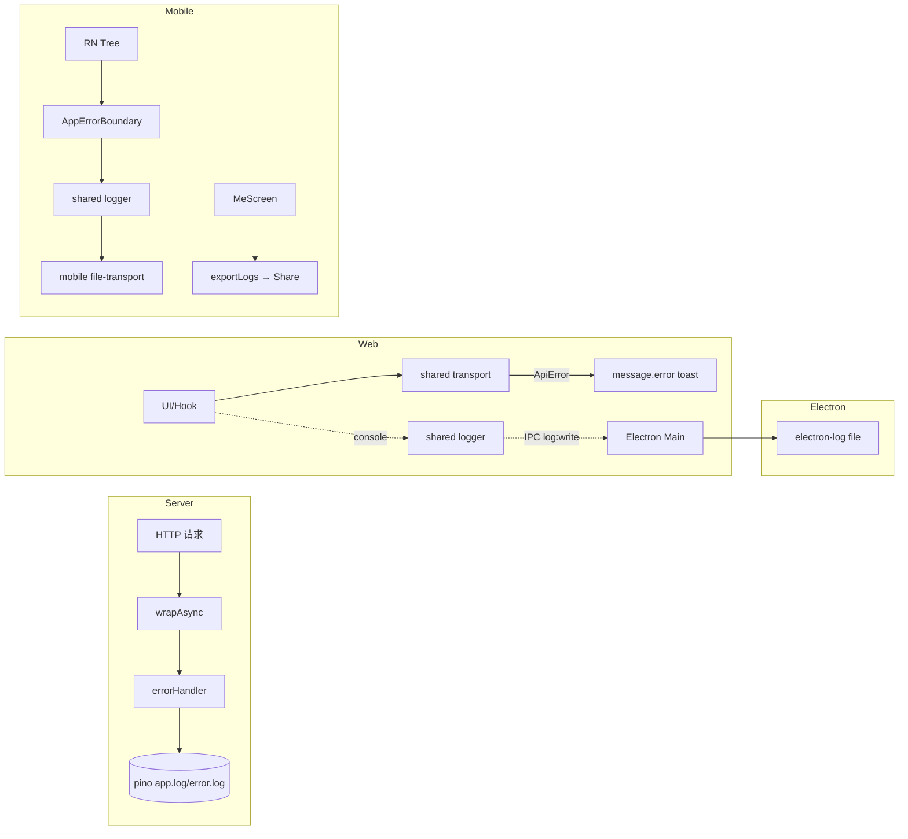

# 错误与崩溃上报架构设计

> 适用范围：服务端 / Web / Electron / Mobile 的异常捕获、降级、日志落地与用户反馈通道。
>
> 关联文档：
>
> - 日志：`docs/architecture/logging.md`
> - 多账号隔离：`docs/architecture/multi-account-isolation.md`

---

## 1. 模块概述

### 1.1 目标

- 各端将异常归一到统一 logger（pino / electron-log / RN file-transport）落地。
- HTTP/IPC 错误通过统一封装返回 `{ code, success:false, message, data:null, timestamp }`。
- Mobile 暴露日志导出（Share），用户主动反馈携带日志包。

### 1.2 非目标（关键缺口）

- **不接入** 任何第三方崩溃上报 SaaS（Sentry / Bugsnag / Crashlytics / Rollbar / Datadog 均未集成）。
- **不实现** Electron 主进程 `crashReporter` / `render-process-gone` / `unresponsive` / `crashed` 监听。
- **不实现** 服务端 `process.on('uncaughtException'|'unhandledRejection')` 兜底。
- **不实现** Web 端 React ErrorBoundary / `window.onerror` / `unhandledrejection` 监听。
- **不实现** Mobile `ErrorUtils.setGlobalHandler` 全局兜底。
- **不实现** 日志 PII redaction / 敏感字段脱敏。
- **不实现** Web/Electron 端的"导出日志/反馈"按钮。

### 1.3 平台覆盖

| 平台          | 异常捕获                                 | 上报通道                         | 用户反馈              |
| ------------- | ---------------------------------------- | -------------------------------- | --------------------- |
| Server        | Express errorHandler + wrapAsync         | pino 文件/控制台                 | —                     |
| Web           | Antd `message.error` toast（API 错误）   | console + Electron IPC（嵌入时） | 无                    |
| Electron Main | 仅生命周期 + 主动 try/catch + `log.warn` | electron-log 文件                | 无                    |
| Mobile        | `AppErrorBoundary`（仅 React 树）        | file-transport + console         | 设置→导出日志 → Share |

---

## 2. 架构总览

---

## 3. 业务流程

### 3.1 Server 异常

1. async controller 抛出 `BusinessError` 或其他 Error。
2. `wrapAsync` `next(err)` → Express 进入 `errorHandler()`。
3. `errorHandler` `logger.error(err)` 后回 `{ code, success:false, message, data:null, timestamp }`，HTTP 状态码同 `code`（无效则 500）。
4. 非 Express 上下文（outbox/worker/timer）一旦未捕获，Node ≥15 默认终止进程，**无兜底**。

### 3.2 Web/Electron 异常

1. 业务调用走 `packages/shared/src/api/client.ts`，失败抛 `ApiError({ status, code, result })`。
2. Web `apps/web/src/http/index.ts` 注册 `onUnauthorized` / `onError` → 弹 Antd `message.error`，401 触发 logout。
3. JS 同步错误 / Promise 拒绝**无全局监听**；可能默默吞掉。
4. Electron renderer 通过 `apps/web/src/utils/log-electron-transport.ts` 把 log 转 IPC `log:write` → main 走 `electron-log` 落 `<userData>/logs/YYYY-MM-DD.log`。

### 3.3 Mobile 异常

1. React 渲染树异常 → `AppErrorBoundary.componentDidCatch` → `log.scope('boundary').error({ message, stack, componentStack })`。
2. 显示本地化兜底页 + Reset 按钮；无"上报"按钮。
3. 非组件异常（事件处理、Promise、原生）无全局兜底；落到 RN 红屏。
4. 用户主动「设置 → 导出日志」：`exportLogs()` flush file-transport → `Share.open({ urls, type:'text/plain' })`。

---

## 4. 策略与设计原则

- **错误即业务码**：`BusinessError.code` 同 HTTP 语义化，前端 `ApiError` 透传。
- **toast 即上报**：用户感知第一，远端无 SaaS 接收。
- **日志落地是兜底**：所有 transport 失败容错（`initLogger` 永不崩溃）。
- **跨进程日志桥**：Renderer → main 单向 IPC `log:write`，让 Electron 单文件成为 desktop 真相源。
- **隔离日志容器**：mobile/electron 都有 rotation + retention（与 `logging.md` 一致）。
- **导出而非主动上报**：用户隐私优先，反馈链路靠用户手动 Share。

---

## 5. 平台分层结构

### 5.1 Server

| 模块               | 路径                                                              |
| ------------------ | ----------------------------------------------------------------- |
| 错误中间件工厂     | `server/src/handler/response_wrapper.ts:43-60`                    |
| wrapAsync          | `server/src/handler/response_wrapper.ts:28-41`                    |
| BusinessError      | `server/src/handler/business_error.ts:1-9`                        |
| 错误中间件挂载     | `server/src/app.ts:221`                                           |
| pino logger        | `server/src/utils/logger.ts:1-64`                                 |
| 优雅关停（非异常） | `server/src/app.ts:289, 292`、`server/src/outbox/index.ts:37, 41` |

### 5.2 Shared

| 模块        | 路径                                     |
| ----------- | ---------------------------------------- |
| ApiError 类 | `packages/shared/src/api/client.ts:3-22` |
| Logger 内核 | `packages/shared/src/logger/*`           |

### 5.3 Web / Electron

| 模块             | 路径                                           |
| ---------------- | ---------------------------------------------- |
| HTTP 错误回调    | `apps/web/src/http/index.ts:135-162`           |
| log transport    | `apps/web/src/utils/log.ts:1-28`               |
| Renderer→Main 桥 | `apps/web/src/utils/log-electron-transport.ts` |
| Electron 日志    | `apps/electron/src/utils/log.ts:1-92`          |
| IPC log:write    | `apps/electron/src/main/index.ts:160-191`      |

### 5.4 Mobile

| 模块           | 路径                                                        |
| -------------- | ----------------------------------------------------------- |
| ErrorBoundary  | `apps/mobile/src/components/ui/AppErrorBoundary.tsx:26-103` |
| 挂载           | `apps/mobile/src/App.tsx:35, 435-437`                       |
| Logger init    | `apps/mobile/src/utils/log.ts:1-103`                        |
| File transport | `apps/mobile/src/utils/log-file-transport.ts`               |
| 导出日志 UI    | `apps/mobile/src/screens/MeScreen.tsx:121-189`              |

---

## 6. 核心代码索引

| 职责                                    | 路径                                                                                 |
| --------------------------------------- | ------------------------------------------------------------------------------------ |
| Express errorHandler                    | `server/src/handler/response_wrapper.ts:43-60`                                       |
| pino multistream（生产 error.log 分流） | `server/src/utils/logger.ts:38-57`                                                   |
| onUnauthorized / onError                | `apps/web/src/http/index.ts:135-162`                                                 |
| Electron daily log + retention          | `apps/electron/src/utils/log.ts:48-92`                                               |
| Mobile boundary 日志                    | `apps/mobile/src/components/ui/AppErrorBoundary.tsx:36-43`                           |
| Mobile exportLogs → Share               | `apps/mobile/src/screens/MeScreen.tsx:181-184`、`apps/mobile/src/utils/log.ts:82-90` |

---

## 7. API / 端点

服务端无专门错误上报端点。通用响应封装见 `response_wrapper.ts:49-55`。

---

## 8. WS 协议

不涉及。WSClient 自身错误通过 `addEventListener('error', ...)`（`apps/web/src/ws/WSClient.ts:288, 449`）落 logger。

---

## 9. 数据库

不涉及。崩溃数据**未持久化**到任何 DB。

---

## 10. 约束与边界

- 无第三方 SDK = 无聚合 dashboard、无 alert、无 release health。
- 用户必须主动「导出日志 + Share」，且**仅 mobile 有按钮**。
- 服务端非 Express 上下文（outbox/worker）异常不被 `errorHandler` 兜底。
- Web/Electron 渲染端无 ErrorBoundary，单个组件抛错可能白屏。
- 日志含明文（无 redaction），导出前需自审 PII。
- Electron 主进程崩溃无 crashDumps、无 minidump。

---

## 11. 现状缺口与 Roadmap

| ID  | 现状                                                    | 风险                       | 建议                                                |
| --- | ------------------------------------------------------- | -------------------------- | --------------------------------------------------- |
| R1  | server 无 `uncaughtException` / `unhandledRejection`    | worker/timer 崩 → 进程退出 | 加全局 handler：`logger.fatal` + 上抛/graceful exit |
| R2  | server 无 SaaS 上报                                     | 线上问题靠 grep 日志       | 接 Sentry/OTel；按 traceId 关联                     |
| R3  | web 无 React ErrorBoundary                              | 局部错误 → 全白屏          | 顶层 + 关键路由级 Boundary                          |
| R4  | web 无 `window.onerror` / `unhandledrejection`          | 异步异常静默               | 注册并 forward 到 logger / Sentry                   |
| R5  | Electron main 无 crashReporter                          | 原生崩溃无信息             | `crashReporter.start` + `app.setPath('crashDumps')` |
| R6  | Electron main 无 `render-process-gone` / `crashed` 监听 | 渲染崩溃无救援             | 监听 + 自动重载 + 上报                              |
| R7  | Electron main 无 uncaughtException 兜底                 | 静默退出                   | 注册并落 electron-log + 弹错误对话框                |
| R8  | Mobile 无 `ErrorUtils.setGlobalHandler`                 | 非组件异常红屏             | 在 `initLogger` 之后注册                            |
| R9  | 无 Crashlytics/Sentry RN                                | 原生层崩溃无记录           | 评估 Sentry RN（含 native）                         |
| R10 | 无统一错误码表                                          | 前后端协商混乱             | 共享枚举 `packages/shared/src/errors/codes.ts`      |
| R11 | 日志无 redaction                                        | 导出可能泄露 token/手机号  | 在 shared logger 加 transform                       |
| R12 | Web/Electron 无"导出日志/反馈"UI                        | desktop 用户无路上报       | 设置面板加按钮，复用 main 进程读取日志目录          |
| R13 | mobile "帮助与反馈"是 TODO                              | 反馈链路缺失               | 实装表单 + 上传                                     |
| R14 | toast `message.error` 频次过高                          | UX 噪音                    | 错误归类：silent / toast / dialog / report          |
| R15 | 无 release health 维度                                  | 灰度回归不可见             | 上报含 version / channel / uid                      |

优先级：R1/R7（保活）→ R3/R8（兜底显示）→ R5/R6/R9（崩溃可观测）→ R2/R12/R13（链路闭环）→ R10/R11/R14/R15。

---

## 12. Changelog

| 日期       | 版本 | 变更                                        | 作者     |
| ---------- | ---- | ------------------------------------------- | -------- |
| 2026-05-23 | v1.0 | 首版：四端异常路径、统一响应封装、15 项缺口 | OpenCode |
