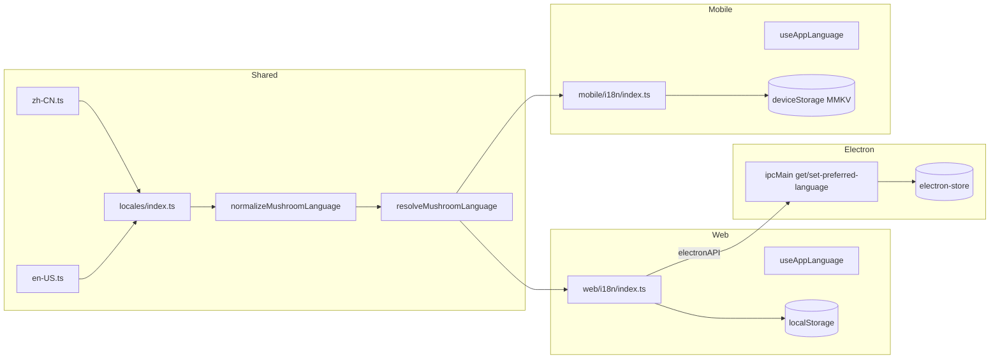

# 国际化（i18n）架构设计

> 适用范围：mushroom-app 客户端语言资源、检测、切换、持久化与共享类型契约。
>
> 关联文档：
>
> - 配置：`docs/architecture/config.md`
> - 主题：`docs/architecture/theme.md`
> - 多账号隔离：`docs/architecture/multi-account-isolation.md`

---

## 1. 模块概述

### 1.1 目标

- 统一两端 i18n 资源 single source of truth：`packages/shared/src/i18n/locales/*`。
- 支持 zh-CN（默认）与 en-US，两语言一键切换；命名空间统一 `translation`。
- 各端自有检测/持久化适配（browser localStorage / Electron electron-store / MMKV）。
- 类型安全：以 zh-CN 结构为 schema，其他语言编译期对齐。

### 1.2 非目标

- **不实现** 服务端本地化（push body / 邮件 / 错误信息均无 i18n）。
- **不实现** RTL（无 `I18nManager.forceRTL`，不支持阿拉伯/希伯来）。
- **不实现** 跨设备语言同步（无 server 列、无 API）。
- **不实现** 拼写多语言切换之外的复杂选择（locale list 写死两项）。
- **不实现** 按需懒加载语言包（启动期全量装载）。

### 1.3 平台覆盖

| 平台            | i18n                  | 系统语言检测                                   | 持久化                                                    |
| --------------- | --------------------- | ---------------------------------------------- | --------------------------------------------------------- |
| Web 纯浏览器    | i18next               | `navigator.language`                           | `localStorage`（**当前实现存在 bug**：仅 read，未 write） |
| Web on Electron | i18next               | IPC `getSystemLanguage`                        | `electron-store` `preferred-language`                     |
| Mobile          | i18next（同步初始化） | iOS `AppleLocale` / Android `localeIdentifier` | MMKV `deviceStorage`                                      |
| Server          | —                     | —                                              | —                                                         |

---

## 2. 架构总览

---

## 3. 业务流程

### 3.1 启动期

1. Shared `resolveMushroomLanguage({ preferredLanguage, systemLanguage, defaultLanguage })` 按 **stored → system → default(zh-CN)** 解析。
2. i18next `init({ resources: mushroomI18nResources, lng, fallbackLng: 'zh-CN', interpolation: { escapeValue: false } })`。
3. Web 在 `main.tsx` 启动前 `await initAppI18n()`；Mobile 在模块加载即同步初始化。

### 3.2 切换语言

1. UI `toggleAppLanguage()` → 调 `getNextMushroomLanguage(current)` 两态轮换。
2. `i18n.changeLanguage(next)` → 触发 `languageChanged` 事件。
3. `useAppLanguage` 订阅事件 → 组件刷新；同步落盘到对应持久层。

### 3.3 Electron 系统语言同步

- Main 暴露：`get-system-language` / `get-preferred-language` / `set-preferred-language`。
- Renderer 在 Electron 环境优先 IPC，否则降级到 `navigator.language` + `localStorage`。

---

## 4. 策略与设计原则

- **single namespace = `translation`**：以点分键（`common.*`、`chat.*` 等）做隐式命名空间，避免 i18next 多 ns 复杂度。
- **TS 文件而非 JSON**：直接 `export default { ... }`；编译期类型断言 zh-CN 为契约（`types.ts`）。
- **同步 mobile / 异步 web**：web 涉及 Electron IPC 必须 await；mobile 直接拿 MMKV 同步值。
- **持久化分层**：Electron 上写到 main 进程 store（多窗口可见、被主进程查到能用于菜单/通知）；纯浏览器写 localStorage。
- **设备级 vs 账户级**：当前**完全设备级**，登出不丢，未上 server。
- **复数与插值**：用 i18next 内建 CLDR，`_one/_other` 显式键；`{{count}}` 直接插值。

---

## 5. 平台分层结构

### 5.1 Shared

| 模块                   | 路径                                                  |
| ---------------------- | ----------------------------------------------------- |
| 默认/支持语言          | `packages/shared/src/i18n/index.ts:6-12`              |
| 资源装配               | `packages/shared/src/i18n/index.ts:20`                |
| 前缀映射               | `packages/shared/src/i18n/index.ts:37`                |
| normalize/resolve/next | `packages/shared/src/i18n/index.ts:42-79`             |
| Schema                 | `packages/shared/src/i18n/types.ts:9`                 |
| locale 注册表          | `packages/shared/src/i18n/locales/index.ts:13`        |
| zh-CN 资源             | `packages/shared/src/i18n/locales/zh-CN.ts`（886 行） |
| en-US 资源             | `packages/shared/src/i18n/locales/en-US.ts`（920 行） |

### 5.2 Web

| 模块       | 路径                                                              |
| ---------- | ----------------------------------------------------------------- |
| 入口       | `apps/web/src/i18n/index.ts:58-68`                                |
| 检测       | `apps/web/src/i18n/index.ts:19-41`                                |
| public API | `apps/web/src/i18n/index.ts:76-122`                               |
| 启动 await | `apps/web/src/main.tsx:5, 7`                                      |
| 切换 UI    | `apps/web/src/components/settings/SystemSettingsModal.tsx:68-152` |

### 5.3 Electron

| 模块           | 路径                                       |
| -------------- | ------------------------------------------ |
| IPC handlers   | `apps/electron/src/main/index.ts:334-358`  |
| Preload bridge | `apps/electron/src/preload/index.ts:31-40` |

### 5.4 Mobile

| 模块       | 路径                                     |
| ---------- | ---------------------------------------- |
| 入口       | `apps/mobile/src/i18n/index.ts:48-60`    |
| 检测       | `apps/mobile/src/i18n/index.ts:22-46`    |
| public API | `apps/mobile/src/i18n/index.ts:62-102`   |
| 持久化     | `apps/mobile/src/data/storage.ts:12, 47` |

### 5.5 Shared 复用

| 用途                            | 路径                                             |
| ------------------------------- | ------------------------------------------------ |
| system 消息渲染（接收宿主 t）   | `packages/shared/src/utils/system-message.ts:8`  |
| MessageDateLabels（按语言注入） | `packages/shared/src/utils/date.ts:127-144`      |
| Intl 数字格式                   | `packages/shared/src/utils/format-size.ts:5, 17` |

---

## 6. 核心代码索引

| 职责                            | 路径                                      |
| ------------------------------- | ----------------------------------------- |
| 默认语言常量                    | `packages/shared/src/i18n/index.ts:6`     |
| resolveMushroomLanguage         | `packages/shared/src/i18n/index.ts:60`    |
| getNextMushroomLanguage         | `packages/shared/src/i18n/index.ts:78`    |
| Web Electron 检测分支           | `apps/web/src/i18n/index.ts:19-41`        |
| Mobile RN 原生模块检测          | `apps/mobile/src/i18n/index.ts:22-46`     |
| Electron set-preferred-language | `apps/electron/src/main/index.ts:351-358` |

---

## 7. API / 端点

不涉及服务端。客户端 hook：

- `useAppLanguage()`：返回 `{ language, languageLabel, languageOptions, setLanguage?(web only), toggleLanguage }`。

---

## 8. WS 协议

不涉及。

---

## 9. 数据库

- 无 `users.locale` 列；无 server 端语言偏好持久化。
- 客户端持久化：`localStorage` / `electron-store` / MMKV，键名见上表。

---

## 10. 约束与边界

- 仅两语言（zh-CN / en-US），新增需同步两份 TS 资源 + 注册表。
- 服务端推送/邮件/错误均无 i18n；用户跨语言体验不一致。
- 无 RTL。
- 无懒加载，bundle 一次性包含全部语言资源。
- 复数规则依赖 i18next CLDR，自定义 plural 较少。
- web 浏览器模式持久化 bug：`persistThemePreference` 等价路径未写 localStorage，需补 set/remove。

---

## 11. 现状缺口与 Roadmap

| ID  | 现状                                 | 风险              | 建议                                                              |
| --- | ------------------------------------ | ----------------- | ----------------------------------------------------------------- |
| R1  | 服务端零 i18n（push/邮件/错误）      | 跨语言体验断层    | server `Accept-Language` 中间件 + push body 模板按 user.locale 选 |
| R2  | 用户 `locale` 未存 DB                | 设备间不一致      | `users.locale` + `PUT /auth/me/locale` + 登录后下发               |
| R3  | web 纯浏览器不写 localStorage        | 刷新后语言丢失    | i18n 写入路径补 `localStorage.setItem`                            |
| R4  | 仅 zh-CN/en-US                       | 国际化覆盖窄      | 新增 ja-JP/ko-KR/es-ES 模板 + i18n CI lint                        |
| R5  | 无 RTL                               | 阿语市场不可用    | mobile `I18nManager.forceRTL` + web `dir=rtl`                     |
| R6  | 资源全量打包                         | bundle 增大       | i18next 动态 import + per-language chunk                          |
| R7  | 无键缺失/未翻译告警                  | 翻译漂移          | CI 比对 zh-CN 与 en-US 键集                                       |
| R8  | mobile 无 `setLanguage`（仅 toggle） | 多语未来扩展受限  | 与 web 对齐                                                       |
| R9  | 日期/数字格式散落                    | 显示风格不统一    | 抽 `formatDate(date, locale)` 单点                                |
| R10 | 推送 mute body 无本地化              | 通知中心英中混杂  | server 按 user.locale 选 push 模板                                |
| R11 | 文案存在"拼音搜索"误导               | UI 期望与能力不符 | 实装拼音匹配或删除该提示                                          |
| R12 | 无翻译记忆/CMS 接入                  | 文案维护痛        | 接入 Crowdin/Lokalise + 同步脚本                                  |

优先级：R3/R7（即时质量）→ R2/R1/R10（端到端一致）→ R4/R6/R9（扩展）→ R5/R8/R11/R12。

---

## 12. Changelog

| 日期       | 版本 | 变更                                               | 作者     |
| ---------- | ---- | -------------------------------------------------- | -------- |
| 2026-05-23 | v1.0 | 首版：i18next 单 ns、双语言、三端持久化、12 项缺口 | OpenCode |
