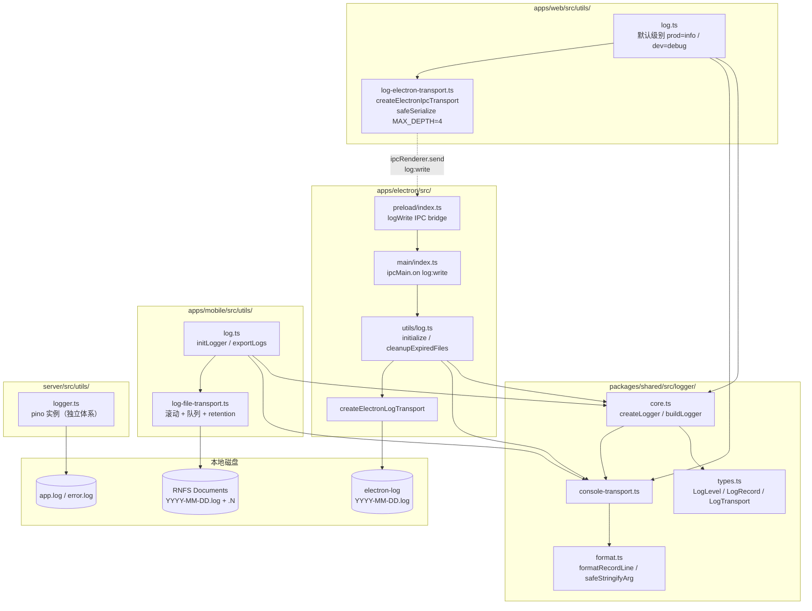
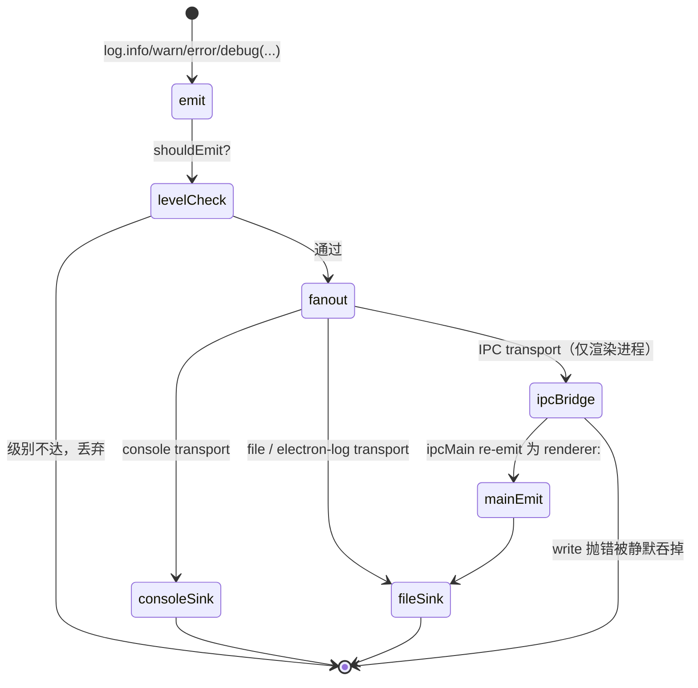

# 统一日志模块架构设计

> 模块：`logging`
> 适用范围：`apps/web`、`apps/electron`、`apps/mobile`、`packages/shared`
> 服务端 `server/` 使用独立的 `pino` 体系，本文档单列一节简要说明
> 文档版本：2026-05-22（重写自原 `docs/logging.md`，迁移至 `docs/architecture/logging.md` 并对齐当前实现）

本文档面向架构师与开发工程师，描述客户端统一日志模块的设计目标、运行时架构、各端落盘策略、核心源码文件、扩展点与约束条件。

---

## 1. 模块概述

### 1.1 目标

- **接口统一**：Web / Electron 主进程 / Electron 渲染进程 / Mobile 四端共用同一份 `Logger` 抽象，业务代码与运行环境解耦。
- **平台特定 transport**：每端选用最合适的落盘 / 上报方式，互不耦合。
- **失败静默**：日志层任何异常不得影响业务，所有 `transport.write()` 调用被 `try/catch` 包裹。
- **零强依赖**：`@mushroom/shared/logger` 只依赖 TypeScript，不引入运行时第三方库；transport 各自按需引入 `electron-log` / `react-native-fs` 等。
- **可扩展**：`Logger.addTransport(transport)` 即可挂载新 sink（远程上报、指标、Sentry…）。

### 1.2 非目标

- **不**承载服务端日志。`server/` 追求高吞吐结构化日志，使用 `pino` + `pino-http`，不接入 `@mushroom/shared/logger`。
- **不**做结构化日志查询/聚合。本模块只负责"产生 + 落盘 + 导出"，远端聚合属于后续 Roadmap。
- **不**保证跨端实时同步。每端日志各自落盘，渲染进程到主进程的 IPC 桥接是单向 fire-and-forget。

### 1.3 适用范围

| 平台                    | 默认 transport         | 落盘                                 |
| ----------------------- | ---------------------- | ------------------------------------ |
| Web（纯浏览器）         | console                | ❌                                   |
| Electron 主进程         | console + electron-log | ✅ `<userData>/logs/YYYY-MM-DD.log`  |
| Electron 渲染进程       | console + IPC → 主进程 | ✅ 通过 IPC 走主进程文件             |
| Mobile（iOS / Android） | console + RNFS 文件    | ✅ `<Documents>/logs/YYYY-MM-DD.log` |
| Server                  | pino（独立体系）       | ✅ `app.log` / `error.log`（按配置） |

---

## 2. 架构总览

### 2.1 组件依赖图



### 2.2 日志记录生命周期



---

## 3. 关键概念

| 概念                | 说明                                                                                              |
| ------------------- | ------------------------------------------------------------------------------------------------- |
| `LogLevel`          | `"debug" \| "info" \| "warn" \| "error"`，定义于 `packages/shared/src/logger/types.ts:1`          |
| `LogRecord`         | 单条日志结构：`level`、`scope?`、`message`、`args[]`、`timestamp`；定义于 `types.ts:3`            |
| `LogTransport`      | sink 接口：`name`、`level?`、`write(record)`、`flush?()`；定义于 `types.ts:11`                    |
| `scope`             | 派生子 logger 的命名空间，按 `:` 拼接，例：`"auth:token"`                                         |
| `LOG_LEVEL_WEIGHT`  | 级别权重映射，`shouldEmit` 用其比较；定义于 `types.ts:37`                                         |
| renderer scope 前缀 | 渲染进程日志经 IPC 转发到主进程后，scope 被改写为 `renderer:<原 scope>`                           |
| `safeSerialize`     | IPC 前对 `args` 做安全序列化（Error / 循环引用 / 非结构化克隆类型），最大递归深度 `MAX_DEPTH = 4` |
| rollover index      | mobile 文件 transport 在单文件超 `LOG_MAX_FILE_MB` 时滚动为 `YYYY-MM-DD.1.log` / `.2.log` …       |

---

## 4. 业务工作流程

### 4.1 业务代码写日志

```text
1. 业务代码 import 各端 wrapper：apps/<target>/src/utils/log
2. 调用 log.info / debug / warn / error 或 log.scope("xxx").info(...)
3. core.ts:emit (L30) 创建 LogRecord，按级别过滤后 fan-out
4. 各 transport.write(record) 串行调用，单个失败被静默吞掉
5. 异步 transport（如 mobile 文件队列）返回的 Promise 被加 .catch(noop)
```

### 4.2 Electron 渲染进程 → 主进程 IPC 转发

```text
1. apps/web/src/utils/log.ts:23-26 检测到运行在 Electron 中，额外挂载
   createElectronIpcTransport（apps/web/src/utils/log-electron-transport.ts:86）
2. 渲染进程调用 log.warn(msg, error)：
   - console transport 立即输出到 DevTools
   - IPC transport.write 先用 safeSerialize 处理 args
     （MAX_DEPTH=4，log-electron-transport.ts:11,19,38）
   - 通过 window.electronAPI.logWrite(record) 发送
3. preload（apps/electron/src/preload/index.ts:23-29）透传到
   ipcRenderer.send("log:write", record)
4. 主进程（apps/electron/src/main/index.ts:160-189）监听 ipcMain，
   将 scope 改写为 "renderer:<原 scope>"，再调主进程 log.<level>(...)
5. 主进程 logger 的 electron-log transport 落到 <userData>/logs/YYYY-MM-DD.log
```

纯浏览器模式启动 web 时，`window.electronAPI` 未注入，IPC transport 不会附加，仅 console 输出，这是预期行为。

### 4.3 启动期初始化

```text
Electron:
  1. apps/electron/src/main/index.ts:146 调 loadEnv()（apps/electron/.env）
  2. 同处紧接调 log.initialize()（apps/electron/src/utils/log.ts:136）
  3. initialize → configureElectronLog (L73)：
     - 解析 LOG_LEVEL / LOG_MAX_FILE_MB / LOG_RETENTION_DAYS
     - 配置 electron-log 文件 transport（每日 YYYY-MM-DD.log）
     - 调 cleanupExpiredFiles (L48,94) 删除过期文件
  4. app.whenReady 内注册 ipcMain.on("log:write")

Mobile:
  1. apps/mobile/index.js:10 import initLogger
  2. apps/mobile/index.js:21 调 initLogger()
  3. apps/mobile/src/utils/log.ts:60 initLogger：
     - 读 react-native-config 的 LOG_LEVEL / LOG_TO_FILE /
       LOG_MAX_FILE_MB / LOG_RETENTION_DAYS
     - 若 LOG_TO_FILE=true：createMobileFileTransport (L65) → addTransport (L69)
     - 文件 transport 首次写入时执行 cleanupExpired
       （log-file-transport.ts:53,101）
```

### 4.4 文件滚动与清理（mobile）

```text
1. 每条日志触发 resolveTargetFile（log-file-transport.ts:135）
2. 当 cache.size >= maxBytes：
   - 调 nextIndexForDate (L104)，自增后缀直到找到不存在的文件名
   - 文件名变为 YYYY-MM-DD.<N>.log（N 从 1 递增，循环上限 1000 次 L112）
3. 写入通过 enqueue (L163) 进入串行 Promise 队列，
   保证同一文件的写入顺序（appendLine L148）
4. 启动时 cleanupExpired (L53)：按 LOG_RETENTION_DAYS 删除更早日期的日志文件
```

### 4.5 日志导出 / 清空（mobile）

```text
1. 设置页 "我" → "导出日志" 调 exportLogs（apps/mobile/src/utils/log.ts:82）
2. 内部先 flushLogs（log-file-transport.ts:180）确保队列写穿
3. listFiles（log-file-transport.ts:183）返回所有 .log 文件路径
4. UI 层调 react-native-share 的 Share.open，把 file:// URL 列表交给系统
5. clearAllLogs (log.ts:93) 调 clearAll (log-file-transport.ts:191) 物理删除
```

---

## 5. 策略

### 5.1 级别判定

| 端              | 默认级别                             | 来源                                                          |
| --------------- | ------------------------------------ | ------------------------------------------------------------- |
| Web             | `production → info` / 其它 → `debug` | `apps/web/src/utils/log.ts:15`（Vite `import.meta.env.MODE`） |
| Electron 主进程 | `打包 → info` / 未打包 → `debug`     | `apps/electron/src/utils/log.ts:76,139`（`LOG_LEVEL` 优先）   |
| Mobile          | `__DEV__ → debug` / 否则 `info`      | `apps/mobile/src/utils/log.ts:39`（`Config.LOG_LEVEL` 优先）  |
| Server          | pino 自身配置                        | `server/src/utils/logger.ts:11`                               |

运行时调整：`log.setLevel("debug")`（`core.ts` 的 `buildLogger`）。

### 5.2 Transport 错误隔离

- `core.ts:emit` 用 `try/catch` 包裹每个 transport 的 `write()` 同步异常。
- 异步 transport 返回的 `Promise` 自动挂 `.catch(noop)`。
- `flush()` 用 `Promise.allSettled` 并行等待，单个失败不阻塞其它 transport。

### 5.3 序列化

- 控制台 / 文件：`format.ts:35` `safeStringifyArg` + `formatRecordLine` 处理 `Error.stack`、循环引用、`undefined`。
- IPC：`log-electron-transport.ts:19` `safeSerialize` 单独做深拷贝并把 `Error` 转为普通对象，避免 Electron 结构化克隆抛错；最大递归深度 `MAX_DEPTH = 4`。

### 5.4 Scope 命名约定

- 顶层 logger 无 scope。
- 模块内派生：`const log = baseLog.scope("auth")`。
- 进一步分层用 `:`：`log.scope("token")` 实际 scope 为 `"auth:token"`（`core.ts:24` `joinScope`）。
- 渲染进程经 IPC 转发后会自动前缀 `renderer:`，便于在主进程文件中区分来源。

### 5.5 失败静默原则

- 业务方 fire-and-forget 调用 `log.*`，不感知 transport 状态。
- 任何 transport 实现都**不得**在 `write()` 抛出未捕获错误以外的副作用（例：不得 `process.exit`、不得弹窗）。
- 文件 IO 失败时仅写到控制台告警，业务继续。

---

## 6. 多平台落盘布局

| 端                 | 路径                                                          | 说明                                                                             |
| ------------------ | ------------------------------------------------------------- | -------------------------------------------------------------------------------- |
| Electron (macOS)   | `~/Library/Application Support/<App>/logs/YYYY-MM-DD.log`     | `app.getPath("userData") + /logs`，定义见 `apps/electron/src/utils/log.ts:44-46` |
| Electron (Windows) | `%APPDATA%/<App>/logs/YYYY-MM-DD.log`                         | 同上                                                                             |
| Electron (Linux)   | `~/.config/<App>/logs/YYYY-MM-DD.log`                         | 同上                                                                             |
| Mobile (iOS)       | `<Documents>/logs/YYYY-MM-DD.log`                             | `RNFS.DocumentDirectoryPath`；超限滚动为 `.1.log` / `.2.log`                     |
| Mobile (Android)   | `/data/data/<package>/files/logs/YYYY-MM-DD.log`              | 同上                                                                             |
| Web 纯浏览器       | —                                                             | 无落盘                                                                           |
| Server             | 进程当前目录 `app.log` / `error.log`（按 `LOG_TO_FILE` 切换） | `server/src/utils/logger.ts:38`                                                  |

文件名使用本地时区，与命名一致；启动时按 `LOG_RETENTION_DAYS` 清理。

### 6.1 环境变量

#### Electron（`apps/electron/.env`）

| 变量                 | 默认值                            | 说明                                   |
| -------------------- | --------------------------------- | -------------------------------------- |
| `LOG_LEVEL`          | `info`（打包）/ `debug`（未打包） | `debug` / `info` / `warn` / `error`    |
| `LOG_MAX_FILE_MB`    | `50`                              | 单文件上限，超过 electron-log 自动轮转 |
| `LOG_RETENTION_DAYS` | `14`                              | 启动时清理 `userData/logs/` 下更早文件 |

> 注：`LOG_TO_FILE` 在 Electron 端被忽略（文件 transport 一旦 `initialize()` 即恒开启），见 §11 缺口。

#### Mobile（`apps/mobile/.env`）

| 变量                 | 默认值                 | 说明                                   |
| -------------------- | ---------------------- | -------------------------------------- |
| `LOG_LEVEL`          | `debug`（DEV）/ `info` | 同上                                   |
| `LOG_TO_FILE`        | `true`                 | 关闭后只用 console，不创建任何日志文件 |
| `LOG_MAX_FILE_MB`    | `5`                    | 单文件滚动阈值                         |
| `LOG_RETENTION_DAYS` | `7`                    | 启动时清理过期文件                     |

mobile env 由 [`react-native-config`](https://github.com/luggit/react-native-config) 在打包阶段注入，**不要**放任何敏感凭据（这些值会进入 native bundle）。

---

## 7. 核心代码文件

> 仅列路径与职责，不展开实现细节。

### 7.1 共享核心（`packages/shared/src/logger/`）

| 文件                   | 职责                                   | 关键导出 / 函数（行号）                                                                                                                          |
| ---------------------- | -------------------------------------- | ------------------------------------------------------------------------------------------------------------------------------------------------ |
| `index.ts`             | Barrel 导出                            | 上述全部符号                                                                                                                                     |
| `types.ts`             | 类型与级别权重                         | `LogLevel`(L1)、`LogRecord`(L3)、`LogTransport`(L11)、`Logger`(L18)、`CreateLoggerOptions`(L31)、`LOG_LEVEL_WEIGHT`(L37)、`compareLogLevel`(L44) |
| `core.ts`              | 内存级 logger 工厂、级别过滤、错误静默 | `shouldEmit`(L15)、`joinScope`(L24)、`buildLogger`(L29)、`emit`(L30)、`createLogger`(L116)                                                       |
| `console-transport.ts` | 默认 console sink                      | `ConsoleTransportOptions`(L3)、`createConsoleTransport`(L14)                                                                                     |
| `format.ts`            | 时间戳与单行格式化                     | `formatTimestamp`(L17)、`formatDateOnly`(L26)、`formatLevel`(L31)、`safeStringifyArg`(L35)、`formatRecordLine`(L61)                              |

测试：`packages/shared/test/logger.test.mjs`（173 行，覆盖 `createLogger`、transport 行为、级别过滤、格式化函数）。

### 7.2 Electron 主进程（`apps/electron/src/`）

| 文件                | 职责                                                                      | 关键函数（行号）                                                                                                                                                                                                                   |
| ------------------- | ------------------------------------------------------------------------- | ---------------------------------------------------------------------------------------------------------------------------------------------------------------------------------------------------------------------------------- |
| `utils/log.ts`      | 主进程 logger 包装；env 解析、桥接 electron-log、过期文件清理             | `parseLevel`(L19)、`parsePositiveInt`(L25)、`resolveLogsDir`(L44)、`cleanupExpiredFiles`(L48)、`configureElectronLog`(L73)、`callElectronLog`(L99)、`createElectronLogTransport`(L110)、基础 logger 构造(L129)、`initialize`(L136) |
| `main/index.ts`     | 启动钩子；调 `loadEnv` + `log.initialize`；注册 `ipcMain.on("log:write")` | `loadEnv()`(L146)、`log.initialize()`(L147)、`ipcMain.on`(L160-189)                                                                                                                                                                |
| `utils/load-env.ts` | `.env` 解析                                                               | `loadEnv`(L71)                                                                                                                                                                                                                     |

### 7.3 Electron Preload

| 文件                                 | 职责                                                                          | 行号                                       |
| ------------------------------------ | ----------------------------------------------------------------------------- | ------------------------------------------ |
| `apps/electron/src/preload/index.ts` | `contextBridge.exposeInMainWorld("electronAPI", ...)` 暴露 `logWrite(record)` | L20（contextBridge）、L23-29（`logWrite`） |

### 7.4 apps/web（含 Electron 渲染进程）

| 文件                                           | 职责                                                               | 关键函数（行号）                                                                                                     |
| ---------------------------------------------- | ------------------------------------------------------------------ | -------------------------------------------------------------------------------------------------------------------- |
| `apps/web/src/utils/log.ts`                    | web logger 包装；按 Vite mode 决定默认级别；自动挂载 IPC transport | 默认级别判定(L15)、logger 构造(L23-26)                                                                               |
| `apps/web/src/utils/log-electron-transport.ts` | Electron IPC transport + 序列化                                    | `MAX_DEPTH = 4`(L11)、`safeSerialize`(L19)、序列化调用(L38)、`resolveBridge`(L75)、`createElectronIpcTransport`(L86) |

### 7.5 Mobile（`apps/mobile/src/`）

| 文件                          | 职责                                                   | 关键函数（行号）                                                                                                                                                                                                                         |
| ----------------------------- | ------------------------------------------------------ | ---------------------------------------------------------------------------------------------------------------------------------------------------------------------------------------------------------------------------------------- |
| `utils/log.ts`                | mobile logger 包装；启动 init；导出 / 清空 / flush API | `parseLevel`(L18)、`parseBool`(L24)、`parsePositiveInt`(L32)、env 读取(L39-45)、`baseLogger`(L50)、`initLogger`(L60)、`createMobileFileTransport`(L65)、`addTransport`(L69)、`exportLogs`(L82)、`clearAllLogs`(L93)、`flushLogs`(L99)    |
| `utils/log-file-transport.ts` | RNFS 文件 transport：滚动、retention、串行写队列       | `FILE_DATE_PATTERN`(L13)、`cleanupExpired`(L53)、`queue`(L93)、`init`(L101)、`nextIndexForDate`(L104)、`resolveTargetFile`(L135)、`appendLine`(L148)、`enqueue`(L163)、`write`(L176)、`flush`(L180)、`listFiles`(L183)、`clearAll`(L191) |
| `index.js`                    | RN 入口；早期调 `initLogger()`                         | import(L10)、调用(L21)                                                                                                                                                                                                                   |

### 7.6 Server（独立 pino 体系，仅作参考）

| 文件                         | 职责                                                                  | 行号                                                                                                       |
| ---------------------------- | --------------------------------------------------------------------- | ---------------------------------------------------------------------------------------------------------- |
| `server/src/utils/logger.ts` | pino 实例：开发 `pino-pretty` / 文件 `pino.multistream` / 默认 stdout | options(L11)、dev 分支(L25)、文件分支(L38)、默认分支(L58)、`export default logger`(L62)、`{ logger }`(L64) |
| `server/src/app.ts`          | `pino-http` 中间件挂载                                                | import(L22-23)、`app.use(pinoHttp({ logger }))`(L62)                                                       |

服务端**不**接入 `@mushroom/shared/logger`，与客户端日志体系完全独立。

### 7.7 调用量统计

| 域                     | 业务侧 `log` 导入文件数 | 备注                                                                                                                            |
| ---------------------- | ----------------------- | ------------------------------------------------------------------------------------------------------------------------------- |
| `apps/web/src/**`      | 22                      | App.tsx、useChat、useChatCallSession、refreshAttachmentUrls、ProfileSettingsModal 等                                            |
| `apps/electron/src/**` | 8                       | 主要为主进程与窗口管理                                                                                                          |
| `apps/mobile/src/**`   | 22                      | actions / features / services 多处                                                                                              |
| `server/src/**`        | 30+                     | ws_server / presence_manager / redis_dispatcher / minio / outbox_worker / message_service / thumbnail_worker / push/\* / app.ts |

业务代码统一通过各端 wrapper `…/utils/log` 间接使用，**不**直接 import `@mushroom/shared/logger`。

---

## 8. 关联数据库表

本模块**无**关联数据库表。日志只落本地文件 / 控制台，不入库。

如未来引入服务端日志聚合（OTLP / Loki / ELK），由聚合方自定义存储，本模块仅负责产生与上报。

---

## 9. IPC / API 契约

### 9.1 Electron IPC：`log:write`

**方向**：渲染进程 → 主进程（单向 `send`，无响应）。

**Channel**：`"log:write"`（apps/electron/src/main/index.ts:160；apps/electron/src/preload/index.ts:23-29）。

**Payload**：`LogRecord`（`packages/shared/src/logger/types.ts:3`）

```ts
interface LogRecord {
  level: "debug" | "info" | "warn" | "error";
  scope?: string;
  timestamp: number; // 渲染进程本地时间，ms
  args: unknown[]; // 经 safeSerialize 处理，深度 ≤4，Error → 普通对象
}
```

**Preload Bridge**：

```ts
window.electronAPI.logWrite(record: LogRecord): void
```

**主进程处理**：将 `scope` 重写为 `"renderer:" + (record.scope ?? "")`，再调主进程 `log.<level>(...record.args)`，最终通过 electron-log 落到 `userData/logs/YYYY-MM-DD.log`。

**错误处理**：preload / 主进程任一环节抛错均被吞掉；不返回成功状态给渲染进程。

### 9.2 无对外 HTTP / WS API

本模块不暴露任何 REST/WebSocket 接口；服务端日志查询走运维通道（直接读取文件或日志聚合平台）。

---

## 10. 约束与安全

### 10.1 性能

- 同步路径：`emit` 仅做级别比较 + transport fan-out，单次调用 < 0.1ms。
- 异步文件 IO 通过串行 `enqueue` 队列吸收高频写入，避免 `RNFS.appendFile` 并发覆盖问题。
- 控制台 transport 在生产构建中**不**摘除（依赖 ESLint `no-console` 在源码层约束业务方调用）。

### 10.2 安全

- **禁止打印敏感数据**：token、密码、私钥、完整手机号 / 邮箱等不得进入日志参数。代码评审时关注 `log.*` 调用点。
- IPC `log:write` 不做来源校验：preload 已通过 `contextBridge` 隔离，渲染进程无法直接访问 `ipcRenderer`，故视为可信通道。
- 移动端文件 transport 写入应用沙箱目录，不可被其它应用读取（iOS App Sandbox / Android internal storage）。导出操作经由 `Share.open`，由系统授权拷贝到目标位置。
- 不收集设备唯一标识 / 用户 PII；如未来接入崩溃上报需单独走合规评审。

### 10.3 跨端一致性

- 四端 `log.<level>(...args)` 调用签名一致，业务代码无须按端做分支。
- `scope` 命名约定（`auth:token` 形式）跨端通用。
- 时间戳全部使用本地时区毫秒数；如需 UTC 对齐由聚合端转换。

### 10.4 失败模式

| 场景                             | 影响                     | 兜底                                      |
| -------------------------------- | ------------------------ | ----------------------------------------- |
| 文件写入失败（磁盘满 / 权限）    | 该条日志丢失             | 仅 console 提示，业务无感                 |
| IPC 序列化失败                   | 该条日志不到主进程文件   | console 仍输出，DevTools 可见             |
| `cleanupExpired` 失败            | 旧文件残留，磁盘占用上涨 | 下次启动重试                              |
| Mobile `RNFS` 在某些机型权限受限 | 文件 transport 全部失败  | 通过 `LOG_TO_FILE=false` 关闭后仅 console |

---

## 11. 现状缺口与 Roadmap

### 11.1 漂移与缺口

| 项                                                         | 现状                                                                                       | 期望 / 风险                                                                       |
| ---------------------------------------------------------- | ------------------------------------------------------------------------------------------ | --------------------------------------------------------------------------------- |
| Electron 无 `LOG_TO_FILE` 开关                             | `apps/electron/src/utils/log.ts:73` 一旦 `initialize()` 即恒开 electron-log 文件 transport | mobile 有 `LOG_TO_FILE` 配置，文档与代码语义未对齐；CI / E2E 场景无法关闭文件输出 |
| 无远程上报 transport                                       | 全仓 grep Sentry / OTLP / opentelemetry 零命中                                             | 生产环境问题排查只能靠用户上传日志                                                |
| Server 与客户端日志体系隔离                                | 服务端用 pino，客户端用 shared logger                                                      | 跨端 trace 关联缺失（无 `traceId` 透传约定）                                      |
| ESLint `no-console` 仅覆盖 `apps/{web,electron,mobile}/**` | `eslint.config.mjs:83-86`                                                                  | `packages/**` / `server/**` 无强制约束，仍可能直接 `console.log`                  |
| `flush()` 未被启动期 / 异常退出钩子调用                    | `core.ts` 暴露但调用点仅 mobile 导出逻辑使用                                               | Electron `before-quit` / mobile crash 时尾部日志可能丢失                          |
| mobile 滚动文件名次序耦合                                  | `nextIndexForDate` 上限 1000 (`log-file-transport.ts:112`)                                 | 极端长时间运行 + 高日志量时可能溢出，但实际不可达                                 |
| 没有 logger 使用规范文档                                   | scope 命名、敏感字段约束散落在 PR review                                                   | 新人易写出泄漏 PII 的日志                                                         |

### 11.2 Roadmap（短中期）

- **P1**：补齐 Electron 的 `LOG_TO_FILE` 支持，使 4 端 env 语义对齐。
- **P1**：编写 `docs/logging-guidelines.md`（scope 约定 + 禁用字段清单 + 示例）。
- **P2**：抽出 `RemoteTransport` 抽象，可挂接 Sentry / 自建 OTLP collector；先在 server pino 上 PoC。
- **P2**：业务关键链路注入 `traceId`，shared logger 增加 `bindings`/`child` 能力，与服务端 pino `req.id` 对齐。
- **P3**：渲染进程崩溃前调 `flush()`（监听 `beforeunload`），Electron `app.on("before-quit")` 同步等待 `flush`。
- **P3**：把 ESLint `no-console` 规则扩到 `packages/**`、`server/**`。

### 11.3 不做事项

- 不引入第三方重型日志框架（如 winston）替换现有 shared logger，保留零依赖、跨端可控的简单实现。
- 不在客户端做日志加密 / 签名（应用沙箱已足够，加密会显著增加调试难度）。
- 不做按 scope 的运行时级别覆盖（YAGNI；如需调试单模块，直接改源码 `setLevel`）。

---

## 12. 变更记录

| 日期       | 变更                                                                      | 提交 / PR  |
| ---------- | ------------------------------------------------------------------------- | ---------- |
| 2025-XX-XX | 首版：从 `docs/logging.md` 重构为架构文档，补齐 IPC 契约、Roadmap、漂移表 | （待提交） |
| 2026-05-23 | 新增 §13 服务端结构化日志规范、ALS 上下文与 `payload_logger` 采样能力     | （待提交） |

后续每次涉及 logger 公共 API、新 transport、env 变量、IPC channel 的改动均需更新本表。

---

## 13. 服务端结构化日志规范（pino）

服务端使用 `pino`，入口位于 `server/src/utils/logger.ts`。本节给出排障/运维所需的统一约定。

### 13.1 上下文与字段

- 通过 `AsyncLocalStorage` 注入请求级上下文：
  - HTTP：`app.ts` 中间件在每个请求 `runWithLogContext({ reqId })`，`authenticateToken` 之后 `mergeLogContext({ userId, deviceId })`。
  - WebSocket：`ws_server.ts` 在每条 `ws.on("message")` 包入 `runWithLogContext({ reqId: randomUUID(), userId, deviceId })`，单条消息对应一个 `reqId`。
- 业务代码用 `getRequestLogger()` 拿 child logger，它会自动绑定上下文（无须每次手写 `reqId/userId`）。
- 通用字段约定（约定即文档，请勿在业务里再造新字段名）：
  `reqId / userId / deviceId / conversationId / messageId / clientMessageId / sequence / classify / bytes / err / reason / mode / outboxId / eventType / retryCount`。
- **消息正文、authorization、cookie 不进日志**：`pino-http` 已重写 `req` serializer 脱敏；业务里同样禁用对 raw payload 的直接打印。

### 13.2 级别策略

| 级别    | 场景                                                                      |
| ------- | ------------------------------------------------------------------------- |
| `error` | 5xx / 不可重入异常 / 数据库错误 / Outbox 投递达到上限                     |
| `warn`  | 4xx 业务拒绝 / 慢查询 / 推送失败 / 重试中 / Token 校验失败 / 心跳清理统计 |
| `info`  | 关键业务事件（登录成功、群操作成功、Call 状态变更、Outbox 队列健康）      |
| `debug` | 2xx/3xx HTTP 访问日志、WS 消息粒度元信息、推送选路、Outbox claim 数量     |
| `trace` | payload 采样（仅 `payload_logger` 使用）                                  |

生产建议 `LOG_LEVEL=info`，排障时开 `debug`；`trace` 仅在配合 `LOG_PAYLOAD_ENABLED=true` 临时排查 payload 漂移时打开。

### 13.3 Payload 采样

通用入口：`server/src/utils/payload_logger.ts#logPayload(ctx, payload)`。默认完全禁用，调用成本约等于一次属性读取，可放心铺设。

环境变量（详见 `server/.env.example`）：

| 变量                         | 默认                                                                  | 说明                                                           |
| ---------------------------- | --------------------------------------------------------------------- | -------------------------------------------------------------- |
| `LOG_PAYLOAD_ENABLED`        | `false`                                                               | 总开关                                                         |
| `LOG_PAYLOAD_SCOPES`         | 空                                                                    | 命中 scope 白名单，逗号分隔，留空全放行                        |
| `LOG_PAYLOAD_MAX_BYTES`      | `2048`                                                                | 单条 payload 序列化后最大字节，超出截断并标记 `truncated:true` |
| `LOG_PAYLOAD_SAMPLE_RATE`    | `1`                                                                   | 0–1 之间采样率                                                 |
| `LOG_PAYLOAD_USER_ALLOWLIST` | 空                                                                    | 只采样指定 `userId`                                            |
| `LOG_PAYLOAD_REDACT_KEYS`    | `password,token,access_token,refresh_token,phone,email,authorization` | key 级整字段替换为 `***`                                       |

当前已落 scope：

- `ws.chat.in`：WS 收到的 chat 消息（在 `handleChatMessage` 中调用）
- `message.save.outbox`：消息落库时为目标用户写入 outbox 的 envelope
- `outbox.deliver.chat`：Outbox worker 投递 chat 时的 envelope
- `push.envelope`：推送下发前的 envelope
- 预留：`ws.recv`、`http.4xx.body`

### 13.4 排障 cheat sheet

- 按 `clientMessageId` 串链路：客户端发送 → `ws.chat.in` → `message.save.outbox` → `outbox.deliver.chat` → 客户端 ack。
- 按 `reqId` 排查单次 HTTP / 单条 WS 消息：HTTP 由 `pino-http` 注入，WS 在 ws_server 入口注入，errorHandler 也走同一个 child logger。
- 慢查询：阈值由 `PG_SLOW_QUERY_MS`（默认 300ms）控制，命中输出 `Slow Postgres query`（不含参数）。
- Outbox 堆积：`Outbox queue health warning` 会附带队列分级统计，对照 `outbox/policy.ts` 的阈值。

### 13.5 引用文件

- `server/src/utils/log_context.ts`：ALS 与 `getRequestLogger`。
- `server/src/utils/payload_logger.ts`：trace 级 payload 采样实现。
- `server/src/app.ts`、`server/src/handler/response_wrapper.ts`、`server/src/websocket/ws_server.ts`：上下文注入入口。
- `server/test/payload-logger.test.mjs`：开关/redact/截断/scope 过滤单测。
