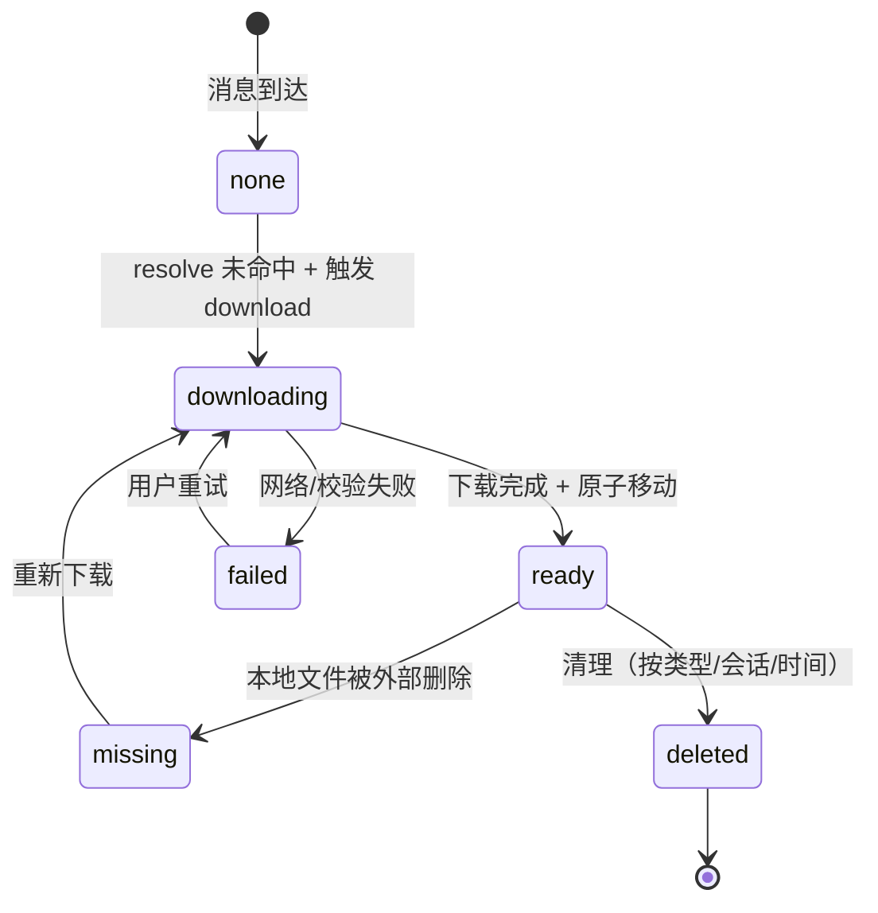

# 媒体缓存模块架构设计

> 模块：`media-cache`
> 适用平台：Desktop（Electron）/ Mobile（React Native）/ Web（仅通过 Electron 包装）
> 文档版本：2026-05-22（合并自原 `docs/cache.md`，对齐 migration v2 之后的实际实现）

本文档面向架构师与开发工程师，描述聊天媒体缓存模块的业务流程、缓存策略、各平台落盘目录、核心源码文件、关联数据库表与约束条件。后续每个模块的设计文档统一放在 `docs/architecture/` 下，文件名与模块名一致。

---

## 1. 模块概述

### 1.1 目标

- 将聊天图片、附件、语音、视频、缩略图落盘缓存，降低重复下载与打开延迟。
- 按登录账号物理隔离缓存，避免不同账号互相污染。
- 按月份归档子目录，方便排查、迁移与清理。
- 缓存目录是应用内部数据，可被应用自动清理；用户主动「另存为」的文件不写入该缓存目录。
- 缓存的判定（命中、下载、清理）对消息组件透明，调用方只关心「拿本地路径」。

### 1.2 非目标

- 不为纯浏览器 Web 版实现 IndexedDB / OPFS 落盘缓存（仅在 Electron 容器内提供本地缓存能力）。
- 不做服务端侧缓存代理（客户端直连 MinIO presigned URL）。
- 不写迁移老数据脚本；如表结构需要重大调整，按 `AGENTS.md` 规则直接 DROP & 重建。

### 1.3 适用范围

| 平台                    | 落盘缓存 | 实现                              |
| ----------------------- | -------- | --------------------------------- |
| Desktop（Electron）     | ✅       | 主进程 + SQLite 索引 + 自定义协议 |
| Mobile（iOS / Android） | ✅       | RN-FS + SQLite 索引               |
| Web（纯浏览器）         | ❌       | 直连 presigned URL，无落盘        |

---

## 2. 架构总览

### 2.1 组件依赖图

```mermaid
flowchart TB
  subgraph Web["apps/web (React/TSX, 在 Electron 容器内)"]
    WebMsg[聊天消息组件<br/>Image / Video / Audio / File]
    WebSet[设置页 StorageSettingsPanel]
  end

  subgraph Mobile["apps/mobile (React Native)"]
    MobMsg[消息组件 + actions/chat/*]
    MobStore[features/storage/useStorageUsage]
  end

  subgraph Shared["packages/shared"]
    AutoDL[media-auto-download.ts<br/>策略 + 阈值]
  end

  subgraph Preload["apps/electron/src/preload/index.ts"]
    Bridge[contextBridge<br/>media-cache:* / prefs:*]
  end

  subgraph Main["apps/electron/src/main"]
    MC[media-cache.ts<br/>IPC + 下载 + 协议处理]
    MCCore[media-cache-core.ts<br/>路径/命名/分类纯函数]
    RP[runtime-paths.ts<br/>账号/实例隔离]
    MIG[migration.ts<br/>SQLite DDL]
    SS[storage-stats.ts]
  end

  subgraph MobPlat["apps/mobile/src/platform"]
    MMC[media-cache.ts<br/>RN-FS + SQLite]
  end

  subgraph Disk["本地磁盘"]
    FS[(文件系统<br/>media-cache 根)]
    DB[(SQLite<br/>media_cache 表)]
  end

  subgraph Server["server/"]
    Limits[/api/config/limits]
    Att[/file/attachment/*]
    Minio[(MinIO presigned URL)]
  end

  WebMsg --> Bridge
  WebSet --> Bridge
  Bridge --> MC
  MC --> MCCore
  MC --> RP
  MC --> MIG
  MC --> FS
  MC --> DB
  MC -. 自定义协议<br/>mushroom-media-cache:// .-> WebMsg

  MobMsg --> MMC
  MobStore --> MMC
  MMC --> FS
  MMC --> DB

  WebMsg --> AutoDL
  MobMsg --> AutoDL

  MC --> Att
  MMC --> Att
  Att --> Minio
  WebSet --> Limits
  MobStore --> Limits
```

### 2.2 下载状态机



---

## 3. 关键概念

| 概念                      | 说明                                                                                        |
| ------------------------- | ------------------------------------------------------------------------------------------- |
| `category`                | 五个固定值：`images` / `files` / `voice` / `video` / `thumbs`                               |
| `user_id`                 | 当前登录账号的服务端数值 ID，作为账号级数据隔离键（migration v2 之后已用它替代 `username`） |
| `month_key`               | `yyyy_MM` 字符串，例 `2026_04`；归档维度                                                    |
| `client_conversation_id`  | 关联的本地会话 ID，用于「按会话清理」                                                       |
| `status`                  | `downloading` / `ready` / `missing` / `failed` / `deleted`                                  |
| `mushroom-media-cache://` | Electron 自定义协议，把本地缓存文件以受控方式暴露给 Renderer，避免直接拼 `file://`          |
| `download task key`       | `<user_id>::<category>::<remote_url>`，用于同一资源的并发去重                               |

---

## 4. 业务工作流程

### 4.1 发送侧：本地文件 → 上传 → 登记缓存

```text
1. Renderer 选择本地文件
2. Renderer 调用上传逻辑（分片上传走 /file/attachment/initiate → part-url → complete）
3. 服务端返回 upload_id / remote_url
4. 消息体落库后，Renderer 通过 IPC `media-cache:register-local` 通知主进程
5. 主进程：
   - 根据 MIME / 扩展名判定 category
   - 计算目标目录 <userData>/users/<uid>/media/<yyyy_MM>/<category>/
   - 若源文件已位于缓存根目录内：仅登记索引
   - 否则：复制到目标路径并按 <messageId>-<uploadId>-<hash16>.<ext> 重命名
6. 写入 media_cache 表，status = ready
```

### 4.2 接收侧：resolve → 命中？→ 下载

```text
1. 消息组件挂载时拿到 remote_url + size + category
2. 调用 IPC `media-cache:resolve` 查询本地是否已缓存
3. 主进程按 (user_id, remote_url, category) 唯一索引查询
   - 命中且 local_path 存在：刷新 accessed_at，返回 hit=true + 本地路径
   - 命中但文件丢失：状态改 missing，返回 hit=false
   - 未命中：返回 hit=false
4. 未命中时根据自动下载策略决定是否自动触发 download：
   - 调用 shared 工具 shouldAutoDownload(category, policy, networkType, fileSize)
   - 通过：调用 IPC `media-cache:download` 开始后台下载
   - 拒绝：UI 显示「未下载」+ 手动下载按钮
5. 下载完成后渲染本地路径（via mushroom-media-cache:// 协议）
```

### 4.3 预览 / 打开 / 另存为

| 操作           | IPC                    | 行为                                                                                           |
| -------------- | ---------------------- | ---------------------------------------------------------------------------------------------- |
| 大图预览       | `media-cache:download` | 必要时阻塞下载原图，返回本地路径                                                               |
| 文件双击打开   | `media-cache:open`     | 走 Electron `shell.openPath`，由系统默认应用打开                                               |
| 右键「另存为」 | `media-cache:save-as`  | 先确保缓存就绪，再弹系统保存对话框，把缓存文件复制到用户选择路径；**不**把保存目标计入缓存目录 |

### 4.4 自动下载策略

- 真相源：`packages/shared/src/utils/media-auto-download.ts`
- 用户偏好：按账号 + 类别（photos / audio / videos / documents）选择 `none / wifi / wifiCellular`
- 内置大小阈值（自动下载路径生效，手动点击不受限）：

| 类别      | Wi-Fi | 蜂窝 |
| --------- | ----- | ---- |
| photos    | 不限  | 5 MB |
| audio     | 5 MB  | 2 MB |
| videos    | 30 MB | 永不 |
| documents | 20 MB | 永不 |

- 偏好读写经由 IPC `prefs:get-media-auto-download` / `prefs:set-media-auto-download`，并通过 `prefs:media-auto-download-changed` 事件广播。

### 4.5 清理流程

| 维度                     | 入口                                     | IPC                           |
| ------------------------ | ---------------------------------------- | ----------------------------- |
| 按类型 / 月份 / 时间窗口 | 设置页 → 「清理图片缓存 / 全部缓存…」    | `media-cache:cleanup`         |
| 按会话                   | 会话设置 → 「清理本会话缓存」            | `media-cache:cleanup-by-conv` |
| 容量自动驱逐             | **未实现**（见第 11 节缺口）             | —                             |
| 按时间自动驱逐           | **未实现**，仅支持显式传 `olderThanDays` | —                             |

清理动作的实际行为：物理 `unlink` 本地文件 → 批量更新 SQLite 行 `status='deleted'`（软删）。

---

## 5. 缓存策略

### 5.1 分类判定

优先 MIME，扩展名兜底，缩略图不参与自动判定：

```text
image/*  → images
audio/*  → voice
video/*  → video
其它     → files
缩略图  → 必须由调用方显式指定 category=thumbs
```

实现位置：`apps/electron/src/main/media-cache-core.ts:159` `resolveMediaCacheCategory`。

### 5.2 文件命名

```text
<messageId>-<uploadId>-<hash16>.<ext>
```

- `messageId`：服务端消息 ID（无则用 clientMessageId 兜底，类型 TEXT）
- `uploadId`：服务端附件上传 ID（无则用 remote_url 哈希前 16 位）
- `hash16`：文件内容 SHA-256 前 16 位；下载阶段先用 URL 哈希，落盘后补内容哈希
- `ext`：MIME → URL → 原始文件名兜底；都无法识别时用 `bin`

原始文件名仅在 UI 展示，存 `media_cache.original_name`，不参与命名。

### 5.3 并发控制

主进程维护一张 `Map<string, Promise<MediaCacheRecord>>`，key 为：

```text
<user_id>::<category>::<remote_url>
```

同一资源的并发请求复用同一个 Promise，避免重复下载与磁盘竞争。实现见 `media-cache.ts` 中的 `downloadMediaCache` / `downloadMediaCacheInternal` 与 `buildDownloadTaskKey`（`media-cache-core.ts:230`）。

### 5.4 清理优先级（设计目标）

```text
1. thumbs    （可从原文件/服务端重建，最先清）
2. images / voice / video  （按 accessed_at LRU）
3. files     （只在用户允许「自动清理文件缓存」时参与）
```

> 当前代码仅实现「按显式条件」清理，LRU 与总容量上限属于后续工作（见 §11）。

### 5.5 状态转移摘要

- 访问命中：刷新 `accessed_at`（`touchRecord`）。
- 下载失败：临时文件删除，状态置 `failed`。
- 文件丢失：状态置 `missing`，访问时按远端重下。
- 清理：物理删文件 + status `deleted` 软删。
- 重新下载：从 `missing/failed/deleted` 经 `downloading` 回到 `ready`，行复用而非新增。

---

## 6. 多平台目录布局

### 6.1 Desktop（Electron）

Electron 通过 `app.getPath("userData")` 获取应用数据根目录。生产环境默认位置：

```text
macOS:   ~/Library/Application Support/Mushroom
Windows: C:\Users\<用户名>\AppData\Roaming\Mushroom
Linux:   ~/.config/Mushroom
```

媒体缓存目录采用「账号级隔离 + 月份归档 + 分类」三层结构：

```text
<userData>/users/<uid>/media/<yyyy_MM>/<images|files|voice|video|thumbs>/
```

实际示例：

```text
~/Library/Application Support/Mushroom/users/10001/media/2026_04/images/
~/Library/Application Support/Mushroom/users/10001/media/2026_04/files/
~/Library/Application Support/Mushroom/users/10001/media/2026_04/voice/
~/Library/Application Support/Mushroom/users/10001/media/2026_04/video/
~/Library/Application Support/Mushroom/users/10001/media/2026_04/thumbs/
```

目录规则：

- `<uid>` 使用服务端数值用户 ID（不再使用 username，避免改名后丢失缓存）。
- `<yyyy_MM>` 使用四位年份 + 两位月份，例 `2026_04`，单层目录不再拆 `yyyy/MM`。
- 五个分类按需创建，登录时不预创建。
- 实现：`apps/electron/src/main/runtime-paths.ts:87` `getAccountMediaRoot(uid)`。

#### 开发多实例模式

开发场景下允许通过 `--instance=<id>` CLI 参数或 `MUSHROOM_APP_INSTANCE` 环境变量启动多实例：

```text
<userData>/instances/<instanceId>/users/<uid>/media/<yyyy_MM>/<category>/
```

打包版强制单实例锁，`getInstanceId()` 恒返回 `"default"`，第二个实例启动时直接退出并聚焦已有窗口（`apps/electron/src/main/index.ts:53-59,133-143`）。

### 6.2 Mobile（React Native）

落盘根目录由 `react-native-fs` 提供：

```text
iOS:     <CachesDirectoryPath>/users/<uid>/media/<yyyy_MM>/<category>/
Android: <CachesDirectoryPath>/users/<uid>/media/<yyyy_MM>/<category>/
```

- 选用 `CachesDirectoryPath` 而非 `DocumentDirectoryPath`：系统可在空间紧张时主动回收，符合「缓存」语义。
- Outbox（发送队列原文件）走 `LibraryDirectoryPath ?? DocumentDirectoryPath`，与缓存分离，避免系统回收导致发送失败。
- 实现：`apps/mobile/src/platform/media-cache.ts:60-72`。

### 6.3 Web（纯浏览器）

无落盘缓存。所有 `window.electronAPI.*` 调用前以 `typeof === "function"` 保护，纯浏览器路径下直接渲染 presigned URL，由浏览器 HTTP 缓存负责短时间复用。

---

## 7. 核心代码文件

> 仅列路径与职责，不展开实现细节。

### 7.1 Electron 主进程（`apps/electron/src/main/`）

| 文件                  | 职责                                                                                       | 关键导出                                                                                                                                                                                                                                                                                                                                                                                                                 |
| --------------------- | ------------------------------------------------------------------------------------------ | ------------------------------------------------------------------------------------------------------------------------------------------------------------------------------------------------------------------------------------------------------------------------------------------------------------------------------------------------------------------------------------------------------------------------ |
| `media-cache.ts`      | IPC 注册、下载/查询/清理主流程、自定义协议处理                                             | `setupMediaCacheIpcHandlers`、`setupMediaCacheProtocol`；内部：`resolveMediaCache`、`downloadMediaCache`、`downloadMediaCacheInternal`、`registerLocalMediaCache`、`openMediaCache`、`saveMediaCacheAs`、`getMediaCacheStats`、`getMediaCacheStatsByConversation`、`cleanupMediaCache`、`cleanupMediaCacheByConversation`、`deleteRowsByQuery`、`upsertReadyRecord`、`touchRecord`、`assertCachePath`、`normalizeRecord` |
| `media-cache-core.ts` | 纯函数工具（路径/命名/分类），被 electron-vite 单独打包成入口，供主进程与测试复用          | `mediaCacheProtocol`、`mediaCacheCategories`、`MediaCacheCategory`、`isMediaCacheCategory`、`assertMediaCacheCategory`、`getMonthKey`、`getMediaCacheRoot`、`buildLocalMediaCacheUrl`、`parseLocalMediaCacheUrl`、`getCategoryDir`、`isPathInside`、`inferExtension`、`resolveMediaCacheCategory`、`buildCacheFileName`、`normalizeRemoteUrl`、`buildDownloadTaskKey`                                                    |
| `runtime-paths.ts`    | 账号 + 实例隔离的根目录计算                                                                | `getInstanceId`、`applyInstanceUserDataPath`、`getUsersRoot`、`getAccountRoot`、`getAccountMediaRoot`、`getAccountDbRoot`、`getAccountOutboxRoot`                                                                                                                                                                                                                                                                        |
| `migration.ts`        | SQLite DDL；v1 创建初始表，v2 整表 DROP & 重建以切换到 `user_id`                           | `initSchemaMigration`、`migrateMediaCacheToUserIdMigration`                                                                                                                                                                                                                                                                                                                                                              |
| `database.ts`         | 主进程 SQLite 句柄、当前登录用户解析                                                       | `getDb`、`getCurrentUserId`                                                                                                                                                                                                                                                                                                                                                                                              |
| `storage-stats.ts`    | 设置页存储用量统计；依赖 `getMediaCacheRoot` 与 `media_cache` 表                           | —                                                                                                                                                                                                                                                                                                                                                                                                                        |
| `index.ts`            | 启动期挂载自定义协议与 IPC（第 36-37、201-202 行），并启用单实例锁（第 53-59、133-143 行） | —                                                                                                                                                                                                                                                                                                                                                                                                                        |

测试：`apps/electron/test/media-cache-core.test.mjs`（核心纯函数单测）。

### 7.2 Preload

`apps/electron/src/preload/index.ts:71-100` 通过 `contextBridge` 暴露媒体缓存能力；类型在 `apps/web/src/types/global.d.ts:137-184` 同步维护。

### 7.3 Web Renderer（消费方，`apps/web/src/`）

| 文件                                           | 用途                                               |
| ---------------------------------------------- | -------------------------------------------------- |
| `components/chat/messageMediaCache.ts`         | 公共下载封装，被多个消息组件复用                   |
| `components/chat/VisualMediaMessages.tsx`      | 图片 + 视频消息卡片                                |
| `components/chat/ImagePreviewModal.tsx`        | 大图预览                                           |
| `components/chat/AudioMessageCard.tsx`         | 语音消息播放                                       |
| `components/chat/FileAttachmentMessage.tsx`    | 文件附件卡片（含 ≤20MB 自动 / >20MB 手动下载逻辑） |
| `components/chat/MessageList.tsx`              | 消息右键「另存为」入口                             |
| `components/settings/StorageSettingsPanel.tsx` | 设置页缓存统计与清理 UI                            |
| `services/mediaAutoDownloadPreferences.ts`     | 自动下载偏好读写（封装 `prefs:*` IPC）             |
| `types/global.d.ts`                            | `electronAPI` 类型定义                             |

### 7.4 Mobile（`apps/mobile/src/`）

| 文件                                   | 职责                                           |
| -------------------------------------- | ---------------------------------------------- |
| `platform/media-cache.ts`              | RN-FS + SQLite 实现；与桌面端 IPC 行为一一对应 |
| `actions/chat/conversation-actions.ts` | 拉取/打开消息媒体时调用缓存                    |
| `actions/chat/voice-actions.ts`        | 语音消息缓存接入                               |
| `features/storage/useStorageUsage.ts`  | 设置页存储统计                                 |

关键导出：`getMediaCacheRoot`、`resolveMobileMediaCache`、`downloadMobileMediaCache`、`downloadMobileMediaCacheInternal`、`MobileMediaCacheCategory`；自动下载并发队列：`AUTO_DOWNLOAD_CONCURRENCY = 2`、`pumpAutoQueue`、`createScheduledAutoDownload`、`handleAppStateChange`。

### 7.5 Shared

`packages/shared/src/utils/media-auto-download.ts`：自动下载策略与大小阈值（`MEDIA_CATEGORIES`、`MEDIA_AUTO_DOWNLOAD_POLICIES`、`DEFAULT_MEDIA_AUTO_DOWNLOAD_PREFERENCES`、`AUTO_DOWNLOAD_SIZE_LIMITS`、`getAutoDownloadSizeLimit`、`shouldAutoDownload`）。

### 7.6 Server 依赖（`server/src/`）

| 文件                         | 路由 / 职责                                                                                                       |
| ---------------------------- | ----------------------------------------------------------------------------------------------------------------- |
| `storage/minio.ts`           | `POST /file/attachment/initiate`、`/part-url`、`/complete`、`/abort`、`/refresh-urls`；头像上传 `/file/upload` 等 |
| `app.ts`                     | `GET /api/config/limits`（第 205-217 行）下发上传/附件硬上限                                                      |
| `utils/config.ts`            | 上传与附件硬上限定义（`MAX_*_SIZE_MB`、`UPLOAD_CHUNK_SIZE_MB`、`UPLOAD_PRESIGNED_EXPIRES_SECONDS` 等）            |
| `service/message_service.ts` | 消息体附件校验，依赖 `config.limits`                                                                              |

服务端**不**承担附件下载代理职责；客户端拿到 presigned URL（有效期由
`UPLOAD_PRESIGNED_EXPIRES_SECONDS` 决定，默认 1 小时）后直连 MinIO。

---

## 8. 关联数据库表

### 8.1 当前 schema（migration v2 之后）

```sql
CREATE TABLE media_cache (
  id INTEGER PRIMARY KEY AUTOINCREMENT,
  user_id INTEGER NOT NULL,
  message_id TEXT,
  upload_id TEXT,
  remote_url TEXT,
  local_path TEXT NOT NULL,
  category TEXT NOT NULL,
  original_name TEXT,
  mime_type TEXT,
  size INTEGER,
  sha256 TEXT,
  month_key TEXT NOT NULL,
  status TEXT NOT NULL DEFAULT 'ready',
  created_at TEXT NOT NULL,
  updated_at TEXT NOT NULL,
  accessed_at TEXT,
  client_conversation_id TEXT
);

CREATE INDEX idx_media_cache_user_month
  ON media_cache (user_id, month_key);

CREATE INDEX idx_media_cache_message
  ON media_cache (message_id);

CREATE UNIQUE INDEX idx_media_cache_remote_category
  ON media_cache (user_id, remote_url, category)
  WHERE remote_url IS NOT NULL;

CREATE INDEX idx_media_cache_user_conv
  ON media_cache (user_id, client_conversation_id);
```

定义位置：`apps/electron/src/main/migration.ts:243-275`。Mobile 端表结构与之等价（账号隔离字段在 mobile 当前实现中仍保留 `username` + 复合索引，迁移计划见 §11）。

### 8.2 字段约定

| 字段                                        | 类型             | 说明                                                               |
| ------------------------------------------- | ---------------- | ------------------------------------------------------------------ |
| `user_id`                                   | INTEGER NOT NULL | 服务端账号 ID，账号级隔离键                                        |
| `message_id`                                | TEXT             | 关联消息 ID（字符串以兼容客户端临时 ID），可空                     |
| `upload_id`                                 | TEXT             | 服务端附件上传 ID，可空                                            |
| `remote_url`                                | TEXT             | 服务端文件 URL，可空（纯本地登记场景）                             |
| `local_path`                                | TEXT NOT NULL    | 缓存文件绝对路径                                                   |
| `category`                                  | TEXT NOT NULL    | `images` / `files` / `voice` / `video` / `thumbs`                  |
| `original_name`                             | TEXT             | 原始文件名，仅 UI 展示                                             |
| `mime_type`                                 | TEXT             | 文件 MIME                                                          |
| `size`                                      | INTEGER          | 字节                                                               |
| `sha256`                                    | TEXT             | 内容哈希全量值，下载完成后写入                                     |
| `month_key`                                 | TEXT NOT NULL    | `yyyy_MM`                                                          |
| `status`                                    | TEXT NOT NULL    | 状态机：`downloading` / `ready` / `missing` / `failed` / `deleted` |
| `created_at` / `updated_at` / `accessed_at` | TEXT             | ISO 字符串；`accessed_at` 用于 LRU                                 |
| `client_conversation_id`                    | TEXT             | 关联本地会话，按会话清理使用                                       |

### 8.3 与服务端表的关系

- `remote_url` / `upload_id` 对应服务端 `attachments` 表的下载 URL 与上传 ID（具体定义见 `server/src/db/schema/*`，由 `message_service` 通过附件解析器关联）。
- 本表为客户端独立索引，不与服务端表做外键约束；服务端记录删除不会级联清理客户端缓存（由清理流程负责）。

### 8.4 Migration 历史

| ID  | 名称                  | 说明                                                                                                       |
| --- | --------------------- | ---------------------------------------------------------------------------------------------------------- |
| 1   | `init_schema`         | 初始建表，账号隔离字段为 `username TEXT`                                                                   |
| 2   | `media_cache_user_id` | **DROP & 重建** `media_cache`，账号隔离切换为 `user_id INTEGER`，索引同步重命名为 `idx_media_cache_user_*` |

按 `AGENTS.md` 规则，迁移不携带数据搬运脚本；老客户端首次启动 v2 时本地缓存会失效，重新下载即可。

---

## 9. IPC / 协议契约

### 9.1 IPC channels

| Channel                       | 入参                                                                                                            | 出参                           | 说明                                 |
| ----------------------------- | --------------------------------------------------------------------------------------------------------------- | ------------------------------ | ------------------------------------ |
| `media-cache:resolve`         | `{ remoteUrl, category? }`                                                                                      | `{ hit, localPath?, record? }` | 查询本地缓存命中情况，不触发下载     |
| `media-cache:download`        | `MediaCacheInput`（含 `remoteUrl`、`category`、`messageId?`、`uploadId?`、`clientConversationId?`、`size?` 等） | `MediaCacheRecord`             | 下载并缓存远端文件；并发去重         |
| `media-cache:register-local`  | `MediaCacheInput - remoteUrl + sourcePath`                                                                      | `MediaCacheRecord`             | 登记或复制本地文件为缓存（发送侧用） |
| `media-cache:open`            | `MediaCacheInput`                                                                                               | `{ ok: true }`                 | 用系统默认应用打开缓存文件           |
| `media-cache:save-as`         | `MediaCacheInput`                                                                                               | `{ savedPath? }`               | 弹保存对话框后复制到用户目录         |
| `media-cache:stats`           | —                                                                                                               | 各 category 大小与文件数       | 设置页统计                           |
| `media-cache:stats-by-conv`   | —                                                                                                               | 按会话维度的占用统计           | 设置页「按会话」视图                 |
| `media-cache:cleanup`         | `{ category? / categories? / monthKey? / olderThanDays? }`                                                      | `{ deletedCount, freedBytes }` | 通用清理                             |
| `media-cache:cleanup-by-conv` | `{ clientConversationId, categories?, olderThanDays? }`                                                         | 同上                           | 按会话清理                           |

辅助 IPC：

- `prefs:get-media-auto-download` / `prefs:set-media-auto-download`：自动下载偏好读写
- `prefs:media-auto-download-changed`：偏好变更广播事件
- `storage:get-app-stats` / `storage:open-path`：设置页杂项

### 9.2 自定义协议

`mushroom-media-cache://` 由 `setupMediaCacheProtocol` 注册（`media-cache.ts`）。URL 构造与解析使用纯函数 `buildLocalMediaCacheUrl` / `parseLocalMediaCacheUrl`（`media-cache-core.ts:76-95`）。Renderer 使用该 URL 渲染本地资源（``），主进程校验路径必须位于缓存根目录内才返回内容，避免任意文件访问。

> ⚠️ Electron 的 `protocol.handle` 是 per-session 注册。多账号隔离改造之后，BrowserWindow 使用 `persist:user-<uid>` / `persist:anon` 自定义 partition，必须在 `createWindow` 时通过 `registerMediaCacheProtocolForSession(session.fromPartition(...))` 对每个 partition session 重新注册，否则 renderer 加载 `mushroom-media-cache://...` 会触发 `ERR_UNKNOWN_URL_SCHEME`。`registerSchemesAsPrivileged` 是全局生效，仍只需调用一次。

---

## 10. 约束与安全要求

### 10.1 安全

- Renderer 不可传入任意目标目录；所有路径在主进程内部计算并通过 `assertCachePath` / `isPathInside` 校验位于 `<userData>/users/<uid>/media/` 之内。
- 不使用原始文件名落盘，杜绝路径穿越与重名覆盖。
- 下载先写临时文件 `.download-<uuid>.tmp`，校验通过后原子 `rename` 到最终路径。
- 删除文件时只删除「索引行 + 行指向的、位于缓存根目录内的」文件，避免误删用户其它数据。
- 自定义协议返回内容前再次校验路径合法性。

### 10.2 单实例

- 生产包：强制单实例锁（`app.requestSingleInstanceLock`），第二实例直接 `app.quit()`；已有窗口自动还原 + 聚焦。
- 开发包：通过 `--instance=xxx` / `MUSHROOM_APP_INSTANCE` 多开，缓存目录自动落到 `<userData>/instances/<id>/...`，互不干扰。

### 10.3 编码与换行

- 所有源码与文档以 UTF-8 无 BOM 写入，LF 行尾，文末换行（遵循 `.editorconfig`）。
- 主进程读写文件名时不依赖系统默认编码，统一 UTF-8。

### 10.4 数据迁移

- 不写老数据迁移脚本；schema 变更采用整表 DROP & 重建（见 migration v2）。
- 老缓存会在下次访问时自动重下，不视为业务故障。

### 10.5 调用方约束

- 所有 IPC 入参禁止传任意 `targetDir`；目录由主进程根据 `user_id` + `category` + `month_key` 计算。
- 调用 `register-local` 前必须确保上传已完成，避免缓存与服务端记录不一致。
- 「另存为」与「缓存登记」语义严格分离：另存为只复制到用户路径，不影响缓存。

---

## 11. 现状缺口 / Roadmap

以下是当前实现未覆盖、但设计层面已规划的工作，后续由 Issue 跟进：

| 项                                   | 现状                          | 待办                                                                                                 |
| ------------------------------------ | ----------------------------- | ---------------------------------------------------------------------------------------------------- |
| 总容量上限 + LRU 自动驱逐            | ❌ 未实现                     | 默认 5 GB 上限，超限时按「thumbs → images/voice/video → files」与 `accessed_at` LRU 驱逐             |
| 按时间自动定时清理                   | ❌ 未实现                     | 默认 `thumbs > 30d`、`images/voice/video > 180d` 自动清理；`files` 仅手动                            |
| Mobile 端清理函数对等                | ⚠️ 部分实现                   | 补齐与桌面 `cleanupMediaCache` / `cleanupMediaCacheByConversation` 对等的 mobile API，并在设置页接入 |
| 自动下载阈值下发                     | ❌ 硬编码于 `packages/shared` | 评估是否纳入 `/api/config/limits`，由服务端按版本/区域下发，便于灰度调整                             |
| Mobile `media_cache` 表 `user_id` 化 | ⚠️ 仍为 `username`            | 与桌面 migration v2 对齐，DROP & 重建                                                                |
| 缩略图本地生成                       | ⚠️ 仅消费服务端缩略图         | 评估在主进程使用 `sharp` / `ffmpeg` 本地生成视频首帧与图片缩略图                                     |

---

## 12. 变更记录

| 日期       | 版本 | 变更                                                                                                                                                                                                              |
| ---------- | ---- | ----------------------------------------------------------------------------------------------------------------------------------------------------------------------------------------------------------------- |
| 2026-05-22 | v2   | 合并自 `docs/cache.md`，迁移至 `docs/architecture/media-cache.md`；对齐 migration v2（`user_id` / `client_conversation_id` / 新 IPC / 自定义协议）；补充 Mobile 与 Shared 实现；新增 mermaid 架构图与现状缺口章节 |
| 2026-04-xx | v1   | 初版方案（`docs/cache.md`），仅描述桌面端设计                                                                                                                                                                     |
