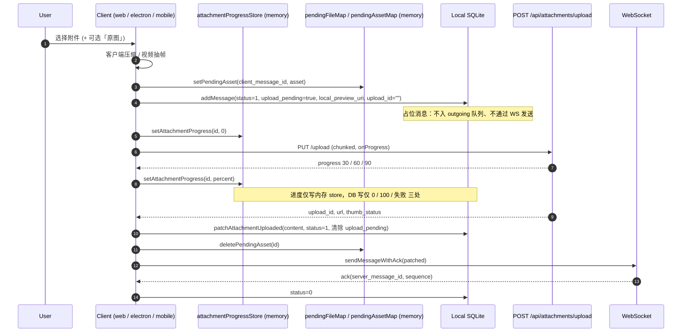

# 附件上传架构

本文档描述 Mushroom IM 在 web / electron / mobile 三端使用的统一附件上传协议、
分级限额、服务端异步缩略图流水线，以及消息和上传记录之间的绑定关系。

> 本设计仅适用于 **消息附件**。用户头像仍走 `POST /file/avatar` 旧通道，限额由
> 单独的 `MAX_AVATAR_SIZE_MB` 控制。

## 总览

```
┌─────────┐  1.initiate    ┌──────────┐  2.PUT (single | multipart)   ┌────────┐
│ Client  │ ─────────────▶ │  Server  │ ────presigned URL──────────▶ │ MinIO  │
│ (web /  │                │  /api    │ ◀──ETag(s)──────────────────  │        │
│  app)   │                │  attach- │                               └────────┘
│         │ 3.complete     │  ments   │
│         │ ─────────────▶ │          │ ─────statObject 复核大小──▶  MinIO
│         │ 4.bind 绑定到  │          │
│         │   消息  ──────▶│          │ 异步入队 → thumbnail_worker
│         │                │          │ ◀── WS attachment_updated (推送 thumb_url)
└─────────┘                └──────────┘
```

## 分级附件限额

由 `server/.env` 配置、`GET /api/config/limits` 下发；客户端本地仅作为兜底。

| 类别  | env 变量             | 默认上限 |
| ----- | -------------------- | -------- |
| image | `MAX_IMAGE_SIZE_MB`  | 30 MB    |
| video | `MAX_VIDEO_SIZE_MB`  | 300 MB   |
| audio | `MAX_AUDIO_SIZE_MB`  | 100 MB   |
| voice | `MAX_VOICE_SIZE_MB`  | 50 MB    |
| file  | `MAX_FILE_SIZE_MB`   | 200 MB   |
| 头像  | `MAX_AVATAR_SIZE_MB` | 5 MB     |
| 文本  | `MAX_TEXT_LENGTH`    | 2000 字  |

客户端通过 `@mushroom/shared` 的 `detectAttachmentCategory({ mimeType, name, isVoice })`
推断类别；语音消息必须显式传 `isVoice: true`。

## 协议

### `POST /api/attachments/initiate`

入参（节选）：

```json
{
  "filename": "scene.mp4",
  "size": 1234567,
  "mime_type": "video/mp4",
  "category": "video",
  "width": 1280,
  "height": 720,
  "duration_ms": 8200
}
```

服务端返回 `mode: "single" | "multipart"`：

- **single**：`size < UPLOAD_MULTIPART_THRESHOLD_MB`；返回单个 presigned PUT URL。
- **multipart**：返回 `upload_id` + 每个 part 的 presigned URL（默认 5 MB / part）。

### 客户端分片上传

由 `@mushroom/shared/uploader/ChunkedUploader` 实现，三端共享：

- 并发：`UPLOAD_CHUNK_CONCURRENCY`（默认 3）。
- 重试：`UPLOAD_CHUNK_MAX_RETRIES`（默认 3，指数退避）。
- presigned URL 有效期：`UPLOAD_PRESIGNED_EXPIRES_SECONDS`（默认 1 小时（3600s））。
- MinIO 必须在 CORS 中暴露 `ETag` 头（multipart complete 需要每个分片的 ETag）。

平台适配器：

- **web** / **electron**：`XMLHttpRequest` + `Blob.slice`，原生进度回调。
- **mobile (RN)**：`RNFS.read(path, length, offset, "base64")` →
  `globalThis.atob` → `Uint8Array` → `fetch PUT`；fetch 无真实进度，结束时一次性回报。

### `POST /api/attachments/complete`

- single 模式仅校验 ETag（可选）。
- multipart 模式需提交所有 part 的 `{ part_number, etag }`，服务端调用
  `composeObject`/`completeMultipartUpload`。
- 完成后服务端 `statObject` 复核实际字节数；若 > 分级上限则删除对象 + 抛错。

### 绑定到消息

`attachment_uploads.status`：

- `0 pending`：initiate 后；上传中。
- `1 bound`：消息发送时通过 `bindAttachmentToMessage` 把 `message_id` 写入并置 1。
- `2 orphan`：暂留态，未使用（cleanup job 待实现）。

服务端守卫：`bind` 时要求 `file_url IS NOT NULL`，避免空 URL 进入消息。

## 客户端图片压缩

### 设计目标

为了对齐 WhatsApp / Telegram / 微信的体验、降低上行流量与对端解码压力，
三端（web / electron / mobile）在**上传前**对图片做一次保守的客户端压缩。
压缩失败一律静默回退到原文件，不阻断发送；用户可通过"原图"开关一键
跳过压缩。

整套契约集中在 `packages/shared/src/media/imageCompress.ts`，三端通过
各自的实现文件复用同一套阈值与决策函数。

### 默认压缩档位（`DEFAULT_IMAGE_COMPRESS`）

| 参数             | 取值     | 说明                                       |
| ---------------- | -------- | ------------------------------------------ |
| `maxEdge`        | 2560 px  | 长边上限；短于不放大                       |
| `quality`        | 0.85     | JPEG 重编码质量                            |
| `skipBelowBytes` | 200 KB   | 小于该阈值且无需格式转换的图片直接跳过压缩 |
| `outputFormat`   | `"jpeg"` | 默认重编码为 JPEG；PNG 例外（见下）        |

### 各格式处理矩阵

`decideCompressStrategy({ mime, size })` 决定单张图片的处理路径：

| 输入类型                                              | 策略        | 输出               | 备注                                                                     |
| ----------------------------------------------------- | ----------- | ------------------ | ------------------------------------------------------------------------ |
| HEIC / HEIF                                           | `"convert"` | JPEG q=85          | 必须转 JPEG（接收端浏览器/原生不一定能解码 HEIC）；扩展名同步改为 `.jpg` |
| PNG                                                   | `"png"`     | PNG（resize only） | **不**重编码为 JPEG，保留透明通道；仅在长边 > 2560 时缩放                |
| JPEG                                                  | `"jpeg"`    | JPEG q=85          | resize + 重编码；自然丢弃 EXIF（含 GPS）                                 |
| GIF                                                   | `"skip"`    | 原文件             | 保留动画                                                                 |
| WebP / AVIF / SVG / 其他                              | `"skip"`    | 原文件             | 不解码、不重编码；交给服务端原样转发                                     |
| 任意上述格式且 `size < skipBelowBytes` 且无需格式转换 | `"skip"`    | 原文件             | 小图直接发，避免无谓重编码                                               |

**EXIF / Orientation 处理**：

- Web / Electron：`createImageBitmap(blob, { imageOrientation: "from-image" })`
  在解码时按 EXIF Orientation 翻转，重编码到 canvas 后**像素已经是正向**，
  再写出 JPEG 时不带 EXIF，接收端无需再处理。
- Mobile：`react-native-compressor` 内部同样按 EXIF 旋转后再编码输出。
- 结果：客户端压缩的图片对**所有**接收端表现一致，不再有 iOS 拍照 90°
  侧躺问题；同时去除 GPS / 拍摄时间等隐私字段。

### 各端实现入口

| 端             | 文件                                     | 关键依赖                                                                                                                                                                     |
| -------------- | ---------------------------------------- | ---------------------------------------------------------------------------------------------------------------------------------------------------------------------------- |
| web / electron | `apps/web/src/media/compressImage.ts`    | 动态 `import("heic2any")` 解码 HEIC；`createImageBitmap` + `OffscreenCanvas`（Safari < 16.4 fallback `HTMLCanvasElement`）做 resize / 重编码                                 |
| mobile (RN)    | `apps/mobile/src/media/compressImage.ts` | `react-native-compressor` 的 `Image.compress({ output: "jpg"\|"png", maxWidth, maxHeight, quality })` 一体完成 resize 与 HEIC→JPG；`react-native-fs` `stat` 重算压缩后字节数 |

HEIC 解码在 web 端走动态 `import`，避免 `heic2any` 600KB 包体进入首屏；
仅当用户实际选了 HEIC 图片时才会按需加载。

### "原图"开关 UX

| 端             | 位置                                                                 | 触发流程                                                                                                                                                           |
| -------------- | -------------------------------------------------------------------- | ------------------------------------------------------------------------------------------------------------------------------------------------------------------ |
| web / electron | 选图后弹出的「底部图片预览面板」内的 antd `Checkbox`（对齐微信桌面） | 用户点回形针 → 选图 → Composer 底部出现预览面板（缩略图 + 文件名 + 大小 + "原图(xxMB)"）→ 在面板内勾选"原图" → 点击"发送"或回车确认 → 走原图通道；点击"取消"则丢弃 |
| mobile         | `AttachmentSheet` 底部"原图（不压缩）"勾选行                         | 用户点击 + → sheet 内先勾选"原图"→ 再点"相册"/"相机"/"文件"                                                                                                        |

**重置语义**（对齐微信）：

- Web / Electron：开关只在「图片预览面板」的生命周期内有效；
  发送成功或点击取消关闭面板时一并复位。失败现以**消息气泡内的 Pending
  Attachment Bubble** 展示（半透明预览 + 红色刷新按钮），用户点气泡上的
  刷新即可重新走上传，详见下方 [失败处理 & 重试（Pending Attachment Bubble）](#失败处理--重试pending-attachment-bubble)。
- Mobile：开关**仅在附件发送成功后**自动复位为关闭；
  上传失败或重试期间保留用户意图，在 `message-actions.ts` 内
  `sendPreparedMessage` resolve 之后才 `state.setSendImageAsOriginal(false)`。

### 限额校验时机

图片附件的最终尺寸守卫**只在压缩后做一次**：

- Web Composer 在判定为图片且未勾选"原图"时**主动跳过预压缩的
  `file.size > maxBytes` 校验**，让大尺寸原图（例如手机直出 8MB JPEG）
  也能进入压缩流水线；
- 真正的强制校验由 `useChatOutgoing.ts` 在压缩**后**调用
  `attachmentSizeExceeded` 触发。
- Mobile 端无单独的 pre-check；`uploadMobileFile` 内部基于压缩后大小走
  分级限额。

行为对齐 WeChat 静默压缩，不弹"图片过大"中间态。

### `original_size` 字段

在客户端实际压缩**且**已知原始字节数（> 0）时，消息 content 写入
`original_size`（压缩前字节数）。该字段：

- 在 `MessageFileContent` 中可选（`packages/shared/src/types/models.ts`）；
- `size` 字段始终代表服务端实际持久化的字节数（即压缩后或原图）；
- 当前所有接收端 UI 未消费 `original_size`，预留给未来"已压缩"角标 / 排查工具使用；
- 服务端宽松接收，不参与缩略图与转发逻辑。

### 与缩略图流水线的关系

客户端压缩与服务端缩略图流水线相互独立：

- 服务端 `thumbnail_worker` 始终对**最终入库的图片对象**生成
  `thumb`（256² cover）与 `preview`（1280 长边）；
- 因此即便客户端发送的是原图，缩略图仍然由服务端按相同档位生成；
- 客户端压缩的输入对服务端透明，服务端不关心"这张图是否压过"。

### 失败与回退

- HEIC 解码失败 / `createImageBitmap` 抛错 / canvas 编码失败 / RN compressor 抛错：
  统一回到 `passThrough(input)`，原文件原样上传，并在客户端日志记录 `warn`。
- 视频首帧抽取（见下一节）同样 best-effort，失败时仅 `thumbnail_upload_id`
  缺失，不影响视频本体发送。

> **已落地（UX）**：web / electron 的"原图" checkbox 已从 Composer 主行
> 移除，改为「图片预览面板」内的两步发送流程（选图 → 预览 + 原图开关 →
> 确认发送），对齐微信桌面。实现见
> `apps/web/src/components/chat/composer/PendingImagePreviewCard.tsx` 与
> `apps/web/src/components/chat/Composer.tsx`。mobile 端原本就在
> `AttachmentSheet` 内显示，无需调整。

## 缩略图流水线

### 图片（服务端 `sharp` 异步）

`thumbnail_worker`（内存队列，并发 2）在 `completeAttachmentUpload` 成功后入队，
生成两档：

- `thumb`：256 × 256 内（cover 裁剪）。
- `preview`：长边 1280（保留宽高比）。

两个产物分别作为独立 MinIO 对象（私有 bucket `attachments`，预签名 GET 有效期
`UPLOAD_PRESIGNED_EXPIRES_SECONDS`），
对应 `MessageFileContent.thumb_url` / `preview_url`，并通过
`WS attachment_updated` 推送给消息所在的全部接收者。

`thumb_status` 在消息 content 中的状态机：

- `pending`：服务端正在生成。
- `ready`：已生成；客户端展示 thumb/preview。
- `failed`：生成失败；客户端回退到原图。
- `none`：不需要缩略图（非图片，且没有 thumbnail_upload_id）。

### 视频（客户端首帧）

服务端不解码视频。客户端在发送消息前先生成首帧并独立走一遍附件上传协议，
得到 `thumbnail_upload_id`，与主视频附件一起绑定到同一消息：

- **web / electron**：`apps/web/src/media/extractVideoThumbnail.ts`，使用
  `<video>` + `<canvas>.toBlob` 抽取首帧；在 Composer 选择视频时立即生成
  本地预览。
- **mobile (RN)**：`apps/mobile/src/media/extractVideoThumbnail.ts`，封装
  `react-native-create-thumbnail` 的 `createThumbnail`。

视频展示时 `MessageFileContent.thumb_url` 即为该首帧附件的 URL。

## WebSocket 实时事件

`attachment_updated` payload：

```json
{
  "messageClassify": "attachment_updated",
  "upload_id": "...",
  "message_id": "server msg id",
  "thumb_url": "...",
  "preview_url": "...",
  "thumb_status": "ready",
  "width": 1280,
  "height": 720
}
```

- 服务端用 `wsServer.dispatchToUser` 分发给会话内所有在线设备。
- web 在 `apps/web/src/ws/handlers/attachmentUpdatedHandler.ts` 处理，直接调用
  `db:update-message-attachment` 单点写入本地缓存。
- electron 通过 preload `db:update-message-attachment` 写主进程 SQLite。
- mobile 在 `MobileAppController.handleAttachmentUpdated` 中通过
  `repository.listMessages` 定位 `upload_id`，合并 thumb 字段后回写。

## 安全 / 资源约束

- Express JSON `limit: '128kb'`：HTTP 入口只走小负载（控制平面）。
- WS `maxPayload: 64 * 1024`：实时事件入口同样不允许走大消息体。
- 旧的 `POST /file/attachment` multipart 端点已移除，无 fallback。

## URL 自愈

私有 bucket 的预签名 URL 有效期由 `UPLOAD_PRESIGNED_EXPIRES_SECONDS` 决定
（默认 1 小时（3600s）），缓存到客户端 SQLite 的旧消息在用户长时间不打开时会过期。
`` / `<Image onError>` / `<video onError>` / `<Video onError>`
会调用：

```
POST /file/attachment/refresh-urls
{ "upload_ids": ["..."] }
```

服务端通过 `attachment_url_resolver.refreshAttachmentUrls` 重新签发 `url`、
`thumb_url`、`preview_url` 并返回 `thumb_status`。

- **web**：`apps/web/src/http/refreshAttachmentUrls.ts` 采用 **80ms 微批合并**
  （`MICRO_BATCH_MS=80`，`MAX_BATCH_SIZE=100`）：短窗口内的多个单 id 请求会被合并
  成一次 `POST /file/attachment/refresh-urls`；ids 数量超出上限时自动按 100/批
  分片。命中 Electron 主进程后通过 `db:update-message-attachment` 回写本地缓存。
- **mobile**：`apps/mobile/src/services/refresh-attachment-urls.ts` 使用同一套
  80ms 微批 + ≤100/批 分片策略；刷新成功后，调用方传入的 `messageIds` 映射
  （`upload_id → client_message_id|server_message_id`）触发
  `apps/mobile/src/data/repo/refresh-attachment-persist.ts` 直接更新
  `mobile_messages.payload` JSON 中对应附件的 `url`/`thumb_url`/`preview_url`/
  `thumb_status`。这样 TTL（默认 1h）内冷启动不再重复自愈。
- **会话级预刷新（A 方案）**：进入会话时（`activeConversationId` 切换或消息
  加载完成），客户端会把首屏可见的最后 50 条消息中的附件 `upload_id` 一次性
  汇总（去重，含 `thumbnail_upload_id` 与 merged-forward 嵌套消息），通过同一
  微批通道发起预刷新，避免每张图片各发一次 `refresh-urls`。
  - Web 入口：`apps/web/src/components/chat/ChatWindow.tsx` 内
    `useEffect([activeConversationId, messages])`。
  - Mobile 入口：`apps/mobile/src/app/controller/effects/useMobileUiStateEffects.ts`
    内基于 `activeMessages` 的 effect。
  - 收集工具：`packages/shared/src/utils/message-content.ts` 的
    `collectAttachmentUploadIds(messages, onAttachment?)`。

### 视频附件的特殊处理

视频消息的封面与播放分别走两条独立链路，都已接入自愈：

- **气泡封面**：只渲染服务端缩略图（`content.thumb_url` / `preview_url`），
  缺失时显示「灰底 + ▶ 播放图标」占位；**不再**使用 `<video preload="metadata">`
  / `<Video>` 拉远端整段 mp4 当封面，避免预签名 URL 过期带来的黑框 / 403，
  以及为取一帧而拉整段视频的流量浪费。封面 URL 过期沿用 `` /
  `<Image onError>` 自愈链路。
- **全屏播放**（web `VideoPlayerModal` / mobile `VideoPreviewOverlay`）：
  `<video onError>` / `<Video onError>` 触发一次 `refresh-urls`，拿新 URL
  替换 `src` 重试一次；二次失败显示「视频已失效」错误态 + 「重试」按钮。
  本地 `file://` / `blob:` URL 不走自愈（属文件损坏而非过期），直接进入
  错误态。`uploadId` 通过 `onOpenVideoPlayer` / `previewVideo` state 从气泡
  侧透传，缺失时仅维持旧行为兜底。

## 缩略图 Recovery

服务端启动时 `recoverPendingThumbnails(500)` 扫描所有 `thumb_status=pending`
的图片附件并重新入队，避免 worker 进程在生成中途崩溃后任务永久卡住。
硬错误（如解码失败）会写回 `thumb_status=failed`，客户端回退到原图。

## MinIO 部署提示

### CORS（浏览器分片直传必备）

ChunkedUploader 走 PUT 直传，需要在 attachments bucket 上放开 ETag 暴露：

```sh
mc alias set myminio https://minio.example ACCESS SECRET
mc anonymous set none myminio/attachments  # 严格私有，禁止匿名读写

cat > /tmp/cors.json <<'JSON'
[
  {
    "AllowedOrigins": ["https://your-web-origin"],
    "AllowedMethods": ["PUT", "GET", "HEAD"],
    "AllowedHeaders": ["*"],
    "ExposeHeaders": ["ETag"],
    "MaxAgeSeconds": 3600
  }
]
JSON
mc admin bucket cors set myminio/attachments /tmp/cors.json
```

> 注意：`ExposeHeaders` 必须包含 `ETag`，否则浏览器分片完成后无法读取分片
> ETag，`completeAttachmentUpload` 会失败。

### 升级 / 旧 bucket 迁移

旧版本若曾把 attachments 设为公开读，需要回收：

```sh
mc anonymous set none myminio/attachments
```

不迁移历史数据；旧消息中的旧 URL 会通过上文 URL 自愈机制重新签发。

## 已知局限 / TODO

- RN 适配器 fetch 模式下没有分片内进度，仅在分片完成时回报。
- 移动端 voice 通道目前直接走 ChunkedUploader（与图片/文件共用）；旧的 Android Kotlin
  `MushroomVoiceRecorderModule.uploadFile` multipart 路径仅保留给头像。
- **R4（暂缓）**：WS `maxPayload: 64KB` 限制对 reactions / typing 事件足够，
  但若未来需要通过 WS 直推大型 system message payload，需要单独评估上限。

## 孤儿清扫（attachment_uploads）

由 `server/src/storage/attachment_orphan_cleanup.ts` 提供的后台 job 周期性地
回收"已 initiate / 已 complete 但始终未绑定到消息"的上传记录，避免 MinIO 与
`attachment_uploads` 表无界增长：

- 触发条件：`status = 0 (PENDING_BIND)` 且 `created_at < NOW() - ATTACHMENT_ORPHAN_TTL_HOURS`。
- 每轮按 `ATTACHMENT_ORPHAN_CLEANUP_BATCH` 批量取候选行（仅读取，不持事务锁）。
- 对每条记录：
  1. 若 `upload_mode = multipart` 且 `multipart_upload_id` 非空，先 `abortMultipart`（失败仅 warn）。
  2. 删除主对象 `object_name`（失败抛出，保留行待下一轮重试，避免 DB 与 MinIO 不一致）。
  3. best-effort 删除 `thumb_object_key` / `preview_object_key`。
  4. `markDeleted` 走乐观条件 `AND status <> 2`，并发安全。
- 周期：`ATTACHMENT_ORPHAN_CLEANUP_INTERVAL_MS`（默认 1h），进程退出由 lifecycle 钩子停止。

> 撤回消息（`recallMessage`）不再直接调用 MinIO 删除，而是入队
> `attachment.delete` outbox 事件（见 `docs/architecture/messaging.md`），
> 失败由 outbox 重试/死信兜底；本 job 只是兜底回收"未绑定"孤儿。

## 失败处理 & 重试（Pending Attachment Bubble）

> 设计动机：对齐 **WhatsApp / Telegram / 微信**，把"上传中 / 上传失败 / 重试"
> 三种状态收敛到时间线**消息气泡内**，不再依赖 Composer 底部卡片占位。
> 群消息洪水时，Composer 卡片容易被新消息推走、且与"消息"语义割裂；
> 气泡内表达让失败附件成为可滚动、可长按、可重试的一等公民。

### 两阶段发送时序



### 失败语义

- 上传失败 → `content.upload_error = <message>`、`status = -1`、保留
  `local_preview_uri` 与 `pendingFileMap/pendingAssetMap` 中的原始文件；
  不入 outgoing 队列（避免重试循环上传同一个已失败的请求）。
- WS 推送失败 → 走原有 outgoing 队列后台 auto-retry，`content.upload_id` 已就绪。
- UI：`PendingAttachmentBubble` 在 status === -1 或 `upload_pending=true` 时
  渲染半透明预览 + 中央红色刷新按钮，点击触发 `handleRetryMessage`
  (web) / `handleRetryAttachment` (mobile)。
- 错误文案：写入 `content.upload_error`，不写 `outgoing_messages.last_error`
  （上传阶段失败时还没有 outgoing 行），重试成功后随 content 一起被
  覆写为干净值。

### 进程刷新行为

`pendingFileMap` / `pendingAssetMap` 是**模块级内存**，进程重启即丢失
（对齐 WhatsApp 行为）：

- 失败消息行仍保留在本地 DB（status=-1, upload_error 持久化）。
- 用户点击重试时若 asset 已丢失 → 抛出 `attachmentRetryFileMissing`
  toast（"原始文件已丢失，请重新选择文件发送"），并保留失败气泡。

### 数据流约束

- `upload_pending` / `upload_progress` / `local_preview_uri`
  / `local_thumbnail_uri` / `upload_error` **仅本地**字段；
  - `MessageFileContent` 在 `packages/shared/src/types/models.ts` 标注；
  - 通过 WS 发送的载荷必须为 `false / undefined`；服务端宽松忽略；
  - `patchAttachmentUploaded` (web `useChatOutgoing.handleSendFileMessage`
    第 4 步 / app-core `controller.patchAttachmentUploaded`) 负责在最终 content
    中清掉这些字段。
- 进度仅写 `attachmentProgressStore` (内存) — 0 / 100 / 失败三处由
  上传流程显式触发 DB 写。
- 重试**不会新增**消息行：复用同一 `client_message_id` 走两阶段流程，
  避免重复气泡。

### 平台差异

| 维度         | web / electron                                             | mobile                                                                           |
| ------------ | ---------------------------------------------------------- | -------------------------------------------------------------------------------- |
| 原始文件句柄 | `File` (Web File API)                                      | `{uri, name, type, size}` (RN asset 描述)                                        |
| 预览 URI     | `URL.createObjectURL(file)` (`blob:...`)                   | `asset.uri` (`file://...`，`<Image>` 可直接渲染，无需 copy)                      |
| Pending 存储 | `apps/web/src/hooks/pendingFileMap.ts`                     | `apps/mobile/src/services/pendingAssetMap.ts`                                    |
| 进度 store   | `apps/web/src/hooks/attachmentProgressStore.ts`            | `apps/mobile/src/services/attachmentProgressStore.ts`                            |
| 气泡组件     | `apps/web/src/components/chat/PendingAttachmentBubble.tsx` | `apps/mobile/src/features/chat/MessageBubble.tsx` 内的 `PendingAttachmentBubble` |
| 写库 API     | `db:update-message-status` (IPC 扩展支持 content patch)    | `controller.patchAttachmentUploaded` / `markAttachmentUploadFailed`              |
| 重试入口     | `useChatOutgoing.handleRetryMessage`                       | `message-actions.ts` 内 `handleRetryAttachment`                                  |

### 回归测试清单（建议手测）

1. **弱网中断**：上传到 50% 时禁网 → 气泡显示失败 + 刷新按钮 → 恢复网络 →
   点刷新 → 上传成功 → 气泡变为正常已发送态。
2. **应用 kill**：上传中杀掉 App → 重启后失败气泡仍在 → 点重试 → toast
   "原始文件已丢失" → 仍可长按删除该气泡。
3. **重试再失败**：失败 → 重试 → 再次失败 → 气泡仍渲染失败态，错误文案更新。
4. **视频附件**：抽帧成功 → 占位气泡显示本地首帧 → 上传失败 → 刷新按钮位于首帧之上。
5. **群洪水**：上传中持续有他人新消息插入 → 上传气泡随聊天流上滚 → 完成时
   `last_message_time` 更新到原 created_at，不影响排序。

### 失败附件三态 UX（2026-05）

为了在"上传/网络失败"与"原始文件已找不回"两种状况之间区分用户应该做什么，
`PendingAttachmentBubble` 把失败渲染细分为：

| 态                     | 触发条件                               | 气泡按钮               | 行为                                                                                                                                        |
| ---------------------- | -------------------------------------- | ---------------------- | ------------------------------------------------------------------------------------------------------------------------------------------- |
| 上传中                 | `upload_pending=true`                  | 圆形进度 %             | 进度仅写内存 store                                                                                                                          |
| 上传失败（可重试）     | `status===-1 && !local_source_missing` | 红色刷新               | 从 outbox / pendingMap 取回 ref → 复用同一 cid 走两阶段                                                                                     |
| 本地源丢失（必须重选） | `status===-1 && local_source_missing`  | "重新选择文件"上传图标 | Web 弹临时 `<input>`、Mobile 按 mime 自动分流（image/video → 相册；其它 → 文件选择器）；用户选完文件后 → 删旧失败消息 → 走 `handleSendFile` |

`local_source_missing` 由 `controller.markAttachmentLocalSourceMissing`
在重试时检测到 ref 丢失后写入；它同时清空 `upload_progress` / `upload_error`，
避免气泡上同时出现"百分比"+"错误文案"。

#### 删除失败草稿

失败本地草稿（`status===-1 && !server_message_id && type===2`）允许直接删除，
**无二次确认**（与 WhatsApp / Telegram 的"未发出消息"一致）：

- 入口：长按气泡 → `MessageContextMenu` 在该态下只渲染单个"删除"项，且
  隐藏快捷反应条（消息还没在服务端落地，反应没有意义）。
- 串清范围：`local_messages` / `outgoing_messages` / outbox 的
  `local_source_ref` + `local_preview_ref` / `attachmentProgressStore` / Web
  blob URL（`URL.revokeObjectURL`）。
- 入口实现：
  - `@mushroom/app-core`：`controller.deleteFailedLocalAttachmentMessage`
    （供 Mobile 调用）；内部走 `MessageSendService.deleteFailedLocalAttachmentMessage`，
    SQL 守卫 + `attachmentStore.delete` × N + `publishSnapshot`。
  - Web/Electron：未走 app-core，手写等价 5 步在
    `useChatOutgoing.handleDeleteFailedMessage`，对接 IPC
    `db:delete-local-message`（主进程 SQL 再加一道 `server_message_id IS NULL`
    守卫），并通过 `message-sync` 广播 `removedClientMessageIds` 让其它窗口同步。
- 不动服务端：消息从未上链，无需调撤回 API。

#### 平台差异（重选 / 删除）

| 维度         | web / electron                                                       | mobile                                                                        |
| ------------ | -------------------------------------------------------------------- | ----------------------------------------------------------------------------- |
| 重选文件入口 | 临时 `<input type=file accept=image/* \| video/* \| audio/* \| */*>` | `pickFromGallery()` / `pickFileAttachment()` 按 mime 分流                     |
| 重选后语义   | 用户**选完文件**才删旧消息，再调 `handleSendFileMessage(file)`       | 同上；删除走 `controller.deleteFailedLocalAttachmentMessage`                  |
| 用户取消重选 | 静默保留旧失败消息                                                   | 同上                                                                          |
| 删除调用栈   | `useChatOutgoing.handleDeleteFailedMessage`（无 app-core）           | `actions/chat/message/attachments.ts.handleDeleteFailedAttachment` → app-core |
| 上下文菜单   | `useMessageContextMenu` 在失败附件分支只返回 `delete-failed`         | `MessageContextMenu.isFailedDraft` + `onDeleteFailedMessage` 同效             |

## 本地附件 Outbox 与启动恢复（2026-05）

主流 IM（WhatsApp / Telegram / WeChat）的"附件失败仍可重试且气泡缩略图始终可见"的关键在于：客户端在发起上传前，**先把原文件 + 缩略图持久化到自有存储**（不依赖系统相册 URI / 临时 `File` 引用），消息内只存"引用键"。下面是 mushroom-app 的对应设计。

### 抽象

`@mushroom/app-core` 提供 `LocalAttachmentStore` 接口：

| 方法                                              | 语义                                                |
| ------------------------------------------------- | --------------------------------------------------- |
| `persist({ clientMessageId, slot, source, ... })` | 把原文件 / 缩略图落到自有存储，返回 ref 字符串      |
| `get(ref)`                                        | 取回内容（Blob / file://URI），供 UI 渲染或重试上传 |
| `release(ref)`                                    | ACK 成功后释放原文件（缩略图保留供滚动 / 转发预览） |
| `sweep(activeRefs)`                               | 启动时清理孤儿条目                                  |

`createMobileAppController({ attachmentStore })` 在初始化时注入；未注入则回退到 `NoopLocalAttachmentStore`，所有方法 best-effort 返回空。

### 各端实现

- **Mobile**：`apps/mobile/src/services/outbox-store.ts` 基于 `react-native-fs`，写到
  `<DocumentDir>/users/<uid>/outbox/<clientMessageId>/{source.<ext>,thumb.jpg}`。ref = **绝对路径字符串**。
- **Electron**：渲染进程不能直接写 FS，因此在主进程
  `apps/electron/src/main/outbox.ts` 注册 IPC handler，写到
  `<userData>/users/<uid>/outbox/<clientMessageId>/{source.<ext>,thumb.jpg}`，
  与 Mobile 路径布局对齐。ref 同样是主进程绝对路径，由 preload 透传给渲染进程。
- **Web（纯浏览器）**：`apps/web/src/services/outbox-store.ts` 在检测不到
  `window.electronAPI.outboxPut` 时退回 IndexedDB（`mushroom-outbox` /
  `attachments`），带 **500MB LRU**（`lastAccessedAt` 升序删除）。ref 形如
  `idb:<uid>:<clientMessageId>:<slot>`。

### 消息 content 字段

`MessageFileContent` 在 `packages/shared/src/types/models.ts` 扩展：

| 字段                                        | 含义                                                            |
| ------------------------------------------- | --------------------------------------------------------------- |
| `local_source_ref`                          | 原文件 ref；ACK 后释放                                          |
| `local_preview_ref`                         | 缩略图 ref；长期保留（除非孤儿被 sweep）                        |
| `local_preview_kind`                        | `"image" \| "video" \| "audio" \| "file"`，决定占位气泡渲染策略 |
| `local_source_missing`                      | 启动恢复检测到 ref 失效时置 `true`，UI 提示"重新选择文件"       |
| `original_file_name` / `original_file_size` | 重试时从 outbox 重建 `File` / `PendingMobileAsset` 需要的元数据 |

### 写入时机

1. 用户选择附件 → **先 `persistLocalAttachment`** 写入 outbox。
2. 拿到 `sourceRef` / `previewRef` 后才 `createOptimisticPendingAttachmentMessage`，
   把 refs 写入 `content`。
3. 上传阶段任何失败都不会丢源文件，气泡缩略图始终可渲染。

### ACK 后释放

`OutgoingRetryService.confirmMessageAck` 在 status: 0 入库后调用
`attachmentStore.release(local_source_ref)` 释放原文件。`local_preview_ref`
保留供后续滚动 / 转发预览复用。

### 重试时回退取源

- **Mobile**：`apps/mobile/src/actions/chat/message/attachments.ts:ensureRetryAsset()`
  在 `pendingAssetMap` 缺失时通过 `RNFS.stat(local_source_ref)` 重建 `PendingMobileAsset`。
- **Web/Electron**：`apps/web/src/hooks/useChatOutgoing.ts:handleRetryMessage`
  在 `pendingFileMap` 缺失时调 `outbox.get(ref)`，把返回 Blob 包成新 `File` 写回 in-memory map。
- 两端在 outbox 也无内容时调用 `markAttachmentLocalSourceMissing` → 状态 -1 +
  `content.local_source_missing=true` → 气泡渲染"原始文件已丢失，请重新选择文件"。

### 启动恢复

`StartupRecoveryService.recover()`（Mobile 通过 `MobileAppController.runStartupRecovery`
暴露；Web/Electron 在 `useChatOutgoing.runStartupRecovery` 中等价实现）做四件事：

1. 扫描所有 `outgoing_messages`，把 `status:1`（发送中，但进程已重启 → 不会有人 ACK）
   归位为 `status:-1`，并清除 `upload_pending` / `upload_progress`，让 UI 立即停下转圈。
2. 对每条仍是 `status:1 / -1` 的附件消息，遍历 `local_source_ref` / `local_preview_ref`，
   调 `attachmentStore.get(ref)` 检查存在性；任一缺失则置 `local_source_missing=true`。
3. 汇总所有仍被引用的 refs，调 `attachmentStore.sweep(activeRefs)`，删除存储中
   的孤儿条目（IndexedDB 老条目 / 主进程残留目录）。
4. 一次 `publishSnapshot()` 把恢复后的状态推给 UI。

调用时机：

- **Mobile**：`useMobileRuntimeEffects` 在 bootstrap 完成后 5s 触发，避开冷启动 IO 压力。
- **Web / Electron**：`useChat.ts` 在 `getWSClient()` 之前 `await runStartupRecovery()`，
  保证 status:1 旧消息不会被当成"正在发送"被 resend 流程误处理。

### 与"自动重发"边界

启动恢复只重建 UI 状态。真正"网络回来后自动重发"由
`OutgoingRetryService.listRetryableOutgoingMessages` + 各端的 retry poller（Web 是
`OUTGOING_RETRY_POLL_MS` 轮询，Mobile 是 AppState 变更 + WS reconnect）触发，复用
`local_source_ref` 重建上传源即可，无需用户重新选文件。

### 缩略图档位（THUMBNAIL_IMAGE_COMPRESS）

写入 outbox `preview` slot 时**必须使用缩略图档位**，而不是把上传用的图片
原封不动复制一份：

| 用途            | 档位                       | 长边 | 质量 | 目标体积 |
| --------------- | -------------------------- | ---- | ---- | -------- |
| 上传给对端      | `DEFAULT_IMAGE_COMPRESS`   | 2560 | 0.85 | 视觉无损 |
| outbox 本地占位 | `THUMBNAIL_IMAGE_COMPRESS` | 512  | 0.70 | < ~50 KB |

理由：

- 浏览器渲染线程 decode 5MB 大图会卡顿，气泡列表滚动掉帧；
- IndexedDB 总配额受浏览器限制（Chrome 默认 ~60% 磁盘可用空间），写大图
  会被 LRU 频繁淘汰；
- mobile 端 RNFS 在弱网设备上 IO 也是瓶颈。

两端实现：

- **Web/Electron**：`apps/web/src/hooks/useChatOutgoing.ts` 调
  `compressImageForUpload(workingFile, THUMBNAIL_IMAGE_COMPRESS)`，把结果
  写入 `preview` slot；`local_preview_uri` 也指向这份缩略图。
- **Mobile**：`apps/mobile/src/actions/chat/message/attachments.ts` 对图片
  也走 `compressImageForUpload(input, THUMBNAIL_IMAGE_COMPRESS)`，把生成
  的 `localThumbnailUri` 作为 `preview` slot 输入。

视频附件仍走 `extractVideoThumbnail`，输出本身就是小 JPEG；语音/文件不生成缩略图。

### 安全约束（Outbox 路径校验）

由于 Web 渲染层不可信，**所有 outbox IPC 入口（put/get/delete/sweep）必须强制
路径 / 账户校验**，否则 XSS 或恶意 IPC 调用可读写到主进程文件系统的任意位置：

- **uid 不接受渲染端传入**：Electron 主进程 `apps/electron/src/main/outbox.ts`
  使用 `getCurrentUserId()` 解析当前账户，避免渲染端伪造 uid 写入其他账户
  的 outbox 目录。
- **`isInside(ref, accountRoot)` 校验**：所有以 ref 为输入的 handler 都先验证
  路径仍在当前账户的 outbox 根之下；越界直接返回 null / 静默忽略。
- **`sanitizeClientMessageId`**：`createClientMessageId()` 返回 `msg:<ts>:<rand>`，
  `:` 在 Windows NTFS / macOS HFS 文件名中非法，统一替换为 `_`；同时限制
  字符集 `[A-Za-z0-9_-]` 与长度上限 96，防御 `..`、`/`、空字节注入。
- **Mobile 同步对齐**：`MobileOutboxStore` 也做 sanitize + `isInsideRoot` 前缀
  校验（注意 root 末尾需补 `/`，避免 `/foo/outbox-evil` 被误判进 `/foo/outbox`）。

### 启动 sweep 的 active 集合

`runStartupRecovery` 在调 `sweep` 之前要把"所有仍被任何消息引用"的 refs 都
塞进 active 集合。仅遍历 `outgoing_messages` 是不够的：

- 失败态 `status=-1` 消息一旦从 outgoing 队列被消费/删除，但消息行仍存在
  `messages` 表中并持有 `local_source_ref`，sweep 时如果忽略就会把用户**仍
  能在气泡里点重试**的本地源误删，导致下次重试时 `local_source_missing=true`。

因此 Electron 端额外暴露 `attachments:list-local-refs` IPC
（`apps/electron/src/main/db/ipc/attachment-refs.ts`），用 `json_extract` 从
`messages` 表收集所有仍被引用的 `local_source_ref` / `local_preview_ref`，
与 outgoing 队列引用合并后再喂给 sweep。Mobile 端因 outbox 容量天然受限于
RNFS 文件系统，目前依赖 outgoing 队列引用即可，后续需要再补齐同等查询。
