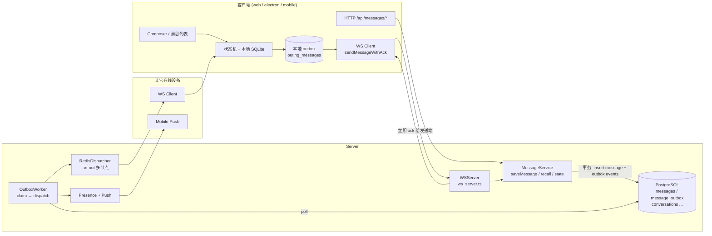
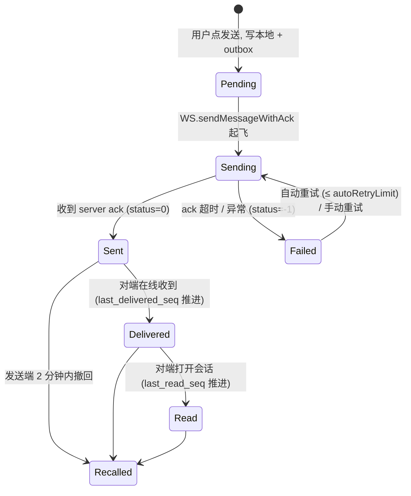
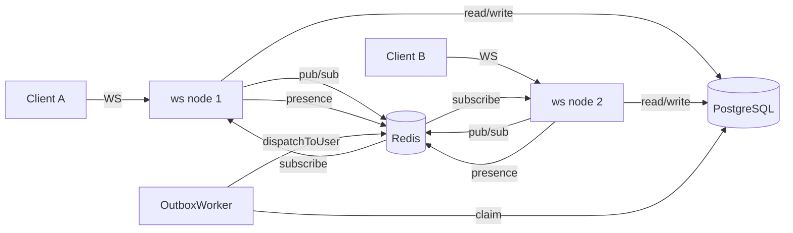
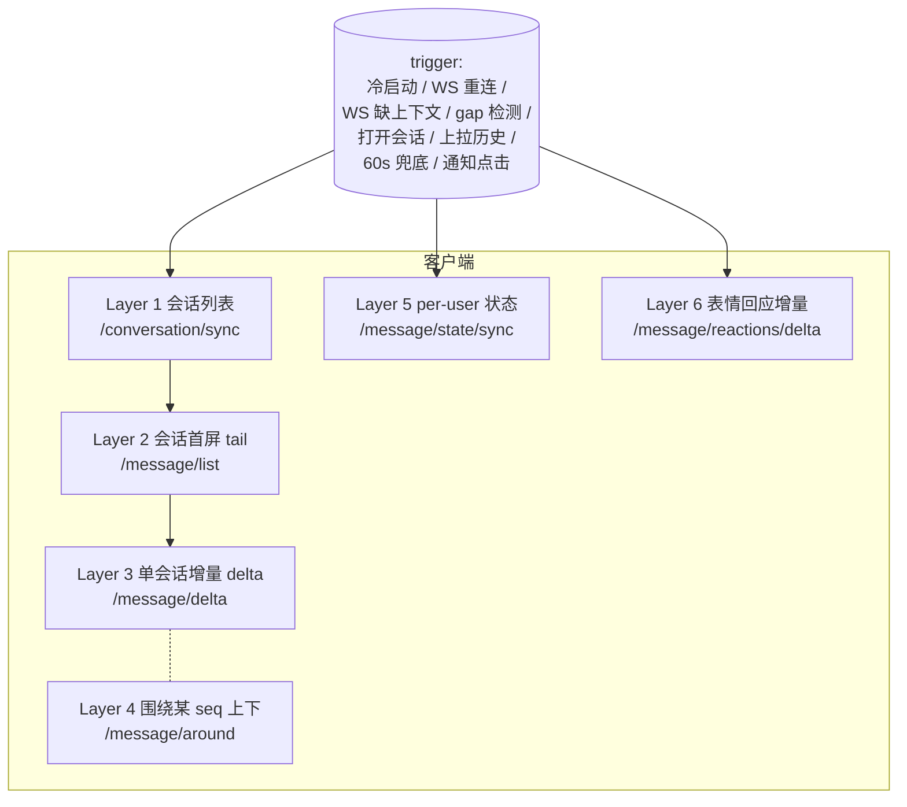

# Messaging（消息核心）模块架构设计

> 适用范围：mushroom-app 的即时消息核心子系统，覆盖 **消息发送、投递、接收、持久化、可靠性与完整性保障**。
> 本文档关注「会话消息」（文本 / 媒体 / 系统通知）。语音视频通话信令、登录鉴权、推送通道详细实现各自有独立文档。
>
> 阅读对象：需要维护或扩展该模块的架构师 / 后端 / 客户端工程师。

---

## 1. 模块概述

### 1.1 目标

- 在 Web、Electron、Mobile（iOS / Android）四端之间，借助 Server（Node + PostgreSQL + Redis）实现 **「至少一次、本端最终一致、单会话顺序可读」** 的消息投递。
- 支持在线即时下发、离线消息补拉、断网重发、推送兜底。
- 提供撤回、引用、转发、表情回应等扩展操作，其状态变更也按统一事件机制广播。

### 1.2 非目标

- **不**追求严格 exactly-once；以幂等键（`(sender_id, client_message_id)`）让重复消息在服务端折叠为同一条。
- **不**做端到端加密（链路用 TLS，落库明文，由信任服务端模型支撑）。
- **不**保证跨会话的全局顺序；只保证**单会话内单调递增的 `seq`**。
- **不**处理音视频媒体的字节流上传 / 缩略图生成（见 `docs/architecture/media-upload.md`）。

### 1.3 涉及目标

| 端                       | 角色                                                          |
| ------------------------ | ------------------------------------------------------------- |
| `apps/web`               | 浏览器 / Electron 渲染进程通用，UI + WS 客户端 + 同步引擎     |
| `apps/electron/src/main` | 主进程：本地 SQLite 持久化、Outbox 队列、媒体缓存桥接         |
| `apps/mobile`            | RN 客户端：UI + WS 客户端 + 本地 SQLite Repository            |
| `packages/app-core`      | Mobile 业务逻辑大脑：状态机、Outbox 调度                      |
| `packages/shared`        | 跨端共享类型、Outgoing 重试策略、同步引擎                     |
| `server`                 | WS 网关 + HTTP 控制器 + MessageService + Outbox Worker + Push |

---

## 2. 架构总览

### 2.1 顶层组件



### 2.2 一条消息的生命周期



> 客户端 `Message.status` 枚举：`-1` 失败 / `0` 已发送（默认成功态）/ `1` 已送达 / `2` 已读，定义见 `packages/shared/src/types/models.ts:164-188`。

---

## 3. 关键概念

| 术语                                   | 含义                                                                                                                   |
| -------------------------------------- | ---------------------------------------------------------------------------------------------------------------------- |
| `client_message_id`                    | 客户端在创建 optimistic message 时生成的 UUID，全链路追踪标识                                                          |
| `server_message_id`                    | 服务端 `messages.id`（VARCHAR(64)），入库后回传客户端用于覆盖本地 ID                                                   |
| `seq`                                  | 单会话内严格单调递增的 BIGINT，由 `ConversationRepository.nextConversationSequence` 分配；客户端排序与同步进度均依赖它 |
| `last_delivered_seq` / `last_read_seq` | `conversation_user_state` 上每用户维度的水位线                                                                         |
| Outbox（服务端）                       | `message_outbox` 表 + `OutboxWorker`，事务性 Outbox 模式，事件类型见 §10.3                                             |
| Outbox（客户端）                       | Electron 的 `outgoing_messages` 表 / Mobile 的"无 sequence 行"约定，本地待发队列                                       |
| ack                                    | WS 上 `messageClassify:"ack"` 帧，由 `sendMessageWithAck` Promise resolve / 超时 reject                                |
| Sync 增量同步                          | `GET /api/messages/delta?afterSequence=…`，重连或冷启动后拉取漏单                                                      |
| 幂等键                                 | `(sender_id, client_message_id)` UNIQUE 索引；重复保存返回已有消息                                                     |
| Lease                                  | `message_outbox.lease_expires_at`，`FOR UPDATE SKIP LOCKED` + 30s 续约，保证单事件单消费者                             |

---

## 4. 业务工作流程

### 4.1 发送（在线快路径）

```text
1. UI 调 createMessageActions.handleSendMessage (mobile)
   或 useChatOutgoing.sendText (web)
2. 业务层用 createOptimisticTextMessage 生成 Message
   - client_message_id = uuid
   - status = 0 (web) / "sending" (mobile)
   - 写入本地 SQLite local_messages + outgoing_messages（Electron）
   - 立即渲染（optimistic UI）
3. WS 客户端调 sendMessageWithAck(envelope, timeoutMs)
   - Web: apps/web/src/ws/WSClient.ts:387
   - Mobile: apps/mobile/src/services/realtime.ts:178
4. Server WSServer 收到 messageClassify="chat"
   - ws_server.ts:628 handleChatMessage
   - MessageService.saveMessage 在事务里：
     a. 按 (sender_id, client_message_id) 查重复 → 命中即复用
        (message_service.ts:256-263)
     b. nextConversationSequence 分配 seq
     c. INSERT INTO messages
     d. 推进 conversations.message_seq / last_message_*
     e. 维护成员 conversation_user_state.last_delivered_seq
     f. OutboxRepository.insertEvents 写 N 条 chat.message.deliver
        + 1 条 push.notification（同一事务，事务性 Outbox）
5. saveMessage 返回后立即回 ack 给发送端：
   {messageClassify:"ack", client_message_id, server_message_id, seq}
   (ws_server.ts:663-674)
6. 发送端 ack Promise resolve → confirmMessageAck
   - 写回 server_message_id / seq / status=0
   - 从 outgoing_messages 删除
7. OutboxWorker 异步 tick (outbox_worker.ts:111)
   - claimPending 抢占 N 条事件 (lease 30s)
   - chat.message.deliver → 重新签名附件 URL → wsServer.dispatchToUser
   - push.notification → PushNotificationService.deliverToUser
   - 失败 markRetry（指数退避 1s→60s）；超过上限 markDead
```

### 4.2 接收（在线推送路径）

```text
1. wsServer.dispatchToUser 优先调用 sendToUserLocal 本地直投（默认路径，与节点模式无关）
   - 实现：server/src/websocket/ws_server.ts dispatchToUser
   - 多节点（WS_MULTI_NODE=true）下额外 fire-and-forget redis_dispatcher.publishOnly，
     其他节点订阅 ws:deliver 后亦走 sendToUserLocal；envelope 带 sourceNodeId 自跳过
   - 单节点（默认）下 redis_dispatcher 不创建 subscriber，subscriberStatus="disabled"
2. ws 节点把事件帧写到目标 WebSocket
3. 客户端 WS 收到 messageClassify="chat" 事件
   - Web: router.ts → chatHandler.ts (apps/web/src/ws/handlers/chatHandler.ts)
   - Mobile: controller.ts:1968-1996 switch
4. 入库前若本地无对应 conversation：
   chatHandler 先 fetchRemoteConversations → fetchRemoteMessages 兜底
   (apps/web/src/ws/handlers/chatHandler.ts:23-34)
5. 写本地 local_messages（按 (conversation_id, sequence) UNIQUE 去重）
6. 推进本地 last_delivered_seq；UI 列表自动刷新
```

### 4.3 离线 / 重连后补拉

```text
1. WSClient 重连成功 (handleConnected, WSClient.ts:293)
2. orchestrator runSyncOrchestrator (apps/web/src/sync/orchestrator.ts:40)
   - 拉远端 conversations 增量
   - 对每个 conversation 拉 /api/messages/delta?afterSequence=<本地最大 seq>
   - fetchRemoteMessages: syncContext.ts:407
3. 把返回结果用同步引擎 reconciler 计算 contiguous seq
   - calculateContiguousSyncSequence (packages/shared/src/sync-engine/reconciler.ts:12)
   - 推进本地"已完整同步水位"，标记后续可见
4. 后台 backfill job 继续向上回填历史窗口
   (useChatSync.ts:298-401)
```

### 4.4 客户端失败重试

```text
1. ack 超时（默认数秒）→ catch 路径写 status=-1
   - 记录 retry_count + last_error
   - 计算 next_retry_at = computeNextRetryAt
     (apps/web/src/hooks/useChatHelpers.ts:14)
2. 调度层 retryPendingMessages 周期扫描
   - status=-1 且 next_retry_at <= now
   - retry_count < autoRetryLimit（默认 3，packages/app-core/src/controller.ts:101）
3. 走 4.1 步骤 3 重新 sendMessageWithAck
4. 超过 autoRetryLimit 后停止自动重试，等待用户手动「重试」
   (useChatOutgoing.ts:408-416)
```

### 4.5 撤回

```text
1. 客户端 message-actions.recallMessage（mobile）
   / useChatMessageActions.recall（web）
2. POST /api/messages/recall  (server/src/routers/message_router.ts)
3. MessageService.recallMessage (message_service.ts:790)
   - 事务：
     · UPDATE messages SET is_recalled=true
     · OutboxRepository.insertEvents 写 message.recall（每接收成员一条）
     · 若被撤回消息绑定了附件，同事务追加一条 attachment.delete outbox 事件
       payload: { upload_id, object_name, thumb_object_key?, preview_object_key? }
4. OutboxWorker 派发：
   · message.recall → 所有在线设备
   · attachment.delete → 内部 handler 调用 MinIO 删除主对象 / 缩略图 / 预览图
     并把 attachment_uploads.status 置为 deleted；失败走 outbox 重试 / 死信
5. 客户端 messageRecallHandler 更新本地 is_recalled，UI 替换为占位
```

> 说明：附件删除从"事务外 best-effort"改为 outbox 补偿事件，确保 DB 与 MinIO
> 不会因为单次 IO 失败而出现孤儿；未绑定到消息的孤儿另由
> `attachment_orphan_cleanup` 后台 job 周期清理，详见
> `docs/architecture/media-upload.md`。

---

## 5. 策略

### 5.1 顺序与可见性

- 单会话顺序：仅依赖服务端分配的 `messages.seq`（UNIQUE `(conversation_id, seq)`，`server/src/db/migrate.ts:328-329`）。
- 客户端按 `seq` 升序渲染；同一 `seq` 不可能并存。
- 跨会话不保证顺序——`conversations.last_message_at` 仅用于会话列表排序。
- 可见性窗口：`conversation_user_state.hidden_before_seq` 控制"加入会话前的历史不可见"。

### 5.2 幂等

- **入库层**：`UNIQUE (sender_id, client_message_id)`（`migrate.ts:330-332`）。`saveMessage` 在事务前先 `findMessageBySenderClientId`（`message_repository.ts:54`），命中则直接返回原消息，避免双重 insert。
- **HTTP 控制器层**：通用 `Idempotency-Key` 中间件 `server/src/handler/idempotency.ts:55`，配合 `api_idempotency_keys` 表（`migrate.ts:312`）做 24h 窗口缓存（含响应体 hash）。
- **Outbox 投递层**：单事件由 lease 保证只被一个 worker 处理；下游客户端用 `(conversation_id, seq)` 去重，重复推送不影响最终状态。

### 5.3 重试与退避

| 层                 | 上限                                                                      | 退避公式                                                                                                             | 出处                                                                                        |
| ------------------ | ------------------------------------------------------------------------- | -------------------------------------------------------------------------------------------------------------------- | ------------------------------------------------------------------------------------------- |
| 客户端自动重试     | `DEFAULT_OUTGOING_AUTO_RETRY_LIMIT = 3`                                   | `computeExponentialBackoffMs`（`packages/shared/src/utils/backoff.ts:7`），底数 / 上限通过 `computeNextRetryAt` 注入 | `packages/app-core/src/controller.ts:101`、`useChatHelpers.ts:14`                           |
| WS 重连            | maxReconnectAttempts = 5（web）；mobile 在 `realtime.ts:477-501` 内自定义 | `reconnectDelay * 1.5^attempts`                                                                                      | `apps/web/src/ws/ConnectionManager.ts:24-25,80`、`apps/mobile/src/services/realtime.ts:477` |
| 服务端 Outbox      | 由 `policy.ts` 配置：基础 1000ms，最大 60_000ms，指数退避                 | `computeOutboxNextRetryAt`                                                                                           | `server/src/outbox/policy.ts:16`                                                            |
| 服务端 Outbox 死信 | 内部硬上限（达到 → `markDead`）                                           | —                                                                                                                    | `server/src/outbox/outbox_worker.ts:143-148`                                                |

只有「可重试错误」才走重试逻辑，判定见 `packages/shared/src/utils/outgoing-message.ts:33` `isRetryableOutgoingError`。

### 5.4 至少一次 + 客户端去重

服务端事务性 Outbox 保证 "消息已写入数据库 ⇒ 事件最终会被派发"；客户端使用 `(conversation_id, seq)` UNIQUE 索引（Electron `idx_local_messages_conversation_sequence`、Mobile 等价索引）保证 "同一条消息多次到达只入库一份"。

> Mobile 端额外通过仓库内 promise 链（`apps/mobile/src/data/sqlite-data-repository.ts` 中的 `runExclusive`）把所有写 `mobile_messages` 的入口（`upsertMessages` / `applyMessageStates` / `clearConversationMessages` / `softDeleteConversation` / `removeConversations` / `clear`）串行化，避免 WS 实时分发（`controller.handleRealtimeChatMessage`）与 pull-sync（`runMessageSyncTasks`）并发触达同一 `server_message_id` 时撞上部分唯一索引 `idx_mobile_messages_server`（症状：`[ws] onServerMessage failed ... UNIQUE constraint failed: mobile_messages.server_message_id`）。

### 5.5 已读 / 已送达水位

- 收方端在打开会话时调 `POST /api/conversations/:id/read`，服务端推进 `last_read_seq` 并写 `conversation.read` outbox 事件向发方广播。
- `last_delivered_seq` 由 `saveMessage` 主路径维护（成员在线时记为已送达；离线由后续 ack 推进）。
- 发方 UI 根据 `last_delivered_seq` / `last_read_seq` 与消息 `seq` 比较推导单条状态，工具函数 `packages/shared/src/utils/message-delivery.ts`。

**群聊已读回执（扩展）**：群聊 `markConversationRead` 写库成功后，按新增已读区间 `(prev_seq, new_seq]` 聚合作者，**仅向原作者** dispatch 一帧非持久化 `group_read`（流量 O(N) 而非 O(N²)）；不写 outbox，离线 / 断连缺失的帧由 `GET /api/conversation/:id/read-state`（`conversation_router.ts:23`）+ 客户端本地高水位缓存补齐（Electron `local_group_read_states` / Mobile `mobile_group_read_states`）。`read_receipts_visibility = 2` 时 reader 或 author 任一关闭则双向失效（不广播 / 归零）。完整协议、客户端聚合规则与回归清单见 `./group-read-and-typing.md`。

### 5.6 推送兜底

`saveMessage` 在 outbox 中同时写入 `push.notification` 事件；`OutboxWorker.deliverPushNotification`（`outbox_worker.ts:213`）调用 `PushNotificationService`（`server/src/service/push_notification_service.ts:5`）→ `PushRouter` 按 provider（FCM / 华为 / 小米）分发。详细配置见 `docs/testing/mobile-push-runtime.md`。

---

## 6. 平台落地布局

### 6.1 服务端部署拓扑



- 同一用户的多设备可分别落在不同 ws 节点；`RedisDispatcher` 通过 user 频道 fan-out。
- `OutboxWorker` 可与 ws 节点同进程也可独立部署（轮询同一张 `message_outbox` 表，依靠 lease 互斥）。
- 单节点 / Redis 不可用时 `RedisDispatcher` 退化为 `local-fallback`（同进程内派发），仅本节点用户能即时收到，其它节点用户依赖重连 + delta 拉取。

### 6.2 客户端本地数据布局

| 端              | 存储                               | 关键表 / 文件                                                                                                                                                                                         |
| --------------- | ---------------------------------- | ----------------------------------------------------------------------------------------------------------------------------------------------------------------------------------------------------- |
| Electron        | better-sqlite3，每账号一个 db 文件 | `local_messages` / `outgoing_messages` / `sync_cursors` / `sync_backfill_jobs` / `local_message_reactions` / `local_reaction_cursors`（`apps/electron/src/main/migration.ts:92,124,115,138,168,182`） |
| Web（纯浏览器） | 内存 + 服务端拉取                  | 无本地持久化，刷新即丢；依赖 `/messages/list` + `/messages/delta` 重建                                                                                                                                |
| Mobile          | expo-sqlite                        | `mobile_messages` / `mobile_conversations` / `mobile_outgoing`（约定为 `mobile_messages` 中 `status` 表达 outbox 语义），定义见 `apps/mobile/src/data/migration.ts`                                   |

> Electron 渲染层通过 `window.electronAPI`（preload）调用主进程 SQLite IPC；Web 纯浏览器场景下相同 hook 走"内存 + 即时拉取"分支。

### 6.3 文件 / 媒体附件

附件字节流与 URL 不在本文档范围；本模块只关心：

- 发送时 `messages.content.payload` 携带 `attachment_id`，由 `attachment_uploads` 表（`migrate.ts:111`）做 metadata 绑定。
- 投递时 `OutboxWorker.deliverChatMessage`（`outbox_worker.ts:180`）会调用 minio 重新签名 URL，避免投递长链接过期。详见 `docs/architecture/media-upload.md` 与 `docs/architecture/media-cache.md`。

---

## 7. 消息同步策略（三端 ↔ 服务端）

WS 主路径只承担「在线即时分发」，**最终一致性由 HTTP 同步层兜底**。本章说明三端何时同步、按哪些层级同步、如何记录进度、失败如何退避、各端实现差异。

### 7.1 同步分层模型



| 层               | HTTP 接口                          | 客户端封装                                                                                                         | 服务端实现                                                                                                                                              | 说明                                                                                                                                                   |
| ---------------- | ---------------------------------- | ------------------------------------------------------------------------------------------------------------------ | ------------------------------------------------------------------------------------------------------------------------------------------------------- | ------------------------------------------------------------------------------------------------------------------------------------------------------ |
| L1 会话列表      | `POST /api/conversation/sync`      | `packages/shared/src/api/index.ts:320-396` `syncConversations`、web `syncContext.ts:74` `fetchRemoteConversations` | `server/src/controller/conversation_controller.ts`、`conversation_repository.ts:90`（把 `s.last_delivered_seq AS last_sync_sequence` 作为同步基线下发） | 拉会话元数据 + 成员水位；每个 conversation 同时带回 `hidden_before_seq`                                                                                |
| L2 首屏 tail     | `GET /api/message/list`            | `fetchConversationTailMessages`（`syncContext.ts:462`）                                                            | `message_service.ts:116-168 listMessages`                                                                                                               | 进入会话首屏；返回 `{messages, loaded_from_sequence, max_sequence, has_more, reached_history_start}`                                                   |
| L3 单会话增量    | `GET /api/message/delta`           | `syncMessageDelta` / `fetchRemoteMessages`（`syncContext.ts:407`）                                                 | `message_service.ts:72,81 deltaSync`                                                                                                                    | 入参 `afterSequence`（默认 0，本端最大 anchor）+ `limit`（默认 200，**clamp 1..500**）；返回 `{messages, has_more, next_after_sequence, max_sequence}` |
| L4 围绕 seq      | `GET /api/message/around`          | `listMessagesAround`                                                                                               | `message_service.ts:171-218`                                                                                                                            | 用于跳转到引用消息 / 通知点击定位                                                                                                                      |
| L5 状态同步      | `GET /api/message/state/sync`      | `syncMessageStates`                                                                                                | `message_service.ts:865`，pageSize=200                                                                                                                  | favorite / pin 等 per-user 状态，cursor 翻页                                                                                                           |
| L6 reaction 增量 | `GET /api/message/reactions/delta` | `syncReactionDeltasForConversations`（`syncContext.ts:558`）                                                       | `message_controller.ts:316 listReactionDeltas`                                                                                                          | 按 `(conversation_id, sequence)` 增量；本地游标表 `local_reaction_cursors`                                                                             |

服务端在所有 list / around / delta SQL 上都强制了可见性过滤 `m.seq > COALESCE(cus.hidden_before_seq, 0)`（`message_repository.ts:150,213,334,412`），并在 `:601-618` 用 `max(join_seq, hidden_before_seq+1, 1)` 计算 `visible_from_sequence`。客户端无需自己做窗口过滤。

### 7.2 触发条件

| #   | 触发条件                                                  | 同步动作                                                                             | 出处                                                                                                                         |
| --- | --------------------------------------------------------- | ------------------------------------------------------------------------------------ | ---------------------------------------------------------------------------------------------------------------------------- |
| 1   | 冷启动 / 登录成功                                         | 全量 L1 + 优先级 tail + 历史 backfill                                                | web `useChat.ts:268 bootstrapChatSession`；mobile `controller.ts:363,527,677 syncNow`                                        |
| 2   | WS 重连成功                                               | `runSyncOrchestrator`：L1 + **仅前 10 个会话**的 L2（防止打雷） + 各会话 L3          | web `WSClient.ts:191 handleConnected` → `:293-316`；mobile `realtime.ts:303 onConnected` + AppState/NetInfo effects          |
| 3   | 收到 WS chat 但本地无该会话                               | 立即调 L1（拉这一个会话）+ L3 兜底                                                   | `apps/web/src/ws/handlers/chatHandler.ts:22-38`                                                                              |
| 4   | 收到 `conversation_sync` 事件                             | 拉会话快照（L1 单条）                                                                | `conversationSyncHandler.ts:7-37`；mobile `controller.ts:1976` → `syncNow()`                                                 |
| 5   | 新消息入库 / 更新后 reconciler 推出 `sync_gap_detected=1` | 立即 `repairConversationGaps({limit:1})`                                             | `useChat.ts:516-521`（onMessageAdded）、`:579-584`（onMessageUpdated）                                                       |
| 6   | 打开会话且 `sync_gap_detected=1`                          | `repairConversationGaps({limit:1, refreshLocalConversations:true})`                  | `useChat.ts:1013-1022`                                                                                                       |
| 7   | 上拉历史                                                  | L4 (around) 或 L3 反向回填                                                           | mobile `controller.ts:710 loadOlderMessages` / `:795 loadMessagesAround`；web `useChatMessageHistory.ts:36 loadMoreMessages` |
| 8   | **web 60s 兜底轮询**                                      | 只在 `wsUiState.status === "connected"` 且页面可见时跑；事件路径异常时的最后一道保险 | `useChat.ts:963-1011`（`FALLBACK_INTERVAL_MS = 60_000`，`:979`）                                                             |
| 9   | `visibilitychange → visible`                              | 立即触发一轮 orchestrator                                                            | `useChat.ts:1000-1005`                                                                                                       |
| 10  | mobile push 通知点击                                      | `syncNow()`（同 #4 路径）                                                            | `controller.ts:1976`                                                                                                         |
| 11  | 后台 backfill job 到期（电脑/web）                        | 扫 `sync_backfill_jobs` → 按 jobKind 派发到 L2/L3/history                            | `useChatSync.ts:298-401`                                                                                                     |

> **注**：mobile 不存在独立的「定期轮询」；它依赖 WS + AppState/NetInfo 触发的 `syncNow()` 一把全量。详见 §7.6。

### 7.3 进度 / 游标管理

#### 7.3.1 全局游标表 `sync_cursors`（Electron）

`apps/electron/src/main/migration.ts:115-122`。主键 `(scope, entity_id)`，写入入口 `database.ts:684-691 getLastSyncTime / updateLastSyncTime`，`cursor_type` 当前固定 `"time"`。

调用方使用的 `scope` 取值（web orchestrator）：

| scope            | 用途              | 出处                                   |
| ---------------- | ----------------- | -------------------------------------- |
| `contacts`       | 联系人增量        | `apps/web/src/sync/orchestrator.ts:60` |
| `conversations`  | 会话列表增量      | `orchestrator.ts:67`                   |
| `message_states` | per-user 状态增量 | `orchestrator.ts:97`                   |

#### 7.3.2 每会话进度（`local_conversations` 扩展列）

类型在 `packages/shared/src/sync-engine/types.ts:12-33 ConversationSyncProgress`：

| 字段                                          | 含义                                             |
| --------------------------------------------- | ------------------------------------------------ |
| `last_sync_sequence`                          | 已**连续**同步到的最大 seq                       |
| `last_server_sequence`                        | 最近从服务端观察到的 `max_sequence`              |
| `tail_loaded_from_seq` / `tail_loaded_to_seq` | 首屏 tail 已加载的窗口                           |
| `local_hidden_before_seq`                     | 本端可见性下限（对齐服务端 `hidden_before_seq`） |
| `history_complete`                            | 是否已回填到历史起点                             |
| `needs_backfill`                              | reconciler 计算出仍有缺口                        |
| `sync_gap_detected`                           | 收到了 seq 跳变的消息（疑似漏单）                |

读取：`database.ts:512-530 getConversationSyncProgress`；写入：`database.ts:1481-1582+ reconcileConversationSyncProgress`；mobile 等价：`apps/mobile/src/data/sqlite-data-repository.ts:969-987` + `packages/app-core/src/conversation-sync.ts:30-62 recomputeConversationSyncProgress`。

**拉取起点 anchor** 三选最大：`max(last_sync_sequence, tail_loaded_to_seq, local_hidden_before_seq)`，避免重复拉旧数据。出处：`apps/web/src/sync/syncContext.ts:43-49`、`packages/app-core/src/sync.ts:49-55`（**口径完全一致**）。

#### 7.3.3 Reconciler 核心算法

`packages/shared/src/sync-engine/reconciler.ts`：

- `:12-27 calculateContiguousSyncSequence(base, ascSequences)`：从 base 起向上扫连续 seq 上界，决定新的 `last_sync_sequence`。**只要存在跳号就停在跳号之前**，未连续部分即为"gap"。
- `:34-52 calculateTailWindow(descSequences)`：返回 `{tail_loaded_from_seq, tail_loaded_to_seq}`。
- `:54+ reconcileProgress(input)`：合并 observed server seq、reachedHistoryStart、visibleFromSequence、`local_hidden_before_seq`，**输出 `needs_backfill` 与 `sync_gap_detected` 的最终值**。
- `:107+` 当 tail 已下探到 `hidden_before_seq + 1` 时把 `history_complete=1`（测试 `packages/shared/test/sync-engine.test.mjs:107-119`）。
- `:137+ normalizeProgress` 将 DB 行转为 ConversationSyncProgress 类型。

`engine.ts`（67 行整文件）封装 `reconcileConversation(repo, conversationId, input)`，作为唯一的 reconcile 入口；`repository.ts` 定义 storage-agnostic 契约。

### 7.4 Backfill 队列（仅桌面 / web）

#### 7.4.1 表结构

`apps/electron/src/main/migration.ts:138-212 sync_backfill_jobs`：

| 字段                        | 说明                                         |
| --------------------------- | -------------------------------------------- |
| `client_conversation_id` PK | 一条会话同时只有一个待跑 job                 |
| `job_kind`                  | `tail` / `delta` / `history`                 |
| `priority`                  | 越大越先跑                                   |
| `not_before_at`             | 退避目标时刻                                 |
| `payload`                   | job-kind 相关上下文（如 history 的目标窗口） |

索引 `idx_sync_backfill_jobs_priority (priority DESC, updated_at ASC)`（`database.ts:853-855` SELECT 语句一致）。

#### 7.4.2 优先级公式

`apps/electron/src/main/database.ts:470-481`：

```
priorityBase = { tail: 300, delta: 200, history: 100 }
priority     = priorityBase + min(unread_count, 99)
```

即「未读越多的会话越先跑」，但跨 jobKind 的优先级差 ≥ 100，确保 tail > delta > history 的相对顺序不被未读量打破。

#### 7.4.3 调度循环

`apps/web/src/hooks/useChatSync.ts:298-401`：

1. 周期扫 `sync_backfill_jobs`（受 WS 状态门控，断网时停跑）。
2. 按 `(priority DESC, updated_at ASC)` 取一批。
3. 按 `job_kind` 分发：
   - `tail` → `fetchConversationTailMessages`（L2）
   - `delta` → `fetchRemoteMessages`（L3）
   - `history` → 反向历史回填（L3 反向）
4. 调用前读 `local_hidden_before_seq` 作 hiddenFloor（`:168, :197-202`），避免越过隐藏水位拉到不可见的更老消息。
5. 失败按 `BACKOFF_LADDER_MS = [30s, 2m, 10m, 1h]` 退避，**>4 次放弃**（`packages/shared/src/sync-engine/job-scheduler.ts:7-15 nextBackoffMs`）。
6. 成功后由 reconciler 重算进度；若仍 `needs_backfill`，自动 upsert 下一轮 job。

#### 7.4.4 JobScheduler（内存协调）

`job-scheduler.ts:22+`：内存 Map，key `(kind, clientConversationId)`，重复 enqueue 取**更早** deadline（避免推迟），`drainReady(now)` 仅返回 `not_before_ms <= now` 的 job 并按时间升序；fresh trigger（来自 WS 推送或用户动作）会重置 `attempts`，让退避梯回到 30s。

### 7.5 兜底机制总表

| 场景                              | 兜底路径                                                 | 出处                                              |
| --------------------------------- | -------------------------------------------------------- | ------------------------------------------------- |
| 收 chat 推送但本地无 conversation | 先 L1 拉会话 → 再 L3 兜底拉消息                          | `chatHandler.ts:22-38`                            |
| 收 `conversation_sync`            | 拉 L1 单条                                               | `conversationSyncHandler.ts:7-37`                 |
| Reconciler 检测到 seq 跳号        | 写 `sync_gap_detected=1` → 触发 `repairConversationGaps` | `database.ts:1481+`、`useChat.ts:516-521,579-584` |
| 打开会话且仍有 gap                | 进入会话首屏即调 repair                                  | `useChat.ts:1017-1022`                            |
| WS 断网期间错过事件               | 重连后 `runSyncOrchestrator` 走 L1+L2+L3 全链            | `WSClient.ts:293-316`                             |
| HTTP 失败                         | `BACKOFF_LADDER_MS` 退避，>4 次放弃                      | `job-scheduler.ts:7-15`                           |
| 事件路径完全失灵（罕见）          | web 60s 兜底轮询 + visible 立即跑                        | `useChat.ts:963-1011`                             |
| 推送（mobile）点开                | `syncNow()` 全量                                         | `controller.ts:1976`                              |
| 服务端可见性 / 黑名单             | SQL 层强制 `m.seq > hidden_before_seq` 过滤              | `message_repository.ts:150,213,334,412,601-618`   |

**条件说明**：

- web 兜底轮询**只在**连接已建立 (`wsUiState.status === "connected"`) 且 `document.visibilityState !== "hidden"` 时执行（`useChat.ts:979-998`），避免锁屏后台浪费电量。
- backfill job 调度循环**只在 WS 已连接**时跑（断网时整个循环 idle，等重连后自然恢复），避免无效请求。
- `repairConversationGaps` 默认 `limit:1`（每次只补一个会话的一个窗口），避免风暴。
- 重连首轮 tail 仅前 `INITIAL_TAIL_SYNC_CONVERSATION_LIMIT = 10` 个会话（`WSClient.ts:34`），其余进 backfill 队列异步跑。

### 7.6 三端实现差异

| 维度             | web / electron 渲染层                                                                                                          | mobile（RN）                                                                                                            |
| ---------------- | ------------------------------------------------------------------------------------------------------------------------------ | ----------------------------------------------------------------------------------------------------------------------- |
| 同步入口         | `runSyncOrchestrator()` + `WSClient.handleConnected` + 两个 WS handler 兜底 + 60s 轮询 + `visibilitychange`                    | 单入口 `controller.syncNow()`（`controller.ts:363,527,677`）+ AppState/NetInfo effects                                  |
| Backfill 队列    | SQLite `sync_backfill_jobs` 持久化 + `useChatSync.ts:298-401` 调度循环                                                         | **无持久化队列**（`packages/app-core/src/sync.ts:834` 注释明确），仅内存 `JobScheduler` + 全量 `syncNow()`              |
| 并发控制         | 会话 batch=20 + 批内 `Promise.all`                                                                                             | Worker pool `MESSAGE_SYNC_CONCURRENCY=6` + writeChain 串行 SQLite                                                       |
| 防抖 / 互斥      | 隐式（job 表 upsert 合并同 key）                                                                                               | 显式 `syncNowInflight` 互斥（`controller.ts:532-538`）                                                                  |
| Stage 编排       | 按 jobKind / priority / 退避                                                                                                   | 固定 stage：`contacts → conversations → messages → states`（`packages/app-core/src/sync.ts:700+ runMobileSync(stage)`） |
| 重连首轮 tail    | 限前 10 个会话                                                                                                                 | 走完全部（无显式限制；靠 worker pool 6 并发自然限速）                                                                   |
| 60s 兜底轮询     | 有                                                                                                                             | **无**（依赖 AppState/NetInfo + push 触发）                                                                             |
| Reconciler       | 同一份 `@mushroom/shared/sync-engine`；外层封装在 `apps/electron/src/main/database.ts:1481+ reconcileConversationSyncProgress` | 同一份 sync-engine；外层封装在 `packages/app-core/src/conversation-sync.ts:30-62 recomputeConversationSyncProgress`     |
| 拉取 anchor 计算 | `syncContext.ts:43-49`                                                                                                         | `sync.ts:49-55`（口径一致）                                                                                             |
| contacts 限频    | 由 `sync_cursors.contacts` 控制                                                                                                | 硬上限 `CONTACTS_SYNC_MIN_INTERVAL_MS = 15min`（`sync.ts:32`）                                                          |

### 7.7 关键常量速查

| 常量                                                     | 值                                                   | 出处                                                    |
| -------------------------------------------------------- | ---------------------------------------------------- | ------------------------------------------------------- |
| `BACKOFF_LADDER_MS`                                      | `[30_000, 120_000, 600_000, 3_600_000]`（>4 次放弃） | `packages/shared/src/sync-engine/job-scheduler.ts:7`    |
| `MESSAGE_SYNC_BATCH_SIZE` (web)                          | 20                                                   | `apps/web/src/sync/syncContext.ts:28`                   |
| `MESSAGE_DELTA_PAGE_SIZE`                                | 200                                                  | `syncContext.ts:29`、`packages/app-core/src/sync.ts:27` |
| `MESSAGE_TAIL_PAGE_SIZE`                                 | 50                                                   | `syncContext.ts:30`、`sync.ts:28`                       |
| `REACTION_DELTA_PAGE_LIMIT` / `REACTION_DELTA_MAX_PAGES` | 500 / 1000                                           | `syncContext.ts:32-33`                                  |
| `REACTION_RECONCILE_BATCH_SIZE`                          | 100                                                  | `syncContext.ts:31`                                     |
| `DEFAULT_MESSAGE_STATE_PAGE_SIZE`                        | 200                                                  | `apps/web/src/sync/orchestrator.ts:13`                  |
| `INITIAL_TAIL_SYNC_CONVERSATION_LIMIT`                   | 10                                                   | `apps/web/src/ws/WSClient.ts:34`                        |
| `FALLBACK_INTERVAL_MS`                                   | 60_000                                               | `apps/web/src/hooks/useChat.ts:979`                     |
| `MESSAGE_SYNC_CONCURRENCY` (mobile)                      | 6                                                    | `packages/app-core/src/sync.ts:26`                      |
| `CONVERSATION_PAGE_SIZE` (mobile)                        | 500                                                  | `sync.ts:25`                                            |
| `CONTACTS_SYNC_MIN_INTERVAL_MS` (mobile)                 | 15min                                                | `sync.ts:32`                                            |
| `MESSAGE_STATE_PAGE_SIZE` (mobile)                       | 200                                                  | `sync.ts:29`                                            |
| Server `/message/delta` limit                            | 默认 200，**clamp [1,500]**                          | `server/src/service/message_service.ts:81`              |
| Server `syncMessageStates` pageSize                      | 200                                                  | `message_service.ts:865`                                |
| Backfill `priorityBase`                                  | tail=300 / delta=200 / history=100                   | `apps/electron/src/main/database.ts:470-481`            |
| Backfill 优先级 unread 加权                              | `+ min(unread_count, 99)`                            | 同上                                                    |

---

## 8. 核心代码文件

> 仅列路径与职责，不展开实现。函数旁的行号便于 IDE 跳转。

### 8.1 服务端

| 文件                                              | 职责                                                                   | 关键函数（行号）                                                                                                                                                                                                                                                           |
| ------------------------------------------------- | ---------------------------------------------------------------------- | -------------------------------------------------------------------------------------------------------------------------------------------------------------------------------------------------------------------------------------------------------------------------- |
| `server/src/websocket/ws_server.ts`               | WS 网关、鉴权、chat / ack / typing / call 等帧路由                     | `WSServer`(L30)、`start`(L71)、`handleConnection`(L168)、auth(L408)、ping(L458)、chat 入口(L471)、`handleChatMessage`(L628)、ack 回包(L663-674)、`dispatchToUser`(L153)、`startHeartbeatCheck`(L722)                                                                       |
| `server/src/websocket/redis_dispatcher.ts`        | 多节点 pub/sub 桥（仅 `WS_MULTI_NODE=true` 启用）；subscriber 心跳保活 | `WebSocketRedisDispatcher`、`publishOnly` / `publishControlOnly`、`start`（单节点 no-op）、`handleDispatchEvent`（按 `sourceNodeId` 自跳过）、subscriber heartbeat（30s ping / 10s timeout）                                                                               |
| `server/src/websocket/presence_manager.ts`        | 在线设备登记、过期、广播                                               | `registerPresence`(L47)、`refreshPresence`(L72)、`getPresenceSummary`(L185)、`broadcastPresenceTransition`(L321)、`reconcileNodeCounter`(L471)                                                                                                                             |
| `server/src/service/message_service.ts`           | 写消息、撤回、状态更新、增量查询                                       | `saveMessage`(L222)、幂等查重(L256-263)、`nextConversationSequence`(L516)、维护水位(L611-616)、写 outbox(L641-656)、`recallMessage`(L720)、`updateMessageState`(L817)、`syncMessageStates`(L865)、`getMessageDelta`(L72)、`listMessages`(L116)、`listMessagesAround`(L171) |
| `server/src/controller/message_controller.ts`     | HTTP 控制器（`/api/messages/*`）                                       | `sync`(L31)、`syncState`(L79)、`delta`(L102)、`list`(L129)、`around`(L156)、`updateState`(L187)、`recall`(L223)、`setReaction`(L256)、`listReactionDeltas`(L316)                                                                                                           |
| `server/src/routers/message_router.ts`            | 路由挂载                                                               | 17 行整文件                                                                                                                                                                                                                                                                |
| `server/src/repository/message_repository.ts`     | messages 表 CRUD                                                       | `findMessageBySenderClientId`(L54)、`findMessageDelta`(L166)、`insertMessage`(L227)、`listMessagesAround`(L276)、`listMessages`(L354)、`upsertMessageUserState`(L471)、`recallMessage`(L555)                                                                               |
| `server/src/repository/outbox_repository.ts`      | message_outbox 表 + lease 抢占                                         | `insertEvents`(L30)、`claimPending`(L65)、`markDispatched`(L100)、`markRetry`(L115)、`markDead`(L131)                                                                                                                                                                      |
| `server/src/outbox/outbox_worker.ts`              | 异步派发循环                                                           | `OutboxWorker`(L40)、handlers map(L48-55)、`start`(L57)、`tick`(L111)、`deliverChatMessage`(L180)、`deliverPushNotification`(L213)、`logHealthIfNeeded`(L226)                                                                                                              |
| `server/src/outbox/policy.ts`                     | 退避 / 健康阈值策略                                                    | `computeOutboxNextRetryAt`(L16)、`getOutboxHealthLevel`(L32)                                                                                                                                                                                                               |
| `server/src/handler/idempotency.ts`               | 通用 `Idempotency-Key` 中间件                                          | `idempotency`(L55)、`patchedJson`(L115)                                                                                                                                                                                                                                    |
| `server/src/repository/idempotency_repository.ts` | `api_idempotency_keys` CRUD                                            | L31 / L50 / L71                                                                                                                                                                                                                                                            |
| `server/src/service/push_notification_service.ts` | 把 outbox push 事件转 provider 调用                                    | `deliverToUser`(L6)、`buildChatMessageNotification`(L10)                                                                                                                                                                                                                   |

### 8.2 共享层（`packages/shared/`）

| 文件                                        | 职责                                 | 关键导出（行号）                                                                                                        |
| ------------------------------------------- | ------------------------------------ | ----------------------------------------------------------------------------------------------------------------------- |
| `src/types/models.ts`                       | `Message`、`Conversation` 等核心类型 | `Message`(L164-188，含 `status` / `retry_count` / `next_retry_at` / `last_error` / `is_recalled`)                       |
| `src/utils/outgoing-message.ts`             | 是否可重试判定                       | `isRetryableOutgoingError`(L33)、重试判断(L66)                                                                          |
| `src/utils/backoff.ts`                      | 通用指数退避计算                     | `computeExponentialBackoffMs`(L7)                                                                                       |
| `src/utils/message-delivery.ts`             | 由水位推导 delivered / read          | 30 行整文件                                                                                                             |
| `src/sync-engine/engine.ts`                 | 同步引擎入口                         | 67 行整文件                                                                                                             |
| `src/sync-engine/reconciler.ts`             | 连续段计算 / tail window / 归一化    | `calculateContiguousSyncSequence`(L12)、`calculateTailWindow`(L34)、`reconcileProgress`(L62)、`normalizeProgress`(L137) |
| `src/sync-engine/job-scheduler.ts`          | backfill job 调度退避                | `BACKOFF_LADDER_MS`(L7)、`nextBackoffMs`(L11)、`JobScheduler`(L22)                                                      |
| `src/sync-engine/repository.ts`、`types.ts` | 同步引擎 storage 抽象                | —                                                                                                                       |

### 8.3 Web 端（`apps/web/src/`）

| 文件                                                                                                                               | 职责                            | 关键函数（行号）                                                                                                                                                         |
| ---------------------------------------------------------------------------------------------------------------------------------- | ------------------------------- | ------------------------------------------------------------------------------------------------------------------------------------------------------------------------ |
| `ws/WSClient.ts`                                                                                                                   | WS 连接、收发、ack Promise      | `connect`(L82)、`openConnection`(L101)、`handleReconnect`(L236)、`handleConnected`(L293)、`sendMessageWithAck`(L387)                                                     |
| `ws/ConnectionManager.ts`                                                                                                          | 心跳 + 重连退避                 | `heartbeatInterval=25000`(L19)、`maxReconnectAttempts=5`(L24)、`reconnectDelay=3000`(L25)、`startHeartbeat`(L39)、`handleReconnect`(L80)                                 |
| `ws/router.ts`                                                                                                                     | `messageClassify` switch        | 整文件                                                                                                                                                                   |
| `ws/handlers/chatHandler.ts`                                                                                                       | 入库 + 兜底拉取                 | 兜底分支(L23-34)                                                                                                                                                         |
| `ws/handlers/{ack,conversationSync,conversationRead,messageRecall,messageReaction,attachmentUpdated,contactChange,pong}Handler.ts` | 各事件落库 / 状态更新           | —                                                                                                                                                                        |
| `hooks/useChatOutgoing.ts`                                                                                                         | 发送 / 重试核心                 | `useChatOutgoing`(L37)、optimistic 构造(L65)、ack 路径(L102-107)、失败路径(L116-129)、`retryMessage`(L326)、`retryPendingMessages`(L344-432，含 autoRetryLimit L408-416) |
| `hooks/useChatHelpers.ts`                                                                                                          | `computeNextRetryAt`(L14)       | —                                                                                                                                                                        |
| `hooks/useChat.ts`                                                                                                                 | 顶层组装                        | `useChat` 整文件（1220 行）                                                                                                                                              |
| `hooks/useChatSync.ts`                                                                                                             | 同步触发 / backfill             | `useChatSync`(L104)、backfill jobs(L298-401)                                                                                                                             |
| `hooks/chat/useChatMessageHistory.ts`                                                                                              | 上拉历史（本地优先 → 远端兜底） | `loadMoreMessages`(L36)，分支 L46 / L75                                                                                                                                  |
| `sync/orchestrator.ts`                                                                                                             | 一次完整同步流程                | `runSyncOrchestrator`(L40)                                                                                                                                               |
| `sync/syncContext.ts`                                                                                                              | 远端 HTTP 拉取封装              | `fetchRemoteConversations`(L74)、`fetchRemoteMessages`(L407)、`fetchConversationTailMessages`(L462)、`reconcileMessageReactions`(L505)、`fetchRemoteMessageStates`(L665) |
| `components/chat/Composer.tsx`                                                                                                     | UI 输入                         | 整文件 302 行                                                                                                                                                            |

### 8.4 Electron 主进程

| 文件                                  | 职责                         | 关键 IPC（行号）                                                                                                                                                                                                                                                                                  |
| ------------------------------------- | ---------------------------- | ------------------------------------------------------------------------------------------------------------------------------------------------------------------------------------------------------------------------------------------------------------------------------------------------- |
| `apps/electron/src/main/database.ts`  | better-sqlite3 + IPC handler | `db:create-messages`(L2155)、`db:add-message`(L2331)、`db:update-message-status`(L2494)、`db:apply-message-states`(L2602)、`db:get-outgoing-messages`(L3544)、`db:queue-outgoing-message`(L3572)、`db:update-outgoing-message`(L3614)、`db:delete-outgoing-message`(L3634)、会话已读(L3453,L3488) |
| `apps/electron/src/main/migration.ts` | 本地表 DDL                   | `local_messages`(L92)、`outgoing_messages`(L124)、`sync_cursors`(L115)、`sync_backfill_jobs`(L138)、`local_message_reactions`(L168)、`local_reaction_cursors`(L182)                                                                                                                               |
| `apps/electron/src/preload/index.ts`  | 暴露 `electronAPI` 给渲染层  | L335-345                                                                                                                                                                                                                                                                                          |

### 8.5 Mobile 端

| 文件                                              | 职责                             | 关键函数（行号）                                                                                                                                                                                                                                            |
| ------------------------------------------------- | -------------------------------- | ----------------------------------------------------------------------------------------------------------------------------------------------------------------------------------------------------------------------------------------------------------- |
| `apps/mobile/src/features/chat/Composer.tsx`      | UI 输入                          | —                                                                                                                                                                                                                                                           |
| `apps/mobile/src/actions/chat/message-actions.ts` | 发送 / 撤回 / 引用 / 转发 / 删除 | `createMessageActions`(L31)、`sendPreparedMessage`(L117-151)、`handleSendMessage`(L153-174)、媒体发送(L178-354)、撤回等(L355-509)                                                                                                                           |
| `apps/mobile/src/services/realtime.ts`            | Mobile WS 客户端                 | `MobileRealtimeClient`(L39)、`reconnect`(L129)、`sendChatMessage`(L178-224)、`sendMessage`(L229)、ack 处理(L322)、重连退避(L477-501)                                                                                                                        |
| `apps/mobile/src/data/sqlite-data-repository.ts`  | mobile\_\* 表 Repository         | `upsertConversationRecord`(L195)、`loadMessagesForConversation`(L272)、`loadRecentMessagesForConversation`(L303，含 outbox 拼接 L332-349)、`createSQLiteMobileDataRepository`(L426)                                                                         |
| `apps/mobile/src/data/migration.ts`               | mobile\_\* 表 DDL                | 整文件 285 行                                                                                                                                                                                                                                               |
| `packages/app-core/src/controller.ts`             | Mobile 业务大脑                  | `DEFAULT_OUTGOING_AUTO_RETRY_LIMIT=3`(L101)、`createOptimisticTextMessage`(L932)、`recallMessage`(L1248)、`confirmMessageAck`(L1722)、`failMessageSend`(L1777)、`markOutgoingMessageSending`(L1808)、autoRetryLimit 应用(L1854)、WS 路由 switch(L1968-1996) |
| `packages/app-core/src/sync.ts`                   | Mobile 同步引擎封装              | 整文件 919 行                                                                                                                                                                                                                                               |
| `packages/app-core/src/conversation-sync.ts`      | 会话级 sync                      | 整文件 89 行                                                                                                                                                                                                                                                |

---

## 9. 关联数据库表（PostgreSQL）

DDL 源文件统一在 `server/src/db/migrate.ts`。本节列出与消息直接相关的表与字段语义。

### 9.1 `messages`（`migrate.ts:81-94`）

| 字段                          | 类型                  | 说明                                                         |
| ----------------------------- | --------------------- | ------------------------------------------------------------ |
| `id`                          | VARCHAR(64) PK        | server_message_id；服务端生成（雪花 / KSUID）                |
| `conversation_id`             | BIGINT                | 所属会话                                                     |
| `seq`                         | BIGINT                | 会话内单调递增；与 `(conversation_id, seq)` UNIQUE 索引      |
| `client_message_id`           | VARCHAR(64)           | 客户端 UUID；与 `(sender_id, client_message_id)` UNIQUE 索引 |
| `sender_id`                   | BIGINT                | 发送者                                                       |
| `type`                        | SMALLINT              | 0 普通 / 1 系统 / 2 通知                                     |
| `content`                     | JSONB                 | 业务内容（文本、attachment_id、引用、扩展字段）              |
| `is_recalled` / `recalled_at` | BOOLEAN / TIMESTAMPTZ | 撤回水位                                                     |
| `reply_to_message_id`         | VARCHAR(64)           | 引用                                                         |
| `created_at` / `updated_at`   | TIMESTAMPTZ           | —                                                            |

关键索引：

- `UNIQUE (conversation_id, seq)` — 顺序保证 + 去重
- `UNIQUE (sender_id, client_message_id)` — 幂等
- `(conversation_id, created_at DESC)` — 列表查询

### 9.2 `message_outbox`（`migrate.ts:95-110`）

| 字段                                         | 说明                                                                                                                             |
| -------------------------------------------- | -------------------------------------------------------------------------------------------------------------------------------- |
| `id` BIGSERIAL PK                            | —                                                                                                                                |
| `event_type` VARCHAR(32)                     | `chat.message.deliver` / `conversation.read` / `conversation.sync` / `message.recall` / `message.reaction` / `push.notification` |
| `message_id` / `conversation_id`             | 关联键                                                                                                                           |
| `target_user_id` / `target_device_id`        | 投递目标（device_id 可为空表示按 user fan-out）                                                                                  |
| `payload` JSONB                              | 事件负载（投递时按需重签名 URL 等）                                                                                              |
| `status` SMALLINT                            | 0 pending / 1 processing / 2 dispatched / 3 retry / 9 dead，映射 `outbox_repository.ts:173`                                      |
| `retry_count`                                | 已重试次数                                                                                                                       |
| `next_retry_at`                              | 退避目标时刻                                                                                                                     |
| `processing_started_at` / `lease_expires_at` | lease 抢占字段                                                                                                                   |
| 索引                                         | `(status, next_retry_at, lease_expires_at)`（`migrate.ts:343-344`）                                                              |

### 9.3 `conversations`（`migrate.ts:34-50`）

- `message_seq` BIGINT：会话内已分配的最大 seq（`nextConversationSequence` 自增依据）
- `last_message_id` / `last_message_at`：会话列表排序
- `last_reaction_sequence`：表情回应增量游标
- `settings` JSONB

### 9.4 `conversation_members`（`migrate.ts:51-64`）

- `role`：0 普通 / 1 管理员 / 2 群主
- `join_seq` / `leave_seq`：成员在会话 seq 时间线上的可见范围
- `mute_until`：禁言到期

### 9.5 `conversation_user_state`（`migrate.ts:65-80`）

每个 `(conversation_id, user_id)` 维护：

- `last_read_seq` / `last_delivered_seq` / `unread_count`
- `hidden_before_seq`：UI 隐藏的历史水位
- `is_pinned` / `is_muted` / `is_archived` / `draft` / `peer_id`

### 9.6 `message_user_state`（`migrate.ts:133-140`）

跨设备同步的 per-user 状态：`is_favorited`、`is_pinned`。

### 9.7 `message_reactions`（`migrate.ts:141-151`）

- 主键 `(message_id, user_id)`：每人对每条消息只有一个 emoji 记录
- `sequence`：用于增量 delta 同步
- `is_deleted`：tombstone（保留增量游标）

### 9.8 `api_idempotency_keys`（`migrate.ts:312`）

通用 HTTP 幂等：key + 请求体 hash + 缓存的响应；TTL 由后台清理。

### 9.9 客户端 SQLite（Electron 视角）

| 表                                                   | 说明                                                                     | 出处                                     |
| ---------------------------------------------------- | ------------------------------------------------------------------------ | ---------------------------------------- |
| `local_messages`                                     | 与服务端 `messages` 对齐 + 本地 status / 收藏 / 置顶                     | `apps/electron/src/main/migration.ts:92` |
| `outgoing_messages`                                  | 待发 outbox，写入即 status=pending                                       | `migration.ts:124`                       |
| `sync_cursors`                                       | 各 scope 的同步游标（含 conversation delta、reaction delta、状态同步等） | `migration.ts:115`                       |
| `sync_backfill_jobs`                                 | 历史回填任务队列                                                         | `migration.ts:138`                       |
| `local_message_reactions` / `local_reaction_cursors` | reaction 本地缓存                                                        | `migration.ts:168` / `migration.ts:182`  |

Mobile 端等价但表名以 `mobile_` 前缀，定义于 `apps/mobile/src/data/migration.ts`。

---

## 10. IPC / API 契约

### 10.1 WebSocket 帧

所有帧为 JSON，顶层 `messageClassify` 字段区分类型。常见类型：

| `messageClassify`                   | 方向                       | 用途                                                                     |
| ----------------------------------- | -------------------------- | ------------------------------------------------------------------------ |
| `auth`                              | C→S                        | 连接首帧鉴权（`ws_server.ts:408`）                                       |
| `ping` / `pong`                     | 双向                       | 心跳，25s 一次（`ConnectionManager.ts:19`）                              |
| `chat`                              | C→S：发消息；S→C：投递消息 | 主路径                                                                   |
| `ack`                               | S→C                        | 服务端入库成功回执，含 `client_message_id` / `server_message_id` / `seq` |
| `conversation_read`                 | S→C                        | 对端推进 `last_read_seq` 通知                                            |
| `group_read`                        | S→C                        | 群聊已读回执：reader 已读区间内消息的原作者收（非持久化，不写 outbox）   |
| `conversation_sync`                 | S→C                        | 会话元数据变更通知                                                       |
| `message_recall`                    | S→C                        | 撤回通知                                                                 |
| `message_reaction`                  | S→C                        | 表情回应增量                                                             |
| `attachment_updated`                | S→C                        | 附件 URL / 缩略图就绪通知                                                |
| `contact_changed` / `block_changed` | S→C                        | 关系链变更                                                               |
| `privacy_sync`                      | S→C                        | 隐私设置变更跨设备同步（单调 version 合并，非持久化）                    |
| `typing`                            | 双向                       | 输入态：按 `conversation_id` 群扇出 + 1.5s/(conv,sender) 节流            |
| `presence.*`                        | 双向                       | 在线态                                                                   |
| `call.*`                            | 双向                       | 通话信令（独立文档）                                                     |

#### 发消息帧（示意）

```json
{
  "messageClassify": "chat",
  "client_message_id": "uuid-v4",
  "conversation_id": "1234",
  "type": 0,
  "content": { "text": "hello", "attachment_id": null, "reply_to": null }
}
```

#### Ack 帧（服务端 → 发送端）

```json
{
  "messageClassify": "ack",
  "client_message_id": "uuid-v4",
  "server_message_id": "01HXYZ...",
  "conversation_id": "1234",
  "seq": 42,
  "created_at": "2026-05-22T08:00:00.000Z"
}
```

发送端 `sendMessageWithAck` 用 `client_message_id` 把 ack 匹配回 Promise，超时即 reject 并触发失败路径。

### 10.2 HTTP API（`server/src/routers/message_router.ts`）

| 方法 | 路径                            | 用途                                          | 控制器               |
| ---- | ------------------------------- | --------------------------------------------- | -------------------- |
| POST | `/api/messages/sync`            | 多会话批量同步                                | `sync`               |
| GET  | `/api/messages/state/sync`      | per-user 状态同步                             | `syncState`          |
| GET  | `/api/messages/delta`           | 增量拉取：`afterSequence` / `conversation_id` | `delta`              |
| GET  | `/api/messages/list`            | 会话消息分页                                  | `list`               |
| GET  | `/api/messages/around`          | 围绕某 seq 上下展开                           | `around`             |
| POST | `/api/messages/state`           | 更新 favorite / pin                           | `updateState`        |
| POST | `/api/messages/recall`          | 撤回                                          | `recall`             |
| POST | `/api/messages/reaction`        | 设置 / 取消表情                               | `setReaction`        |
| GET  | `/api/messages/reactions`       | 列出 reaction                                 | `listReactions`      |
| GET  | `/api/messages/reactions/delta` | reaction 增量                                 | `listReactionDeltas` |

所有写操作均支持 `Idempotency-Key` 请求头（`server/src/handler/idempotency.ts:55`），24h 内重复请求返回缓存响应。

### 10.3 Outbox 事件协议

`message_outbox.event_type` 枚举与 handler 一一对应（`server/src/outbox/outbox_worker.ts:48-55`）：

| event_type             | payload 关键字段                                                  | 投递动作                                                                                           |
| ---------------------- | ----------------------------------------------------------------- | -------------------------------------------------------------------------------------------------- |
| `chat.message.deliver` | message 完整结构 + target_user_id                                 | `deliverChatMessage` → 重新签名附件 URL → `wsServer.dispatchToUser`                                |
| `conversation.read`    | conversation_id / reader_id / last_read_seq                       | `deliverWsEvent`                                                                                   |
| `conversation.sync`    | conversation 元数据                                               | `deliverWsEvent`                                                                                   |
| `message.recall`       | message_id / recaller_id                                          | `deliverWsEvent`                                                                                   |
| `message.reaction`     | message_id / user_id / emoji / sequence / is_deleted              | `deliverWsEvent`                                                                                   |
| `push.notification`    | provider 中立的 notification 抽象                                 | `deliverPushNotification` → `PushRouter`                                                           |
| `attachment.delete`    | upload_id / object_name / thumb_object_key? / preview_object_key? | `deleteAttachmentObject` → MinIO delete + `attachment_uploads.markDeleted`，仅内部消费不下发客户端 |

> **不入 outbox 的实时帧**：`group_read`（群已读回执）与 `privacy_sync`（隐私同步）**不写 `message_outbox`**，由 Redis dispatcher 直发 WS——离线设备靠 `GET /api/conversation/:id/read-state` 补齐。群聊已读场景不再向其他成员派发笨重的 `conversation.sync`（仅 1:1 保留兼容）。完整设计见 `./group-read-and-typing.md`。

### 10.4 客户端 ↔ 主进程 IPC（Electron）

消息相关 IPC channel（详细字段见 `apps/electron/src/preload/index.ts:335-345`）：

| channel                      | 方向 | 用途                                          |
| ---------------------------- | ---- | --------------------------------------------- |
| `db:create-messages`         | R→M  | 批量入库（含 ON CONFLICT 合并 sequence）      |
| `db:add-message`             | R→M  | 单条入库（WS chat handler 用）                |
| `db:update-message-status`   | R→M  | 更新本地 status / retry_count / next_retry_at |
| `db:apply-message-states`    | R→M  | 同步远端 favorite / pin                       |
| `db:queue-outgoing-message`  | R→M  | 写 outbox                                     |
| `db:get-outgoing-messages`   | R→M  | 拉队列重试                                    |
| `db:update-outgoing-message` | R→M  | 更新重试态                                    |
| `db:delete-outgoing-message` | R→M  | ack 成功后清队列                              |

---

## 11. 约束与安全

### 11.1 顺序

- 服务端必须确保 `seq` 在事务内分配；否则会出现两条消息同 seq 的脏数据。当前实现走 `pg.tx` 内 `nextConversationSequence`（`message_service.ts:516`）。
- 客户端**不得**自行根据 `created_at` 排序展示——必须以 `seq` 为准；时间戳仅作为辅助显示。

### 11.2 幂等

- 客户端 retry **必须**复用同一 `client_message_id`；新 UUID 会被服务端视为不同消息。
- HTTP 写接口建议带 `Idempotency-Key`，尤其是撤回 / 状态修改这类有副作用的接口。

### 11.3 一致性

- 服务端事务边界是「`messages` 插入 + 各成员 `conversation_user_state` 更新 + `message_outbox` 写事件」三者同事务。事务失败 ⇒ 客户端收不到 ack ⇒ 触发重试。
- 跨节点投递的最终一致性依赖 `OutboxWorker` 持续运行；运维需监控 `getStats`（`outbox_repository.ts:147`）与 `getOutboxHealthLevel`（pending>=200 或 processing>=50 触发告警，`policy.ts:32`）。

### 11.4 性能与限流

- WS 单连接吞吐：心跳 25s，未做应用层流控，依赖 TCP 反压。
- 高并发写场景下 `nextConversationSequence` 是行级竞争点；当前通过 `UPDATE … RETURNING` 单语句完成，需关注热点会话（万人群）下的 PG 行锁开销。
- Outbox 轮询默认 batch 大小由 worker 内部常量控制；高峰期需横向扩 worker 实例，依靠 `FOR UPDATE SKIP LOCKED` 自然分片。

### 11.5 安全

- 鉴权：WS 首帧 `auth`（`ws_server.ts:408`）。未鉴权连接禁止任何 chat 帧。
- 多设备：以 `(user_id, device_id)` 维度做 presence；同 user 多设备可同时在线，事件全设备 fan-out。
- 撤回：仅发送者本人在 2 分钟内可撤回（业务规则在 `recallMessage` 内校验）。
- 黑名单：`user_blocks` 表 + `block_changed` 事件；服务端在 `saveMessage` 前置校验拒绝向黑名单成员投递。
- 推送内容：默认仅推送"标题 + 你收到了一条新消息"，不在 push payload 中携带敏感正文（由 `buildChatMessageNotification` 控制，`push_notification_service.ts:10`）。

### 11.6 失败模式

| 场景                   | 当前行为                                                                 | 用户感知                                |
| ---------------------- | ------------------------------------------------------------------------ | --------------------------------------- |
| 客户端发送时网络中断   | ack 超时 → status=-1 → 自动重试 ≤3 次 → 仍失败转手动                     | 消息出现红色感叹号，可点重试            |
| 服务端事务回滚         | 不返回 ack；客户端走重试                                                 | 同上                                    |
| Redis 不可用           | RedisDispatcher 退化为 local-fallback；其它节点用户依赖重连 + delta 拉取 | 跨节点用户**延迟收到**，无丢失          |
| Outbox worker 全部宕机 | 事件在表内积压；其它路径（如 ack）仍可走                                 | 离线 / 跨节点用户暂收不到；监控告警触发 |
| PG 主从延迟            | `delta` 读副本可能短暂少返回；后续轮询补齐                               | 偶发一次延迟，下次同步即一致            |
| 客户端本地 SQLite 损坏 | 重新走 `/list` + `/delta` 重建，但本地未发出的 outbox 丢失               | 极少数极端情况下未发送的草稿丢失        |

---

## 12. 现状缺口与 Roadmap

### 12.1 与现有文档 / 代码漂移

| 项                                | 现状                                                                                                    | 期望 / 风险                                                                 |
| --------------------------------- | ------------------------------------------------------------------------------------------------------- | --------------------------------------------------------------------------- |
| 客户端"已送达 / 已读"半成品       | `Message.status` 字段已有 1/2 枚举，UI 已渲染回执，但 `conversation.read` outbox 事件需要全平台落地确认 | 部分端可能仍只显示"已发送"；待跨端 QA                                       |
| Mobile 没有独立 outbox 表         | `mobile_messages` 中以"无 sequence + status"约定承担 outbox 角色（`sqlite-data-repository.ts:332-349`） | 概念不清晰，新人易误改；建议补独立 `mobile_outgoing` 表与 Electron 对齐     |
| `Idempotency-Key` 未全量启用      | 中间件存在（`idempotency.ts:55`）但客户端在多数 POST 中未自动注入                                       | 高重试场景仍依赖数据库幂等键兜底；建议在 axios / fetch 封装层默认注入       |
| Outbox health 无可视化            | `getStats` / `getOutboxHealthLevel` 仅写日志                                                            | 缺独立 metrics 暴露端点（Prometheus / OpenTelemetry）                       |
| 单会话 seq 热点风险               | 万人群高频发言时 `UPDATE conversations SET message_seq = message_seq + 1 RETURNING` 会成为瓶颈          | 大群上线前需做压测；可考虑 advisory lock 或分段预分配                       |
| 客户端重试退避未集中配置          | 各端各自实现 `computeNextRetryAt` / 重连退避公式                                                        | 形成共享配置常量（已部分在 `packages/shared/src/utils/backoff.ts`，需推广） |
| 消息体最大长度 / 附件数等限制散落 | 部分依赖 `GET /api/config/limits`，部分硬编码                                                           | 统一到服务端 limits 接口，客户端不得本地写死阈值                            |
| 撤回时间窗口 / 权限校验           | 业务规则散落在 `recallMessage` 内                                                                       | 建议抽到 `MessagePolicy` 模块，配合管理员撤回扩展点                         |

### 12.2 Roadmap

- **P1：可观测性补齐**。`message_outbox` 关键计数、`MessageService.saveMessage` p95 延迟、ws 在线连接数、ack 超时率全部接入 metrics。
- **P1：跨端"已读 / 已送达"水位 e2e 验证**。建立自动化用例覆盖 1v1、多设备、群聊场景下的水位推进与回执 UI。
- **P2：Outbox 改用 LISTEN/NOTIFY + 抢占混合**。当前纯轮询在低负载场景延迟偏高；用 PG `LISTEN` 触发立即抢占，回落到周期轮询作为兜底。
- **P2：Mobile 独立 outbox 表**，与 Electron 对齐；状态机抽到 `packages/shared` 单元测试覆盖。
- **P2：HTTP 客户端封装层默认注入 `Idempotency-Key`**。
- **P3：跨节点投递改 Redis Streams**，提供更强的回溯与多消费者语义。
- **P3：群消息分段 seq**（如 100 一段预分配）以缓解大群行锁。
- **P3：端到端可选加密**（仅 1v1，单设备 PFS），保留服务端文本检索为可选项。

### 12.3 不做事项

- 不引入 Kafka / RabbitMQ：当前事务性 Outbox 已能满足规模；新增依赖会显著抬高运维复杂度。
- 不做"严格全局 exactly-once"：客户端去重 + 服务端幂等键已满足业务一致性。
- 不在客户端实现复杂的 CRDT 类型合并：撤回 / 状态变更走"以服务端为权威"的简单覆盖语义即可。

---

## 13. 变更记录

| 日期       | 变更                                                                                                                                                                                        | 提交 / PR  |
| ---------- | ------------------------------------------------------------------------------------------------------------------------------------------------------------------------------------------- | ---------- |
| 2026-05-22 | 首版：综合 ws_server / MessageService / Outbox / 客户端 hook / 本地 SQLite 形成完整架构视图                                                                                                 | （待提交） |
| 2026-05-22 | 新增 §7「消息同步策略」专章；原 §7-§12 顺延为 §8-§13                                                                                                                                        | （待提交） |
| 2026-08-05 | 同步群聊已读回执 / typing 群扇出：§5.5 补群已读水位与 `read-state` 补齐路径；§10.1 帧表补 `group_read` / `privacy_sync`；§10.3 标注两者不入 outbox。完整协议见 `./group-read-and-typing.md` | （待提交） |

后续任何涉及消息事件类型、WS 帧格式、ack 协议、`messages` / `message_outbox` 表结构、客户端状态机的修改均需更新本表。
