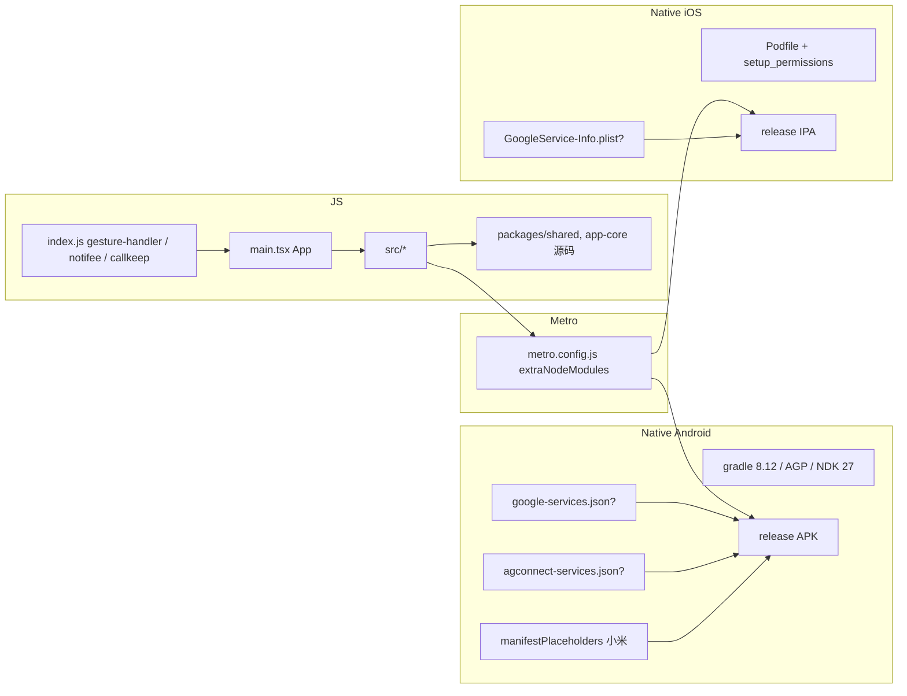

# Mobile 构建打包架构设计

> 适用范围：mushroom-app 的 React Native（bare workflow）Android / iOS 构建链、原生依赖、签名/推送/通话凭据现状。
>
> 关联文档：
>
> - 推送：`docs/architecture/push-notification.md`
> - 通话：`docs/architecture/realtime-call.md`
> - 多账号隔离：`docs/architecture/multi-account-isolation.md`

---

## 1. 模块概述

### 1.1 目标

- RN 0.85 + 新架构（Fabric/TurboModule）+ Hermes 启用。
- 三推送通道并存：Firebase（Android/iOS）+ 华为 HMS + 小米 Push，按凭据文件存在与否条件 apply。
- 通话原生层用 react-native-webrtc + callkeep（**不**引入 LiveKit）。
- 本地数据存储用 nitro-sqlite + MMKV。
- Metro 直接编译 monorepo 包源码，免预构建。

### 1.2 非目标

- **不实现** OTA（无 CodePush / Expo Updates）。
- **不实现** fastlane / mobile CI（仓库内无 lane / 无 mobile workflow）。
- **不实现** productFlavors 多渠道（依赖「凭据是否存在」隐式区分）。
- **不实现** ABI splits / R8 ProGuard（包体未优化）。
- **不实现** versionCode/versionName 自动注入。

### 1.3 平台覆盖

| 平台    | min             | target/compile | 主签名                        |
| ------- | --------------- | -------------- | ----------------------------- |
| Android | minSdk 24       | 36/36          | env 注入 keystore，缺一不签名 |
| iOS     | 15.1（pbxproj） | —              | Xcode 默认 team               |

---

## 2. 架构总览

---

## 3. 业务流程

### 3.1 启动调用链

1. `apps/mobile/index.js:5` 先 import `react-native-gesture-handler`。
2. `:10` `initLogger()`。
3. `:23-38` 注册 `registerNotificationBackgroundHandlers`，分发 `call.invite` / `call.missed`。
4. `:40` `AppRegistry.registerComponent(appName, () => App)`，App 来自 `apps/mobile/main.tsx`。
5. App 装载 → src/ 业务层 → `app-runtime.openMobileSQLiteForUser(uid)` 等。

### 3.2 构建期

1. `pnpm build:mobile` → `scripts/build.js:52-55` → `pnpm --filter @mushroom/mobile build`。
2. mobile 的 `build` 脚本只是 `tsc --noEmit`（`apps/mobile/package.json:9`）——**不出 APK/IPA**。
3. 真正出包必须手工：
   - Android：`apps/mobile/android` 跑 `./gradlew assembleRelease`。
   - iOS：`apps/mobile/ios` 跑 `xcodebuild` / Xcode GUI / fastlane（**仓库未配 lane**）。

### 3.3 推送 / 通话原生注册

- Android：`google-services` plugin 条件加载（`app/build.gradle:7-14`）；callkeep 服务声明在 `AndroidManifest.xml:52-62`；小米 metadata `:31-39`。
- iOS：`AppDelegate.swift:20-24` 检测 plist 才 `FirebaseApp.configure()`；Podfile `:16-19` `setup_permissions(['Camera','Microphone'])`。

---

## 4. 策略与设计原则

- **凭据缺失安全降级**：Android `google-services.json` / `agconnect-services.json` 缺失即跳过对应 plugin；iOS 缺 plist 不崩。
- **Metro 直编源码**：`metro.config.js:10-31` `unstable_enableSymlinks=true` + `extraNodeModules` 把 `@mushroom/app-core` / `shared` 指向 `packages/*/src`；无需预构建。
- **alias 全由 metro 管**：babel 仅 `@react-native/babel-preset` + reanimated/plugin，**无 module-resolver**。
- **autolink 选择性禁用**：`react-native.config.js` 禁 `react-native-audio-recorder-player` Android autolink、禁 `react-native-document-picker` 双端（用 `@react-native-documents/picker`）。
- **后台推送提前注册**：`index.js` 在 JS 入口尽早注册 headless task，避免 cold-start 漏接 VoIP。
- **三推送并存**：靠 `manifestPlaceholders` + Manifest metadata + 凭据文件三套独立，**无 productFlavors 区分渠道**。

---

## 5. 平台分层结构

### 5.1 JS / TS

| 模块       | 路径                                     |
| ---------- | ---------------------------------------- |
| 入口       | `apps/mobile/index.js:5-40`              |
| App        | `apps/mobile/main.tsx`                   |
| 业务       | `apps/mobile/src/*`                      |
| Metro 配置 | `apps/mobile/metro.config.js:10-31`      |
| Babel 配置 | `apps/mobile/babel.config.js:1-4`        |
| RN 配置    | `apps/mobile/react-native.config.js:4-8` |

### 5.2 Android

| 模块              | 路径                                                                           |
| ----------------- | ------------------------------------------------------------------------------ |
| 顶层 gradle       | `apps/mobile/android/build.gradle:1-24`                                        |
| 应用 gradle       | `apps/mobile/android/app/build.gradle:7-145`（条件 plugin、签名、placeholder） |
| Manifest          | `apps/mobile/android/app/src/main/AndroidManifest.xml:31-62`                   |
| gradle.properties | `apps/mobile/android/gradle.properties:28, 35, 39`（ABI / newArch / Hermes）   |

### 5.3 iOS

| 模块        | 路径                                                                                |
| ----------- | ----------------------------------------------------------------------------------- |
| Podfile     | `apps/mobile/ios/Podfile:13-19`                                                     |
| AppDelegate | `apps/mobile/ios/Mesh/AppDelegate.swift:20-24`                                      |
| Info.plist  | `apps/mobile/ios/Mesh/Info.plist:56`                                                |
| Xcode 工程  | `apps/mobile/ios/Mesh.xcodeproj/project.pbxproj`（IPHONEOS_DEPLOYMENT_TARGET=15.1） |

---

## 6. 核心代码索引

| 职责                          | 路径                                                  |
| ----------------------------- | ----------------------------------------------------- |
| gesture-handler 必须先 import | `apps/mobile/index.js:5`                              |
| 后台推送注册                  | `apps/mobile/index.js:23-38`                          |
| Metro 直编源码                | `apps/mobile/metro.config.js:10-31`                   |
| Android 条件 plugin           | `apps/mobile/android/app/build.gradle:7-14`           |
| Android release 签名 env      | `apps/mobile/android/app/build.gradle:15-24, 138-145` |
| Android 小米 metadata         | `apps/mobile/android/app/build.gradle:124-129`        |
| iOS Firebase 条件 init        | `apps/mobile/ios/Mesh/AppDelegate.swift:20-24`        |
| iOS 权限自动配置              | `apps/mobile/ios/Podfile:16-19`                       |
| 构建编排                      | `scripts/build.js:52-55`                              |

---

## 7. API / 命令接口

| 命令                        | 入口                     | 说明                          |
| --------------------------- | ------------------------ | ----------------------------- |
| `pnpm dev:mobile`           | `scripts/dev.js`         | Metro + RN dev                |
| `pnpm build:mobile`         | `scripts/build.js:52-55` | 仅 `tsc --noEmit`，**不出包** |
| `./gradlew assembleRelease` | `apps/mobile/android/`   | Android release APK           |
| `xcodebuild` / Xcode        | `apps/mobile/ios/`       | iOS IPA                       |

---

## 8. WS 协议

不涉及。

---

## 9. 数据库 / 原生依赖

| 类别      | 库                                                                                                                                                                                                      |
| --------- | ------------------------------------------------------------------------------------------------------------------------------------------------------------------------------------------------------- |
| 本地 DB   | `react-native-nitro-sqlite ^9.6.0` + `react-native-nitro-modules ^0.35.3`                                                                                                                               |
| KV        | `react-native-mmkv ^4.3.1`                                                                                                                                                                              |
| 通话      | `react-native-webrtc ^124.0.7` + `react-native-callkeep ^4.3.16`（**无 livekit**）                                                                                                                      |
| 媒体      | `react-native-video` / `react-native-image-picker` / `react-native-vision-camera`（按住录制短视频）/ `react-native-compressor` / `react-native-create-thumbnail` / `react-native-audio-recorder-player` |
| 推送      | `@react-native-firebase/app+messaging ^24.0.0` / `@hmscore/react-native-hms-push 6.13.0-300` / 小米 metadata                                                                                            |
| 通知/VoIP | `@notifee/react-native ^9.1.8`                                                                                                                                                                          |

---

## 10. 约束与边界

- **RN 0.85 bare workflow**：不可使用 Expo 模块接口。
- **新架构启用**：第三方库需兼容 Fabric/TurboModule。
- **min iOS 15.1**：Podfile 与 pbxproj 基线**不一致**（前者用 RN 默认，后者写死 15.1）。
- **min Android API 24**。
- **Hermes**：JS bundle 必须 Hermes 兼容。
- **签名靠 env**：4 个变量缺一即不签 release。
- **ABI**：单 APK 内含 4 ABI（armv7/arm64/x86/x86_64），包体偏大。
- **R8/ProGuard 关**：`enableProguardInReleaseBuilds=false`，未做混淆压缩。
- **凭据隐式区分渠道**：同一 applicationId / 单 release variant，无 productFlavors。

---

## 11. 现状缺口与 Roadmap

| ID  | 现状                                   | 风险                           | 建议                                                  |
| --- | -------------------------------------- | ------------------------------ | ----------------------------------------------------- |
| R1  | 无 OTA                                 | bundle 修复必须商店上架        | 评估 Microsoft App Center / 自建 bundle 下发          |
| R2  | 无 fastlane / mobile CI                | 自动化产线缺                   | 加 GitHub Actions matrix + fastlane lane              |
| R3  | versionCode/versionName 写死           | 漏改风险                       | CI 注入 `git describe`                                |
| R4  | APK 未按 ABI splits                    | 包体大                         | `splits.abi` 启用，发版 4 个 ABI 各自包               |
| R5  | R8/ProGuard 关                         | 包体 / 防逆向弱                | 启用 + 规则维护（webrtc / callkeep 需 keep）          |
| R6  | iOS min 版本基线两处不一致             | 升级时冲突                     | Podfile 显式 `platform :ios, '15.1'`                  |
| R7  | 无 productFlavors 区分渠道             | 华为/小米/Google 同包同 ID     | `flavorDimensions("channel")` + appId suffix          |
| R8  | 无 `applicationIdSuffix` debug/release | 调试与发布不能共存             | debug 加 `.dev`                                       |
| R9  | Android 签名仅 env                     | 本地构建易缺凭据               | 加 README 步骤 + fastlane match                       |
| R10 | iOS 签名靠本地 Xcode                   | 团队成员 setup 复杂            | fastlane match + App Store Connect API                |
| R11 | mobile CI 不存在                       | 破坏难早发现                   | quality workflow 加 mobile lint / pod install dry-run |
| R12 | nitro-sqlite 单连接                    | 并发场景脆弱                   | 文档化 mutex；考虑迁 `react-native-quick-sqlite`      |
| R13 | callkeep + webrtc 组合复杂             | iOS PushKit + CallKit 集成易踩 | 单独写「Mobile 通话集成手册」                         |
| R14 | 后台推送处理散在 index.js              | 难单测                         | 抽到 `services/background-tasks.ts`                   |

优先级：R6 / R8（开发体验）→ R3 / R11（版本管理 + CI）→ R1 / R4 / R5（包体 / 分发）→ R7 / R9 / R10（渠道与签名）→ 其余。

---

## 12. Changelog

| 日期       | 版本 | 变更                                            | 作者     |
| ---------- | ---- | ----------------------------------------------- | -------- |
| 2026-05-23 | v1.0 | 首版：RN 0.85 bare、三推并存、构建链、14 项缺口 | OpenCode |
