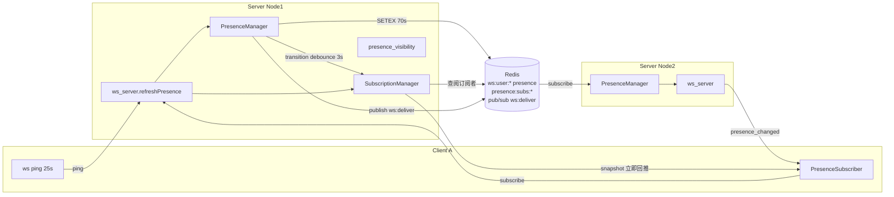

# Presence 在线状态架构设计

> 适用范围：mushroom-app 的在线状态系统——device 维度采集 / user 维度聚合 / 按需订阅广播 / 隐私可见性。
>
> 关联文档：
>
> - WS 长连接 / 心跳：`docs/architecture/websocket.md`
> - 隐私可见性：`docs/architecture/account-privacy.md`
> - 联系人双向覆盖：`docs/architecture/contacts.md`

---

## 1. 模块概述

### 1.1 目标

- 每用户跨多端设备聚合「是否在线 + 最近活跃时间」。
- 按需订阅（pub/sub 模型）+ Redis TTL 心跳收敛，避免主动轮询。
- 隐私可见性三档（everyone / contacts_only / nobody）+ 5min 桶化最近活跃时间。
- 跨节点（Redis pub/sub）单一可信源（Redis 是 ground truth）。

### 1.2 非目标

- **不实现** away / busy / do-not-disturb 三态（仅 online/offline 二态）。
- **不实现** 隐身 / invisible（仅 `nobody` 全局隐藏）。
- **不实现** typing 合并到 presence（typing 是独立 classify）。
- **不实现** 按前/后台精确分态（仅靠 ws 断开后 70s TTL 收敛）。

### 1.3 平台覆盖

| 维度 | Server                          | Web                          | Electron | Mobile                     |
| ---- | ------------------------------- | ---------------------------- | -------- | -------------------------- |
| 采集 | ws 心跳 → Redis TTL             | 25s ping                     | 同 web   | 25s ping                   |
| 聚合 | `WebSocketPresenceManager`      | n/a                          | n/a      | n/a                        |
| 订阅 | `presence_subscription_manager` | `webPresenceSubscriber`      | 同 web   | `mobilePresenceSubscriber` |
| 隐私 | `presence_visibility`           | n/a                          | n/a      | n/a                        |
| 渲染 | n/a                             | `PresenceDot` / `UserAvatar` | 同 web   | `ChatDetailScreen` 等      |

---

## 2. 架构总览

---

## 3. 业务流程

### 3.1 客户端上线 → 广播

1. ws 握手成功，`PresenceManager.registerClient` 写 Redis `ws:user:{uid}:device:{did}:presence=nodeId` TTL=70s + `ws:user:{uid}:devices` HASH（TTL 24h）。
2. 计算 transition：若该 user 之前 0 device → `online=true`，进入 3s debounce 窗口。
3. flush：`listPresenceSubscriberIds(userId, fanoutMode)` 取目标用户集 → 经 `loadPresenceVisibilityForBroadcast` 裁剪 → `publish ws:deliver` 各节点扇出。

### 3.2 订阅者请求

1. 客户端发 `presence_subscribe { user_ids[], scope: 'conversation'|'list'|'profile' }`（≤500/批）。
2. 服务端写 Redis：
   - `presence:subs:{targetUserId}` SET 添加 `<subId>:<deviceId>`
   - `presence:subs-by:{subId}:{deviceId}` SET 添加 `<targetId>`
   - `presence:subs:device:{subId}:{deviceId}` SETEX 300s（订阅活跃 marker）
3. 立即回 `presence_snapshot` 携带当前 summaries（不依赖 HTTP）。
4. 后续每次客户端 ping → 服务端 `refreshDeviceTtl` 续 300s。

### 3.3 客户端下线 → 收敛

- 软退出：`unregisterClient`（disconnect/close 幂等）→ Redis del → 若该 user 0 device → 进入 3s debounce → flush offline。
- 硬崩溃：客户端不再发 ping → 70s 后 Redis presence key 自然过期 → 下一次 transition 触发或订阅查询时反映 offline。
- 启动期 reconcile：`reconcileNodeCounter` SCAN `ws:user:*:devices`，对 value=当前 nodeId 的 device 检查短 TTL key 是否存在；不存在则视为崩溃残留并清理。

---

## 4. 策略与设计原则

- **Redis 单一可信源**：`getOnlineDeviceIds` 完全只看 Redis，不读本地 map，防 ghost。
- **TTL 阶梯**：客户端 25s ping < 服务端 35s 扫描 < 70s device TTL；保证心跳早于过期。
- **device 维度采集 / user 维度聚合**：任一 device 存活即 `is_online=true`；`active_device_count` 同时下发供 UI 决策（如「在 Electron 与手机同时在线」）。
- **transition 3s debounce**：合并 online↔offline 抖动，`previousOnline` 取首次入窗口值，flush 时与最新对比；相等不推。
- **按需订阅 + 联系人兜底**：`fanoutMode='both'` 默认值并集（contacts 双向 ∪ 显式 subscribers），灰度期安全网；目标切到纯 `subscribers`。
- **last_active_at 桶化**：默认 5min 桶（`bucketizeLastActiveAt`），transition 广播路径 `skipBucketize=true` 保留近端实时感。
- **`mergePresenceSummary` 单调性**：`observed_at` 单调 + `last_active_at` 取较新 + latestKnown 兜底，防 HTTP+WS 乱序闪烁。
- **重连完整重发**：客户端适配器双 flag（connected + hadConnectedOnce），仅在"曾连过 → 断 → 再连"才走 `onReconnected` 全量重发。
- **粗 3 态视觉**：UI 层 `resolvePresenceLevel` 派生 `online | recent | offline`（5min/1h 阈值），协议不传。

---

## 5. 平台分层结构

### 5.1 服务端

| 模块                | 路径                                                    | 责任                            |
| ------------------- | ------------------------------------------------------- | ------------------------------- |
| PresenceManager     | `server/src/websocket/presence_manager.ts`              | 注册/注销/transition/reconcile  |
| SubscriptionManager | `server/src/websocket/presence_subscription_manager.ts` | 订阅 SET / TTL / refresh        |
| Visibility          | `server/src/service/presence_visibility.ts`             | viewer/target 双向裁剪 + 桶化   |
| WS Server           | `server/src/websocket/ws_server.ts:498-611`             | ping/subscribe/unsubscribe 入口 |
| Redis Dispatcher    | `server/src/websocket/redis_dispatcher.ts:30-31, 88`    | ws:deliver / ws:control 通道    |
| HTTP batch          | `server/src/service/user_service.ts:325`                | `/auth/presence-batch`          |
| Config              | `server/src/utils/config.ts:165-195`                    | TTL / 心跳 / 上限               |

### 5.2 共享层

| 路径                                                            | 责任                           |
| --------------------------------------------------------------- | ------------------------------ |
| `packages/shared/src/types/ws.ts:91, 121, 131, 140`             | 4 个 presence WS DTO           |
| `packages/shared/src/types/api.ts:94`                           | `UserPresenceSummary` HTTP DTO |
| `packages/shared/src/presence-client/presence-subscriber.ts:20` | 三 scope 桶 + diff + 重连重发  |
| `packages/shared/src/presence-client/interfaces.ts`             | Realtime / Store Adapter 抽象  |
| `packages/shared/src/utils/presence.ts:44, 66, 119, 175`        | 桶化 / 等级 / merge            |

### 5.3 Web / Electron

| 模块        | 路径                                                           |
| ----------- | -------------------------------------------------------------- |
| 适配器单例  | `apps/web/src/services/presence-subscriber.ts:92`              |
| 订阅触发    | `apps/web/src/hooks/useChat.ts:885, 891-911, 914-929`          |
| UI 圆点     | `apps/web/src/components/avatars/{PresenceDot,UserAvatar}.tsx` |
| Header 文案 | `apps/web/src/components/chat/{ChatHeader,ChatWindow}.tsx`     |
| HTTP 兜底   | `useChat.ts:885` → `/auth/presence-batch` 5min                 |

### 5.4 Mobile

| 模块         | 路径                                                                                        |
| ------------ | ------------------------------------------------------------------------------------------- |
| 适配器单例   | `apps/mobile/src/services/presence-subscriber.ts:71`                                        |
| 订阅触发     | `apps/mobile/src/app/controller/effects/useMobileConnectivityEffects.ts:150, 190-226`       |
| 首页采集     | `apps/mobile/src/utils/presence.ts:11` `collectHomePresenceUserIds`（10 chats + 6 friends） |
| 渲染         | `apps/mobile/src/features/chat/ChatDetailScreen.tsx:240`                                    |
| 切账号 reset | `apps/mobile/src/services/app-runtime.ts:404`                                               |

---

## 6. 核心代码索引

| 职责                                | 路径                                                            |
| ----------------------------------- | --------------------------------------------------------------- |
| registerClient                      | `server/src/websocket/presence_manager.ts:74`                   |
| unregisterClient（幂等）            | `server/src/websocket/presence_manager.ts:113`                  |
| getPresenceSummary                  | `server/src/websocket/presence_manager.ts:187`                  |
| getOnlineDeviceIds（Redis-only）    | `server/src/websocket/presence_manager.ts:213`                  |
| listPresenceSubscriberIds（fanout） | `server/src/websocket/presence_manager.ts:281`                  |
| transition debounce                 | `server/src/websocket/presence_manager.ts:323`                  |
| flushPresenceTransition             | `server/src/websocket/presence_manager.ts:391`                  |
| reconcileNodeCounter                | `server/src/websocket/presence_manager.ts:473`                  |
| subs 数据结构                       | `server/src/websocket/presence_subscription_manager.ts:9-15`    |
| handlePresenceSubscribe             | `server/src/websocket/ws_server.ts:576`                         |
| handlePresenceUnsubscribe           | `server/src/websocket/ws_server.ts:611`                         |
| ping 续 TTL                         | `server/src/websocket/ws_server.ts:498-499`                     |
| visibility viewer 视角              | `server/src/service/presence_visibility.ts:63`                  |
| visibility target 视角（广播）      | `server/src/service/presence_visibility.ts:150`                 |
| mergePresenceSummary                | `packages/shared/src/utils/presence.ts:119`                     |
| resolvePresenceLevel                | `packages/shared/src/utils/presence.ts:66`                      |
| PresenceSubscriber 适配器           | `packages/shared/src/presence-client/presence-subscriber.ts:48` |

---

## 7. API 路径

| Method | Path                     | 说明                             |
| ------ | ------------------------ | -------------------------------- |
| GET    | `/auth/presence-summary` | 单用户 summary                   |
| POST   | `/auth/presence-batch`   | 批量 summary（HTTP 兜底/重连前） |

---

## 8. WS 协议

| classify               | 方向 | payload                                                                                 | 限制                                         |
| ---------------------- | ---- | --------------------------------------------------------------------------------------- | -------------------------------------------- |
| `presence_subscribe`   | C→S  | `{ user_ids: number[], scope?: 'conversation'\|'list'\|'profile' }`                     | 批量 ≤500 (`PRESENCE_SUBSCRIBE_BATCH_LIMIT`) |
| `presence_unsubscribe` | C→S  | 同上                                                                                    | —                                            |
| `presence_snapshot`    | S→C  | `{ entries: UserPresenceSummary[] }`                                                    | 订阅成功 / 重连完整重发                      |
| `presence_changed`     | S→C  | `{ user_id, is_online, last_active_at, active_device_count, observed_at, expires_at? }` | transition debounce 3s                       |

`expires_at` 已声明但服务端当前未填，客户端 merge 也未消费——协议预留。

---

## 9. 数据库 / Redis Schema

### 9.1 Postgres

| 表                                          | 字段           | 用途                         |
| ------------------------------------------- | -------------- | ---------------------------- |
| `user_devices.last_active_at`               | timestamptz    | 重启 / 冷启动 last_seen 兜底 |
| `user_privacy_settings.presence_visibility` | smallint 0/1/2 | 隐私档位                     |

### 9.2 Redis

| Key                                       | 类型                 | TTL  | 用途                    |
| ----------------------------------------- | -------------------- | ---- | ----------------------- |
| `ws:user:{uid}:device:{did}:presence`     | string `nodeId`      | 70s  | device 心跳活跃 marker  |
| `ws:user:{uid}:devices`                   | HASH `did→nodeId`    | 24h  | 长存 device→node 映射   |
| `presence:subs:{targetUserId}`            | SET `subId:deviceId` | 持久 | 谁订阅了 target         |
| `presence:subs-by:{subId}:{deviceId}`     | SET `targetId`       | 持久 | 反查清理                |
| `presence:subs:device:{subId}:{deviceId}` | string               | 300s | 订阅 device 活跃 marker |

### 9.3 Pub/Sub 通道

- `ws:deliver` —— 业务消息派发（含 presence_changed / snapshot）
- `ws:control` —— 控制指令（强制断开等）

---

## 10. 约束与边界

- **TTL 阶梯不变量**：25s ping < 35s 服务端扫描 < 70s device TTL；300s 订阅 TTL > 心跳间隔 ⇒ 心跳自动续订。
- **批量上限**：单次 `presence_subscribe` ≤500 user_ids。
- **`fanoutMode='both'` 默认**：联系人 ∪ 显式订阅；切纯 subscribers 前需确认订阅链路稳定。
- **桶化**：默认 5min 桶展示 last_active_at；transition 广播豁免。
- **隐私层强制**：`nobody` 强行返回 `HIDDEN_PRESENCE`；`contacts_only` 走单向通讯录判定。
- **scope=profile 未启用**：共享层 API 已暴露 `syncProfile()`，客户端尚无调用点。
- **typing 不复用**：typing 是独立 classify，不经 presence 订阅。
- **重连重发**：仅"曾连过 → 断 → 再连"才走 `onReconnected`，首次连接不重发。

---

## 11. 现状缺口与 Roadmap

| ID  | 现状                               | 风险                                               | 建议                                                                              |
| --- | ---------------------------------- | -------------------------------------------------- | --------------------------------------------------------------------------------- |
| R1  | 仅 online/offline 二态             | 缺 away / busy                                     | 增加 `status: 'online'\|'away'\|'busy'\|'offline'`；客户端按 idle/screen-off 上报 |
| R2  | 无隐身（仅 nobody 全局）           | 「我想看别人在线但别人看不到我」无解               | 引入 `presence_visibility=3 invisible_outbound`                                   |
| R3  | `fanoutMode='both'` 仍走联系人兜底 | 大通讯录用户广播放大                               | 监控订阅链路成功率达标后切 `subscribers`                                          |
| R4  | `expires_at` 协议预留未落地        | 客户端无法预测 stale                               | 服务端填 = now + 70s；客户端到期主动重订/HTTP 兜底                                |
| R5  | profile scope 客户端未用           | 资料页 presence 依赖会话/列表订阅，独立场景失效    | 资料页打开时调用 `syncProfile([peerId])`                                          |
| R6  | 移动后台前后台未区分               | 后台挂着的连接显示在线                             | 切后台时主动发 `presence_offline_hint` 帧；服务端将该 device 提前到期             |
| R7  | 5min 桶在「刚刚离线」场景偏粗      | 文案不友好                                         | 引入「刚刚活跃」专项窗口（如 60s 内不桶化）                                       |
| R8  | typing 不与 presence 联动          | typing 仅会话内传播，资料页/列表无法显示「输入中」 | 长期可考虑 typing 也走订阅模型                                                    |
| R9  | 无活跃端类型下发                   | 客户端无法区分「手机在线 / Electron 在线」         | `summary.active_devices: [{platform}]` 替代 count                                 |
| R10 | reconcile 仅启动期跑               | 长运行节点崩溃后由 TTL 兜底，但订阅清理可能滞后    | 周期 reconcile（10min）                                                           |
| R11 | HTTP 兜底周期 5min                 | 弱网下偏长                                         | 暴露 `lastConnectedAt` + 自适应缩短                                               |

优先级：R3（性能）→ R4（协议一致性）→ R6（端体验）→ R1/R2（产品功能）→ 其余。

---

## 12. Changelog

| 日期       | 版本 | 变更                                                            | 作者     |
| ---------- | ---- | --------------------------------------------------------------- | -------- |
| 2026-05-23 | v1.0 | 首版：覆盖 TTL/订阅/隐私/reconcile/客户端订阅触发；列 11 项缺口 | OpenCode |
