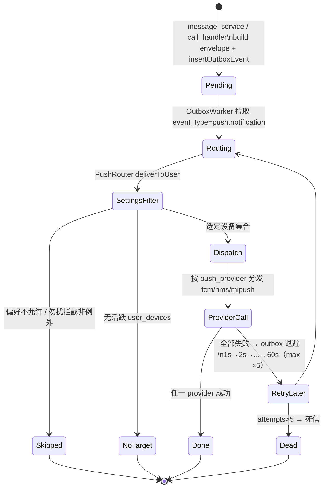
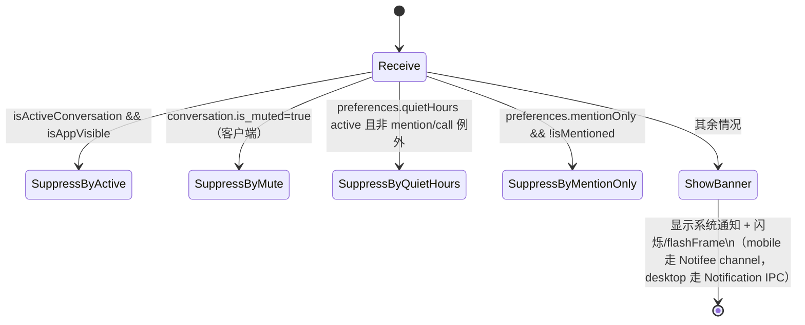
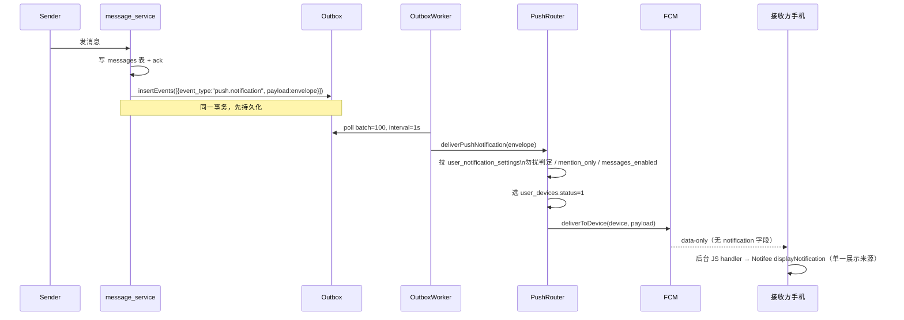

# 消息推送架构设计

> 适用范围：mushroom-app 中「将服务器事件转化为最终用户感知到的系统通知」的全链路。
>
> **本文按平台拆分**：第 7 节为「移动端（iOS / Android via React Native）」，第 8 节为「桌面端（Electron + 内嵌 Web bundle）」。Web 浏览器场景仅作为「桌面端 fallback」覆盖，不单独成章（当前未接入 Web Push / Service Worker，详见 §11 gap）。
>
> 关联文档：
>
> - 消息流水线总览：`docs/architecture/messaging.md`（包含 outbox、ack、同步）
> - 媒体上传：`docs/architecture/media-upload.md`
> - 账号隐私偏好：`docs/architecture/account-privacy.md`

---

## 1. 模块概述

### 1.1 目标

- 当用户**不在场**（应用未聚焦 / 后台 / 离线）时，可靠地把新消息与来电递送到系统通知中心。
- 当用户**在场**（应用前台、目标会话已打开）时，**抑制系统通知**，避免重复打扰。
- 统一一套服务端通知 envelope，下游分发到三家手机推送（FCM / 华为 HMS / 小米 Mi-Push）+ 桌面本地通知 + Web 浏览器 fallback。
- 隐私偏好（preview_mode / 勿扰时段 / mentionOnly / 每会话静音）在 server 与 client 双层协同。

### 1.2 非目标

- **不实现** APNs 直连：iOS 在中国大陆以外区域通过 FCM 中转，国内使用华为/小米通道（FCM 通常不可达）。
- **不实现** Web Push / Service Worker：当前 web fallback 走浏览器 Notification API，仅在页面打开时生效。
- **不实现** 服务端「多端在线去重」：多端在线时所有设备都会收到推送，去重由各端的「应用聚焦 + 会话激活」启发式完成。
- Electron / Web 角标：当前仅 `apps/mobile` 实现 OS 级未读角标；`apps/electron` 的 `dock.setBadge` / `Tray` 仍未接入（见 §12 Gap-6 残留项）。

### 1.3 平台能力矩阵

| 能力                         | Mobile                             | Electron                        | Web 浏览器             |
| ---------------------------- | ---------------------------------- | ------------------------------- | ---------------------- |
| 系统级通知（应用退出仍可达） | ✅ FCM / HMS / Mi-Push             | ❌（依赖应用进程）              | ❌                     |
| 应用内 banner                | ✅ Notifee channel                 | ✅ 主进程 Notification          | ✅ 浏览器 Notification |
| 来电通知（高优先级）         | ✅ full-screen 通知 + CallOverlay  | ✅ 独立 IPC                     | ✅ 浏览器 Notification |
| 通知点击 deep link           | ✅ `PENDING_NOTIFICATION_OPEN_KEY` | ✅ `desktop:focus-conversation` | ✅ window.focus + 路由 |
| 静默推送（仅触发同步）       | ✅ FCM data-only                   | N/A                             | N/A                    |
| 勿扰时段                     | ✅ server + client                 | server 决定 silent              | server 决定 silent     |
| 每会话静音 (is_muted)        | ⚠️ 仅 client 过滤                  | ⚠️ 仅 client 过滤               | ⚠️ 仅 client 过滤      |
| 未读角标                     | ✅ 客户端聚合 + APNs `aps.badge`   | ❌                              | ⚠️ 仅标题前缀          |

---

## 2. 架构总览

### 2.1 端到端组件依赖

```mermaid
flowchart LR
  subgraph Server
    MS[message_service / call_handler]
    PNS[PushNotificationService<br/>buildChatMessageNotification<br/>buildIncomingCallNotification]
    OBW[OutboxWorker<br/>retry policy 1s..60s ×5]
    PR[PushRouter<br/>勿扰 / mentionOnly / sound]
    FCM[FcmPushProvider]
    HMS[HuaweiPushProvider]
    MI[XiaomiPushProvider<br/>execFile JVM helper]
    VOIP[ApnsVoipPushProvider<br/>PushKit / CallKit]
    DB[(user_devices<br/>user_notification_settings)]
  end

  subgraph Mobile[apps/mobile]
    PP[platform/push/<br/>FCM + HMS + Xiaomi 统一]
    NC[notification-center.ts<br/>@notifee/react-native]
    CK[system-call.ts<br/>iOS CallKit / Android 自研来电]
    NP[notification-preferences.ts]
    Runtime[app-runtime.ts<br/>device 注册生命周期]
  end

  subgraph Desktop[apps/electron]
    NM[NotificationManager<br/>main process Notification]
    Pre[preload index.ts<br/>desktop:notify-*]
    Hook[useChatNotifications<br/>useChat.shouldNotify]
  end

  MS --> PNS
  PNS --> OBW
  OBW --> PR
  PR --> FCM
  PR --> HMS
  PR --> MI
  PR --> DB
  FCM -.APNs/FCM.-> Mobile
  HMS -.HMS.-> Mobile
  MI -.Mi-Push.-> Mobile
  PP --> NC
  NC --> CK
  NP --> NC
  Runtime -->|/device/register| DB

  PNS -.WS chat.-> Hook
  Hook --> Pre --> NM
```

### 2.2 状态机：服务端 push 派发



### 2.3 状态机：客户端是否本地显示通知



---

## 3. 关键概念

| 概念                          | 定义                                                                                 | 出处                                                                                                                                                |
| ----------------------------- | ------------------------------------------------------------------------------------ | --------------------------------------------------------------------------------------------------------------------------------------------------- |
| Push envelope                 | 服务端构造的与平台无关的通知载荷                                                     | `server/src/service/push_notification_service.ts:65`                                                                                                |
| PushRouter                    | 评估偏好 / 勿扰 / 选设备 / 分发的中心调度                                            | `server/src/service/push/push_router.ts:85`                                                                                                         |
| Provider                      | 一家具体推送通道的实现（JPush / FCM / HMS / Mi-Push / APNs VoIP）                    | `jpush_push_provider.ts:20`、`fcm_push_provider.ts:24`、`huawei_push_provider.ts:15`、`xiaomi_push_provider.ts:44`、`apns_voip_push_provider.ts:44` |
| Outbox                        | 事务性发件箱，承担推送的异步重试                                                     | `docs/architecture/messaging.md` §3 + `outbox_worker.ts:54`                                                                                         |
| `silent` flag                 | 静音推送（数据帧或无声音），由勿扰 + `sound_enabled` 决定                            | `push_router.ts:99-103`                                                                                                                             |
| Channel                       | Android / Notifee 的通知通道，区分消息与来电的振动 / 声音 / 优先级                   | `alert-tones/types.ts`（`getMessagesChannelId`）+ `notifications/types.ts`（`CALLS_CHANNEL_ID`）                                                    |
| System-call                   | 系统来电接线：iOS 走 CallKit（CallKeep），Android 走 Notifee full-screen 通知 + 按钮 | `apps/mobile/src/platform/system-call.ts`                                                                                                           |
| PENDING_NOTIFICATION_OPEN_KEY | 冷启动深链：通知点击后等 RN runtime 起来再消费                                       | `notifications/types.ts`（`PENDING_NOTIFICATION_OPEN_KEY`）                                                                                         |
| flashFrame                    | Windows / Linux 任务栏闪烁，焦点恢复时停止                                           | `apps/electron/src/main/notification.ts:46-47,276`                                                                                                  |
| `is_muted`                    | 每会话静音；当前**仅客户端**过滤，server 不读                                        | `packages/shared/src/types/models.ts:224`                                                                                                           |

---

## 4. 业务工作流程

### 4.1 新消息推送



详见 `server/src/service/message_service.ts:32,663-667`、`server/src/outbox/outbox_worker.ts:54,216`、`server/src/service/push/push_router.ts:85`。

### 4.2 来电邀请推送

`server/src/websocket/call_handler.ts:137-154`：

1. 写 outbox 事件 `event_type=push.notification`，payload 走 `PushNotificationService.buildIncomingCallNotification`（`push_notification_service.ts:35`）。
2. `PushRouter` 在勿扰判定时**优先**放行：`quiet_hours_allow_calls=true` 时来电可穿透勿扰（`push_router.ts:45-83`）。
3. FCM Provider `buildMessage` 对 chat / call 统一 data-only（无顶层 `notification`、无 `android.notification`）+ `android.priority=high`；来电额外 `apns-priority=10`（`fcm_push_provider.ts` `buildMessage`）。
4. 华为通道把来电 TTL 设为 60s（其他消息 86400s），避免离线很久后弹来电（`huawei_push_provider.ts:63`）。
5. 移动端通过全屏来电通知（iOS CallKit / Android Notifee full-screen + CallOverlay）在锁屏 / 后台直接拉起来电 UI（详见 §7.4）。
6. **iOS PushKit / VoIP**：注册了 `voip_token` 的设备，来电（`call.invite` / `call.missed`）改走 `apns_voip` 专用通道（`<bundleId>.voip` topic，`apns-push-type:voip`），且**不再**经 FCM 重复响铃。普通 `content-available` 静默推送在 App 被杀后会被系统限流、不唤起 JS，VoIP 是 iOS 杀进程态唯一可靠拉起 CallKit 的方式（`apns_voip_push_provider.ts`、`push_router.ts:249-289` `collectTargets(devices, isCall)`）。
7. **小米杀进程态**：小米 SDK 默认在杀进程态收不到，故来电对小米改走 **pass-through 透传**（`Message.passThrough(1)`），由原生 `XiaomiPushReceiver` 拉起前台服务 + HeadlessJS 任务 `XiaomiCallPush` 拉起来电 full-screen 通知（`server/tools/xiaomi/XiaomiPushCli.java`、`xiaomi_push_provider.ts`；客户端见 §7.5）。chat 仍走通知型消息。

### 4.3 偏好过滤与勿扰

`server/src/service/push/push_router.ts`：

| 步骤                      | 行号       | 说明                                                                                                          |
| ------------------------- | ---------- | ------------------------------------------------------------------------------------------------------------- |
| `currentHHmm`             | `:18`      | 取服务端本地时间 HH:mm                                                                                        |
| `isQuietHoursActive`      | `:25`      | 支持跨午夜；`start===end` 视为**全天静音**                                                                    |
| `shouldDeliverBySettings` | `:45`      | `messages_enabled` / `calls_enabled` / `group_messages_enabled` / `mention_only` / 勿扰允许 mention/call 突破 |
| `silent` 决定             | `:99-103`  | `sound_enabled=false` 或勿扰中（非例外）→ 强制 `silent=true`                                                  |
| `no-target`               | `:116`     | 无 `status=1` 设备 → 直接返回                                                                                 |
| 分发                      | `:157`     | 按 `push_provider` 选 provider，调 `deliverToDevice`                                                          |
| 聚合统计                  | `:215-243` | `{delivered, targetedDevices, deliveredProviders}`                                                            |

### 4.4 失败重试

`server/src/outbox/policy.ts:16-26` `computeOutboxNextRetryAt`：

- `baseDelayMs = 1000`
- `maxDelayMs = 60_000`
- 指数退避封顶 60s
- `OUTBOX_MAX_RETRY_COUNT = 5`（`server/src/utils/config.ts:109-117`）

超过 5 次进入死信状态，不再重试；监控日志间隔 `OUTBOX_MONITOR_LOG_INTERVAL_MS = 60_000`。

### 4.5 token 注册 / 注销

```
POST /device/register    user_controller.ts:425-446
POST /device/unregister  同上
```

入参：`DeviceRegistrationPayload`（`packages/shared/src/types/api.ts:30-51`）含 `device_id / device_type / push_provider / push_token / push_app_id / push_capabilities`。

`device_type` 枚举（`server/src/db/migrate.ts:524-532`）：0=未知，1=web，2=electron，3=mobile，9=其他。

注销路径：mobile 在 wipe 时调 `deleteUnifiedPushToken()`（`apps/mobile/src/services/app-runtime.ts:411-419`）→ 调用 FCM `deleteToken()` + 华为 `HmsPushInstanceId.deleteToken()` + 小米 `unregisterPush()`（`apps/mobile/src/platform/push/registration.ts`）→ 再调 server `/device/unregister` 把 `status=2`。

---

## 5. 策略

### 5.1 服务端是「分发与偏好」唯一源；客户端是「在场抑制」与「展示」

服务端只回答「该不该向用户的设备发推送、用哪些通道、是否静默」，**不**回答「设备此刻是否聚焦、目标会话是否打开」。后者由客户端在 push handler / WS handler 里启发式决定（详见 §7.5、§8.4）。

理由：服务端不知道客户端窗口状态；强行在服务端做去重需要客户端持续上报焦点，反而增加复杂度与隐私面。

### 5.2 全部 Android 推送 = data-only，展示统一交给 Notifee

- **chat.message 与 call.invite 均为 data-only**：FCM body 不带顶层 `notification` 字段，也不带 `android.notification` 字段（`server/src/service/push/fcm_push_provider.ts` `buildMessage`）。
- 原因：若同时下发 `notification` + `data`，应用退出 / 后台时 FCM SDK 会**由系统自动弹一条**，同时 `data` 又唤起后台 JS handler 走 Notifee 再弹一条 → **重复通知**。改为 data-only 后，展示由客户端 Notifee 单一负责，渠道 / 样式 / 去重 / 点击跳转全部可控。
- data-only 必须 `android.priority=high`，否则 Doze / 后台限制下无法可靠唤起后台 handler，导致通知延迟或丢失。
- 来电额外特性：独立 channel `mushroom-calls`（单独振动 / 铃声 / 重要性）、`apns-priority=10`、TTL 60s（来电时效性强，离线超时直接放弃，避免「错过的来电」在用户上线时回放），由移动端 full-screen 通知 / 主进程 IPC 接管 UI。

### 5.3 三家国内推送 + FCM 的覆盖策略

服务端 `user_devices.push_provider` 决定通道。客户端在 `apps/mobile/src/platform/push/registration.ts` 中按设备厂商（华为机型走 HMS，小米机型走 Mi-Push，其余走 FCM）选择性注册。这避免在国内对小米/华为设备依赖 FCM（通常不可达）。

### 5.4 隐私模式 preview_mode

`packages/shared/src/types/models.ts:52,54-67`：

- `full`：标题=会话名，正文=消息内容
- `sender`：标题=发送者，正文=「你收到了一条新消息」
- `hidden`：标题=应用名，正文=「你有新消息」

锁屏可见性差异由 OS 层处理，但应用层 preview_mode 已经保证敏感字段不出现在 payload 中（**服务端在构造 envelope 时即裁剪**）。

### 5.5 勿扰可被来电 / @mention 穿透

`user_notification_settings.quiet_hours_allow_mentions` / `quiet_hours_allow_calls`（默认 true）。设计与 iOS / Telegram 一致：勿扰不应静默重要的人际事件。

### 5.6 每会话静音的双层缺口

`Conversation.is_muted` 当前只在客户端层过滤（详见 §11 P0 gap）：

- 服务端 `push_router` 没有读 `conversation_user_state.is_muted`。
- 客户端在 push handler / 渲染层根据本地缓存的 `is_muted` 决定是否显示。

后果：静音的会话在锁屏 / 应用退出时仍会**收到系统推送**（除非用户全局关闭 messages_enabled）。需要补到服务端。

### 5.7 客户端 fallback 链：electronAPI → 浏览器 Notification

`apps/web/src/hooks/useChatNotifications.ts:34,55,185-196`：优先调主进程 IPC；缺失时回退浏览器 Notification。Web 浏览器场景（无 Electron）必然走后者；该路径下应用被关闭后即丢失推送（无 Service Worker）。

---

## 6. 平台落地布局

| 维度         | 移动端（apps/mobile）                                   | 桌面端（apps/electron + apps/web）                 |
| ------------ | ------------------------------------------------------- | -------------------------------------------------- |
| 系统推送通道 | FCM / HMS / Mi-Push                                     | 无（依赖应用进程）                                 |
| 通知 SDK     | `@notifee/react-native`                                 | Electron `Notification` 类 + 浏览器 `Notification` |
| 来电组件     | `react-native-callkeep`                                 | 主进程独立 IPC `desktop:notify-incoming-call`      |
| 偏好持久化   | server + `notification-preferences.ts` 本地缓存         | server only（无单独本地缓存层）                    |
| 通知点击恢复 | `PENDING_NOTIFICATION_OPEN_KEY` 写入存储，RN 启动后消费 | IPC `desktop:focus-conversation` 主进程聚焦窗口    |
| 触发点       | FCM/HMS background handler、Notifee channel display     | `useChat.ts:426-509` 客户端启发式                  |
| 多账号       | 切账号时 `deleteUnifiedPushToken` 后重新注册            | 切账号刷新 `notifyLoginSuccess`                    |

详细文件清单见 §7（移动）、§8（桌面）。

---

## 7. 移动端实现（React Native）

### 7.1 推送通道接入

`apps/mobile/src/platform/push/` 统一封装三家（外层 `push-provider.ts` 仍以 barrel 形式重导出公共 API）：

| 通道                             | SDK                                | token 获取                                                                                         | token 注销                                                          |
| -------------------------------- | ---------------------------------- | -------------------------------------------------------------------------------------------------- | ------------------------------------------------------------------- |
| FCM（Android Google 服务 + iOS） | `@react-native-firebase/messaging` | `providers/fcm.ts` `registerDeviceForRemoteMessages(instance) + getToken(instance)`（modular API） | `providers/fcm.ts` `deleteToken(instance)`（modular API）           |
| 华为 HMS                         | `@hmscore/react-native-hms-push`   | `providers/huawei.ts` `HmsPushInstanceId.getToken(HUAWEI_SCOPE)`                                   | `providers/huawei.ts` `HmsPushInstanceId.deleteToken(HUAWEI_SCOPE)` |
| 小米 Mi-Push                     | 自研 NativeModule bridge           | `providers/xiaomi.ts`（native 层注册）                                                             | `providers/xiaomi.ts`（native 层注销）                              |

**Token 刷新订阅**：`push/lifecycle.ts` 中 `onTokenRefresh(messagingInstance, token => handleRegistrationResult(...))`（modular API），token 变化时自动同步给 server 而无需登录。

**初始化**：`push/lifecycle.ts` 的 `initializeUnifiedPush(options)`，由 `useMobileRuntimeEffects.ts:247` 在应用启动时调用。

**前后台 handler**：

- 前台：`:418` `onMessage(messagingInstance, ...)`（modular API） — FCM data 帧到达时不弹系统通知；移动端实际的「前台 heads-up」由 WebSocket 实时消息触发，见 §7.2.1。
- 后台：`:601` `setBackgroundMessageHandler(messagingInstance, ...)`（modular API）、华为 `:619` `HmsPushMessaging.setBackgroundMessageHandler(...)`

### 7.2 Notifee 本地通知与 channel

`apps/mobile/src/platform/notification-center.ts`（barrel，实现位于
`apps/mobile/src/platform/notifications/*`）：

| 常量                              | 位置                     | 值                                     |
| --------------------------------- | ------------------------ | -------------------------------------- |
| `PENDING_NOTIFICATION_OPEN_KEY`   | `notifications/types.ts` | `"mushroom.notification.pending-open"` |
| `CALLS_CHANNEL_ID`                | `notifications/types.ts` | `"mushroom-calls"`                     |
| `CALL_INVITE_NOTIFICATION_PREFIX` | `notifications/types.ts` | `"mushroom-call-invite:"`              |

**Channel 创建**：`notifications/channels.ts` `ensureNotificationChannels()`，分别创建 messages 与 calls 两个 Android 通道。Android 通道差异在重要性 / 振动 / 声音 / 锁屏可见性上，由 Notifee 在原生层落到 `NotificationChannel`。

**显示通知**：

- `notifications/chat.ts` `displayLocalNotification(payload, context?)`：根据 `payload.type === "call.invite"` 选 `CALLS_CHANNEL_ID`，否则走按铃声偏好派生的版本化渠道 `getMessagesChannelId(messageSound)`；对 `chat.message` 通过 `chatNotificationDedup.reserve(server_message_id)` 去重，挡住 WS + FCM/HMS 双通道同消息重复弹窗（cap 500、TTL 5 min、FIFO）。
- `notifications/calls.ts` `displayIncomingCallNotification(...)`：固定走 calls channel，与 `system-call.ts` 来电链路联动。
- `notifications/calls.ts` `clearIncomingCallNotification(callId?)`：来电结束时清理。

#### 7.2.1 前台 WS 实时消息驱动的本地通知

为对齐 WhatsApp / Telegram「应用打开但不在目标会话」时仍弹 heads-up 的行为，并避免依赖 FCM/HMS 在前台到达，移动端在 `MobileAppController` 的 WebSocket 消息入口直接派发本地通知：

- `packages/app-core/src/controller.ts` `handleRealtimeChatMessage` 在 `isIncoming && !isDuplicateMessage` 时调用 `onIncomingChatMessage(ctx)` host hook（`packages/app-core/src/types.ts` `IncomingChatMessageHandler`）。
- `apps/mobile/src/services/app-runtime.ts` `dispatchIncomingChatMessageNotification(ctx)` 收集 `AppState.currentState`、`conversation.type === 2` ⇒ group、`conversation.is_muted`、当前激活会话，组装 `MobileNotificationPayload`，调用 `displayChatMessageNotification(...)`。
- 抑制策略集中在 `apps/mobile/src/platform/notification-policy.ts` 纯函数 `shouldDisplayNotification`（与 RN 解耦，便于 `node --test`），覆盖：active state + isActiveConversation 抑制、muted 抑制、`mentionOnly` 只弹 @、`groupMessagesEnabled=false` 抑制群消息、`quiet_hours_*`（含跨夜窗口、allow_mentions / allow_calls）。
- 消息 id 级去重见 §7.2 `chatNotificationDedup`，避免 WS 抢先 + FCM 后到双弹。
- iOS 后台 WebSocket 会被系统挂起，前台 WS 通知仅覆盖「应用在前台」场景；后台 / 锁屏仍走 FCM/HMS → Notifee 路径。

**Push 路径同样需要 context**（2026-05-25 修复）：FCM/HMS 前台与后台消息处理器也调用同一份 `displayLocalNotification(payload, ctx)`，由 `apps/mobile/src/platform/notifications/payload.ts` `buildPushDisplayContext(payload, appStateOverride)` 同步组装 `ctx`：

- `isActiveConversation` 由 `readActiveConversation()` 与 `payload.conversationId` 比对得到；`ChatDetailScreen` 通过 `useFocusEffect` 在 `apps/mobile/src/platform/active-conversation.ts` 持久化当前会话 id（`deviceStorage` key `mushroom.mobile.active-conversation-id`）。
- `isMuted` 通过 `setMutedConversationResolver(...)` 注入的仓储查询拿到（`app-runtime.ts` 启动时注入，调用 `bootRepository.getConversationByClientId`）；后台 wake 时若仓储未就绪降级为 `false`，保证「宁可弹，不要静默丢」。
- `appState` 后台 push 强制为 `"background"`，避免 `AppState.currentState` 在 JS 唤醒瞬间还报 `"active"` 误判为前台。

**深链恢复**（冷启动）：

- 推送点击时写入 `deviceStorage.set(PENDING_NOTIFICATION_OPEN_KEY, payload)`（`:211`）。
- RN 启动后 `consumePendingNotificationOpen()`（`:214-220`）读出并导航。

**前后台事件**：

- `:508-510` `client.onForegroundEvent(...)`：前台时拦截通知交互（点击、操作按钮）。
- `:606` `client.onBackgroundEvent(...)`：注册在 `registerNotificationBackgroundHandlers` 中（`:581`），需在 `index.js` 顶层注册以确保 RN 冷启动前生效。

**权限**：`:272-302` `getNotificationPermissionStatus / requestNotificationPermission / openSystemNotificationSettings`。

### 7.3 通知偏好

`apps/mobile/src/platform/notification-preferences.ts`：

```ts
type NotificationPreviewMode = "full" | "sender" | "hidden";

interface MobileNotificationPreferences {
  messagesEnabled / callsEnabled / soundEnabled / groupMessagesEnabled  // 全局开关
  mentionOnly                  // 仅 @我 / 群提及
  inAppBannerEnabled           // 前台是否弹 in-app banner
  previewMode                  // full / sender / hidden
  quietHoursEnabled / Start / End  // 默认 22:00–08:00
  quietHoursAllowMentions      // 勿扰是否放行 @ 提及
  quietHoursAllowCalls         // 勿扰是否放行来电
}
```

| 函数                                                 | 行号       |
| ---------------------------------------------------- | ---------- |
| `defaultNotificationPreferences`                     | `:25-37`   |
| `normalizeNotificationPreferences`                   | `:57`      |
| `readNotificationPreferences`                        | `:110-121` |
| `saveNotificationPreferences`                        | `:123`     |
| `updateNotificationPreferences`                      | `:131`     |
| `fromServerNotificationSettings`（snake → camel）    | `:140-156` |
| `toServerNotificationSettingsPatch`（camel → snake） | `:158-196` |

服务端 PUT 入参类型见 `packages/shared/src/types/api.ts:306-320` `UpdateUserNotificationSettingsRequest`。

### 7.4 系统来电（iOS CallKit / Android 自研 ConnectionService）

`apps/mobile/src/platform/system-call.ts`（平台分治：iOS 走 CallKeep/CallKit，Android 走自研 ConnectionService）：

| 入口                           | 行号       | 说明                                                                                      |
| ------------------------------ | ---------- | ----------------------------------------------------------------------------------------- |
| `initializeSystemCallManager`  | `:303`     | 注册应答/结束监听（iOS 绑 CallKeep 事件；Android 绑 `MushroomCallConnection` 原生事件）   |
| `reportIncomingSystemCall`     | `:394-448` | iOS → `callKeep.displayIncomingCall`；Android → 自研 `reportIncomingCall`（self-managed） |
| `markSystemCallActive`         | `:449`     | iOS 激活 CallKit 音频会话；Android no-op                                                  |
| `endSystemCall(callId)`        | `:459-476` | iOS → `callKeep.endCall`；Android → 自研 `endCall` + 清理 full-screen 通知                |
| `handleNotificationCallAction` | `:173`     | 全屏来电通知「接听/拒绝」按钮 → 持久化 + 广播应答/结束路径                                |
| 冷启动消费                     | `:150`     | `consumePendingSystemCallAction()`                                                        |

来电从 FCM data-only 收到后，background handler 调用 `reportIncomingSystemCall`。iOS 由 CallKeep 通过 CallKit 拉起原生来电 UI；Android 由自研 self-managed `ConnectionService` 报告来电（详见下）。

> **Android 自研 ConnectionService（`call/MeshConnectionService`）**：不依赖 CallKeep（其 `VoiceConnectionService` 在无 `READ_PHONE_NUMBERS` 权限时会抛 `SecurityException` 崩溃，上游 issue #635 长期未修）。原生模块注册 `CAPABILITY_SELF_MANAGED` 电话账户——系统自动启用、**无任何运行时权限**、无「启用来电提醒」类确认框。来电时 `TelecomManager.addNewIncomingCall` → 系统响铃 + 锁屏来电通知；**全屏来电 UI 仍由 Notifee `fullScreenAction` + CallOverlay 承担**（`notifications/calls.ts`，含「接听/拒绝」action 按钮，带 `launchActivity: "default"` 唤起 app）。系统来电按钮（`MeshCallConnection.onAnswer/onReject`）与通知按钮统一走 by-id 路径。铃声策略：self-managed 连接无系统来电铃声（`Connection` 无 `setRingtone` API，self-managed 语义下系统不自动响铃），铃声由 Notifee `loopSound` 播放自研铃声。⚠️ 需真机验证个别 ROM 是否仍播系统铃声（若出现双重铃声则改用系统铃声 + Notifee 通知静音）。Android < API 26 回退 Notifee-only（无 ConnectionService）。

> **iOS PushKit 例外**：被杀 / 后台的 iOS 不走 FCM data-only，而是经 APNs VoIP（`<bundleId>.voip`）直达原生层。`apps/mobile/ios/Mesh/VoipPushManager.swift` 注册 `PKPushRegistry(.voIP)`，在 `didReceiveIncomingPush` 内**同步**调用 `RNCallKeep.reportNewIncomingCall`（iOS 13+ 强制要求同步上报，否则系统终止进程），随后把 token / payload 经 `RCTEventEmitter` 桥接给 JS（`apps/mobile/src/platform/push/providers/apns-voip.ts` 监听 `voipTokenReceived` / `voipPushReceived`）。VoIP token 与普通 push token 解耦，经 `device-identity.ts` `updateMobileVoipToken` 写入并随 `/device/register` 上报 `voip_token`（`useMobileRuntimeEffects.ts` 初始化 + token 变化时重新注册）。需在工程里开启 `UIBackgroundModes=voip` 与 Push Notifications / VoIP entitlement，并使用真机 + 付费账号 + .p8 证书验证（模拟器无 PushKit）。

> **小米杀进程态例外**：来电对小米走 pass-through 透传，由原生 `XiaomiPushReceiver`（`PushMessageReceiver`）在杀进程态收到后启动 `XiaomiHeadlessService`（前台服务）+ HeadlessJS 任务 `XiaomiCallPush`（`apps/mobile/index.js` `registerHeadlessTask`），复用 `handleBackgroundCallPayload` → `reportIncomingSystemCall` + `displayIncomingCallNotification`。AndroidManifest 注册 receiver / service，并依赖 `USE_FULL_SCREEN_INTENT` / `FOREGROUND_SERVICE` / `POST_NOTIFICATIONS` 权限。Android calls 渠道补强 `visibility=PUBLIC` + `bypassDnd` + `AndroidCategory.CALL` + `fullScreenAction` + 「接听/拒绝」action 按钮（`notifications/calls.ts`）。

> **小米聊天消息点击打开 App**：chat 走通知型消息（非透传），点击行为由服务端消息的 `notify_effect` 决定——`XiaomiPushCli.java` 设 `extra(Constants.EXTRA_PARAM_NOTIFY_EFFECT, Constants.NOTIFY_LAUNCHER_ACTIVITY)` 即 `notify_effect=1`，使点击通知拉起 Launcher Activity（否则小米 SDK 默认只取消通知、不打开应用）。不涉及会话跳转。

> **离线接听「最后一公里」**：后台/被杀态 WS 已断开（`useMobileConnectivityEffects.ts:74-76`），收不到 `call.invited`，`state.callSessionRef.current` 为 null。用户经来电界面（iOS CallKit/VoIP；Android 为系统来电通知按钮 + Notifee full-screen 按钮）接听/拒绝时，统一走 by-id 入口（`call-realtime-actions.ts` `acceptCallById` / `rejectOrEndCallById`）：先 `rebuildCallSessionFromServer(callId)` 调 `getCallState` 并经 `upsertCallSession` 重建会话（注意 `call.state-sync` 实时分支只更新已存在会话，故离线必须直接 upsert），再接通/拒绝。触发点：① iOS CallKeep `answerCall`/`endCall` 监听器与 Android 系统来电事件（`MushroomCallAnswer`/`MushroomCallEnd`）及全屏通知按钮（`handleNotificationCallAction`，均先 `persistPendingSystemCallAction` 再广播监听，`useMobileRuntimeEffects.ts` 消费并清除持久化动作防止下次冷启重放）；② 冷启动持久化的 pending action，由 **auth-gated** effect 在 access token 就绪后重放（`getCallState` 需鉴权）；③ iOS `initializeVoipPush({ onPush })` 兜底——VoIP payload 带 `call_id` 时经 `openPayloadEvent` 预热会话。接通后维持 `CallOverlay` 覆盖层呈现（`callSession.phase=ongoing` 自动浮现），无独立通话页路由。

> **CallKit 接通时序**：接听后 `handleAcceptCall`（`call-session-actions.ts`）在发出 `call.accept.request` 后**立即乐观调用** `markSystemCallActive(callId)`，不等 `call.accepted` → WebRTC `ongoing` 回环。iOS CallKit 据此把通话从「连接中」切到「通话中」并激活音频会话，避免冷启动 / 离线接听时长时间静音甚至被系统判超时挂断。该调用幂等（实时 `ongoing` 分支也会调用一次），覆盖前台 CallOverlay 点接听与 by-id 系统接听两条路径。Android 上为 no-op（self-managed 连接已由原生在接听时 `setActive`）。

> **首启权限引导**：可靠的后台 / 杀进程来电唤醒依赖通知权限，冷启动由 `runCallPermissionGuide`（`platform/call-system-permissions.ts`，`deviceStorage` 标记位幂等）跑一次性引导：先请求通知权限（Android 13+ `POST_NOTIFICATIONS` / iOS alert），随后**静默预申请麦克风权限**（`ensureMicrophonePermissionSilently`，`media-permissions.ts`，BLOCKED/UNAVAILABLE 时不弹「打开设置」引导，避免打断首启体验），使首次长按录音即可直接开始而不打断手势；被拒绝后仍由录音时的常规引导兜底。Android 的 self-managed 电话账户无需任何权限或用户确认，`runCallPermissionGuide` 不再涉及 `getSystemCallPhoneAccountStatus` / `requestSystemCallPhoneAccount`。

### 7.5 设备注册生命周期

`apps/mobile/src/services/app-runtime.ts`：

| 节点                          | 行号        | 行为                                                  |
| ----------------------------- | ----------- | ----------------------------------------------------- |
| `DEVICE_ID_KEY` 持久化        | `:38,50-59` | 安装级唯一 ID，跨账号复用                             |
| `mobileDeviceInfo` 单例       | `:67-79`    | `device_type=3`，push 字段缓存                        |
| `applyPushRegistration`       | `:536-543`  | 写入 provider / token / appId / capabilities / region |
| `registerCurrentMobileDevice` | `:555-558`  | 调 `/device/register`（带 push\_\* 字段）             |
| Wipe / 注销                   | `:411-419`  | `deleteUnifiedPushToken()` + 清空缓存                 |

调用方：

- 启动：`useMobileRuntimeEffects.ts:247,310-314`（有 token+provider 时主动注册）
- 应用主入口：`useMobileAppEffects.ts:367`
- 用户手动重新注册：`apps/mobile/src/app/view-props/me-props.ts:46-54`

#### 设备身份统一（device identity）

各端 `device_id` / `device_name` / `app_version` 的生成与上报规则统一收敛到
`packages/app-core/src/device-identity.ts`（纯函数，含单测）：

| 维度          | 规则                                                                                                                                                                                                                              | 使用方                                                                                    |
| ------------- | --------------------------------------------------------------------------------------------------------------------------------------------------------------------------------------------------------------------------------- | ----------------------------------------------------------------------------------------- |
| `device_id`   | 统一 **UUID v4**；客户端生成一次并持久化（mobile MMKV / electron `userData/device-id`）                                                                                                                                           | `apps/mobile/src/services/runtime/device-identity.ts`、`apps/electron/src/main/device.ts` |
| `device_name` | `buildDeviceName()`：Android `品牌+制造商+型号 (系统名 系统版本)`（如 `Redmi Xiaomi 24094RAD4C`，brand/manufacturer 相同则去重，见 `buildVendorLabel`）；iOS `营销名 (系统名 系统版本)`；electron `hostname + platform + release` | mobile 经 `react-native-device-info`；electron 经 IPC `get-device-info`                   |
| `app_version` | 真实构建版本（mobile `DeviceInfo.getVersion()` 读原生工程；electron `app.getVersion()`），删除历史硬编码 `0.1.0-dev`                                                                                                              | 同上                                                                                      |

要点：

- **无历史设备**：系统尚未有存量用户，新装即 UUID v4，无需格式迁移兼容。
- **不双推**：`PushRouter.collectTargets` 按 `(push_provider, push_token)` 去重（见 §4.3），同一手机 token 只推一次。
- **渠道不变**：推送渠道仍由 `push_provider`（厂商探测）决定，与 `device_id` 格式无关。
- **上报时序**：mobile 登录 / 注册 / `registerCurrentMobileDevice` 前 `await ensureMobileDeviceInfoReady()`，保证服务端拿到真实 `device_name` / `app_version`。

#### 极光（JPush）可选厂商通道

极光作为**可选厂商**接入，配置了即优先，未配置则维持现有 `xiaomi → huawei → fcm` 优先级：

| 维度         | 说明                                                                                                                                                                                              |
| ------------ | ------------------------------------------------------------------------------------------------------------------------------------------------------------------------------------------------- |
| 客户端注册   | `resolvePreferredRegistration` 顺序 `jpush → xiaomi → huawei → fcm`；`JPUSH_APPKEY` 非空且拿到 registrationId 才用极光，否则回退三家                                                              |
| 设备上报     | `push_provider="jpush"`、`push_token`=极光 registrationId                                                                                                                                         |
| 服务端发送   | `jpush_push_provider.ts` 调 `api.jpush.cn/v3/push`（Basic Auth `appKey:masterSecret`），`audience:{registration_id}` 单发                                                                         |
| Android 投递 | **统一自定义消息（message）透传**（chat/call 均由客户端 Notifee 链路统一展示），避免厂商 SDK 自动弹通知重复                                                                                       |
| iOS 投递     | notification（APNs 系统弹）；**来电仍走 APNs VoIP 专用通道**（collectTargets 的 voip 特判），不进本 provider                                                                                      |
| 成功判定     | 极光返回 `msg_id` 即入队成功；仅 HTTP 非 2xx / 业务 error code 抛错（避免 outbox 把入队当失败重试）                                                                                               |
| 配置         | 服务端 `JPUSH_APP_KEY` / `JPUSH_MASTER_SECRET` / `JPUSH_APNS_PRODUCTION`；客户端构建注入 `JPUSH_APPKEY`。**两端需同时配置**，否则设备上报 jpush 但服务端 `isConfigured=false` → unconfigured 跳过 |
| 已知限制     | app 被杀后的可靠唤醒依赖极光控制台配置的厂商通道（小米/华为/OPPO/vivo 凭据）；极光 RN 插件无 JS 后台 handler，`kill 态来电唤醒` 的接收端需按极光 receiver 适配（HeadlessService 链路保留）        |

### 7.6 平台差异（iOS vs Android）

| 维度     | iOS                                              | Android                                       |
| -------- | ------------------------------------------------ | --------------------------------------------- |
| 推送通道 | APNs（chat 经 FCM 中转 / 来电走 APNs VoIP 直达） | FCM / HMS / Mi-Push 按厂商选                  |
| 来电 UI  | CallKit（系统全屏）                              | 自研 full-screen 通知 + CallOverlay           |
| Channel  | 不适用（iOS 用 Category）                        | `mushroom-messages-{hash}` / `mushroom-calls` |
| 静默推送 | `apns-priority=5` + 无 alert                     | data-only                                     |
| Token    | APNs token（FCM 包装）                           | FCM registration token / HMS token / MIID     |
| 权限     | iOS 10+ 需用户授权                               | Android 13+ 需用户授权 `POST_NOTIFICATIONS`   |

### 7.7 移动端关键文件清单

| 文件                                                                | 职责                                                                         |
| ------------------------------------------------------------------- | ---------------------------------------------------------------------------- |
| `apps/mobile/src/platform/push-provider.ts`                         | Barrel re-export，保持历史 import 路径稳定                                   |
| `apps/mobile/src/platform/push/`                                    | 三家通道统一抽象：types/shared/state/providers/registration/lifecycle 子模块 |
| `apps/mobile/src/platform/notification-center.ts`                   | Barrel re-export，保持历史 import 路径稳定                                   |
| `apps/mobile/src/platform/notifications/types.ts`                   | 渠道 id / 常量 / `MobileNotificationPayload` 等类型                          |
| `apps/mobile/src/platform/notifications/channels.ts`                | Android channel 创建（messages / calls）                                     |
| `apps/mobile/src/platform/notifications/permissions.ts`             | 权限查询 / 请求 / 系统设置入口                                               |
| `apps/mobile/src/platform/notifications/payload.ts`                 | payload 解析 / 策略 / dedup / 静音 resolver / context                        |
| `apps/mobile/src/platform/notifications/chat.ts`                    | `displayLocalNotification` / `displayChatMessageNotification`                |
| `apps/mobile/src/platform/notifications/calls.ts`                   | 来电通知展示与清理                                                           |
| `apps/mobile/src/platform/notifications/registration.ts`            | 推送注册同步 + 冷启动 deep-link 消费                                         |
| `apps/mobile/src/platform/notifications/lifecycle.ts`               | 初始化 + 后台 handler 注册                                                   |
| `apps/mobile/src/platform/notification-preferences.ts`              | 偏好读写 + server 同步                                                       |
| `apps/mobile/src/platform/system-call.ts`                           | 系统来电接线（iOS CallKit / Android 自研）                                   |
| `apps/mobile/src/services/app-runtime.ts`                           | 设备 ID + push 元数据 + 注册生命周期                                         |
| `apps/mobile/src/app/controller/effects/useMobileRuntimeEffects.ts` | 启动期串联：notification-center 初始化 + 设备注册                            |
| `apps/mobile/src/app/controller/effects/useMobileAppEffects.ts:367` | 主入口启动                                                                   |
| `apps/mobile/src/app/view-props/me-props.ts:46-54`                  | 「我」页手动重新注册                                                         |

---

## 8. 桌面端实现（Electron + 内嵌 Web）

### 8.1 主进程 NotificationManager

`apps/electron/src/main/notification.ts`：

| 接口                                           | 行号       | 说明                                                                   |
| ---------------------------------------------- | ---------- | ---------------------------------------------------------------------- |
| `setMainWindow(windowInstance)`                | `:44`      | 注入主窗引用                                                           |
| 主窗 `focus` 事件                              | `:46-47`   | `mainWindow.flashFrame(false)` 停闪                                    |
| IPC `desktop:notify-incoming-message`          | `:58-62`   | 弹消息通知                                                             |
| IPC `desktop:notify-incoming-call`             | `:64-68`   | 弹来电通知（独立通道）                                                 |
| IPC `desktop:clear-conversation-notifications` | `:70-74`   | 切会话时清理该会话已弹的通知                                           |
| IPC `desktop:clear-incoming-call`              | `:76-80`   | 来电结束清理                                                           |
| IPC `desktop:focus-conversation`               | `:82-86`   | 渲染层请求聚焦窗口（如收到 WS chat 时）                                |
| 通知点击 handler                               | `:229`     | `focusMainWindow()`                                                    |
| `focusMainWindow` 私有方法                     | `:244-257` | `currentWindow.focus()` + `flashFrame(false)` + `dock.show()`（macOS） |
| flashFrame 决策                                | `:276`     | `flashFrame(hasPending && !isFocused())`                               |

注册：`apps/electron/src/main/index.ts:33,95,142`（`setMainWindow` + 第二实例 focus）。

### 8.2 Preload 桥

`apps/electron/src/preload/index.ts`：

| API                                        | 行号                       |
| ------------------------------------------ | -------------------------- |
| `notifyIncomingMessage(payload)`           | `:50-55`                   |
| `notifyIncomingCall(payload)`              | `:56-63`                   |
| `clearConversationNotifications(id)`       | `:66`                      |
| `clearIncomingCall(callId)`                | `:70`                      |
| `focusConversation(payload)`               | `:135-137`                 |
| `notifyLoginSuccess(payload)`              | `:162+`                    |
| 通知点击订阅 `onDesktopNotificationAction` | （由 hook 调用，类型见下） |

类型声明：`apps/web/src/types/global.d.ts:119-203`。

### 8.3 渲染层 hook

`apps/web/src/hooks/useChatNotifications.ts`：

| 锚点                        | 行号       | 说明                                                                |
| --------------------------- | ---------- | ------------------------------------------------------------------- |
| `useChatNotifications` 入口 | `:21`      | 单例 hook，挂在主应用                                               |
| Electron API 检测           | `:30,34`   | `window.electronAPI as Partial<...>`，优先用 IPC                    |
| 浏览器权限回退              | `:55`      | `await Notification.requestPermission()`                            |
| 点击事件订阅                | `:66-71`   | `electronAPI.onDesktopNotificationAction(payload => navigate(...))` |
| 调用 electron 弹通知        | `:185-194` | `electronAPI.notifyIncomingMessage({...})`                          |
| 浏览器 fallback             | `:196`     | `new Notification(title, {...})`                                    |
| 切会话清理                  | `:221-229` | `electronAPI.clearConversationNotifications(clientConversationId)`  |

### 8.4 触发条件 `shouldNotify`

`apps/web/src/hooks/useChat.ts`：

| 锚点                                           | 行号                                                                               |
| ---------------------------------------------- | ---------------------------------------------------------------------------------- | --- | ----------------------- |
| 注入 `showIncomingNotification`                | `:155`                                                                             |
| `isMentioned` 计算（mentionAll 或包含本人 id） | `:385-393`                                                                         |
| `shouldAutoRead`                               | `:416-425`                                                                         |
| **核心判定**                                   | `:426-427` `const shouldNotify = isIncoming && (!isActiveConversation              |     | !isAppWindowVisible())` |
| 未读 mention 计数                              | `:498-504`                                                                         |
| 实际触发                                       | `:508-509` `if (shouldNotify) void showIncomingNotification(message, isMentioned)` |
| visibility 恢复                                | `:812-849`                                                                         |
| 切会话清理通知                                 | `:1015`                                                                            |

来电：`apps/web/src/hooks/useChatCallSession.ts:874`。

### 8.5 平台差异（macOS / Windows / Linux）

| 维度        | macOS                                                    | Windows                               | Linux            |
| ----------- | -------------------------------------------------------- | ------------------------------------- | ---------------- |
| 通知组件    | NSUserNotification / UNUserNotification（Electron 默认） | Toast（需 AppUserModelID）            | libnotify        |
| Dock / Tray | `app.dock.show()` 已用，`dock.setBadge` 未用             | Tray API 未用                         | Tray API 未用    |
| 任务栏闪烁  | N/A                                                      | `BrowserWindow.flashFrame(true)` 已用 | 部分桌面环境支持 |
| 焦点判定    | `BrowserWindow.isFocused()`                              | 同上                                  | 同上             |
| 应用图标    | `.icns`                                                  | `.ico` + AppUserModelID               | `.png`           |

**注意**：当前未设置 Windows `AppUserModelID`，Win10/11 通知中可能显示为「Electron」而非应用名（见 §11 gap）。

### 8.6 浏览器场景（无 Electron）

- 浏览器 Notification API 仅在页面 tab 打开时生效；关闭后无系统通知。
- 当前**未**接入 Web Push / Service Worker / VAPID（经 grep 确认仓库无相关代码）。
- 焦点判定：`document.visibilityState !== "visible"` 与 `useChat.ts isAppWindowVisible()` 联动。

### 8.7 桌面端关键文件清单

| 文件                                           | 职责                                                            |
| ---------------------------------------------- | --------------------------------------------------------------- |
| `apps/electron/src/main/notification.ts`       | NotificationManager：IPC handler + flashFrame + focusMainWindow |
| `apps/electron/src/main/index.ts:33,95,142`    | 主进程引导 + 第二实例聚焦                                       |
| `apps/electron/src/preload/index.ts:50-159`    | 桥接 IPC 给渲染层                                               |
| `apps/web/src/types/global.d.ts:119-203`       | electronAPI 类型                                                |
| `apps/web/src/hooks/useChatNotifications.ts`   | 渲染层统一通知 API（Electron 优先 / 浏览器回退）                |
| `apps/web/src/hooks/useChat.ts:426-509`        | `shouldNotify` 启发式 + 触发                                    |
| `apps/web/src/hooks/useChatCallSession.ts:874` | 来电触发                                                        |

---

## 9. 关联数据库表（PostgreSQL）

### 9.1 `user_devices`（`server/src/db/migrate.ts:198-216`）

```sql
CREATE TABLE IF NOT EXISTS user_devices (
  id              BIGSERIAL PRIMARY KEY,
  user_id         BIGINT NOT NULL,
  device_id       VARCHAR(128) NOT NULL,
  device_type     SMALLINT NOT NULL DEFAULT 0
                  CHECK (device_type IN (0, 1, 2, 3, 9)),
  device_name     VARCHAR(255),
  push_provider   VARCHAR(32),
  push_token      TEXT,
  push_app_id     VARCHAR(128),
  app_version     VARCHAR(64),
  last_seen_at    TIMESTAMPTZ NOT NULL DEFAULT NOW(),
  last_login_at   TIMESTAMPTZ NOT NULL DEFAULT NOW(),
  last_ip         INET,
  status          SMALLINT NOT NULL DEFAULT 1
                  CHECK (status IN (0, 1, 2)),
  metadata        JSONB,
  created_at      TIMESTAMPTZ NOT NULL DEFAULT NOW(),
  updated_at      TIMESTAMPTZ NOT NULL DEFAULT NOW(),
  CONSTRAINT user_devices_user_device_unique UNIQUE (user_id, device_id)
);
```

列含义（`migrate.ts:524-532`）：

| 列              | 取值                                               |
| --------------- | -------------------------------------------------- |
| `device_type`   | 0=未知 / 1=web / 2=electron / 3=mobile / 9=其他    |
| `status`        | 0=禁用 / 1=活跃 / 2=已登出（unregister 后）        |
| `push_provider` | `apns` / `fcm` / `hms` / `mipush` / `web` / `none` |
| `push_token`    | 服务端独占的敏感 token，仅 PushRouter 读取         |
| `push_app_id`   | 多 bundle / 产品线区分                             |
| `metadata`      | JSONB：机型 / OS 版本 / UA 等                      |

索引（`migrate.ts:382-389`）：

- `idx_user_devices_user_status_seen (user_id, status, last_seen_at DESC)` — PushRouter 选活跃设备主路径
- `idx_user_devices_device_id (device_id)` — `/device/register` 冲突检测
- `idx_user_devices_status_seen (status, last_seen_at DESC)` — 后台清理
- `idx_user_devices_push_provider (push_provider, status, last_seen_at DESC)` — 按 provider 统计

### 9.2 `user_notification_settings`（`server/src/db/migrate.ts:260-275`）

```sql
CREATE TABLE IF NOT EXISTS user_notification_settings (
  user_id                    BIGINT PRIMARY KEY REFERENCES users(id) ON DELETE CASCADE,
  messages_enabled           BOOLEAN NOT NULL DEFAULT TRUE,
  calls_enabled              BOOLEAN NOT NULL DEFAULT TRUE,
  sound_enabled              BOOLEAN NOT NULL DEFAULT TRUE,
  group_messages_enabled     BOOLEAN NOT NULL DEFAULT TRUE,
  mention_only               BOOLEAN NOT NULL DEFAULT FALSE,
  in_app_banner_enabled      BOOLEAN NOT NULL DEFAULT TRUE,
  preview_mode               VARCHAR(16) NOT NULL DEFAULT 'full'
                             CHECK (preview_mode IN ('full', 'sender', 'hidden')),
  quiet_hours_enabled        BOOLEAN NOT NULL DEFAULT FALSE,
  quiet_hours_start          CHAR(5) NOT NULL DEFAULT '22:00',
  quiet_hours_end            CHAR(5) NOT NULL DEFAULT '08:00',
  quiet_hours_allow_mentions BOOLEAN NOT NULL DEFAULT TRUE,
  quiet_hours_allow_calls    BOOLEAN NOT NULL DEFAULT TRUE,
  updated_at                 TIMESTAMPTZ NOT NULL DEFAULT NOW()
);
```

PushRouter 在 `:85-103` 读取全部字段。客户端通过 `/auth/notifications` PUT 部分更新（参见 `packages/shared/src/types/api.ts:306-320`）。

### 9.3 `conversation_user_state.is_muted`

`packages/shared/src/types/models.ts:224`。表 DDL 见 `docs/architecture/messaging.md` §8.5。**当前 PushRouter 未读此列**（gap，见 §11）。

---

## 10. IPC / API 契约

### 10.1 HTTP API

| 方法 | 路径                  | Controller                   | 用途                      |
| ---- | --------------------- | ---------------------------- | ------------------------- |
| POST | `/device/register`    | `user_controller.ts:425-446` | 注册 device + push_token  |
| POST | `/device/unregister`  | `user_controller.ts:425-446` | 注销 device（`status=2`） |
| GET  | `/auth/notifications` | `user_controller.ts:713-728` | 读偏好                    |
| PUT  | `/auth/notifications` | `user_controller.ts:713-728` | 部分更新偏好              |

路由声明：`server/src/routers/user_router.ts:9-10,36-37`。

类型契约（`packages/shared/src/types/api.ts`）：

- `:30-51` `DeviceRegistrationPayload`
- `:43` `RegisterDeviceRequest { device }`
- `:306-320` `UpdateUserNotificationSettingsRequest`
- 登录时附带 `device?:`（`:27`），app-core 在 `auth.ts:176-179` 注入

### 10.2 Push envelope（服务端内部）

`server/src/service/push_notification_service.ts`：

- `:10` `buildChatMessageNotification(input) → PushNotificationEnvelope`
- `:35` `buildIncomingCallNotification(input) → PushNotificationEnvelope`
- `:65` `export type PushNotificationEnvelope`

PushRouter 在 `:99-103` 决定 `effectivePayload.silent`；FCM/HMS/Mi-Push provider 各自把 envelope 翻译成自家 schema。

### 10.3 Electron IPC

| Channel                                    | 方向            | Payload                                | 出处                            |
| ------------------------------------------ | --------------- | -------------------------------------- | ------------------------------- |
| `desktop:notify-incoming-message`          | renderer → main | `{ title, body, conversationId, ... }` | `notification.ts:58-62`         |
| `desktop:notify-incoming-call`             | renderer → main | `{ callId, caller, ... }`              | `notification.ts:64-68`         |
| `desktop:clear-conversation-notifications` | renderer → main | `{ clientConversationId }`             | `notification.ts:70-74`         |
| `desktop:clear-incoming-call`              | renderer → main | `{ callId? }`                          | `notification.ts:76-80`         |
| `desktop:focus-conversation`               | renderer → main | `{ clientConversationId }`             | `notification.ts:82-86`         |
| `desktop:notification-action`（事件）      | main → renderer | `{ action, payload }`                  | `useChatNotifications.ts:66-71` |

### 10.4 RN deep link

通过 `deviceStorage` 持久化 `PENDING_NOTIFICATION_OPEN_KEY`（`notifications/types.ts` 常量，写入由 `notifications/runtime.ts` `persistPendingNotificationOpen` 完成，读出由 `notifications/registration.ts` `consumePendingNotificationOpen` 完成），冷启动后取出导航。

---

## 11. 约束与安全

### 11.1 强制约束

- `push_token` 仅 PushRouter 读取，不得出现在响应 JSON 给客户端。
- `preview_mode=hidden/sender` 时，envelope 中**禁止**携带消息正文（在 `buildChatMessageNotification` 入口裁剪）。
- Outbox 必须先持久化再投递；同一事务保证 message 与 push event 同生共死。
- Mi-Push 通过 `execFile` 调用 JVM helper，必须使用绝对路径 + 受控 classpath，避免命令注入。配置见 `server/src/utils/config.ts:118-146` `PUSH_XIAOMI_HELPER_CLASSPATH`。

### 11.2 重试与退避

- 指数退避：`baseDelayMs=1000`、`maxDelayMs=60_000`、`maxRetry=5`。
- 死信不阻塞后续 event；可观测性靠 `OUTBOX_MONITOR_LOG_INTERVAL_MS=60_000` 周期日志。

### 11.3 多端在场抑制

- Mobile：
  - 前台（`AppState === "active"`）+ 当前会话激活 ⇒ 抑制 heads-up（由 `notification-policy.ts` `shouldDisplayNotification` 判定，见 §7.2.1）。
  - 前台 + 非当前会话 ⇒ 由 WS 入口直接 `displayLocalNotification` 弹通知，并通过 `server_message_id` 去重避免 FCM/HMS 后到重复。
  - 后台 / 锁屏 ⇒ FCM/HMS data payload → Notifee 弹（iOS WS 被挂起，必须走推送）。
- Desktop：`shouldNotify = isIncoming && (!isActiveConversation || !isAppWindowVisible())`。

### 11.4 未读角标（OS app-icon badge）

微信式「回到桌面后图标右上角显示未读总数」，按运行态分两条链路：

- **前台 / 后台存活态（客户端聚合）**：`mobileAppController.subscribe` 每次回推 snapshot 时，`useMobileRuntimeEffects` 调用 `computeTotalUnread(conversations)`（`@mushroom/shared`，按 `is_muted = 0` 聚合 `unread_count`）→ `setAppBadgeCount`（`notifications/badge.ts` 封装 `notifee.setBadgeCount`）。进入会话 / 标记已读使 `unread_count` 归零后，下一帧 snapshot 自动让角标递减；登出在 `resetToLoggedOutState` 显式 `clearAppBadge()` 兜底。
- **被杀态（服务端推送）**：iOS 被杀后 JS 不再运行，未读总数由服务端计算并经 APNs 原生设角标。`PushRouter.deliverToUser` 对非 `call.invite` 的 envelope 调用 `ConversationReadStateRepository.getTotalUnreadForUser`（`SUM(unread_count) WHERE is_muted = FALSE`，走 `idx_conversation_user_state_user_unread` 索引）写入 `PushNotificationEnvelope.badge`；`FcmPushProvider.buildMessage` 将其落入 `aps.badge`。Android 端则在 `lifecycle.ts` 背景 push handler 内用 `payload.badge` 调 `setAppBadgeCount` 兜底。
- **平台差异**：iOS 数字角标完全可靠；Android 无统一数字角标标准，AOSP launcher 仅显示圆点，部分 OEM（小米/华为/三星）由各自通道驱动，`setBadgeCount` 为 best-effort，失败静默降级并记 `notify` 日志。

### 11.5 失败模式

| 场景                          | 表现                  | 兜底                                                                    |
| ----------------------------- | --------------------- | ----------------------------------------------------------------------- |
| FCM 返回 token invalid        | provider 报错         | outbox 重试 5 次后死信；**当前未自动清理 user_devices.status=0**（gap） |
| 设备长期未上线                | `last_seen_at` 久远   | 无自动清理；后续可加 batch job                                          |
| 客户端未授权通知              | OS 静默丢弃           | 应用启动时 `requestNotificationPermission`；用户可拒绝                  |
| 服务端 push provider 凭据缺失 | provider 启动报错     | `PUSH_DRY_RUN` 默认在非生产为 true，开发环境不真发                      |
| 静音会话仍收到推送            | UX 缺陷（§11 gap P0） | 当前依赖客户端二次过滤                                                  |
| 多端在线时所有端响铃          | 干扰                  | 客户端启发式各自抑制，但锁屏 / 后台无法判断焦点                         |

---

## 12. 现状缺口与 Roadmap

### 12.1 与代码的漂移 / Gap

| #   | 现象                                                                                                                                                                              | 影响                                                                                               | 优先级 |
| --- | --------------------------------------------------------------------------------------------------------------------------------------------------------------------------------- | -------------------------------------------------------------------------------------------------- | ------ |
| 1   | **`conversation_user_state.is_muted` 服务端不读**：PushRouter 仅看 `user_notification_settings` 全局开关                                                                          | 用户对单会话设静音后，应用退出 / 锁屏仍收到推送（前台 / 后台 Notifee 路径已客户端过滤，见 §7.2.1） | P0     |
| 2   | **无失败 token 自动清理**：FCM/HMS 报 invalid token 后不会将 `user_devices.status` 置 0                                                                                           | `user_devices` 累积无效记录，PushRouter 每次推都尝试                                               | P0     |
| 3   | **无服务端多端去重**：所有活跃 device 都收推送                                                                                                                                    | 同账号多端时全部响铃；依赖客户端启发式抑制                                                         | P1     |
| 4   | **无 Web Push / Service Worker**                                                                                                                                                  | 浏览器场景关闭页面即丢失推送                                                                       | P1     |
| 5   | **无 APNs 直连**：iOS 走 FCM 中转                                                                                                                                                 | 国内 iOS 推送依赖 Google 服务可达性                                                                | P1     |
| 6   | **角标未读数仅 mobile 实现**：`apps/mobile` 已接入 `setBadgeCount`（客户端聚合 + 服务端 APNs `aps.badge`），但 `apps/electron` 的 `dock.setBadge` / `Tray` / Win Overlay 仍未调用 | 桌面端未读数无法在 OS 级展示                                                                       | P2     |
| 7   | **Windows AppUserModelID 未设置**                                                                                                                                                 | Win10/11 通知中心显示「Electron」                                                                  | P2     |
| 8   | **Mi-Push 依赖外置 JVM helper**                                                                                                                                                   | 部署复杂、跨平台困难                                                                               | P2     |
| 9   | **来电 TTL（华为 60s）未对 FCM/Mi-Push 对齐**                                                                                                                                     | 离线超时行为不一致                                                                                 | P2     |
| 10  | **`PUSH_DRY_RUN` 默认值依赖 `isProduction`**                                                                                                                                      | 误用环境变量可能在 staging 真发                                                                    | P2     |

### 12.2 Roadmap

| 项      | 描述                                                                                                                                                                                                                                                                                           | 优先级 |
| ------- | ---------------------------------------------------------------------------------------------------------------------------------------------------------------------------------------------------------------------------------------------------------------------------------------------- | ------ |
| push-1  | PushRouter 接 `conversation_user_state.is_muted` 二次过滤（解 Gap-1）                                                                                                                                                                                                                          | P0     |
| push-2  | 失败 token 自动降级：provider 返回 NotRegistered/Unregistered → `user_devices.status=0` + 邮件/日志告警（解 Gap-2）                                                                                                                                                                            | P0     |
| push-3  | 多端去重启发式：优先推 mobile，桌面端在线时 mobile 仅推 silent data 帧（解 Gap-3）                                                                                                                                                                                                             | P1     |
| push-4  | 接入 Web Push + Service Worker + VAPID（解 Gap-4）                                                                                                                                                                                                                                             | P1     |
| push-5  | 接入 APNs 直连（中国大陆 iOS 用户体验，解 Gap-5）                                                                                                                                                                                                                                              | P1     |
| push-6  | ~~三端统一未读角标~~ mobile 已落地：客户端按非静音会话聚合 `unread_count` → `notifee.setBadgeCount`（前台/后台存活态），服务端 PushRouter 注入 `badge` → FCM `aps.badge`（iOS killed 态）+ Android 背景 handler 兜底。**剩余**：electron `dock.setBadge` + Tray + Win Overlay（解 Gap-6 残留） | P2     |
| push-7  | 设置 Windows AppUserModelID + 注册 Toast XML（解 Gap-7）                                                                                                                                                                                                                                       | P2     |
| push-8  | Mi-Push 改用 Node-only HTTP API 替换 JVM helper（解 Gap-8）                                                                                                                                                                                                                                    | P2     |
| push-9  | 在 PushNotificationEnvelope 引入统一 `ttl_ms`，各 provider 对齐（解 Gap-9）                                                                                                                                                                                                                    | P2     |
| push-10 | `PUSH_DRY_RUN` 默认值改为显式必填，避免误发（解 Gap-10）                                                                                                                                                                                                                                       | P2     |

### 12.3 不做事项

- 不引入第四方推送通道（OPPO / VIVO / 魅族）：覆盖范围有限，维护成本高，可由 FCM/HMS/Mi-Push + 长连接覆盖。
- 不实现「精确投递回执」：FCM/HMS 不保证到达，业务不应依赖回执做关键判断。

---

## 13. 关键常量速查

| 常量                                    | 值                                                                     | 出处                                                      |
| --------------------------------------- | ---------------------------------------------------------------------- | --------------------------------------------------------- |
| `OUTBOX_BATCH_SIZE`                     | 100                                                                    | `server/src/utils/config.ts:109-117`                      |
| `OUTBOX_POLL_INTERVAL_MS`               | 1000                                                                   | 同上                                                      |
| `OUTBOX_LEASE_MS`                       | 30_000                                                                 | 同上                                                      |
| `OUTBOX_MAX_RETRY_COUNT`                | 5                                                                      | 同上                                                      |
| `OUTBOX_MAX_RETRY_DELAY_MS`             | 60_000                                                                 | 同上                                                      |
| `OUTBOX_MONITOR_LOG_INTERVAL_MS`        | 60_000                                                                 | 同上                                                      |
| Outbox `baseDelayMs`                    | 1_000                                                                  | `server/src/outbox/policy.ts:25-26`                       |
| Outbox `maxDelayMs`                     | 60_000                                                                 | 同上                                                      |
| 华为来电 TTL                            | 60s                                                                    | `huawei_push_provider.ts:63`                              |
| 华为普通消息 TTL                        | 86400s                                                                 | 同上                                                      |
| FCM Android 来电 priority               | `high`                                                                 | `fcm_push_provider.ts:66-74`                              |
| FCM Android 普通 priority               | `normal`                                                               | 同上                                                      |
| FCM APNs 来电 priority                  | 10                                                                     | `fcm_push_provider.ts:75-92`                              |
| FCM APNs 普通 priority                  | 5                                                                      | 同上                                                      |
| `PENDING_NOTIFICATION_OPEN_KEY`         | `"mushroom.notification.pending-open"`                                 | `notifications/types.ts`                                  |
| `CALLS_CHANNEL_ID`                      | `"mushroom-calls"`                                                     | `types.ts:12`                                             |
| `CALL_INVITE_NOTIFICATION_PREFIX`       | `"mushroom-call-invite:"`                                              | `types.ts:13`                                             |
| `DEVICE_ID_KEY`                         | `"mushroom.mobile.device-id"`                                          | `app-runtime.ts:38`                                       |
| 默认勿扰时段                            | 22:00–08:00                                                            | `notification-preferences.ts:25-37`、`migrate.ts:260-275` |
| 默认 `preview_mode`                     | `full`                                                                 | 同上                                                      |
| 默认 `mention_only`                     | `false`                                                                | 同上                                                      |
| 默认 `quiet_hours_allow_mentions/calls` | true / true                                                            | 同上                                                      |
| `PUSH_XIAOMI_HELPER_CLASSPATH`          | env，默认 `server/tools/xiaomi/classes`                                | `server/src/utils/config.ts:118-146`                      |
| `PUSH_XIAOMI_TIMEOUT_MS`                | env，默认 `20_000`（java helper 子进程超时）                           | `xiaomi_push_provider.ts`、`config.ts`                    |
| `PUSH_XIAOMI_RETRIES`                   | env，默认 `1`（MiPush SDK 层重试，出网故障快速失败，交给 outbox 兜底） | `XiaomiPushCli.java`、`config.ts`                         |
| `PUSH_DRY_RUN`                          | 默认 `!isProduction`                                                   | 同上                                                      |
| `device_type` 枚举                      | 0=未知 / 1=web / 2=electron / 3=mobile / 9=其他                        | `migrate.ts:524-532`                                      |
| `status` 枚举                           | 0=禁用 / 1=活跃 / 2=已登出                                             | 同上                                                      |
| `push_provider` 枚举                    | `apns / fcm / hms / mipush / web / none`                               | 同上                                                      |

---

## 14. 变更记录

| 日期       | 变更                                                                                                                                                                                                                                                                                                                                                                                                                                                                                                                                                                                                                                                                                                                                                                                                                                                                                                                                                                                                                                                                                                                            | 提交 / PR  |
| ---------- | ------------------------------------------------------------------------------------------------------------------------------------------------------------------------------------------------------------------------------------------------------------------------------------------------------------------------------------------------------------------------------------------------------------------------------------------------------------------------------------------------------------------------------------------------------------------------------------------------------------------------------------------------------------------------------------------------------------------------------------------------------------------------------------------------------------------------------------------------------------------------------------------------------------------------------------------------------------------------------------------------------------------------------------------------------------------------------------------------------------------------------- | ---------- |
| 2026-05-22 | 首版：覆盖 server PushRouter / Outbox / 三家 provider；按移动端 + 桌面端拆分实现；附 10 项 gap 与 10 条 roadmap                                                                                                                                                                                                                                                                                                                                                                                                                                                                                                                                                                                                                                                                                                                                                                                                                                                                                                                                                                                                                 | （待提交） |
| 2026-05-25 | 移动端前台 WS 实时消息直接驱动本地 heads-up（`controller.onIncomingChatMessage` → `dispatchIncomingChatMessageNotification`）；抑制策略拆分至 `notification-policy.ts`；新增 `chatNotificationDedup` 按 `server_message_id` 去重 WS + FCM/HMS 双通道；Android `MESSAGES_CHANNEL_ID` 升级到 `mushroom-messages-v2` + `IMPORTANCE_HIGH`（旧通道为 DEFAULT，无法 heads-up）                                                                                                                                                                                                                                                                                                                                                                                                                                                                                                                                                                                                                                                                                                                                                        | （待提交） |
| 2026-05-25 | 后续修复：① push 三处入口改为通过 `buildPushDisplayContext(payload, appState)` 注入 `appState` / `isActiveConversation` / `isMuted`（修复后台 push 默认 `appState="active"` 被误抑制）；② 启动时 `setMutedConversationResolver` 注入仓储查询；③ 新建 `active-conversation.ts` 用 `deviceStorage` 持久化当前会话 id，`ChatDetailScreen` 通过 `useFocusEffect` 写入/释放；④ `ensureNotificationChannels` 启动时清理旧 `mushroom-messages` / `mushroom-calls` channel（已升级到 -v2）；⑤ `createNotificationDedup` 新增 `release(id)`，`displayLocalNotification` 在 `displayNotification` 失败时回滚 dedup；⑥ `IncomingChatMessageContext.sender` 字段未被任何消费者使用，已删除；⑦ `controller.handleRealtimeChatMessage` 抽出共享的 `persistedMessage`；⑧ `app-runtime` `senderUserId` 改用 `Number.isFinite`；⑨ `package.json` 测试脚本加 `--no-warnings=ExperimentalWarning` + 显式 `"test/**/*.test.mjs"` glob                                                                                                                                                                                                               | （待提交） |
| 2026-05-30 | 修复 Android FCM chat 消息重复推送：`fcm_push_provider` 抽出纯函数 `buildMessage`，chat.message 改为 **data-only**（移除顶层 `notification` 与 `android.notification` block），与 call.invite 一致；`android.priority` 统一 `high`（data-only 唤起后台 handler 必需）。根因：同时下发 `notification`+`data` 时，后台/杀进程态 FCM 系统自动弹一条 + 后台 handler 经 Notifee 再弹一条 = 重复。展示统一由客户端 Notifee 负责。另在 `AndroidManifest.xml` 增加 `default_notification_channel_id=mushroom-messages-v2`（含 `tools:replace`）兜底。新增 `push-router.test.mjs` 两条用例断言 chat / call payload 形状                                                                                                                                                                                                                                                                                                                                                                                                                                                                                                                  | （待提交） |
| 2026-05-31 | 修复移动端杀进程 / 后台来电无法唤起系统来电界面：① 新增 `user_devices.voip_token` 列（贯穿 models / repo / service / auth controller / shared 类型链）；② 服务端新增 `ApnsVoipPushProvider`（PushKit，http2 + .p8 ES256 JWT，`apns-push-type:voip`，仅 call.invite/missed），`push_router.collectTargets(devices, isCall)` 对有 `voip_token` 的设备改走 `apns_voip` 且不再经 FCM 重复响铃，配置项 `PUSH_APNS_*`；③ iOS 原生 `VoipPushManager.swift/.m` + bridging header + `UIBackgroundModes=voip`，`didReceiveIncomingPush` 同步 `RNCallKeep.reportNewIncomingCall`，token/payload 桥接 JS（`providers/apns-voip.ts`）；④ 小米来电改 pass-through 透传（`XiaomiPushCli.passThrough(1)`），原生 `XiaomiPushReceiver` + `XiaomiHeadlessService` + HeadlessJS `XiaomiCallPush` 拉起 CallKeep；⑤ Android calls 渠道补强 `visibility=PUBLIC` / `bypassDnd` / `AndroidCategory.CALL` / `fullScreenAction`。`push-router.test.mjs` 新增 5 条 VoIP 选路 / payload / guard 用例                                                                                                                                                        | （待提交） |
| 2026-05-31 | 补全离线接听「最后一公里」（§7.4）：后台/杀进程态 WS 断开、`callSession` 为 null，导致系统来电界面接听后接不通。新增 `call-realtime-actions.ts` `rebuildCallSessionFromServer` / `acceptCallById` / `rejectOrEndCallById`（离线时 `getCallState` → 直接 `upsertCallSession` 重建，因 `call.state-sync` 分支只更新已存在会话）；`useMobileRuntimeEffects.ts` CallKeep `answerCall`/`endCall` 改委托 by-id 并清除持久化动作、新增 auth-gated 冷启动 pending-action 重放、`initializeVoipPush` 接 `onPush` 兜底预热；`useMobileAppEffects.ts` `openPayloadEvent` 复用同一重建逻辑、pending 分支改 by-id（移除内联 getCallState 与未用的 handle\*CallEvent）。新增 5 条 `call-actions.test.ts` 用例（内存命中 / 离线重建 / 已结束 no-op / ring→reject / ongoing→end）                                                                                                                                                                                                                                                                                                                                                               | （待提交） |
| 2026-06-01 | 打通 iOS 真机 VoIP + 首启权限引导 + CallKit 时序（§7.4）：① iOS 工程补全——新建 `Mesh.entitlements`（`aps-environment`），`project.pbxproj` 注入 `CODE_SIGN_ENTITLEMENTS` + `SystemCapabilities.com.apple.Push` + entitlements 文件引用（此前缺 Push capability，iOS 拿不到 VoIP token，APNs 拒投）；②CallKit 接通时序——`handleAcceptCall` 发出 accept 后立即乐观 `markSystemCallActive`，不等 WebRTC `ongoing`，避免冷启/离线接听静音或被系统判超时挂断（幂等，覆盖前台/by-id 两路径）；③ 首启权限引导——新增 `platform/call-system-permissions.ts` `runCallPermissionGuide`（通知 + Android 电话账户 + 国产 ROM 后台限制 best-effort 引导，`deviceStorage` 标记幂等），底层探针 `getSystemCallPhoneAccountStatus`/`requestSystemCallPhoneAccount` 收敛进 `system-call.ts`，登录后 auth-gated effect 触发；④ 新增 `call-system-permissions.test.ts`（10 用例）；⑤ 文档——`docs/testing/mobile-push-runtime.md`（原 `docs/mobile-push-runtime-assets.md`）更新 iOS VoIP 必备项与 `PUSH_APNS_*` 接入。**遗留人工项**：Xcode 复核签名（Push/VoIP 能力）、放置 `GoogleService-Info.plist`、配置服务端 `PUSH_APNS_*`、真机执行测试矩阵 | （待提交） |
| 2026-08-19 | 小米推送 java helper 健壮性改进：① 超时由硬编码 20s 改为可配置 `PUSH_XIAOMI_TIMEOUT_MS`（默认 20_000）；② SDK 重试由硬编码 3 改为可配置 `PUSH_XIAOMI_RETRIES`（默认 1，快速失败交给 outbox 退避兜底）；③ 抽出纯函数 `buildXiaomiCliArgs` 便于单测；④ 失败日志区分「超时/出网卡死」（`execError.killed === true`，即 Node 发 SIGTERM，日志中为 exit code 143）与真实业务失败，并补充 stderr/stdout 定位原因（`invalid channel info` / `template_id ... empty` 等小米拒绝信息）。`XiaomiPushCli.java` 新增可选 `retries` 参数需重新编译（`pnpm --filter @mushroom/server tool:xiaomi:build`）。新增 3 条 `buildXiaomiCliArgs` 单测                                                                                                                                                                                                                                                                                                                                                                                                                                                                                                | （待提交） |
| 2026-08-19 | 小米聊天消息点击打开 App：服务端 `XiaomiPushCli.java` 通知型消息加 `extra(notify_effect, 1)`，点击通知拉起 Launcher Activity（`Constants.EXTRA_PARAM_NOTIFY_EFFECT` / `NOTIFY_LAUNCHER_ACTIVITY`）。`XiaomiPushCli.java` 需重新编译                                                                                                                                                                                                                                                                                                                                                                                                                                                                                                                                                                                                                                                                                                                                                                                                                                                                                             | （待提交） |

后续任何涉及 `user_devices` / `user_notification_settings` 字段、PushRouter 决策、provider payload、Notifee channel、Electron 通知 IPC、CallKeep 接入的修改均需更新本表。
