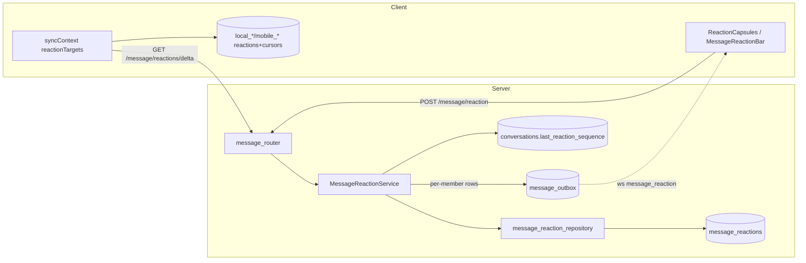

# 消息表情回应架构设计

> 适用范围：mushroom-app 的消息 reactions（表情回应）——单 user 单 emoji、增量游标、墓碑软删、全员 outbox。
>
> 关联文档：
>
> - 消息流水线：`docs/architecture/messaging.md`
> - 同步框架：`docs/architecture/db-migrations.md`
> - WS classify：`docs/architecture/websocket.md`

---

## 1. 模块概述

### 1.1 目标

- 单消息上多用户的 emoji 反应，群聊会话内一致同步。
- 每会话独立 `last_reaction_sequence` 游标，支持任意时点增量拉取。
- 删除走墓碑（`is_deleted=true`）保留行，确保 delta 可传播 remove 事件。
- 复用 outbox + WS classify 派发，保持至少一次投递语义。

### 1.2 非目标

- **不实现** 同用户多表情（PK `(message_id, user_id)`）。
- **不实现** 自定义表情 / sticker / 上传图（emoji 白名单 34 个硬编码）。
- **不实现** 表情排序策略（当前首次出现序，无 count desc）。
- **不实现** 单消息 reaction 数量上限 / 单用户限流。

### 1.3 平台覆盖

| 维度   | Server                                 | Web                                        | Electron                  | Mobile                                 |
| ------ | -------------------------------------- | ------------------------------------------ | ------------------------- | -------------------------------------- |
| 持久化 | `message_reactions` PG                 | n/a                                        | `local_message_reactions` | `mobile_message_reactions`             |
| 游标   | `conversations.last_reaction_sequence` | n/a                                        | `local_reaction_cursors`  | `mobile_reaction_cursors`              |
| UI     | n/a                                    | `ReactionCapsules` / `ReactionDetailModal` | 同 web                    | `MessageReactionBar` / `MessageBubble` |
| 触发   | n/a                                    | hover/长按                                 | 同 web                    | 长按                                   |

---

## 2. 架构总览

---

## 3. 业务流程

### 3.1 set / toggle / remove

`POST /message/reaction` 行为矩阵（`message_reaction_service.ts:40-50`）：

| 输入         | 已有同 emoji  | 已有不同 emoji | 无 reaction |
| ------------ | ------------- | -------------- | ----------- |
| `emoji=X`    | toggle remove | 替换为 X       | 新增 X      |
| `emoji=null` | remove        | remove         | no-op       |

事务内：member 校验 → message 校验（recalled / system 禁止新增但允许清理，`:91-98`） → upsert/soft-delete → `reserveNextSequence` (`reaction_repository.ts:36-48`，`UPDATE conversations SET last_reaction_sequence += 1`) → 拉全员 → **每成员一行 outbox `message.reaction`** (`:172-181`)。

### 3.2 批量快照

`GET /message/reactions?message_ids=...`：≤200 ID；做会话成员授权过滤；用于打开会话时一次性补齐。

### 3.3 增量拉取

`GET /message/reactions/delta?conversation_id=&after_sequence=`：默认 limit=500（≤1000），多拉 1 条判 `has_more`，含 tombstone 行 + 返回 `max_sequence`，客户端推进本地 cursor（CAS 单调非递减）。

### 3.4 调用入口

- HTTP：`server/src/routers/message_router.ts:13-15`
- WS 推送：`message_reaction` (`packages/shared/src/types/ws.ts:25, 180-186`)
- 上游：MessageList / MessageBubble UI
- 下游：messaging（消息聚合）、conversation（推进 `last_reaction_sequence` 游标）

---

## 4. 策略与设计原则

- **每用户每消息一行**：PK `(message_id, user_id)`，简化合并；切换 emoji 即 update。
- **墓碑软删**：`is_deleted=TRUE` 保留行，保证 delta 可投递 remove；upsert 时复活（`:67`）。
- **会话级游标**：所有 reaction 写入共享 `conversations.last_reaction_sequence`，便于按会话维度做增量同步（与 `message_seq` 并列两条独立游标）。
- **outbox per-member 放大**：每次变更写 N 行 outbox（N = 会话成员数），换取「至少一次投递 + 跨节点扇出」一致性；缺点见 §11 R3。
- **主消息聚合**：list/around/delta 三类消息查询用 LATERAL JOIN 把 active reactions 聚合为 JSON 数组随消息返回（`message_repository.ts:7-30`），避免 N+1。
- **客户端 CAS**：本地 cursor `WHEN excluded.sequence > local.sequence` 守护单调性，乱序投递不回退。
- **零返回兜底**：客户端 sync 在 delta 返 0 时执行 `reconcileMessageReactions` 全量快照覆盖（`syncContext.ts:505-545`），抗游标漂移。

---

## 5. 平台分层结构

### 5.1 服务端

| 模块            | 路径                                                   |
| --------------- | ------------------------------------------------------ |
| Router          | `server/src/routers/message_router.ts:13-15`           |
| Service         | `server/src/service/message_reaction_service.ts`       |
| Repository      | `server/src/repository/message_reaction_repository.ts` |
| 主消息聚合      | `server/src/repository/message_repository.ts:7-30`     |
| Outbox dispatch | `server/src/outbox/outbox_worker.ts:53`                |
| DTO 映射        | `server/src/utils/dto.ts:38, 185, 210-263`             |

### 5.2 共享层

| 路径                                                     | 责任                                                  |
| -------------------------------------------------------- | ----------------------------------------------------- |
| `packages/shared/src/types/models.ts:184, 190-194`       | `Message.reactions` / `MessageReactionEntry`          |
| `packages/shared/src/types/api.ts:514, 660-684, 693-742` | DTO + ALLOWED_REACTION_EMOJIS + QUICK + MAX_LENGTH=32 |
| `packages/shared/src/api/index.ts:382-398`               | 3 个 HTTP 方法                                        |
| `packages/shared/src/utils/reaction-format.ts`           | capsule 聚合 / 99+ 折叠                               |
| `packages/shared/src/types/ws.ts:25, 180-186`            | `message_reaction` WS 帧                              |

### 5.3 Web / Electron

| 模块       | 路径                                                                                                                                     |
| ---------- | ---------------------------------------------------------------------------------------------------------------------------------------- |
| 气泡聚合   | `apps/web/src/components/chat/MessageList.tsx:988-1102`                                                                                  |
| 详情弹层   | `apps/web/src/components/chat/MessageList.tsx:1108-1175`                                                                                 |
| 同步上下文 | `apps/web/src/sync/syncContext.ts:80-145, 505-545, 558-660`                                                                              |
| 本地表     | `local_message_reactions` / `local_reaction_cursors`（`apps/electron/src/main/database.ts:2039, 2819-2867, 2908-2915, 2937-3064, 3144`） |

### 5.4 Mobile

| 模块         | 路径                                                                                                       |
| ------------ | ---------------------------------------------------------------------------------------------------------- |
| 长按入口     | `apps/mobile/src/features/chat/MessageBubble.tsx:279-299, 848`                                             |
| 详情弹层     | `apps/mobile/src/features/chat/ChatDetailScreen.tsx:222, 732, 904-919`                                     |
| 聚合 capsule | `apps/mobile/src/features/chat/MessageReactionBar.tsx`                                                     |
| 本地表       | `mobile_message_reactions` / `mobile_reaction_cursors`（`apps/mobile/src/data/migration.ts:118-159, 163`） |
| 同步         | `apps/mobile/src/data/sqlite-data-repository.ts:734-901`                                                   |

---

## 6. 核心代码索引

| 职责                     | 路径                                                         |
| ------------------------ | ------------------------------------------------------------ |
| set/toggle/remove 主流程 | `server/src/service/message_reaction_service.ts:40-181`      |
| reserveNextSequence      | `server/src/repository/message_reaction_repository.ts:36-48` |
| applyReaction 复活墓碑   | `server/src/repository/message_reaction_repository.ts:67`    |
| removeReaction 软删      | `server/src/repository/message_reaction_repository.ts:112`   |
| listReactionDeltas       | `server/src/service/message_reaction_service.ts:245-298`     |
| outbox per-member        | `server/src/service/message_reaction_service.ts:172-181`     |
| 主消息 LATERAL 聚合      | `server/src/repository/message_repository.ts:7-30`           |
| 客户端 reactionTargets   | `apps/web/src/sync/syncContext.ts:80-145`                    |
| 兜底 reconcile           | `apps/web/src/sync/syncContext.ts:505-545`                   |

---

## 7. API 路径

基底前缀：`/message`。

| Method | Path                                                               | DTO                                                                        |
| ------ | ------------------------------------------------------------------ | -------------------------------------------------------------------------- |
| POST   | `/message/reaction`                                                | `{message_id, emoji?: string\|null}` → 200                                 |
| GET    | `/message/reactions?message_ids=`                                  | ≤200 → `MessageReaction[][]`                                               |
| GET    | `/message/reactions/delta?conversation_id=&after_sequence=&limit=` | 默认 500，≤1000 → `{ items, max_sequence, next_after_sequence, has_more }` |

---

## 8. WS 协议

| classify           | 方向 | payload                                                                             |
| ------------------ | ---- | ----------------------------------------------------------------------------------- |
| `message_reaction` | S→C  | `{ message_id, user_id, emoji, sequence, is_deleted, updated_at, conversation_id }` |

来源：outbox `message.reaction`；每会话成员各收一份。

---

## 9. 数据库

| 表                                     | 行                   | 关键                                                                                     |
| -------------------------------------- | -------------------- | ---------------------------------------------------------------------------------------- |
| `message_reactions`                    | `migrate.ts:141-151` | PK `(message_id, user_id)`；`emoji VARCHAR(32)`；`sequence BIGINT`；`is_deleted BOOLEAN` |
| 关键索引                               | `migrate.ts:356-361` | `idx_..._message` / `idx_..._conversation_updated` / `idx_..._conversation_sequence`     |
| `conversations.last_reaction_sequence` | `migrate.ts:47`      | 会话级单调游标                                                                           |

---

## 10. 约束与边界

- **emoji 白名单**：`ALLOWED_REACTION_EMOJIS` 34 个固定（6 quick + 28 扩展），service 拒绝越界（`ALLOWED_EMOJI_SET`）。
- **emoji 长度 ≤32 字节**（`REACTION_EMOJI_MAX_LENGTH=32`）。
- **recalled / system 消息**：禁止新增；允许清理已有。
- **批量快照 ≤200 message_id**，delta ≤1000/页。
- **outbox 放大**：N 人群每次变更产生 N 行 outbox；高频 toggle 风险（无限流）。
- **客户端排序**：按出现顺序而非 count；产品方需明确预期。
- **群成员变更**：踢人后不撤回该成员历史 reaction（与消息可见性一致）。

---

## 11. 现状缺口与 Roadmap

| ID  | 现状                                   | 风险                        | 建议                                                                        |
| --- | -------------------------------------- | --------------------------- | --------------------------------------------------------------------------- |
| R1  | 客户端按"首次出现序"排序               | UX 不符合主流 IM            | 按 `count desc, first_at asc`，server 端 SQL 一并 ORDER BY                  |
| R2  | 表情白名单硬编码 34 个                 | 难支持节日运营              | 抽到 `/api/config/reactions`，含 emoji + sticker 资源 ID                    |
| R3  | outbox per-member 写放大               | 大群下 N×toggle 行          | 改为 conversation-wide 一行 outbox，客户端按 sequence 拉，与 messaging 一致 |
| R4  | 无 reaction 限流                       | 高频 toggle 攻击            | route 加 rate limit（5/s per user）                                         |
| R5  | 自定义表情 / sticker 缺                | 缺少差异化                  | 引入 `reaction_resource(id, type, payload)`                                 |
| R6  | 单消息无上限                           | 极端情况下 reactions 行数大 | 软限制（如 100 user 后聚合 "and N more"）                                   |
| R7  | recalled 后允许清理但 UI 未提示        | 误操作                      | UI 灰显 + 明确 toast                                                        |
| R8  | tombstone 不清理                       | 长期表膨胀                  | 加 vacuum job：`is_deleted=TRUE AND updated_at < now()-180d`                |
| R9  | 移动端缺 quick reaction 行             | 体验差于 web                | MessageReactionBar 顶部加 6 quick                                           |
| R10 | 客户端兜底 reconcile 仅在 delta=0 触发 | 漂移场景兜底不够            | 加版本比对：cursor < server.max_sequence - threshold 强制 reconcile         |

优先级：R3（写放大）→ R4（安全）→ R1（UX）→ R2/R5（产品）→ 其余。

---

## 12. Changelog

| 日期       | 版本 | 变更                                                                | 作者     |
| ---------- | ---- | ------------------------------------------------------------------- | -------- |
| 2026-05-23 | v1.0 | 首版：覆盖 3 端点、PG 表 + 会话游标、客户端缓存与兜底；列 10 项缺口 | OpenCode |
