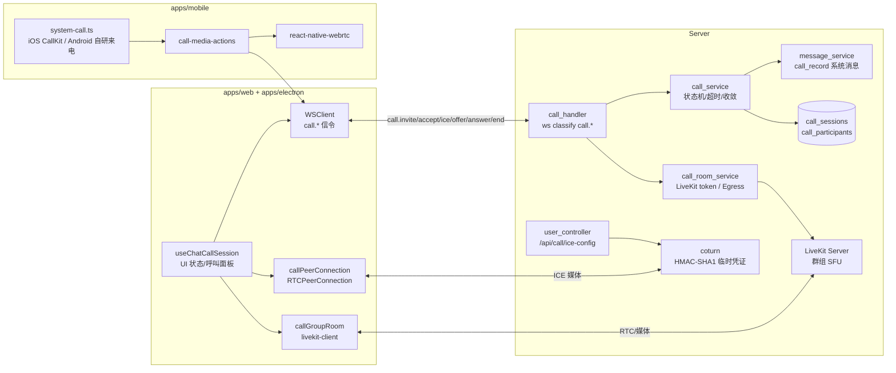
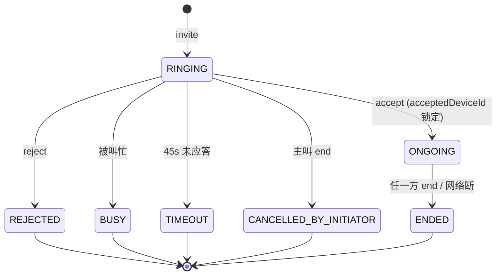

# 实时通话架构设计

> 适用范围：mushroom-app 中「1v1 与群组实时音视频通话 + 直接语音消息」的全链路。
>
> **本文按链路拆分**：第 6 节为信令与状态机；第 7 节为 1v1（P2P + 自建 coturn）；第 8 节为群组（LiveKit SFU，Web/Electron/Mobile 三端均已实现）；第 9 节为直接语音消息。
>
> 历史决策与早期阶段拆解保留在：
>
> - `docs/architecture/realtime-call-legacy-plan.md`（实施计划 v1，5 阶段任务清单）
> - `docs/architecture/realtime-call-legacy-design.md`（首版技术方案：架构选择、数据模型、信令、状态机、TURN 策略）
>
> 关联文档：
>
> - 消息流水线：`docs/architecture/messaging.md`
> - 推送：`docs/architecture/push-notification.md`（含 CallKeep / 系统来电）
> - WebSocket 传输：`docs/architecture/websocket.md`
> - 媒体上传（语音消息文件）：`docs/architecture/media-upload.md`

---

## 1. 模块概述

### 1.1 目标

- 1v1 音视频通话：从呼叫、振铃、接听、互通媒体到挂断的完整状态机。
- 同账号多端同时振铃，任一端接通后其他端自动收敛。
- 群组实时通话：Web / Electron / Mobile 三端均接入 LiveKit SFU。
- 直接语音消息：按住说话、松开发送、最长 60s，复用附件上传链路。
- NAT 穿透：自建 coturn + STUN/TURN，HMAC-SHA1 临时凭证。

### 1.2 非目标

- **不实现** 客户端发起方通过独立 `cancel` classify 取消邀请：发起方取消统一走 `call.end.request`，服务端按当前状态判定为 `CANCELLED_BY_INITIATOR`。
- **不实现** 单聊端到端加密媒体（依赖 DTLS-SRTP/SFU 自身安全；E2EE 见 `docs/e2e-designer.md` 路线图）。
- **不实现** 通话录制 / 转写。
- **不实现** PSTN 互通 / 号码外呼。

### 1.3 平台能力矩阵

| 能力                 | Web                        | Electron               | Mobile (RN)                                                |
| -------------------- | -------------------------- | ---------------------- | ---------------------------------------------------------- |
| 1v1 音视频（P2P）    | ✅ `RTCPeerConnection`     | ✅ 复用 web bundle     | ✅ `@livekit/react-native-webrtc`                          |
| 群组音视频（SFU）    | ✅ `livekit-client`        | ✅ `livekit-client`    | ✅ `@livekit/react-native` + `livekit-client`              |
| 来电系统级 UI        | ✅ 浏览器 Notification     | ✅ 主进程 Notification | ✅ 自研 ConnectionService + full-screen 通知 + CallOverlay |
| 多设备同振           | ✅                         | ✅                     | ✅                                                         |
| 被叫接通后其他端收敛 | ✅（`call.accepted` 广播） | ✅                     | ✅                                                         |
| TURN/STUN            | ✅                         | ✅                     | ✅                                                         |
| 直接语音消息（≤60s） | ✅ MediaRecorder           | ✅                     | ⚠️ 待验证（type 已声明，发送/播放未端到端）                |

---

## 2. 架构总览

### 2.1 端到端组件依赖



### 2.2 全链路时序（1v1 视频呼叫）

```mermaid
sequenceDiagram
  participant A as 主叫(端 A)
  participant S as Server (call_handler/call_service)
  participant B1 as 被叫设备 B1
  participant B2 as 被叫设备 B2

  A->>S: call.invite.request {targetUserId, media:video}
  S->>S: createSession(state=RINGING) + setTimeout(45s)
  S-->>A: call.invited (sessionId)
  S-->>B1: call.invited (含 ICE 凭证 hint)
  S-->>B2: call.invited
  B1->>S: call.accept.request
  S->>S: 收敛: state=ONGOING; 通知 B2 取消
  S-->>A: call.accepted {acceptedDeviceId=B1}
  S-->>B2: call.ended {reason=ACCEPTED_BY_OTHER_DEVICE}
  A->>S: offer(SDP)
  S-->>B1: offer
  B1->>S: answer(SDP)
  S-->>A: answer
  A-->>B1: ICE candidates (经 S 中转)
  Note over A,B1: 媒体直连 / TURN 中继
  A->>S: call.end.request
  S->>S: state=ENDED + 落 call_record 系统消息
  S-->>B1: call.ended
```

---

## 3. 业务流程总览

### 3.1 主要业务场景

| 场景            | 入口                             | 终态                   | 备注                                                  |
| --------------- | -------------------------------- | ---------------------- | ----------------------------------------------------- |
| 1v1 主动发起    | 聊天框麦克风 / 摄像头按钮        | ONGOING / ENDED        | 45s 未接 → TIMEOUT                                    |
| 多端同振 + 收敛 | 服务端 fanout 给被叫所有在线设备 | 单端 ONGOING           | 其他端收 `call.ended` reason=ACCEPTED_BY_OTHER_DEVICE |
| 被叫拒接        | UI 红色按钮                      | REJECTED               | `call.reject.request`                                 |
| 主叫取消        | 振铃中主叫挂断                   | CANCELLED_BY_INITIATOR | 复用 `call.end.request`（无独立 cancel classify）     |
| 忙线            | 被叫已在另一通话                 | BUSY                   | 服务端判定，发 `call.busy`                            |
| 群组通话        | 群聊面板「发起群通话」           | LiveKit 房间           | Web / Electron / Mobile 三端入房                      |
| 直接语音消息    | 按住麦克风按钮                   | 附件消息               | ≤60s，松开发送                                        |

### 3.2 调用入口与对外契约

- WebSocket：`packages/shared/src/types/ws.ts` 中 `call.invite.request` / `call.accept.request` / `call.reject.request` / `call.end.request` / `call.media-state.request` / `offer` / `answer` / `ice`，以及服务端单向 `call.invited` / `call.accepted` / `call.rejected` / `call.busy` / `call.timeout` / `call.ended` / `call.state-sync` / `call.media-state` / `call.error`、`call.ringing`（类型已声明但**当前无发送方**）。
- REST：`GET /api/call/ice-config`（HMAC-SHA1 临时凭证，`server/src/controller/user_controller.ts:732`）。
- 群组房间：`POST /api/call/room/token` 等（`server/src/service/call_room_service.ts`）。

### 3.3 上下游依赖

- 上游：聊天 UI（`useChatCallSession`）、推送（来电 banner / 系统来电）。
- 下游：WebSocket 传输（信令）、coturn（NAT 穿透）、LiveKit Server（群组）、附件存储（语音消息）、message_service（落 `call_record` 系统消息）。

---

## 4. 策略与设计原则

- **信令与媒体分离**：所有控制走 WS classify `call.*`；媒体走 SRTP / DTLS-SRTP，不经过应用服务器（仅 TURN 中继兜底）。
- **状态机集中在 server**：客户端发意图（`*.request`），server 计算合法状态迁移并扇出权威事件，避免多端竞态。
- **多端收敛**：被叫所有在线设备同振；首个接通的设备成为 `acceptedDeviceId`，其他端收 `call.ended` reason 收敛。
- **45s 邀请超时**：服务端独立计时器（`config.ts:148`），无需依赖客户端心跳。
- **取消语义统一**：发起方在振铃阶段挂断 → 复用 `call.end.request`，server 按当前 state 判定 reason 为 `CANCELLED_BY_INITIATOR`，避免新增 classify。
- **ICE 凭证短时效**：`username=<expiresAt>:<userId>`，HMAC-SHA1 签名 `coturn` 共享 secret；TTL 客户端可在 `/api/call/ice-config` 请求时按需获取。
- **群组 SFU 化**：超过 1v1 复杂度的路由统一交由 LiveKit；server 仅签发 token，不参与媒体面。

---

## 5. 平台分层结构

### 5.1 服务端

| 模块                | 路径                                                            | 责任                                                                                    |
| ------------------- | --------------------------------------------------------------- | --------------------------------------------------------------------------------------- |
| `call_service`      | `server/src/service/call_service.ts`                            | 状态机、超时、收敛、落 `call_sessions`/`call_participants`、生成 `call_record` 系统消息 |
| `call_room_service` | `server/src/service/call_room_service.ts`                       | LiveKit token 签发、群组房间生命周期                                                    |
| `call_handler`      | `server/src/websocket/call_handler.ts`                          | WS `call.*` 路由 → service；邀请 45s 定时器；`call.error` 兜底                          |
| `call_messages`     | `server/src/websocket/call_messages.ts`                         | 出站帧构造器（`buildCallInvitedMessage` 等）                                            |
| ICE 凭证            | `server/src/controller/user_controller.ts:732 getCallIceConfig` | HMAC-SHA1 临时账号（共享 secret 见 `config.ts:150-156`）                                |
| 落库 schema         | `server/src/db/migrate.ts:152-381`                              | `call_sessions` / `call_participants`                                                   |

### 5.2 Web / Electron

| 模块               | 路径                                       | 责任                                        |
| ------------------ | ------------------------------------------ | ------------------------------------------- |
| 会话 Hook          | `apps/web/src/hooks/useChatCallSession.ts` | UI 状态、按钮联动、错误提示                 |
| 1v1 PeerConnection | `apps/web/src/media/callPeerConnection.ts` | `RTCPeerConnection` 封装、ICE 收集、SDP O/A |
| 群组 SFU 客户端    | `apps/web/src/media/callGroupRoom.ts`      | `livekit-client` Room / Track 管理          |
| 信令通道           | `apps/web/src/ws/WSClient.ts`（共享）      | 发 `call.*` 帧 + 接收服务端事件             |
| Electron 集成      | 内嵌 web bundle，桌面端复用同一套实现      | 系统通知 / 窗口 focus 由主进程 IPC 处理     |

> **Electron 独立通话窗**：桌面端把通话媒体 / UI 迁入独立的系统级
> `BrowserWindow`，主窗仅做 WS↔IPC 信令中转。完整架构见 **§12 桌面端独立通话窗
> （Electron）**。该模式下 `useChatCallSession` 经注入的 `CallSignalTransport`
> 收发信令（不再直连 WS）；全尺寸·通话中态进任务栏 / Dock 切回、缩小态
> `alwaysOnTop` 悬浮 pip 常驻，来电通知点击「通话窗优先」聚焦。Web 浏览器端不受
> 影响，仍走主窗内 in-window 浮窗。

### 5.3 Mobile (RN)

| 模块     | 路径                                               | 责任                                                                                        |
| -------- | -------------------------------------------------- | ------------------------------------------------------------------------------------------- |
| 通话动作 | `apps/mobile/src/actions/call-media-actions.ts`    | 发起 / 接听 / 挂断业务编排                                                                  |
| 系统来电 | `apps/mobile/src/platform/system-call.ts`          | iOS CallKit / Android 自研 ConnectionService + full-screen 通知（channel `mushroom-calls`） |
| WebRTC   | `@livekit/react-native-webrtc`                     | 1v1 媒体面（与群组 SFU 共用同一套原生 WebRTC）                                              |
| 群组     | `apps/mobile/src/actions/call/group/group-room.ts` | `@livekit/react-native` + `livekit-client` 入房、本地轨道发布、远端参与者镜像               |

---

## 6. 核心代码与职责索引

| 路径                                                              | 职责                                                    |
| ----------------------------------------------------------------- | ------------------------------------------------------- |
| `server/src/service/call_service.ts:668 reconcileDeviceReconnect` | 设备重连后状态对账（恢复进行中通话指针）                |
| `server/src/service/call_service.ts:790 / 941`                    | 通话结束写 `call_record` 系统消息（messaging 流水线）   |
| `server/src/websocket/call_handler.ts:412 / 439`                  | 邀请 45s 超时定时器                                     |
| `server/src/utils/config.ts:148 CALL_INVITE_TIMEOUT_SECONDS`      | 邀请超时常量                                            |
| `server/src/utils/config.ts:150-156`                              | coturn HMAC secret + TURN URLs                          |
| `server/src/controller/user_controller.ts:732 getCallIceConfig`   | `/api/call/ice-config`                                  |
| `packages/shared/src/types/ws.ts:264-376`                         | `call.*` / `offer` / `answer` / `ice` 帧 schema         |
| `apps/web/src/hooks/useChatCallSession.ts`                        | UI 状态机、错误恢复                                     |
| `apps/web/src/media/callPeerConnection.ts`                        | RTCPeerConnection 封装                                  |
| `apps/web/src/media/callGroupRoom.ts`                             | LiveKit Room 客户端                                     |
| `apps/mobile/src/actions/call-media-actions.ts`                   | 移动端通话编排                                          |
| `apps/mobile/src/actions/call/group/group-room.ts`                | 移动端 LiveKit 群组入房 / 本地轨道发布 / 远端参与者镜像 |
| `apps/mobile/src/actions/call/group/group-participant.ts`         | LiveKit 参与者 identity/metadata 解析、远端流聚合       |
| `apps/mobile/src/platform/system-call.ts`                         | 系统来电接线（iOS CallKit / Android 自研）              |

---

## 7. 1v1 通话（P2P + coturn）

### 7.1 状态机



### 7.2 信令流转

- `offer` / `answer` / `ice` 由 server 透传给 sessionId 对端设备（接通后锁定 `acceptedDeviceId`，振铃阶段不互传媒体协商帧）。
- `call.media-state.request` / `call.media-state`：通话中切换静音 / 摄像头开关，server 广播 sessionId 内对端。

### 7.3 NAT 穿透 / TURN

- ICE 凭证：客户端在建立 PC 前 `GET /api/call/ice-config`，server 用 `coturn` 共享 secret 生成 `username=<expiresAt>:<userId>` + HMAC-SHA1 password。
- iceTransportPolicy：默认 `all`，弱网失败可重试为 `relay`（强制 TURN）。
- 重连：依赖底层 ICE restart；session 不变。

### 7.4 通话记录

- 通话终止时由 `call_service` 写一条类型为 `call_record` 的会话消息（参与方、duration、reason），与普通消息共享 messaging 流水线（outbox + 同步 + 推送），见 `call_service.ts:790 / 941`。

---

## 8. 群组通话（LiveKit SFU）

### 8.1 房间生命周期

- 发起：群聊面板「发起群通话」→ 客户端调 `POST /api/call/room/token` 取 LiveKit token → `livekit-client` `Room.connect`。
- 邀请扇出：服务端通过 `call.invite.request`（含 roomId）通知群成员所有在线设备；接受方拿 token 入房；离开 → `Room.disconnect`。
- 服务端不参与媒体面，仅负责签发 token 与（可选）Egress / Webhook。

### 8.2 平台覆盖

- ✅ Web / Electron：`apps/web/src/media/callGroupRoom.ts` 集成 `livekit-client`。
- ✅ Mobile：`apps/mobile/src/actions/call/group/group-room.ts` 集成 `@livekit/react-native` + `livekit-client`，对齐 `callGroupRoom` 行为（入房、本地轨道发布、远端参与者镜像渲染）。1v1 与群组共用同一套 `@livekit/react-native-webrtc` 原生 WebRTC。

### 8.3 与 1v1 的差异

| 维度     | 1v1                        | 群组                               |
| -------- | -------------------------- | ---------------------------------- |
| 媒体路径 | P2P / TURN 中继            | LiveKit SFU                        |
| 信令重心 | `offer` / `answer` / `ice` | LiveKit RTC 协议（应用层只发邀请） |
| 状态机   | server 集中                | 房间内由 LiveKit 维护              |
| 超时收敛 | 45s 单超时                 | 各成员各自决定接听                 |
| 通话记录 | `call_record` 写一次       | 见 §11 gap：群通话 record 待补齐   |

### 8.4 通话 UI（网格 / 说话高亮 / 媒体开关）

- **群通话网格**：桌面 `CallSessionModal` 用 CSS Grid `auto-fit minmax` 自适应列数 + 纵向滚动；移动 `CallOverlay` 用 `ScrollView` 包裹，按参与者总数（含本地）选择列数（1 / 2 / 4 → 1 列、2 列、3 列）并计算 tile 宽度。语音 / 视频共用同一网格，仅 tile 内部按 `video_enabled` 决定渲染视频或头像回退。
- **Active-speaker 高亮（正在说话）**：
  - 群通话（桌面 + 移动）：监听 LiveKit `activeSpeakersChanged`，远端 `is_speaking = participant.isSpeaking` 写入 `GroupCallParticipantMedia` / `MobileGroupCallParticipantMedia`；本地说话状态来自 `room.localParticipant.isSpeaking`。说话时 tile 显示绿色高亮边框。
  - 桌面 1v1：无 LiveKit，故用 Web Audio `AudioContext + AnalyserNode`（`apps/web/src/hooks/call/useAudioLevelSpeaking.ts`）对 `localStream` / `remoteStream` 做 RMS 音量分析并去抖，驱动主画面 / 预览 / 音频头像高亮。
  - 移动 1v1：React Native WebRTC 无 `AudioContext`，暂不支持说话高亮。
- **通话中媒体开关（静音 / 摄像头）**：桌面 `useChatCallSession.handleToggleLocalMedia` 采用「翻转已有轨道 `track.enabled`」策略（不中途采集新轨道、无需重新协商），更新 `local_audio_enabled / local_video_enabled / local_participation_mode` 后由 `broadcastLocalCallMediaState` 自动发 `call.media-state.request`；群通话另调用 `syncGroupRoomLocalTracks` 把本地已发布轨道集合与当前采集状态重新对齐（发布新增的 live 轨道、取消发布已移除的轨道），与移动端 `apps/mobile/src/actions/call/media/toggle.ts` 的群通话路径一致。音频通话仅显示麦克风按钮（不支持中途开摄像头）。
  - ⚠️ 已知限制：群通话本地/远端轨道均以裸 `publishTrack(track)`（无显式 `source`）发布，远端参与者的 `audio_enabled / video_enabled` 角标派生自 `participant.isMicrophoneEnabled / isCameraEnabled`，而这些 getter 依赖 `Track.Source.Microphone / Camera` 匹配，因此对端的「静音 / 关摄像头」角标当前无法准确反映本地切换。如需修复需在发布时携带显式 `source` 并处理摄像头 mute 的停轨语义，属独立既有缺陷，待单独评估。

---

## 9. 直接语音消息

- 入口：聊天输入栏麦克风按钮「按住说话」，松开发送。
- 限制：单条 ≤ 60s；移动端支持左滑取消。
- 实现：Web/Electron 走 `MediaRecorder` → Blob；Mobile 走 `react-native-audio-recorder-player`。
- 复用 `media-upload` 上传链路 + `messaging` 流水线，消息 type 为 `voice`。

### 9.1 移动端按住录音交互

移动端录音入口采用 WhatsApp 风格的按住说话交互，状态包括：

- `Idle`：显示麦克风按钮。
- `Recording`：长按开始录音，显示计时器和“左滑取消”提示。
- `Sliding`：手指向左移动时，麦克风和提示跟随手指移动；提示透明度逐渐降低。
- `Cancelled`：左滑超过 `120dp` 后松手，播放输入框左侧垃圾桶打开、麦克风垂直落入、盖子合上并淡出的取消动画。

录音期间麦克风使用红色呼吸动画。未超过阈值松手时，元素通过 spring 动画回到初始位置，并继续现有录音停止、上传和发送流程。跨过取消阈值时触发一次轻触觉反馈。取消录音时先停止原生录音，再删除返回的临时文件，不进入上传流程。

- **不复用** 实时通话链路：无 ICE / SDP / 状态机；仅作为附件消息形态。

---

## 10. 数据库与外部依赖

### 10.1 数据库

- `call_sessions`（`server/src/db/migrate.ts:152-381`）：通话主表。字段含 `session_id` / `initiator_user_id` / `conversation_id` / `media_type` / `state` / `accepted_device_id` / `started_at` / `ended_at` / `end_reason`。
- `call_participants`：参与方表，per (sessionId, userId, deviceId)；状态如 `INVITED / ACCEPTED / REJECTED / LEFT`。
- 索引见 `migrate.ts:362-381`；语义注释见 `migrate.ts:506-523`。

### 10.2 外部依赖

- `coturn`：自建 TURN/STUN，HMAC-SHA1 临时凭证（共享 secret 在 `config.ts:150-156`）。
- LiveKit Server：群组 SFU；server 用 LiveKit SDK 签发 token。
- 系统来电接线：iOS 用 CallKeep/CallKit 系统来电 UI；Android 用自研 self-managed `ConnectionService`（`call/MeshConnectionService`）+ Notifee full-screen 通知 + CallOverlay。

---

## 11. 现状缺口与 Roadmap

| 缺口 / 风险                                        | 影响                                                     | 建议                                                            | 优先级  |
| -------------------------------------------------- | -------------------------------------------------------- | --------------------------------------------------------------- | ------- |
| ~~移动端未集成 `@livekit/react-native`~~（已完成） | ~~移动端无法加入群组通话~~                               | 已集成 `apps/mobile/src/actions/call/group/`，三端对齐          | ✅ Done |
| `call.ringing` 类型已声明但**无发送方**            | 主叫端 UI 无法精确区分「服务端已分发」与「对端开始振铃」 | 在 `call_handler` 收到首个被叫设备首次响应时反推 `call.ringing` | P1      |
| 群组通话缺少 `call_record` 系统消息                | 历史回溯困难                                             | LiveKit Webhook（room_finished） → 写一条群组 call_record       | P1      |
| 直接语音消息端到端流程未在 mobile 验证             | 录音 / 上传 / 播放可能存在断点                           | 编写 e2e 用例覆盖录音→上传→消息→拉取→播放                       | P1      |
| `iceTransportPolicy=all` 失败时无自动 relay 回退   | 弱网通话失败                                             | 客户端检测 ICE failed 后重新建 PC 强制 `relay`                  | P2      |
| `getCallIceConfig` 未做客户端缓存                  | 频繁建链放大 TURN 鉴权 QPS                               | 客户端按 expiresAt 缓存复用                                     | P3      |

---

## 12. 桌面端独立通话窗（Electron）

> 仅 Electron 桌面端生效。把通话从「主聊天窗口内的 DOM 浮窗」升级为「独立的系统级
> 窗口」，使通话在切到其他应用、最小化主窗口时仍可见、可操作。Web 浏览器端无此能力
> （平台天花板，见 §12.8），保留主窗内 in-window 浮窗。

### 12.1 目标与硬约束

- **目标**：通话拥有独立的系统级 `BrowserWindow`（`frame:false` + 状态相关
  `alwaysOnTop`），媒体与 WebRTC 在该窗口的独立 renderer 进程运行；切到其他应用仍可见。
- **不改**：服务端、WS 协议、deviceId 语义、数据库。

| #   | 约束                                                                 | 影响                                                                                                 |
| --- | -------------------------------------------------------------------- | ---------------------------------------------------------------------------------------------------- |
| C1  | **WS 单例，每 deviceId 一条已鉴权连接**；信令与聊天同步共用此 socket | 通话窗**不能自连第二条 WS**（同设备双连接破坏 presence / 振铃收敛 / 设备计数）。信令必须经主窗中转。 |
| C2  | 会话 + 成员列表来自主进程 SQLite（IPC）                              | 通话窗经 IPC 自拉会话 / 成员快照。                                                                   |
| C3  | `loginUser` 是 renderer 内存态（JWT 解析）                           | 通话窗自行 `getToken()` + `parseJwt()` 重建（同 partition 共享 token）。                             |
| C4  | 来电通知管理器只绑定单一 `mainWindow`                                | 来电 focus / emit 改「通话窗优先」路由。                                                             |
| C5  | 登录 / 登出时主窗被销毁重建                                          | 通话窗生命周期挂靠主窗，随之清理。                                                                   |

> **C1 详解**：服务端按 `deviceId` 记录「设备在线 / 振铃发往哪条连接 / 在线设备数」，
> 根本假设是「一个 deviceId = 一条 WS」。通话窗若用同 deviceId 再开一条 WS，会被服务端
> 视为重复登录而互踢、计数错误、振铃紊乱。故信令只走主窗那条 WS，通话窗经 IPC 代收代发。

### 12.2 总体架构

```
┌──────────────────── 主窗口 (mainWindow renderer) ────────────────────┐
│  WSClient（唯一 WS，deviceId=abc123）                                  │
│   ├─ 聊天同步 / presence / typing          → 原样保留                  │
│   └─ 通话信令 call.* / offer / answer / ice                           │
│        ├─ 入向：WS 收到 → 转发到 IPC 通道 → 通话窗                   │
│        └─ 出向：IPC 通道收到通话窗请求 → 经 WS 发送                  │
│  来电检测（轻量）：仅判断「是否有来电」以决定开 / 关通话窗          │
└───────────────────────────────┬──────────────────────────────────────┘
                                 │  MessageChannelMain（主进程建立的专用双向通道）
┌────────────────────────────────▼─────────────────────────────────────┐
│              通话窗口 (callWindow renderer，独立进程)                  │
│  状态相关 alwaysOnTop / frame:false / skipTaskbar / 同 partition      │
│  ├─ 自建 loginUser（getToken + parseJwt）                            │
│  ├─ 经 IPC getConversations 拉会话 + 成员快照                        │
│  ├─ 通话核心：useChatCallSession 全套（媒体 / PC / LiveKit Room）    │
│  ├─ 信令来源 / 出口：IPC 通道（非 WS 直连）→ 主窗 → WS             │
│  └─ UI：CallSessionModal（displayMode="window"，去 in-window 浮窗）  │
└───────────────────────────────────────────────────────────────────────┘
```

架构方向：**信令留主窗 + 媒体 / UI 迁入独立通话窗 + IPC（MessageChannelMain）中转信令**
——唯一不触碰服务端、不违反 C1 的可行路径。

### 12.3 窗口行为状态机（三态）

通话窗属性**随通话态变化**，避免「永远置顶压住其他应用」「来电抢焦点打断用户」。

| 通话态            | alwaysOnTop | 任务栏 / Dock | 抢焦点                   | 尺寸            | 关窗行为               |
| ----------------- | ----------- | ------------- | ------------------------ | --------------- | ---------------------- |
| **来电响铃**      | 是          | 进任务栏      | **否**（`showInactive`） | 中等            | 等同最小化为悬浮小窗   |
| **通话中·全尺寸** | **否**      | 进任务栏      | 接通瞬间一次性 `focus()` | 大（通话布局）  | → 最小化为悬浮小窗     |
| **缩小·悬浮小窗** | **是**      | `skipTaskbar` | 否                       | 小（约 288×\*） | → 维持悬浮；仅红键挂断 |

- **A1 来电不抢焦点**：来电态置顶但用 `win.showInactive()`，不全屏盖住当前操作；接通后才升正式通话态并 `focus()` 一次（模块级 `lastAppliedPhase` 守卫保证仅「非 ongoing→ongoing」跃迁时夺焦一次）。
- **A2 全尺寸不置顶**：通话中允许把主窗切到前面边聊边通话；仅缩小态置顶。
- **A3 找回**：全尺寸态经任务栏 / Dock 切回；缩小态 `alwaysOnTop` 悬浮 pip 常驻可见——对齐 WhatsApp / Telegram，**无主窗内返回条**（早期「点击返回」胶囊条因 UX 怪异、与独立窗范式割裂而弃用）。
- **A4 关窗 = 最小化不挂断**：拦截 `close` 事件改为最小化悬浮；真正挂断仅靠红色挂断按钮。
- **A5 多屏位置约束**：缩小态位置由主进程按 `screen.getDisplayNearestPoint(...).workArea` 钳制。
- **A6 独立存活**：通话窗不随主窗最小化 / 隐藏联动（OS 层两窗独立），仅登录 / 登出（C5）例外。
- **B1 预热常驻**：app ready 即 `createCallWindow()` + `hide()` 常驻，来电 / 发起仅 `show()` + 切态，消除冷启动白屏与「错过短振铃」。
- **B2 断线自动收场**：IPC 通道心跳 + 超时检测，通道断裂 / 心跳超时 → 通话窗自动 `dismissCallSessionNow()` + `message.error("通话连接已断开")`；主窗 `recreateMainWindow` / 登出前显式收场并 `closeCallWindow()`。

### 12.4 IPC 通话帧协议

经 `MessageChannelMain` 传输的帧统一信封（仅传通话帧，不传聊天数据）：

```ts
type CallChannelFrame =
  | { kind: "signal"; payload: CallWsMessage } // call.* / offer / answer / ice 原样透传
  | { kind: "ws-status"; connected: boolean } // 主窗 → 通话窗：WS 连接状态
  | {
      kind: "command";
      action: "start-call";
      clientConversationId: string;
      mediaType: CallMediaType;
    } // 主窗 → 通话窗：转交「发起呼叫」意图
  | { kind: "heartbeat"; ts: number }; // 双向心跳，断线检测（B2）
```

- `signal` 帧结构与现有 WS 通话消息完全一致，最大化复用 `useCallWsBridge` 的 `switch(messageClassify)`，仅改「来源 / 去向」。出向信令在通话窗构造好完整 payload 后回主窗，主窗**不解析、直接 `sendMessage`**。
- 窗口三态属性（置顶 / 任务栏 / 焦点 / 双击最大化）由通话窗经 `electronAPI.callWindowControl(...)` **直接驱动主进程**，不走本通道帧。
- **端口投递机制（关键）**：主进程 `webContents.postMessage("call-channel", [port])` 投递 `MessagePort`，但 Electron 不为「尚未注册监听器的 renderer」缓存重放，且 `contextBridge` 跨隔离世界克隆会丢失 `MessagePort` 原型方法（`start`/`postMessage`/`onmessage`）。故：preload **顶层常驻**监听 `call-channel` 并缓冲端口；端口经 `window.postMessage(tag, "*", [port])` **转移**进主世界（保真）；主世界注册 `window` 监听后调 `notifyCallChannelReady()` 握手，preload 据此冲刷缓冲端口（`window.postMessage` 同样不为后注册监听器缓存）。详见 `callChannelPort.ts`。
- **通道可重建（自愈）**：`MessageChannelMain` 的一对 port 仅能投递一次，任一侧 renderer 运行期重建（HMR / reload / 会话过期回登录页再进 / `useMainCallRelay` 卸载重挂）后会丢失旧 port 且无法复用。为消除「通道一坏永坏」，`establishCallChannel` 改为**可重入**：每次调用都新铸一对 port 成对投递，两侧 renderer 收到新 port 即 `close()` 旧通道无缝换链（`channelRef` replace-on-new-port）。renderer 任一侧就绪/重建时经 `notifyCallChannelReady` → 主进程 `call-channel:request`（短去抖合并并发请求）触发重铸；亦可经 `electronAPI.requestCallChannel()` 主动请求。旧的 `channelEstablished` 永久单闩已移除。
- **断链检测一次性（§5.6 B2）**：`CallChannel` 的心跳超时（`HEARTBEAT_TIMEOUT_MS`）只回调 `onTimeout` **一次**（`firedTimeout` 守卫），收到对端任意帧后复位，避免一次断链被每个 2s tick 无限放大成日志刷屏 / 反复 dismiss。两侧 `onTimeout` 均在收场的同时调用 `requestCallChannel()` 触发自愈；通话窗侧仅在**存在活跃 `callSession`** 时才提示「通话连接已断开」并收场，空闲预热窗静默重连。

### 12.5 渲染端分叉（apps/web）

- **入口分流**：`main.tsx` 按路由**动态 `import()`** 各入口（`#/call-window` → `CallWindowApp`，否则 `App`）。通话窗永不求值 `App` 的模块图，从根上杜绝其 eager 副作用（尤其 `presence-subscriber` 顶层建 WS，否则违反 C1 致 1006 反复断连）。
- **信令抽象**：`CallSignalTransport` 接口（`send` / `onReceive`）按窗注入——主窗 = WS↔IPC 桥（`useMainCallRelay`），通话窗 = IPC 通道直连。`useChatCallSession` / `useCallWsBridge` 内所有 `getWSClient()` 改走 `transport`，单窗行为等价。
- **通话窗自举**（`CallWindowApp`）：`loginUser` 经 JWT 重建（C3）；conversations 经 IPC 快照 + `onConversationSync` 增量（C2）；ws-status 由通道广播驱动。
- **UI 形态分叉**（`CallSessionModal` `displayMode`）：`"overlay"`（Web 默认，行为逐字不变）/ `"window"`（Electron）。`window` 形态下整个 OS 窗口即通话面（`im-call-window-surface` 全屏平铺，无遮罩），「最小化 / 还原」改为收缩 / 还原 OS 窗口。
- **错误韧性**：`App` / `CallWindowApp` 根部各套 `AppErrorBoundary`（render 异常降级为「重试」提示，不整窗白屏）；`main.tsx` 顶层注册 `window` 的 `error` / `unhandledrejection` 桥接到 electron-log，捕获渲染树外异常。

### 12.6 无边框窗拖拽 / 双击最大化

独立通话窗 `frame:false` 无系统标题栏，靠 CSS app-region 实现拖拽：

- 对 pip `.im-call-mini-embedded` 与全尺寸 `.im-call-window-surface` **整面**设 `-webkit-app-region: drag`，其内 `button` / `a` / `input` / 操作条设 `no-drag`。
- **关键约束**：`no-drag` 只能从「**祖先** drag 区」挖洞。drag 必设最外层 surface、所有控件作后代再 no-drag；若把 drag 设在中间层而控件是其兄弟节点，控件会被拖拽区覆盖而「看得到点不到」。
- 双击最大化 / 还原：`onDoubleClick`（命中 button/a/input 时忽略）→ `callWindowControl("toggle-maximize")` → 主进程 `win.maximize()` / `unmaximize()`。

### 12.7 关键代码文件

| 路径                                                            | 职责                                                                                                                                          |
| --------------------------------------------------------------- | --------------------------------------------------------------------------------------------------------------------------------------------- |
| `apps/electron/src/main/call-window.ts`                         | 预热建窗 / 三态 `applyCallWindowState` / `MessageChannelMain` 建链 / `close` 拦截 / 窗口控制 IPC                                              |
| `apps/electron/src/main/index.ts`                               | 接入通话窗生命周期，与 `recreateMainWindow` / 登录登出联动（C5）                                                                              |
| `apps/electron/src/main/notification.ts`                        | 来电通知「通话窗优先」focus 路由（C4）                                                                                                        |
| `apps/electron/src/preload/index.ts`                            | `openCallWindow` / `callWindowControl` / `isCallWindow` / `call-channel` 端口缓冲 + 转移                                                      |
| `apps/web/src/main.tsx` / `utils/runtimeMode.ts`                | 按 `#/call-window` 动态分流入口                                                                                                               |
| `apps/web/src/hooks/call/callSignalTransport.ts`                | `CallSignalTransport` 抽象与两种实现                                                                                                          |
| `apps/web/src/hooks/call/useMainCallRelay.ts`                   | 主窗 WS↔IPC 中转桥（`relayInboundCallFrame` / `startCallViaWindow`）                                                                         |
| `apps/web/src/hooks/call/callChannel.ts` / `callChannelPort.ts` | IPC 通话帧封装（心跳 / 超时）+ 主世界端口订阅 helper                                                                                          |
| `apps/web/src/app/CallWindowApp.tsx`                            | 通话窗精简入口与自举                                                                                                                          |
| `apps/web/src/components/chat/CallSessionModal.tsx`             | UI 平台分叉（纯渲染编排，逻辑下沉 `call-modal/` 子模块）                                                                                      |
| `apps/web/src/components/chat/call-modal/`                      | `callModalUtils` / `useCallTimer` / `useMiniDrag` / `useCallVideoBinding`（callback ref 媒体绑定）/ `ParticipantMediaTile` / `CallStatusText` |

### 12.8 已知限制

- **Web 平台天花板**：纯浏览器无法创建 OS 级独立窗口，「切到其他 tab / 最小化浏览器后仍能看通话」在 Web 端**无法实现**，仅 Electron 具备。Web 仅保留 in-window 浮窗，与 Electron 体验不对等——平台决定，非缺陷。
- **视频首帧绑定时序**：出向视频呼叫时 `localStream` 到达那一刻 `<video>` 可能尚未挂载，须用 **callback ref**（而非 `useEffect` + 对象 ref）在元素挂载的确切时机绑定 `srcObject`，否则画面黑屏。见 `useCallVideoBinding.ts`。

---

## 13. 移动端后台通话保活（apps/mobile）

### 13.1 背景与问题

桌面端是独立 OS 窗口，切到其他软件不触发应用生命周期挂起，通话自然续存。移动端则不同：按 Home 键 / 切后台会触发 `AppState → background`。历史实现里 `useMobileConnectivityEffects` 在 `background` **无条件** `mobileRealtimeClient.disconnect()`，导致：

- 信令 WS 断开 → 收不到 `offer/answer/ice/call.ended` 等帧，通话事实上中断；
- Android 进程无「通话中」保活，WebRTC 媒体亦很快被系统回收。

目标：对齐 WhatsApp / Telegram / 微信——**按 Home 键通话不中断**，视频通话进入系统画中画（PiP）悬浮窗。

### 13.2 三层保活策略

| 层级           | 机制                                                                                                                                                                                                                                                                                                                                                                                                | 平台                      | 落点                                                                                      |
| -------------- | --------------------------------------------------------------------------------------------------------------------------------------------------------------------------------------------------------------------------------------------------------------------------------------------------------------------------------------------------------------------------------------------------- | ------------------------- | ----------------------------------------------------------------------------------------- |
| **① 信令保活** | `background` 分支增加守卫：`callSession.phase ∈ {ringing, ongoing}` 时**跳过 disconnect**，保持 WS 与心跳。通话结束若仍在后台，再补一次 `disconnect()` 收场。                                                                                                                                                                                                                                       | 全平台                    | `useMobileConnectivityEffects.ts`（守卫）/ `useMobileCallLifecycleEffects.ts`（结束兜底） |
| **② 进程保活** | Android 通话中前台服务（notifee `asForegroundService`）：`ringing` 阶段用无权限的 `shortService` 类型（此时未采集音视频，避免 Android 14+ 无 `RECORD_AUDIO` 权限时 `SecurityException` 闪退）；`ongoing` 阶段按实际授权声明 `microphone`（视频追加 `camera`），全部被拒则回退 `shortService`。通话期间常驻、结束即停。iOS 依赖既有 `Info.plist` 的 `voip`/`audio` 后台模式 + CallKit 维持音频会话。 | Android（iOS 走系统能力） | `notifications/ongoing-call.ts`                                                           |
| **③ 视频 PiP** | 视频通话 ongoing 切后台时进入系统画中画。Android 用首方原生模块（`MainActivity` 自动进 PiP + 模式变化事件）；iOS 用 livekit 内置 `RTCPIPView`（远端帧渲染进 `AVSampleBufferDisplayLayer`）。                                                                                                                                                                                                        | 全平台                    | Android：`pip/*` + `MainActivity.kt`；iOS：`RTCPIPView`（`CallOverlay.tsx`）              |

> **回前台通话状态校验**：后台期间 Android 冻结 JS 执行，对方挂断的 `call.ended` / `call.rejected` 信令可能丢失（WS 重连不重放历史），本地 `callSession` 会残留 ringing/ongoing，导致回前台时 UI 错误停留在接听/通话画面。`useMobileConnectivityEffects` 在 AppState → `active` 时用 `GET /auth/call/state`（`reconcileActiveCallWithServer`）校验残留通话并清理：① 服务端为终态（ended/cancelled/timeout/failed）或 4xx 业务错误 → 清理；② 服务端仍标记 ringing 但本地已超过来电 TTL（~60s，`isRingingOverdue`）→ 清理（对方挂断消息可能未达服务端 / 状态同步延迟）；③ 校验失败（5xx / 网络）且残留为 ringing → 清理（回前台瞬间网络未就绪时兜底）；④ ongoing 真实通话在 ③ 时保守跳过避免误杀。清理动作 = `dismissCallSessionNow` + `endSystemCall` + `clearIncomingCallNotification`；无活跃会话时也会清空残留来电通知。点接听时若服务端已结束，`call.error` 分支（`call-realtime-actions.ts`）同样会清理会话并提示。

### 13.3 Android 视频 PiP（首方原生模块）

社区库（`react-native-pip-android` 等）多为 2022 年旧桥接、且不提供「按 Home 自动进 PiP + 模式变化事件」，与 RN 0.85 + 新架构（Fabric）不兼容。故自写薄原生模块：

- `MushroomPipModule`（`pip/MushroomPipModule.kt`）：暴露 `isPipSupported` / `setAutoEnterEnabled` / `enterPipMode` / `isInPipMode`，并发 `MushroomPipModeChanged` 事件。
- `MainActivity` 实现 `MushroomPipHost`：Android 12+ 用 `setAutoEnterEnabled(true)` 无缝自动进 PiP；Android 8–11 用 `onUserLeaveHint` 兜底进入；`onPictureInPictureModeChanged` 把模式变化桥接到 JS。
- `AndroidManifest`：`MainActivity` 加 `supportsPictureInPicture="true"`；notifee `ForegroundService` 经 `tools:replace` 覆盖类型为 `microphone|camera|shortService`（默认 `shortService` 受时限、不适用于通话）。
- JS 包装：`platform/pip.ts`，`useMobileCallLifecycleEffects` 在视频 ongoing 时启用 auto-enter；`CallOverlay` 监听模式变化切换紧凑（仅视频、隐藏控件）布局。

### 13.4 关键代码文件

| 路径                                                                      | 职责                                                    |
| ------------------------------------------------------------------------- | ------------------------------------------------------- |
| `apps/mobile/src/app/controller/effects/useMobileConnectivityEffects.ts`  | 后台 disconnect 守卫（通话中跳过）                      |
| `apps/mobile/src/app/controller/effects/useMobileCallLifecycleEffects.ts` | 通话生命周期 → 前台服务 / PiP auto-enter / 结束后台收场 |
| `apps/mobile/src/platform/notifications/ongoing-call.ts`                  | Android 通话中前台服务（notifee）                       |
| `apps/mobile/src/platform/pip.ts`                                         | PiP JS 包装（支持探测 / auto-enter / 模式事件）         |
| `apps/mobile/android/.../pip/MushroomPipModule.kt` 等                     | Android PiP 原生模块 + Host 接口 + Package              |
| `apps/mobile/android/.../MainActivity.kt`                                 | 自动进 PiP + 模式变化事件桥接                           |
| `apps/mobile/src/components/overlays/call/CallOverlay.tsx`                | iOS `RTCPIPView` 接入 + PiP 紧凑布局                    |

### 13.5 已知限制

- **iOS 视频 PiP 仅渲染主（远端）视频**：本地摄像头在后台可能停采，PiP 窗只保证远端画面续存——与 livekit 官方建议一致（PiP 应绑远端轨）。
- **Android 厂商 ROM 差异**：部分国产 ROM 对前台服务 / 后台自启有额外限制，已有的来电权限引导（`call-system-permissions`）覆盖大部分场景，极端省电策略下仍可能被系统回收。

---

## 14. Changelog

| 日期       | 变更                                                                                                                                                                                  |
| ---------- | ------------------------------------------------------------------------------------------------------------------------------------------------------------------------------------- |
| 2026-06-02 | 移动端后台通话保活落地：信令保活守卫（通话中切后台不断 WS）+ Android 通话中前台服务 + 视频 PiP（Android 首方原生模块 / iOS livekit `RTCPIPView`），按 Home 键通话不再中断。详见 §13。 |
| 2026-06-02 | 桌面端独立通话窗（Electron）落地完成，原方案文档 `desktop-call-window.md` 的最终架构结论合并入本文 §12 并删除该文件；相关代码注释引用同步改指本文。                                   |
| 2026-05-22 | 初版：合并 `realtime-calling-implementation-plan.md` + `realtime-calling-technical-design.md`，按架构文档大纲重构。原文档以 `realtime-call-legacy-*.md` 保留作为历史决策档案。        |
