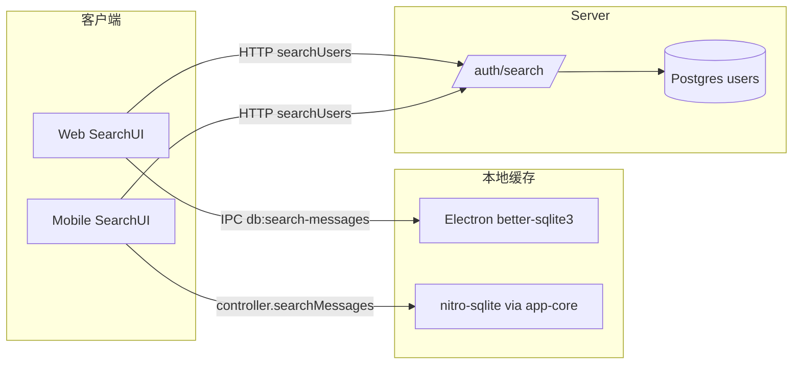

# 搜索架构设计

> 适用范围：mushroom-app 内的全局/会话内/用户/联系人搜索能力。
>
> 关联文档：
>
> - 消息流水线：`docs/architecture/messaging.md`
> - 联系人：`docs/architecture/contacts.md`
> - 数据库迁移：`docs/architecture/db-migrations.md`
> - i18n：`docs/architecture/i18n.md`

---

## 1. 模块概述

### 1.1 目标

- 用户能在客户端按关键词查找用户、消息（含附件名）、会话。
- 消息搜索全部走**本地缓存**（better-sqlite3 / nitro-sqlite），免服务端压力。
- 用户搜索走服务端，结合 block + privacy 过滤可发现性。
- 支持「全局」与「当前会话内」两种 scope，支持过滤器（全部/文本/图片/视频/文件/收藏/置顶/已撤回）。

### 1.2 非目标

- **不实现** 服务端消息全文检索（无 `/messages/search`、无 Postgres FTS/trigram）。
- **不实现** 群组/会话/媒体的服务端搜索端点。
- **不实现** 评分（scoring）/ 排序优化 / 相关度排名。
- **不实现** CJK 分词、拼音、模糊匹配、纠错。
- **不实现** 搜索历史 / 搜索建议（recent searches）。
- **不实现** 服务端 search 端点的限流。

### 1.3 平台覆盖

| 平台         | 用户搜索       | 消息搜索                                    |
| ------------ | -------------- | ------------------------------------------- |
| Web/Electron | `/auth/search` | Electron 主进程 better-sqlite3（IPC）       |
| Mobile       | `/auth/search` | `@mushroom/app-core` JS 引擎 + nitro-sqlite |
| Server       | 单端点 `ILIKE` | —                                           |

---

## 2. 架构总览

---

## 3. 业务流程

### 3.1 用户搜索（远端）

1. UI 拿到 keyword（min 2，debounce 300ms）→ `searchUser({ q })`。
2. 走 `GET /auth/search?q=...`。
3. `UserService.searchUsers` → `UserRepository.search` 执行 `SELECT ... WHERE username ILIKE $1 OR phone ILIKE $1 ORDER BY created_at DESC LIMIT 10`。
4. 命中后逐条 `canDiscoverUser(self, target, mode)`：检查双向 block + privacy（`discoverable_by_username/phone` ∈ {0,1,2}）。
5. 返回 `UserSearchResult[]`（含 `can_open_direct?`、`is_already_contact?`）。

### 3.2 消息搜索（本地）

#### Web/Electron

1. 触发：`InlineSearchBar`（会话内）或 `WorkspaceSearchModal`（全局）。
2. Renderer → `window.electronAPI.searchMessages(convId, kw, 30)` / `searchAllMessages(kw, 50)`。
3. Preload IPC → main 进程 `db:search-messages` / `db:search-all-messages`。
4. SQL：`json_extract(content,'$.text|$.name') LIKE LOWER('%kw%') OR reply_to_text LIKE ...`，按 `sequence DESC, created_at DESC`。
5. 结果合并 `local_conversation_members` 与 `outgoing_messages` 后回传。

#### Mobile

1. 触发：`WorkspaceSearchScreen`（180ms debounce + reqId 取消） 或 `ChatSearchHeader`/`SearchPanel`。
2. → `mobileAppController.searchMessages({ keyword, scope, filter, matchScope, clientConversationId? })`。
3. `packages/app-core/src/controller.ts:1488` 遍历 `listConversations()`（或单会话），对每条调用 `matchesMessageSearchFilter` + `buildMessageSearchText(...).includes(kw)`。
4. JS 排序 `created_at DESC`，UI 切片 30/6。

---

## 4. 策略与设计原则

- **本地优先**：消息搜索完全离线、零服务端开销；与 `messaging.md` 的 outbox/sync 解耦。
- **客户端分平台引擎**：Web/Electron 走 SQL（json_extract + LIKE），Mobile 走 JS includes（性能依赖 `listMessages` 行数）。
- **可发现性多重门控**：用户搜索同时受 block 与 privacy 模式约束；keyword 自动判断 phone vs username。
- **大小写归一**：keyword 与目标统一 `toLowerCase()`，无 accent/拼音处理。
- **取消语义**：mobile workspace 用 `reqIdRef` 单调递增 + `unmountedRef` 丢弃过期；web 用 `setTimeout` 防抖，**无显式 AbortController**。
- **高亮分裂**：web 文本级 `<mark>`，mobile 仅 bubble 行级高亮。
- **结果上限收口**：web 30/50、mobile 30/6；engine 本身不截。

---

## 5. 平台分层结构

### 5.1 Server

- 路由：`server/src/routers/user_router.ts:41`
- 控制器：`server/src/controller/user_controller.ts:543-555`
- Service：`server/src/service/user_service.ts:781-831`
- Repo：`server/src/repository/user_repository.ts:86-112`

### 5.2 Shared

- API 客户端：`packages/shared/src/api/index.ts:202-206`
- DTO：`packages/shared/src/types/api.ts:219-251`

### 5.3 Web / Electron

- 用户搜索 UI：`apps/web/src/components/contacts/AddContactDialog.tsx`、`StartDirectConversationDialog.tsx`、`AddConversation.tsx`
- 消息搜索 UI：`apps/web/src/components/chat/InlineSearchBar.tsx`、`apps/web/src/components/search/WorkspaceSearchModal.tsx`
- Hook：`apps/web/src/hooks/chat/useChatMessageHistory.ts:143-172`
- Preload：`apps/electron/src/preload/index.ts:270-282`
- SQL：`apps/electron/src/main/database.ts:1556-1652`
- 高亮：`apps/web/src/components/chat/MessageList.tsx:402-414`、`apps/web/src/styles/search.css:181`

### 5.4 Mobile

- 全局搜索屏：`apps/mobile/src/features/workspace-search/screens/WorkspaceSearchScreen.tsx`
- 会话内搜索：`apps/mobile/src/features/chat/ChatSearchHeader.tsx`、`SearchPanel.tsx`
- 状态：`apps/mobile/src/app/controller/state/useChatInteractionState.ts:33-43`
- 驱动：`apps/mobile/src/app/controller/effects/useMobileUiStateEffects.ts:130-169`
- 共享引擎：`packages/app-core/src/controller.ts:141-199, 1488-1569`

---

## 6. 核心代码索引

| 职责                | 路径                                                   |
| ------------------- | ------------------------------------------------------ |
| Server SQL          | `server/src/repository/user_repository.ts:86-112`      |
| canDiscoverUser     | `server/src/service/user_service.ts:781-809`           |
| Electron 单会话搜索 | `apps/electron/src/main/database.ts:1556-1606`         |
| Electron 全局搜索   | `apps/electron/src/main/database.ts:1608-1652`         |
| 共享 search engine  | `packages/app-core/src/controller.ts:1488-1569`        |
| filter 谓词         | `packages/app-core/src/controller.ts:141-163`          |
| 可搜索文本拼装      | `packages/app-core/src/controller.ts:165-199`          |
| 高亮 mark           | `apps/web/src/components/chat/MessageList.tsx:402-414` |

---

## 7. API / 端点

| 方法 | 路径                       | 鉴权 | 说明                       |
| ---- | -------------------------- | ---- | -------------------------- |
| GET  | `/auth/search?q=&keyword=` | JWT  | 用户搜索，LIMIT 10，无分页 |

请求/响应 DTO 见 `packages/shared/src/types/api.ts:219-251`。

---

## 8. WS 协议

不涉及。

---

## 9. 数据库

- `users.username` 上有 `idx_users_username`（btree），但 `ILIKE '%kw%'` **不走索引**，全表扫描。
- `users.phone` 无独立索引（`user_phone_identity` 表有 phone 索引但不被 search 引用）。
- 客户端 SQLite/nitro-sqlite 无 FTS5 虚表，全部 btree。

---

## 10. 约束与边界

- 用户搜索硬上限 10、无分页、无关键词长度校验、不做 rate-limit。
- 消息搜索完全本地，**未同步过的历史消息无法搜到**。
- mobile 搜索复杂度 O(N) 全消息内存扫描；超大会话或全局搜索性能瓶颈。
- 仅子串匹配，不支持 CJK 分词 / 拼音 / 同义词 / 拼写纠错（zh-CN 文案虽有"输入姓名或拼音搜索"，**纯展示**）。
- 无搜索历史、无热门关键词、无 typeahead 建议。

---

## 11. 现状缺口与 Roadmap

| ID  | 现状                                           | 风险                                   | 建议                                                                           |
| --- | ---------------------------------------------- | -------------------------------------- | ------------------------------------------------------------------------------ |
| R1  | `/auth/search` 用前导 `%` ILIKE 全表扫         | 用户量上来后慢查询、易被打爆           | 启用 `pg_trgm` + GIN 索引；或迁 ts_vector                                      |
| R2  | 无服务端消息/群/会话搜索                       | 设备未同步内容不可达                   | 服务端 FTS5 / OpenSearch + 增量索引                                            |
| R3  | `/auth/search` 无 rate-limit                   | 拒绝服务面                             | 接入 `authLimiter`；按 IP+uid 限流                                             |
| R4  | 用户搜索硬 LIMIT 10、无 cursor                 | 无法翻页查                             | 加 `?cursor=` 分页 + offset 上限                                               |
| R5  | 无最小关键词长度后端校验                       | 容易扫库                               | server 要求 `len >= 2`                                                         |
| R6  | mobile 搜索 JS 全表扫                          | 大会话卡顿                             | 在 nitro-sqlite 建 FTS5 虚表                                                   |
| R7  | 无 CJK 分词 / 拼音匹配                         | 中文搜索体验差，且 UI 已宣称"拼音搜索" | 引入 `jieba` / `pinyin-pro`，构建拼音索引列                                    |
| R8  | 无搜索历史                                     | UX 缺失                                | per-uid 本地存最近 N 条                                                        |
| R9  | 无高亮统一组件                                 | web 与 mobile 体验不一致               | 抽 `<HighlightedText>` 到 `packages/shared/src/ui`（mobile 复用 RN Text 多段） |
| R10 | Electron 搜索仅 `text/name/reply_to_text` 字段 | 系统消息、转发摘要、表情回应漏搜       | 与 mobile `buildMessageSearchText` 字段对齐                                    |
| R11 | 无可见性过滤之于会话/群成员                    | 隐私边界模糊（如已离群历史）           | 搜索结果二次校验会话成员资格                                                   |
| R12 | 无 abort controller                            | 切屏后仍占 CPU                         | mobile/web 统一 `AbortSignal`                                                  |

优先级：R1/R3/R5（服务端硬伤）→ R6/R7（mobile 体验）→ R10（一致性）→ R2/R4（能力扩展）→ R8/R9/R11/R12。

---

## 12. Changelog

| 日期       | 版本 | 变更                                                       | 作者     |
| ---------- | ---- | ---------------------------------------------------------- | -------- |
| 2026-05-23 | v1.0 | 首版：单服务端 /auth/search、本地分平台消息搜索、12 项缺口 | OpenCode |
