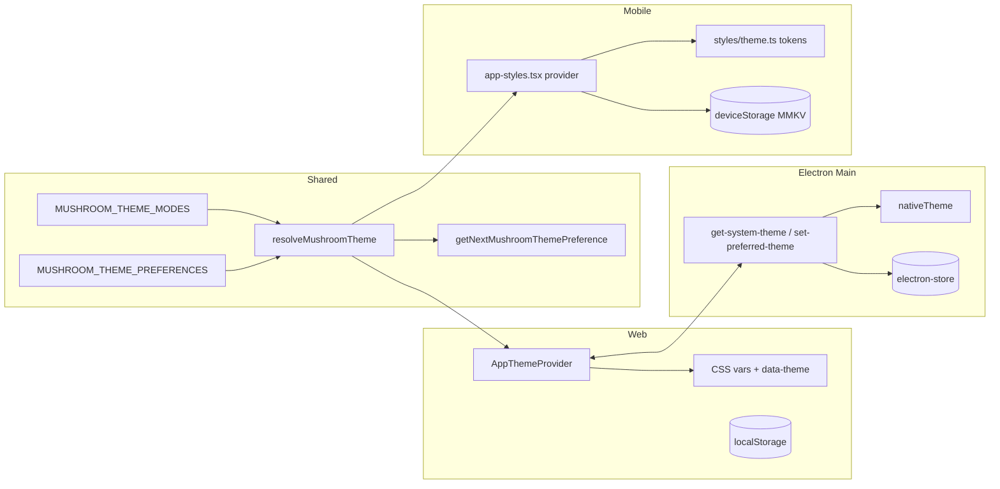

# 主题（Theme / Dark Mode）架构设计

> 适用范围：mushroom-app 客户端的浅/深/跟随系统三态主题、CSS 变量与 RN 样式工厂、Electron 主进程桥。
>
> 关联文档：
>
> - i18n：`docs/architecture/i18n.md`
> - 多账号隔离：`docs/architecture/multi-account-isolation.md`

---

## 1. 模块概述

### 1.1 目标

- 三态偏好：`system | light | dark`，cycle 顺序 `light → dark → system → light`。
- 共享的偏好/解析常量在 `packages/shared/src/theme.ts`，各端复用同一份模式枚举与轮换函数。
- Web 用 CSS 变量 + `:root[data-theme="dark"]`；Mobile 用 RN `StyleSheet` 工厂 + token 表。
- Electron 主进程作为系统主题桥（`nativeTheme.shouldUseDarkColors`）+ electron-store 持久化。

### 1.2 非目标

- **不实现** 跨设备主题同步（无 server 列、无 API）。
- **不实现** 每会话/每群自定义主题或壁纸（WhatsApp/Telegram parity gap）。
- **不实现** 第三方组件库（无 nativewind / paper / styled-components / restyle）。
- **不实现** OS Chrome 主题联动（Electron 未设 `nativeTheme.themeSource`、未设 `BrowserWindow.backgroundColor`、Android 未设 NavigationBar 颜色）。

### 1.3 平台覆盖

| 平台            | 实现                       | 持久化                             | 系统检测                                           |
| --------------- | -------------------------- | ---------------------------------- | -------------------------------------------------- |
| Web 纯浏览器    | CSS vars + `data-theme`    | localStorage（**当前写路径缺失**） | `matchMedia('(prefers-color-scheme: dark)')`       |
| Web on Electron | CSS vars + IPC             | electron-store `preferred-theme`   | IPC `getSystemTheme` + `nativeTheme.on('updated')` |
| Mobile          | RN StyleSheet 工厂 + token | MMKV `deviceStorage`               | `useColorScheme()`                                 |
| Server          | —                          | —                                  | —                                                  |

---

## 2. 架构总览

---

## 3. 业务流程

### 3.1 启动期

1. Shared `resolveMushroomTheme({ preference, systemMode, defaultMode })` 返回最终 `light|dark`。
2. Web 把结果写到 `document.documentElement.dataset.theme` + `style.colorScheme`；AntD `ConfigProvider` 切 `darkAlgorithm`/`defaultAlgorithm`。
3. Mobile 用 `getTheme(mode)` 取 token 表，编译合并组件样式表（基础 + chat + overlay 等）。

### 3.2 偏好切换

1. UI 调 `setAppTheme(next)` 或 cycle 按钮 → `getNextMushroomThemePreference`。
2. Web 把偏好写 store（IPC → electron-store；浏览器纯模式应写 localStorage）。
3. Mobile 写 MMKV `mushroom.mobile.theme`。
4. 全端订阅自身更新事件刷新 React 树。

### 3.3 系统主题变化

- Web on Electron：main `nativeTheme.on('updated')` → `webContents.send('system-theme-changed', light|dark)` 推所有窗口。
- Web 浏览器：`matchMedia.addEventListener('change')`。
- Mobile：`useColorScheme()` 自动重渲。

---

## 4. 策略与设计原则

- **shared 仅管模式三态**：调色板各端独立，避免捆绑 web/mobile 样式系统。
- **`system` 由共享 resolve 把 preference→mode 折叠**：UI 层只关心 `light|dark`。
- **CSS vars 全局 single class flip**：通过 `:root[data-theme="dark"]` 覆盖，避免组件级 if-else。
- **AntD 同步切换**：用 algorithm 切换 + 锁定 `colorPrimary='#00A884'` / `borderRadius=16`。
- **Mobile 样式工厂模式**：`StyleSheet.create({ ...baseStyles(t), ... })` 每次切主题重建样式表，组件用 `useAppTheme()` 拿当前样式集合。
- **持久化与系统检测分离**：preference 偏好长存；mode 是「在该偏好下解析出的此刻最终值」，运行时根据系统变化重算。

---

## 5. 平台分层结构

### 5.1 Shared

| 模块          | 路径                                |
| ------------- | ----------------------------------- |
| 模式/偏好常量 | `packages/shared/src/theme.ts:1-80` |

### 5.2 Web

| 模块         | 路径                                       |
| ------------ | ------------------------------------------ |
| 全局基础     | `apps/web/src/styles/global.css:1-30`      |
| 暗色覆盖     | `apps/web/src/styles/theme.css:1-610`      |
| Provider     | `apps/web/src/theme/index.tsx:1-170`       |
| Context 类型 | `apps/web/src/theme/theme-context.ts:1-17` |
| AntD 集成    | `apps/web/src/App.tsx:211-228`             |

### 5.3 Electron

| 模块              | 路径                                                  |
| ----------------- | ----------------------------------------------------- |
| nativeTheme + IPC | `apps/electron/src/main/index.ts:7, 338-340, 346-380` |
| Preload 暴露      | `apps/electron/src/preload/index.ts:34-49`            |

### 5.4 Mobile

| 模块           | 路径                                              |
| -------------- | ------------------------------------------------- |
| Token 表       | `apps/mobile/src/styles/theme.ts:1-150`           |
| Provider       | `apps/mobile/src/styles/app-styles.tsx:74-125`    |
| StatusBar 切换 | `apps/mobile/src/App.tsx:146-150`                 |
| 设置入口       | `apps/mobile/src/screens/MeScreen.tsx:44-57, 450` |

---

## 6. 核心代码索引

| 职责                  | 路径                                          |
| --------------------- | --------------------------------------------- |
| 偏好三态枚举          | `packages/shared/src/theme.ts:5-11`           |
| cycle 顺序            | `packages/shared/src/theme.ts:69-79`          |
| 默认 mode 常量        | `packages/shared/src/theme.ts:13`             |
| Web data-theme 应用   | `apps/web/src/theme/index.tsx:68-71`          |
| AntD algorithm 切换   | `apps/web/src/App.tsx:211-228`                |
| Electron 系统主题推送 | `apps/electron/src/main/index.ts:374-380`     |
| Mobile token 注入     | `apps/mobile/src/styles/app-styles.tsx:29-41` |

---

## 7. API / 端点

不涉及服务端。Hook：

- Web：`useAppThemePreference()` 返回 `{ preference, resolved, system, setPreference, cyclePreference }`。
- Mobile：`useAppTheme()` 返回 `{ theme, styles, setMode, toggleMode }`。

---

## 8. WS 协议

不涉及。

---

## 9. 数据库

- 无 `users.theme` / `user_settings.theme`。
- 客户端持久化键：
  - Electron：electron-store `preferred-theme`
  - Web 浏览器：localStorage `mushroom.web.theme`（**当前写路径缺失**）
  - Mobile：MMKV `mushroom.mobile.theme`

---

## 10. 约束与边界

- 主题偏好设备级；登出不丢，但跨设备不同步。
- AntD 强绑 `colorPrimary='#00A884'`，未来切品牌色需改 token + dark/light 同步。
- token 在 web (CSS vars) 与 mobile (TS) 双份维护，**有漂移风险**（已见 `--im-bg` `#eef3f7` vs mobile `#FFFFFF`）。
- Electron 未对齐：
  - 不写 `nativeTheme.themeSource` → OS 原生菜单/对话框不跟随。
  - 不设 `BrowserWindow.backgroundColor` → dark 启动白闪。
- Mobile Android 不设 NavigationBar 颜色。
- 无 wallpaper / 每会话主题。

---

## 11. 现状缺口与 Roadmap

| ID  | 现状                                                            | 风险                        | 建议                                                                |
| --- | --------------------------------------------------------------- | --------------------------- | ------------------------------------------------------------------- |
| R1  | web 浏览器纯模式不写 localStorage                               | 刷新偏好丢失                | 在 `setPreference` 路径追加 `localStorage.setItem`/`removeItem`     |
| R2  | Electron 不设 `nativeTheme.themeSource`                         | OS chrome 与 app 主题不一致 | 主题切换时 `nativeTheme.themeSource = preference`                   |
| R3  | Electron BrowserWindow 无 backgroundColor                       | dark 冷启动白闪             | 启动时基于持久化偏好预设 backgroundColor                            |
| R4  | mobile Android 未设 NavigationBar 颜色                          | 底栏与背景割裂              | `react-native-system-navigation-bar` 或自写原生模块                 |
| R5  | web/mobile token 双份重复且漂移                                 | 视觉一致性差                | 抽 design token JSON，构建期生成 CSS vars + TS 对象                 |
| R6  | 无跨设备同步                                                    | 多端不一致                  | `users.theme_preference` 列 + `/auth/me/theme`                      |
| R7  | 无 wallpaper / 会话级主题                                       | 与同类 IM 差距明显          | 设计 `conversation_settings.wallpaper`、客户端缓存                  |
| R8  | AntD `colorPrimary` 硬编码                                      | 品牌色切换重                | 提到 `packages/shared/src/theme.ts` 单点                            |
| R9  | 无 contrast / a11y 校验                                         | 暗色对比度未量化            | 引入 lint 工具或快照                                                |
| R10 | 无暗色 logo/splash 变体                                         | 体验粗糙                    | 双套 asset + 按 `prefers-color-scheme` 选                           |
| R11 | iOS Statusbar barStyle 切换正常，但 SafeArea bg 仍可能 mismatch | 边角颜色错位                | `SafeAreaView style={{ backgroundColor: theme.colors.background }}` |
| R12 | 没有主题切换动画                                                | 切换闪烁                    | 加 `transition: background 200ms` 到全局元素                        |

优先级：R1/R2/R3（启动正确）→ R5/R8（一致性）→ R4/R11（移动端体验）→ R6/R7（跨设备 + 个性化）→ R9/R10/R12。

---

## 12. Changelog

| 日期       | 版本 | 变更                                             | 作者     |
| ---------- | ---- | ------------------------------------------------ | -------- |
| 2026-05-23 | v1.0 | 首版：三态偏好、CSS vars、RN 样式工厂、12 项缺口 | OpenCode |
