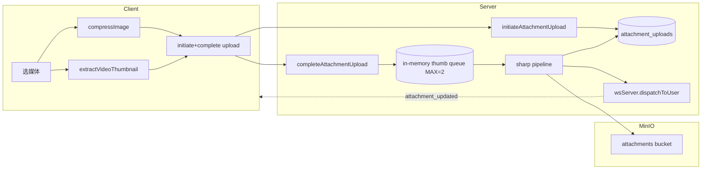

# 缩略图（Thumbnail）架构设计

> 适用范围：图片/视频在上传、生成、分发、本地缓存全链路。
>
> 关联文档：
>
> - 媒体上传：`docs/architecture/media-upload.md`
> - 媒体缓存：`docs/architecture/media-cache.md`
> - 配置：`docs/architecture/config.md`

---

## 1. 模块概述

### 1.1 目标

- 图片上传完成后，服务端用 `sharp` 异步生成 thumb（256² JPEG q70）+ preview（≤1280 JPEG q80）。
- 视频不在服务端切帧，**由客户端在发送前抽帧并作为独立 image attachment 上传**，挂在消息 `content.thumbnail_upload_id`。
- 客户端按统一优先级 `localCache > preview > thumb > url` 渲染，避免直链原图。
- 上传过程中先发 message 并显示 `pending` 占位；worker 完成后 WS push `attachment_updated` 反向刷新。

### 1.2 非目标

- **不实现** 服务端视频帧抽取（无 ffmpeg）。
- **不实现** blurhash / LQIP / dominant color。
- **不实现** thumb/preview 自定义 `Cache-Control`，全靠 presigned URL TTL + MinIO 默认。
- **不实现** 缩略图队列持久化（in-memory + 启动 recover）。
- **不实现** 多分辨率响应式（@1x/@2x/@3x），avatar 例外（small/medium/large）。

### 1.3 平台覆盖

| 平台         | 上传前压缩              | 视频抽帧                      | 显示缩略图                             |
| ------------ | ----------------------- | ----------------------------- | -------------------------------------- |
| Web/Electron | Canvas / heic2any       | `<video>` + canvas            | preview→thumb→url                      |
| Mobile       | react-native-compressor | react-native-create-thumbnail | preview→thumb→url（含本地 cache 优先） |
| Server       | sharp 256²/1280         | —                             | —                                      |

---

## 2. 架构总览

---

## 3. 业务流程

### 3.1 图片上传 → 服务端 thumb/preview

1. 客户端 `compressImage` → `initiateAttachmentUpload`（category 自动判 `image`，`thumb_status='pending'`）→ chunk 上传 → `completeAttachmentUpload`。
2. `completeAttachmentUpload` 出 DB tx 后 `enqueueThumbnail(uploadId)`（`server/src/storage/minio.ts:695-705`）。
3. Worker 取队列（MAX_CONCURRENCY=2）→ MinIO `downloadObject` 原图 → `sharp` 双管线：
   - thumb：`.rotate().resize(256,256,{fit:cover}).jpeg({quality:70,progressive:true})`
   - preview：`.rotate().resize(1280,1280,{fit:inside,withoutEnlargement:true}).jpeg({quality:80,progressive:true})`
4. 写回 MinIO `${baseDir}/${baseName}.thumb.jpg` / `.preview.jpg`；DB 更新 `thumb_object_key/preview_object_key/width/height/thumb_status='ready'`。
5. WS `attachment_updated` 推给上传者；客户端缓存替换占位。
6. 启动时 `recoverPendingThumbnails(500)` 扫 `pending` 行重新入队。

### 3.2 视频缩略图（客户端切帧）

1. Web/Electron：`extractVideoThumbnail` 用 `<video preload=metadata>` + `canvas.toBlob('image/jpeg', 0.8)`。
2. Mobile：`extractVideoThumbnail` 调 `createThumbnail({ url, timeStamp:1000, format:'jpeg' })`。
3. 把抽出的封面作为独立 image attachment 上传，回执 `upload_id` → 写到视频消息 `content.thumbnail_upload_id`。
4. Server `message_service.ts` 校验并 bind 该附件（`:411-435, :557-567`）。

### 3.3 显示与自愈

- 共享解析：`packages/shared/src/attachments/url-resolver.ts:45-77` 决定优先级。
- 失效自动刷新：客户端 `` / 视频 poster 失败 → `refreshAttachmentUrls(uploadIds)` → `POST /file/attachment/refresh-urls`（`server/src/storage/minio.ts:769-797`） → 重新换 presigned URL。
- **视频封面自愈（移动端）**：视频封面是独立 image 附件（`content.thumbnail_upload_id`），主视频附件 `thumb_status='none'`，按主 upload_id 刷新拿不到封面 URL。移动端 `useAttachmentDisplayUri` 在 `onError` 时把封面附件 id 一并提交刷新，取数优先用封面附件刷新的原图 URL（`pickVideoCoverUrl`），并把结果持久化写回 `content.thumb_url`。
- WS 完成推送：`apps/web/src/ws/handlers/attachmentUpdatedHandler.ts` 替换消息 cache。

---

## 4. 策略与设计原则

- **服务端只处理图片**：视频抽帧客户端做，避免服务端引 ffmpeg。
- **双产物 (thumb + preview)**：列表用 thumb，详情/查看大图前用 preview，原图按需下载。
- **私有桶 + presigned URL**：所有 `attachments` 桶对象都是私链，避免越权直链；avatar 桶 public-read。
- **占位 → 替换两段式**：消息先入会话 `thumb_status='pending'`，worker 完成 WS 推送替换；UI 用 `opacity 0.6` 表达。
- **客户端本地缓存接管 URL TTL**：Electron `mushroom-media-cache://` + Mobile `apps/mobile/src/platform/media-cache.ts` 各维 `thumbs` 类目，签名失效用 `refreshAttachmentUrls` 取代。
- **裸 `Cache-Control` 接受 MinIO 默认**：靠 presigned URL 的 expiry 与客户端本地缓存补足。

---

## 5. 平台分层结构

### 5.1 Server

| 模块         | 路径                                                     |
| ------------ | -------------------------------------------------------- |
| 上传 router  | `server/src/storage/minio.ts:475-718`                    |
| Worker       | `server/src/service/thumbnail_worker.ts:14-235`          |
| 启动 recover | `server/src/app.ts:21`、`thumbnail_worker.ts:209-235`    |
| Repo         | `server/src/repository/attachment_repository.ts:128-148` |
| URL resolver | `server/src/service/attachment_url_resolver.ts:60-223`   |
| DB schema    | `server/src/db/migrate.ts:111-132`                       |

### 5.2 Shared

| 模块         | 路径                                                    |
| ------------ | ------------------------------------------------------- |
| 视频抽帧契约 | `packages/shared/src/media/videoThumbnail.ts:14-38`     |
| 图片压缩策略 | `packages/shared/src/media/imageCompress.ts`            |
| URL 优先级   | `packages/shared/src/attachments/url-resolver.ts:23-74` |
| 消息内容模型 | `packages/shared/src/types/models.ts:113-119`           |
| WS 事件      | `packages/shared/src/types/ws.ts:394-402`               |
| 附件类目检测 | `packages/shared/src/config/limits.ts:85-114`           |

### 5.3 Web / Electron

| 模块              | 路径                                                          |
| ----------------- | ------------------------------------------------------------- |
| 图片压缩          | `apps/web/src/media/compressImage.ts`                         |
| 视频抽帧          | `apps/web/src/media/extractVideoThumbnail.ts`                 |
| 上传调度          | `apps/web/src/hooks/useChatOutgoing.ts:217-292`               |
| 显示 URL hook     | `apps/web/src/hooks/useAttachmentDisplayUrl.ts:12-82`         |
| 视觉气泡          | `apps/web/src/components/chat/VisualMediaMessages.tsx:17-169` |
| WS 处理           | `apps/web/src/ws/handlers/attachmentUpdatedHandler.ts:19-20`  |
| URL 刷新          | `apps/web/src/http/refreshAttachmentUrls.ts:22-70`            |
| 媒体缓存类目      | `apps/electron/src/main/media-cache-core.ts:6-12`             |
| Electron 缓存解析 | `apps/electron/src/main/media-cache.ts:447-461`               |

### 5.4 Mobile

| 模块          | 路径                                                                         |
| ------------- | ---------------------------------------------------------------------------- |
| 图片压缩      | `apps/mobile/src/media/compressImage.ts`                                     |
| 视频抽帧      | `apps/mobile/src/media/extractVideoThumbnail.ts:23-37`                       |
| 消息发送      | `apps/mobile/src/actions/chat/message-actions.ts:25, 245, 285-323`           |
| 显示 URI hook | `apps/mobile/src/features/chat-media/hooks/useAttachmentDisplayUri.ts:13-94` |
| 缓存类目      | `apps/mobile/src/platform/media-cache.ts:12, 355-356`                        |
| 气泡          | `apps/mobile/src/features/chat/MessageBubble.tsx:250, 661, 732-740`          |

---

## 6. 核心代码索引

| 职责                      | 路径                                                    |
| ------------------------- | ------------------------------------------------------- |
| sharp thumb 管线          | `server/src/service/thumbnail_worker.ts:86-93`          |
| sharp preview 管线        | `server/src/service/thumbnail_worker.ts:95-102`         |
| Worker recover            | `server/src/service/thumbnail_worker.ts:209-235`        |
| 完成上传后入队            | `server/src/storage/minio.ts:695-705`                   |
| presigned URL             | `server/src/storage/minio.ts:159-172`                   |
| `attachment_updated` 推送 | `server/src/service/thumbnail_worker.ts:130-138`        |
| 显示 URL 优先级           | `packages/shared/src/attachments/url-resolver.ts:39-53` |
| 自愈刷新                  | `apps/web/src/http/refreshAttachmentUrls.ts:22-70`      |

---

## 7. API / 端点

| 方法 | 路径                            | 说明                                              |
| ---- | ------------------------------- | ------------------------------------------------- |
| POST | `/file/attachment/initiate`     | 申请分片，自动判 image → `thumb_status='pending'` |
| POST | `/file/attachment/complete`     | 完成后入 thumb 队列                               |
| POST | `/file/attachment/refresh-urls` | 自愈：批量换 presigned + thumb/preview URL        |
| GET  | `/api/config/limits`            | 仅含上传/附件配额，**不含 thumb 维度**            |

WS：`attachment_updated`（`packages/shared/src/types/ws.ts:394-402`）。

---

## 8. WS 协议

`attachment_updated`：

- payload：`{ upload_id, thumb_url?, preview_url?, thumb_status, width?, height? }`
- 触发：worker `setReady` / `setFailed` 后定向推 uploader（`wsServer.dispatchToUser`）。

---

## 9. 数据库

`attachment_uploads`：

- `thumb_object_key TEXT`
- `preview_object_key TEXT`（comment "预览图对象键（如视频首帧）"，**目前仅图片填充**）
- `thumb_status VARCHAR(16) CHECK IN ('none','pending','ready','failed')`
- `width / height / duration_ms INTEGER`

---

## 10. 约束与边界

- 服务端 thumb 仅用于 **image 类附件**；视频依赖客户端切帧上传。
- 视频抽帧由客户端实现，移动端 iOS DRM 视频可能抽帧失败 → 视频气泡退化到 `<video preload="metadata">`。
- thumb 维度/质量硬编码（256² q70 / 1280 q80），客户端无法协商。
- worker 队列纯内存、单进程，水平扩容必须依靠 `recoverPendingThumbnails` 兜底。
- presigned URL TTL = `config.limits.upload.presignedExpiresSeconds`（默认 3600s），靠客户端 `onError` 自愈。
- 无 `Cache-Control` 自定义；CDN 接入需额外配置 MinIO bucket policy。

---

## 11. 现状缺口与 Roadmap

| ID  | 现状                            | 风险                                 | 建议                                                                                                                                                                                                                                 |
| --- | ------------------------------- | ------------------------------------ | ------------------------------------------------------------------------------------------------------------------------------------------------------------------------------------------------------------------------------------ |
| R1  | 服务端不抽视频帧                | 第三方 / 非默认客户端发视频 → 无封面 | server 用 fluent-ffmpeg 兜底                                                                                                                                                                                                         |
| R2  | 无 blurhash/LQIP                | 弱网下加载占位粗糙                   | server 生成 blurhash 字符串塞 DB                                                                                                                                                                                                     |
| R3  | thumb 队列纯内存                | 单点重启可能延迟数小时               | 引入 BullMQ/Redis 队列                                                                                                                                                                                                               |
| R4  | thumb 维度硬编码                | 高 DPI / 老设备难调                  | server 配 + `/api/config/limits` 暴露                                                                                                                                                                                                |
| R5  | 无 `Cache-Control` 头           | CDN/浏览器缓存命中率低               | MinIO bucket policy 或在 sharp 写入时设 metadata                                                                                                                                                                                     |
| R6  | refresh-urls 批量上限未明示     | 单次大批刷易超时                     | 已在 server `/api/file/attachment/refresh-urls` 限定 ≤100/请求；客户端 (web/mobile) 80ms 微批合并 + 自动分片，进入会话时按首屏可见消息（tail 50）一次性预刷新；mobile 端刷新后同步写回 `mobile_messages.payload`，TTL 内冷启动免自愈 |
| R7  | `preview_object_key` 视频未利用 | 字段语义/实际不一致                  | 同步 schema 注释或填充视频 preview                                                                                                                                                                                                   |
| R8  | HEIC 走 heic2any 仅 web         | 部分浏览器内存峰值大                 | 评估服务端 HEIC→JPEG                                                                                                                                                                                                                 |
| R9  | 没有缩略图清理策略              | MinIO 占用持续增长                   | 与消息撤回/会话清空联动删除                                                                                                                                                                                                          |
| R10 | 单 worker 进程并发 2            | 高峰积压                             | env 化 `THUMB_CONCURRENCY`                                                                                                                                                                                                           |
| R11 | 客户端 thumb 校验缺失           | 攻击者可上传"伪 thumb" 大文件        | 服务端二次校验 image MIME + 尺寸                                                                                                                                                                                                     |

优先级：R1/R3（鲁棒）→ R2/R5（体验）→ R9/R11（治理 + 安全）→ R4/R10（弹性）→ R6/R7/R8。

---

## 12. Changelog

| 日期       | 版本 | 变更                                                                            | 作者     |
| ---------- | ---- | ------------------------------------------------------------------------------- | -------- |
| 2026-05-23 | v1.0 | 首版：sharp 服务端、客户端视频抽帧、WS 推送、11 项缺口                          | OpenCode |
| 2026-05-30 | v1.1 | refresh-urls 增加客户端微批合并 + 会话级批量预刷新 + mobile SQLite 持久化（R6） | OpenCode |
