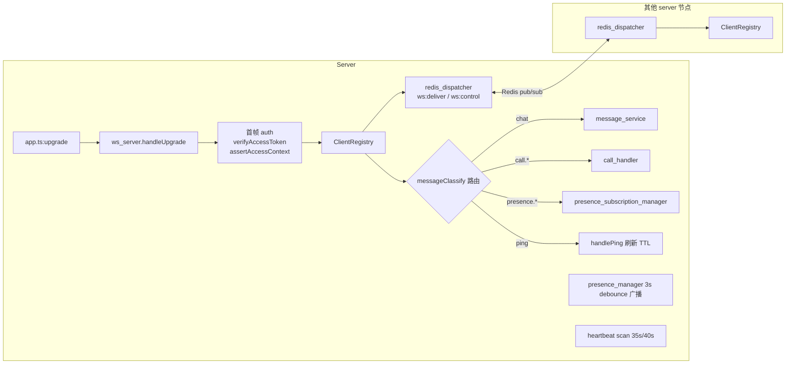
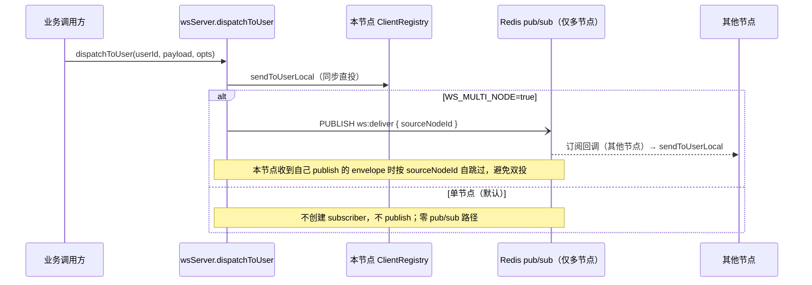

# WebSocket 传输层架构设计

> 适用范围：mushroom-app 全栈使用的「长连接传输层」——服务端 `/ws` 端点、`MessageClassify` 协议、跨节点 fanout、心跳、订阅、强制下线，以及 Web / Electron / Mobile 客户端连接生命周期。
>
> 关联文档：
>
> - 消息流水线（chat / ack / sync）：`docs/architecture/messaging.md`
> - 实时通话（call.\* 信令）：`docs/architecture/realtime-call.md`
> - 认证（首帧 auth / 强制下线 reason）：`docs/architecture/auth.md`
> - Presence 与隐私（presence.\* / contact_changed / block_changed）：`docs/architecture/account-privacy.md`
> - 推送（在线 → 推送降级判定）：`docs/architecture/push-notification.md`

---

## 1. 模块概述

### 1.1 目标

- 提供单一长连接通道承载：消息 / ack / 输入态 / 已读 / 撤回 / 反应 / 通话信令 / Presence / 联系人变更。
- 默认单节点部署：所有派发走「本地直投优先」，不依赖 Redis pub/sub 关键路径，避免 subscriber 半开/僵尸连接造成消息黑洞。
- 可选横向扩展：`WS_MULTI_NODE=true` 开启后，本地仍直投，同时通过 Redis pub/sub 把 envelope 广播给其他节点（节点 id 自跳过，避免双投）。
- 多设备共存：同账号多 `deviceId` 同时在线，按 deviceId 精确投递 / 排除。
- 强制下线：密码修改 / 设备登出 / 顶号场景下，权威路径关闭目标连接。

### 1.2 非目标

- **不承载** 文件 / 媒体：`maxPayload = 64 KB`，仅控制信令；附件走 HTTP（`docs/architecture/media-upload.md`）。
- **不做** 单连接 / 单 user 应用层速率限制（仅 `presence.subscribe` 批量上限 + 帧大小限制）。
- **不实现** SockJS / long-polling 回退。
- **不持久化** 帧：所有 classify 即发即弃，可靠性由 ack（chat）或重发（call 状态机）保障。

### 1.3 平台覆盖

| 维度 | Server              | Web                                  | Electron        | Mobile (RN)                            |
| ---- | ------------------- | ------------------------------------ | --------------- | -------------------------------------- |
| 实现 | `ws` 库             | `apps/web/src/ws/`                   | 复用 web bundle | `apps/mobile/src/services/realtime.ts` |
| 鉴权 | 首帧 `auth`         | onopen 立即发 auth                   | 同 web          | onopen 立即发 auth                     |
| 心跳 | 35s 扫描 / 40s 超时 | 25s ping，丢一次 pong 即 close(4000) | 同 web          | 25s ping，AppState/NetInfo 联动        |
| 重连 | n/a                 | 指数退避 + 抖动                      | 同 web          | 指数退避 + 抖动 + 前台/网络变化触发    |

---

## 2. 架构总览

### 2.1 节点内组件

### 2.2 跨节点 fanout

> **派发主路径恒为本地直投**：`dispatchToUser` 先 `sendToUserLocal`，无论单/多节点；Redis 仅作为多节点桥，**不参与本节点 ws.send 的成败**。

---

## 3. 业务流程

| 流程               | 入口                                    | 关键 classify                                                     |
| ------------------ | --------------------------------------- | ----------------------------------------------------------------- |
| 登录后建立连接     | 客户端 `WSClient.connect`               | 首帧 `auth`                                                       |
| 发送聊天消息       | `sendMessageWithAck`                    | 客户端 `chat` → server `ack`（status 0/1/2/-1）或 `message_error` |
| 已读 / 撤回 / 反应 | UI 操作                                 | `conversation_read` / `message_recall` / `message_reaction`       |
| 输入态             | 输入框 onChange                         | `typing`（按 `conversation_id` 群扇出，1.5s/(conv,sender) 节流）  |
| 通话信令           | 见 `docs/architecture/realtime-call.md` | `call.*` / `offer` / `answer` / `ice`                             |
| Presence 订阅      | 打开会话 / 联系人列表                   | `presence.subscribe` → `presence.snapshot` → 后续 `presence` 增量 |
| 联系人变更广播     | server 主动                             | `contact_changed` / `block_changed`                               |
| 附件元数据更新     | server 主动                             | `attachment_updated`                                              |
| 强制下线           | 密码修改 / 顶号 / 设备登出              | server close(4001, reason)                                        |

---

## 4. 策略与设计原则

- **设备级寻址**：所有 fanout 以 `(userId, deviceId)` 二元组为最小单元，支持 `targetDeviceId` 精确投递与 `excludeDeviceId` 同账号同步。
- **首帧鉴权**：onopen 不传 token query，避免 URL 泄漏；首帧 `auth` 10s 超时（`ws_server.ts:386`）。
- **Presence 双数据结构**：`ws:user:{uid}:devices` hash 维护设备清单 + `ws:user:{uid}:device:{did}:presence` 带 TTL，心跳刷新；`reconcileNodeCounter` 启动时清理本节点 ghost。
- **Presence 广播 3s debounce**：避免短时上下线抖动；最终一致即可。
- **订阅 TTL = 300s**：心跳同时刷新订阅 TTL，断连自然过期。
- **classify 严格 union**：`packages/shared/src/types/ws.ts:17-55` 定义 38 个 classify；新增必须先更新共享 union。
- **心跳客户端先动**：客户端 25s ping，服务端 35s 扫描 / 40s 超时；确保异常网络优先由客户端 close 报告。
- **send 失败立即剔除**：`socket.send` 错误 → `unregisterClient` + `close(1011, send_failed)`。
- **fanout 选择性**：联系人 union vs 订阅集 vs both（`config.presence.fanoutMode`，默认 `both`），便于灰度。

---

## 5. 平台分层结构

### 5.1 服务端

| 模块                  | 路径                                                           | 责任                                   |
| --------------------- | -------------------------------------------------------------- | -------------------------------------- |
| `WSServer`            | `server/src/websocket/ws_server.ts:32-889`                     | upgrade / 生命周期 / 分发 / 心跳扫描   |
| 鉴权辅助              | `server/src/websocket/auth.ts:1-50`                            | `extractAuth` / `verifyWebSocketToken` |
| 跨节点 dispatcher     | `server/src/websocket/redis_dispatcher.ts:27-236`              | `ws:deliver` / `ws:control`            |
| Presence              | `server/src/websocket/presence_manager.ts:19-547`              | 注册/刷新/注销/广播/ghost 对账         |
| Presence 订阅         | `server/src/websocket/presence_subscription_manager.ts:23-272` | 订阅集 + TTL                           |
| Call 路由             | `server/src/websocket/call_handler.ts:47-490`                  | `call.*` 信令编排                      |
| ClientRegistry / 类型 | `server/src/websocket/types.ts:1-23`                           | 内存注册表                             |
| HTTP 接入             | `server/src/app.ts:229-238 / 305`                              | upgrade 监听 + `wsServer.start()`      |

### 5.2 共享层

| 路径                                                         | 责任                                                        |
| ------------------------------------------------------------ | ----------------------------------------------------------- |
| `packages/shared/src/types/ws.ts:17-55`                      | `MessageClassify` union（38 个 classify）                   |
| `packages/shared/src/types/ws.ts:57-413`                     | 各 classify 的 payload 类型                                 |
| `packages/shared/src/types/ws.ts:415-462`                    | `ClientWsMessage` / `ServerWsMessage` / `AnyWsMessage` 联合 |
| `packages/shared/src/presence-client/presence-subscriber.ts` | 平台无关的 PresenceSubscriber                               |

### 5.3 Web / Electron

| 模块                | 路径                                                 | 责任                          |
| ------------------- | ---------------------------------------------------- | ----------------------------- |
| 单例工厂            | `apps/web/src/ws/index.ts:1-19`                      | `getWSClient / closeWSClient` |
| `WSClient`          | `apps/web/src/ws/WSClient.ts:50-503`                 | 连接 / 鉴权 / 重连 / ack 等待 |
| `ConnectionManager` | `apps/web/src/ws/ConnectionManager.ts:14-119`        | 心跳 25s + 重连退避           |
| router              | `apps/web/src/ws/router.ts:15-69`                    | classify → handler            |
| presence 适配       | `apps/web/src/services/presence-subscriber.ts:23-94` | 接共享 PresenceSubscriber     |

Electron 复用 `apps/web` bundle，无独立 WS 客户端。

### 5.4 Mobile (RN)

| 模块          | 路径                                              | 责任                                                       |
| ------------- | ------------------------------------------------- | ---------------------------------------------------------- |
| Realtime 服务 | `apps/mobile/src/services/realtime.ts`            | 连接 / 鉴权 / 心跳 25s / ack / AppState & NetInfo 联动重连 |
| presence 适配 | `apps/mobile/src/services/presence-subscriber.ts` | 接共享 PresenceSubscriber                                  |

---

## 6. 核心代码索引（按职责）

| 职责                         | 路径                                               |
| ---------------------------- | -------------------------------------------------- |
| HTTP upgrade                 | `server/src/app.ts:229-238`                        |
| 启动 / 优雅退出              | `server/src/app.ts:305` / `server/src/app.ts:261`  |
| 首帧 auth 与 10s 超时        | `server/src/websocket/ws_server.ts:380-444`        |
| assertAccessContext          | `server/src/websocket/ws_server.ts:215-238`        |
| 同 deviceId 重连覆盖         | `server/src/websocket/ws_server.ts:259-298`        |
| 心跳扫描                     | `server/src/websocket/ws_server.ts:724-753`        |
| handlePing                   | `server/src/websocket/ws_server.ts:490-517`        |
| sendToUserLocal              | `server/src/websocket/ws_server.ts:755-833`        |
| 强制下线                     | `server/src/websocket/ws_server.ts:835-888`        |
| Redis dispatcher 订阅        | `server/src/websocket/redis_dispatcher.ts:143-209` |
| Presence ghost 对账          | `server/src/websocket/presence_manager.ts:473-546` |
| chat ack 写出                | `server/src/websocket/ws_server.ts:665-676`        |
| message_error 写出           | `server/src/websocket/ws_server.ts:693-722`        |
| 客户端 ack 等待              | `apps/web/src/ws/WSClient.ts:387-453`              |
| 客户端 25s 心跳 / 4000 close | `apps/web/src/ws/ConnectionManager.ts:19, 39-56`   |
| Mobile 心跳                  | `apps/mobile/src/services/realtime.ts:435-467`     |

---

## 7. 协议规范

### 7.1 通用帧

所有帧最低字段：`{ messageClassify: <classify> }`（`BaseWsMessage`，`packages/shared/src/types/ws.ts:57-59`）。

### 7.2 classify 全集（38 个）

定义于 `packages/shared/src/types/ws.ts:17-55`。

- **鉴权 / 控制**：`auth` `ping` `pong`
- **消息 / Ack / 错误**：`chat` `ack` `message_error` `conversation_read` `conversation_sync` `message_recall` `message_reaction` `typing`
- **群已读 / 隐私同步**：`group_read` `privacy_sync`（均非持久化帧，不写 outbox）
- **Presence**：`presence` `presence.subscribe` `presence.unsubscribe` `presence.snapshot`
- **通话信令**：`call.invite.request` `call.accept.request` `call.reject.request` `call.end.request` `call.media-state.request` `call.invited` `call.ringing` `call.accepted` `call.rejected` `call.busy` `call.timeout` `call.ended` `call.state-sync` `call.media-state` `call.error` `offer` `answer` `ice`
- **联系人 / 附件**：`contact_changed` `block_changed` `attachment_updated`

> `typing` 自群聊已读 / 输入态扩展后按 `conversation_id` 校验成员资格并扇出，服务端 1.5s/(conv,sender) 节流（`server/src/websocket/call_handler.ts:396`）；`group_read` / `privacy_sync` 的完整协议与隐私双向 enforcement 见 `./group-read-and-typing.md`。

### 7.3 Ack 帧

`AckMessage`（`packages/shared/src/types/ws.ts:71-79`）：`status` 取值 `0` 成功 / `1` 已存在 / `2` 已撤回 / `-1` 业务错误（由 `message_error` 提供 code）。

### 7.4 错误码 / 关闭码

| 场景             | 关闭码 / classify         | 出处                                                      |
| ---------------- | ------------------------- | --------------------------------------------------------- |
| 缺 deviceId      | 1009                      | `server/src/websocket/ws_server.ts:174-176`               |
| Token 非法       | 1008                      | `server/src/websocket/ws_server.ts:206 / 317 / 416 / 437` |
| auth 10s 超时    | 1008 Auth timeout         | `server/src/websocket/ws_server.ts:389-394`               |
| 服务端优雅退出   | 1001 Server shutting down | `server/src/websocket/ws_server.ts:138`                   |
| send 失败        | 1011 send_failed          | `server/src/websocket/ws_server.ts:819-827`               |
| 强制下线         | 4001 reason               | `server/src/websocket/ws_server.ts:873`                   |
| 客户端心跳缺失   | 4000 No pong received     | `apps/web/src/ws/ConnectionManager.ts:49`                 |
| 客户端正常关闭   | 1000 Manual close         | `apps/web/src/ws/WSClient.ts:465`                         |
| 应用层 chat 错误 | `message_error` (code)    | `server/src/websocket/ws_server.ts:693-722`               |
| 应用层 call 错误 | `call.error` (code)       | `server/src/websocket/call_handler.ts:346-373`            |

### 7.5 鉴权失败首帧

`{type:"auth", success:false, error}` 文本帧（`server/src/websocket/ws_server.ts:95-103`），随后再 close。

---

## 8. 心跳与重连策略

| 维度                | 值 / 路径                                                                                              |
| ------------------- | ------------------------------------------------------------------------------------------------------ |
| 客户端 ping 间隔    | 25 000 ms（`apps/web/src/ws/ConnectionManager.ts:19`、`apps/mobile/src/services/realtime.ts:435-467`） |
| 客户端丢 pong 行为  | `close(4000, "No pong received")`                                                                      |
| 服务端心跳扫描间隔  | `WS_HEARTBEAT_CHECK_INTERVAL_MS = 35_000`（`server/src/utils/config.ts:163-176`）                      |
| 服务端连接超时      | `WS_HEARTBEAT_TIMEOUT_MS = 40_000`                                                                     |
| 设备 presence TTL   | `WS_DEVICE_PRESENCE_TTL_SECONDS = 70`（要求心跳扫描 < TTL/2）                                          |
| 订阅 TTL            | `presence.subscriptionDeviceTtlSeconds = 300`（`server/src/utils/config.ts:189-193`）                  |
| 客户端重连退避      | 指数退避 + 抖动（`apps/web/src/ws/ConnectionManager.ts`、`apps/mobile/src/services/realtime.ts`）      |
| Mobile 触发重连事件 | AppState `active`、NetInfo `isInternetReachable=true`                                                  |

> 通话邀请 45s 超时**不依赖**心跳，由 `call_handler` 独立定时器驱动（`server/src/utils/config.ts:148`）。

### 8.1 移动端单活跃 socket 不变量（防乒乓死循环）

`MobileRealtimeClient`（`apps/mobile/src/services/realtime.ts`）必须保证**同一时刻只有一条同 deviceId 的活跃 socket**。服务端对同 deviceId 新连接会显式 `terminate` 旧连接（`server/src/websocket/ws_server.ts:313-334`，last-writer-wins 语义）；若客户端自身因竞态开出两条同 deviceId socket，被顶掉那条的 `onclose` 若再排队重连，就会与新连接互相顶替，形成自持续的「连接中/收取中」乒乓死循环（首次安装登录后顶部状态反复切换、杀掉进程重开才恢复）。

客户端三个不变量：

1. **`connect()` 幂等锁（`realtime.ts:98-118`）**：socket 处于 `CONNECTING / OPEN / CLOSING` 或已有 `connectPromise` 在飞行时，直接复用当前连接/同一 promise，不开新 socket。
2. **`_doReconnect()` 不打断在飞行连接（`realtime.ts:147-157`）**：强制重连（AppState `active` / NetInfo 恢复触发）若撞上初始 `connect()` 尚未建立完成，直接复用该 `connectPromise`，**绝不**先清空 `connectPromise` 再开第二条 socket——旧实现正是由此制造双连接。
3. **`onclose` 只认当前活跃 socket（`realtime.ts:443-463`）**：`this.socket !== socket`（已被更新的 socket 顶替的 stale close，例如服务端 terminate 旧连接后其 RST 才到达）时，只 settle 本 socket 的 openConnection promise 并记录日志，不置空 `this.socket`、不停属于新 socket 的心跳、不排重连。`settled`/reject 逻辑放在守卫之前，避免 connectPromise 悬挂。

---

## 9. 多节点 fanout 与强制下线

> **默认单节点部署**：`WS_MULTI_NODE=false`（缺省）下 `redis_dispatcher` **不创建 subscriber、不 publish**，`subscriberStatus === "disabled"`。所有派发完全走本地 `sendToUserLocal`，不依赖 Redis pub/sub。
> **多节点开启**：`WS_MULTI_NODE=true` 时本节点仍优先本地直投，再 fire-and-forget `publishOnly` / `publishControlOnly` 把 envelope 广播给其他节点。每条 envelope 携带 `sourceNodeId`，本节点收到自己发出的回声会自跳过，避免双投。
> **subscriber 健康保活**（仅多节点）：`redis_dispatcher` 维护 30s ping / 10s timeout 心跳，超时即 `disconnect()` 触发 ioredis 重连；`connect` + `ready` 双事件均会重订阅 `ws:deliver` / `ws:control`，覆盖笔记本休眠 / NAT 超时 / 半开 TCP 等场景，杜绝 zombie 订阅吞消息。
> 同时 ioredis 主连接 `keepAlive: 30s`（`server/src/cache/redis.ts`），降低 OS 默认 2h TCP keepalive 带来的半开风险。

### 9.1 通道

| 通道         | 用途             | 出处                                               |
| ------------ | ---------------- | -------------------------------------------------- |
| `ws:deliver` | 跨节点投递业务帧 | `server/src/websocket/redis_dispatcher.ts:64-101`  |
| `ws:control` | 跨节点强制下线   | `server/src/websocket/redis_dispatcher.ts:103-141` |

### 9.2 投递选项

`WebSocketDeliveryOptions { targetDeviceId?: string; excludeDeviceId?: string }`（`server/src/websocket/types.ts:1-23`）。

- `targetDeviceId`：精准投递（如「已读回写仅给本人此设备」、「通话邀请仅给 acceptedDevice」）。
- `excludeDeviceId`：扇出给同账号其他设备（如「本设备已发送消息后通知其他端同步」）。

### 9.3 在线设备来源

- 实时 presence：`WebSocketPresenceManager.getOnlineDeviceIds`（`server/src/websocket/presence_manager.ts:213-256`），Redis hash + TTL 双重校验。
- 持久化设备列表：`UserDeviceRepository.listByUser`（如通话邀请 fanout，`server/src/websocket/call_handler.ts:88-99`），用于推送降级。

### 9.4 强制下线 reason 集

来自 `server/src/service/user_service.ts`：`password_changed`、`logged_out`、`device_logged_out`、`device_revoked`、`device_disabled`、`logout_other_devices`、`logout_all_devices`，默认 `session_revoked`。客户端收到 close 4001 后应跳转登录页（见 `docs/architecture/auth.md`）。

---

## 10. Presence 订阅模型

- `presence.subscribe` payload：`{ targets: string[], scope?: "conversation" | "list" | "profile" }`（`packages/shared/src/types/ws.ts:128-137`）。**当前 `scope` 仅为语义占位，服务端不区分**（保留扩展）。
- 单帧批量上限：`config.presence.subscribeBatchLimit = 500`。
- 订阅生效后：服务端立即回一帧 `presence.snapshot`（仅发往订阅端 deviceId）。
- 后续：被订阅用户的 presence transition 触发 `presence` 帧广播（3s debounce，`server/src/websocket/presence_manager.ts:281-321`），扇出范围由 `fanoutMode` 决定（`contacts` / `subscribers` / `both`，默认 `both`）。

---

## 11. 现状缺口与 Roadmap

| 缺口 / 风险                                                         | 影响                                        | 建议                                                                  | 优先级 |
| ------------------------------------------------------------------- | ------------------------------------------- | --------------------------------------------------------------------- | ------ |
| 无应用层 user / 连接级速率限制                                      | 恶意客户端可洪泛 WS 帧                      | 引入令牌桶（按 userId + classify 分类），与 HTTP `rate_limit.ts` 对齐 | P1     |
| `presence.subscribe.scope` 服务端无区分语义                         | 后续按会话精确扇出能力受限                  | 落地 `conversation` scope（关联 conversation membership）             | P2     |
| `call.ringing` 类型已声明但无发送方                                 | 见 `docs/architecture/realtime-call.md` §11 | 同上                                                                  | P1     |
| 客户端 `ack` 5s 超时硬编码                                          | 弱网下假性失败                              | 改为 RTT 自适应 + 服务端心跳建议值                                    | P3     |
| `unregisterClient` 与 redis presence 清理之间有微小窗口（依赖 TTL） | 闪断瞬间他人短暂看到「在线」                | 客户端 close 时主动发 `presence.offline` hint                         | P3     |
| 心跳 / 超时常量在客户端硬编码                                       | 难以灰度调整                                | 由 `GET /api/config/limits` 下发                                      | P3     |

---

## 12. Changelog

| 日期       | 变更                                                                                                                                                                                                                                                                                                                                                                                                                                                                                                                                                                                                                                                                                                                                                                                                                                                                                                                                                                                                                                                                                                                                                                                                                                                                       |
| ---------- | -------------------------------------------------------------------------------------------------------------------------------------------------------------------------------------------------------------------------------------------------------------------------------------------------------------------------------------------------------------------------------------------------------------------------------------------------------------------------------------------------------------------------------------------------------------------------------------------------------------------------------------------------------------------------------------------------------------------------------------------------------------------------------------------------------------------------------------------------------------------------------------------------------------------------------------------------------------------------------------------------------------------------------------------------------------------------------------------------------------------------------------------------------------------------------------------------------------------------------------------------------------------------- |
| 2026-05-22 | 初版：抽取 `server/src/websocket/` 全量职责 + 共享 classify union + Web / Mobile 客户端实现成文。                                                                                                                                                                                                                                                                                                                                                                                                                                                                                                                                                                                                                                                                                                                                                                                                                                                                                                                                                                                                                                                                                                                                                                          |
| 2026-05-30 | 派发主路径反转：`dispatchToUser` / `disconnectUserDevices` 改为「先 `sendToUserLocal` 本地直投，再视 `WS_MULTI_NODE` 广播」。新增 `WS_MULTI_NODE`（默认 `false`）开关：单节点完全不启动 subscriber，零 pub/sub 路径；多节点保留旧行为，envelope 携带 `sourceNodeId` 自跳过避免双投。`redis_dispatcher` 增加 subscriber 30s ping / 10s timeout 心跳 + `connect`/`ready` 双事件重订阅，杜绝休眠唤醒后 zombie subscriber 吞消息；心跳 race 用独立 `.catch` + `finally clearTimeout` 防 unhandledRejection 与定时器泄漏；`start()` 改为可重入并根据当前 `multiNode` 自动启停 subscriber。`server/src/cache/redis.ts` ioredis 全局 `keepAlive: 30_000`（首次探测前空闲延迟，后续 probe 间隔依平台 OS 内核参数）。`outbox_worker` 对实时投递事件（`chat.message.deliver` / `conversation.read` / `conversation.sync` / `contact.changed` / `message.recall` / `message.reaction`）在 `deliveredCount === 0` 时改走 2/4/8s 短延迟 `markRetry`（最多 3 次），给客户端 reconnect 留出窗口；其余事件保持原 `markDispatched` 语义。**多节点修复**：`deliveredCount === 0` 时先调用 `wsServer.hasAnyOnlineDevice` 做集群级 presence 判定 —— 任一节点在线即 `markDispatched`（远程节点已直投，避免重试导致 publish 反复广播 ⇒ 远程节点重复投递）；仅集群全离线才进入 reconnect window。 |
| 2026-05-25 | `conversation_sync`：服务端 `POST /conversation/leave` 现在与 `removeMember` 一致——除向剩余成员派发 `action=upsert` 外，亦向离群者派发 `action=remove`。移动端 `app-core` 对 `conversation_sync` 增加快速路径：`action=remove` 走本地 hard delete (`removeConversations`) + publishSnapshot；`action=upsert` 仍触发 `syncNow`。`syncNow` 改造为 coalesce + replay：入口处立即创建 outer deferred 并赋给 `syncNowInflight`，整个 do-while 期间该字段始终非空，关闭"round N 的 finally 与外层 await 之间存在 microtask 窗口、新调用者穿透守卫启动并行循环"的竞态；inflight 期间到达的事件会标记 pending，当前轮次结束后立即再跑一轮；piggyback 调用者收到 outer promise，会等到最后一轮 resolve，得到包含其触发事件的最新 snapshot，而非过期首轮快照。详见 `docs/architecture/conversation-group.md §3.1.1` 关于 hard vs soft delete 的语义区分。                                                                                                                                                                                                                                                                                                                                                                                                                            |
| 2026-08-05 | 群聊已读回执 / typing 群扇出扩展同步：classify union 现为 38 个（`group_read` / `privacy_sync` 为非持久化帧）；`typing` 改为按 `conversation_id` 扇出 + 1.5s/(conv,sender) 节流（`server/src/websocket/call_handler.ts:396`）；群已读完整协议见 `./group-read-and-typing.md`。                                                                                                                                                                                                                                                                                                                                                                                                                                                                                                                                                                                                                                                                                                                                                                                                                                                                                                                                                                                             |
